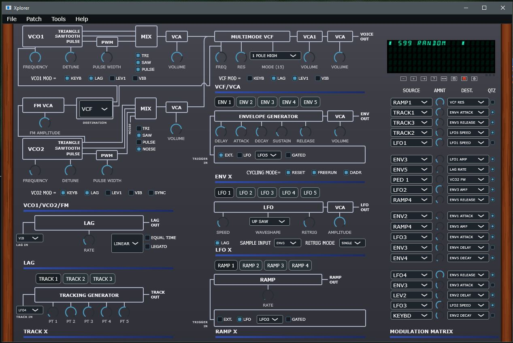

# Xplorer

Xplorer is a real-time editor for the Oberheim Xpander and Matrix-12 synthesizers.

## Status

The current development effort is moving to a JUCE-based implementation.
The source code for this work is located in the [juce](juce) directory.

This JUCE port is still a work in progress.

## Project structure

- [juce](juce): active JUCE-based source tree

## Main features

The JUCE version aims to provide a full editor for Oberheim Xpander and Matrix-12 patches with bidirectional MIDI synchronization. In practice, this means editing single patches from a unified interface, managing patch navigation and storage, sending and receiving SysEx messages, and supporting real-time automation from both the synth and external controllers. The project also covers patch import/export workflows, all-data-dump backup and restore, modulation-matrix editing, copy/paste of page-family settings, and a UI designed to stay responsive while long operations run in the background.

As part of the JUCE port, the application is expected to gain a vector-based user interface compatible with high-resolution displays, native cross-platform support for Windows, Linux, and macOS, a modern audio/MIDI development stack without legacy third-party frameworks dependencies, and a future path to run as a plugin inside DAWs.

This port also aims to demonstrate the integration of AI software development agents such as GitHub Copilot and Claude Code into the SDLC, by following a strict process and ensuring end-to-end traceability, using the AGNOS lightweight agentic developement process (see ./process folder).

## License

This project is licensed under the GPL v3.
See [LICENSE](LICENSE).

