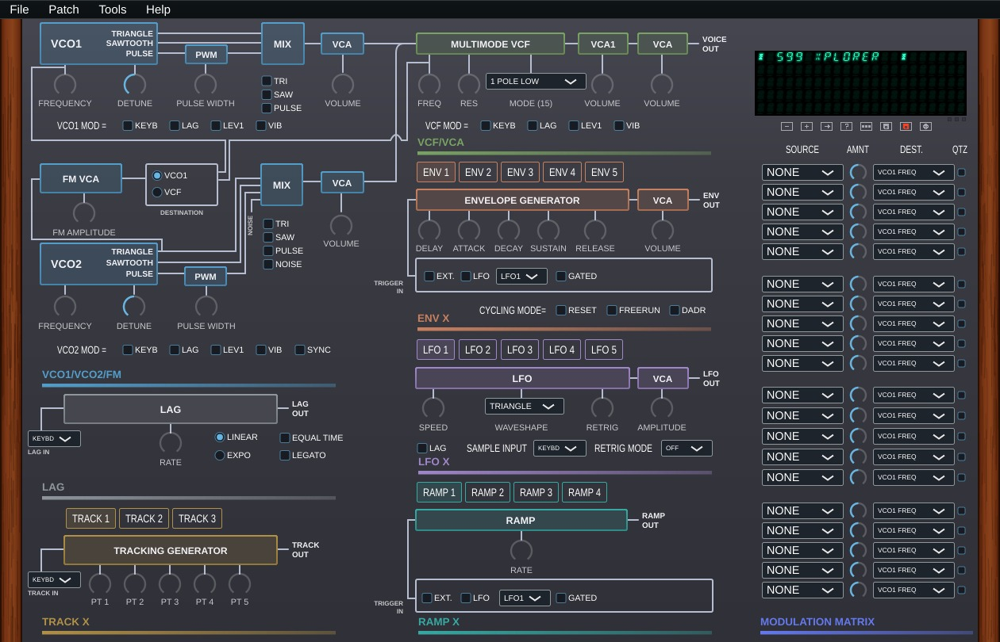

# Xplorer

Xplorer is a real-time and bi-directional software editor for the Oberheim Xpander and Matrix-12 synthesizers.

Xplorer is not just another generic synthesizer editor with ranges of slider controls that are all the same and don't really tell you what you are doing.
Xplorer was developed by an Xpander owner for use by Xpander and Matrix-12 owners. With Xplorer you quickly get an overview of all parameters of a single patch, including an overview of the Modulation Matrix — each functional block of the signal path (VCO, VCF, ENV, LFO, RAMP, LAG, TRACK, Modulation Matrix) is colour-coded so you can read the panel at a glance.

With Xplorer you can tweak the sound simultaneously using a computer mouse, a hardware MIDI controller, your DAW software, or directly on your Xpander or Matrix-12. Use the method you prefer to change the sound. Xplorer's display shows you in real-time which parameter is currently being modified.

"Real-time and bi-directional" means that every change you make in Xplorer is reflected into the synthesizer memory with minimal latency, and vice-versa. Whether you change the sound parameters on the synthesizer, in Xplorer, or with a MIDI controller, the software and the synthesizer will simultaneously update the parameters of the sound, without needing to reload the patch into the synthesizer memory.

## Status

Xplorer is being migrated from its original .NET/WinForms implementation to a cross-platform **JUCE/C++20** implementation. The JUCE port is the active development effort and lives under [juce](juce). Most features are already available; if you want to test it before the official release, compile it from the `main` branch source code — on Windows, run [make-windows-local-release-no-tests](make-windows-local-release-no-tests) (CMake + MSVC), or configure the [juce](juce) CMake project directly on any platform.

- **Alpha preview available**: the latest JUCE development version for Windows and macOS is available as an alpha preview in the releases stream: https://github.com/xplorer2716/XplorerEditor/releases
- **Latest official (.NET) release**: [v2025.12.7.1](https://github.com/xplorer2716/XplorerEditor/releases/latest) — the next official release (JUCE-based) will be published in the same releases stream

- **Legacy .NET source code**: archived at [xplorer2716/XplorerEditor-dotnet-archive](https://github.com/xplorer2716/XplorerEditor-dotnet-archive)

## Main features

- Single patch tone file load/save on disk
- Extract single patches from an "all data dump" SysEx file into a given folder
- Get all single patches from the synthesizer into a given folder
- All-data-dump request backup and restore (save and restore the synthesizer's whole memory to/from a SysEx file)
- Modification of the 226 parameters of a single patch
- Real-time MIDI automation for all parameters with freely assignable control changes, even for filter modes (except the Modulation Matrix)
- Copy/paste page for TRACK, ENV, LFO, and RAMP pages (e.g. copy all ENV1 page parameters and paste them to ENV3)
- Rename patch, go to patch, store patch, save patch to disk
- Real-time update of all parameters when the user tweaks the synthesizer knobs (dual editing can be done without needing to reload the patch and resynchronize the synthesizer and the PC, as most editors require)
- Patch randomizer (generates a new patch from random values)

### What's new in the JUCE port

- **Vector-drawn, resizable user interface** — the whole panel (background, block frames, signal-path diagram) is drawn with vector primitives instead of a fixed bitmap, so it stays crisp at any window size and on high-resolution displays
- **Window size presets & full screen** — a View menu offers five size presets (1x to 2x) plus full screen, falling back to full screen automatically when a preset doesn't fit the display; the VFD's glyph grid is snapped to whole device pixels so text stays equally crisp at every scale
- **Colour-coded functional blocks** — VCO, VCF, ENV, LFO, RAMP, LAG, TRACK and the Modulation Matrix each carry their own colour identity (frame, fill and section header), with a live modulation-matrix highlight, making the signal-path diagram easier to read at a glance
- **Refined VFD display** — a recessed bezel and vector-drawn segments, with the three MIDI-activity indicators redesigned as glowing lamps instead of flat squares
- **Reference-aligned menu bar** — menu order, icons and keyboard shortcuts now match the original hardware editor exactly
- **Native cross-platform target** — Windows, Linux and macOS, on a modern C++20/JUCE stack with no legacy third-party framework dependency, and a future path to run as a plugin inside DAWs
- **Modernised interaction feedback** — consistent hover and disabled states across every control, radio-button selectors matching the reference hardware panel (e.g. FM destination, LAG timing), and instant startup with no splash screen

This port also aims to demonstrate the integration of AI software development agents such as GitHub Copilot and Claude Code into the SDLC, by following a strict process and ensuring end-to-end traceability, using the AGNOS lightweight agentic development process (see the [process](process) folder).

## Requirements

- Windows, Linux, or macOS (x64)
- A MIDI interface (recommended: a MIDI interface with one MIDI OUT and one MIDI IN, plus a virtual MIDI cable driver such as [LoopBe1](http://www.nerds.de/en/loopbe1.html) for loopback to a DAW)

## Project structure

- [juce](juce): active JUCE-based source tree (build instructions, CMake setup)
- [process](process): AGNOS requirements / architecture-decision / plan artifacts

## Community

- Found a bug or have an idea? Open an issue using the
  [Bug Report](https://github.com/xplorer2716/XplorerEditor/issues/new?template=bug_report.yml) or
  [Feature Request](https://github.com/xplorer2716/XplorerEditor/issues/new?template=feature_request.yml) form.
- Want to contribute code? See [CONTRIBUTING.md](CONTRIBUTING.md) — it
  covers the workflow and, if you use an AI coding agent (GitHub Copilot,
  Claude Code, ...), the mandatory AGNOS process.
- This project follows a [Code of Conduct](CODE_OF_CONDUCT.md).

## Credits

- C# MIDI Toolkit by Leslie Sanford (original source code: https://www.codeproject.com/Articles/6228/C-MIDI-Toolkit) — used by the archived .NET implementation

## License

This project is licensed under the GPL v3.
See [LICENSE](LICENSE).

## Links

- website: http://xplorer.programmer.free.fr
- former forum: http://xplorer.programmer.free.fr/bb/
