# Xplorer — Dynamic Architecture

> This document covers only the Xplorer-specific dynamic flows.  
> For the base flows (generic startup, parameter change, CC# automation, worker thread, error handling), see [`MidiApp.MidiController` — Dynamic Architecture](../../MidiApp/MidiApp.MidiController/docs/architecture-dynamic.md).

## Overview

Xplorer extends the base `MidiApp.MidiController` flows with Xpander/Matrix-12-specific behavior: SysEx protocol handling (page-select, modulation edit, all-data-dump), modulation matrix management, page clipboard, tone morphing, and synth display control.

---

## 1. Application Startup (Xplorer-specific additions)

The base startup flow is described in the MidiApp.MidiController dynamic architecture. Xplorer adds:

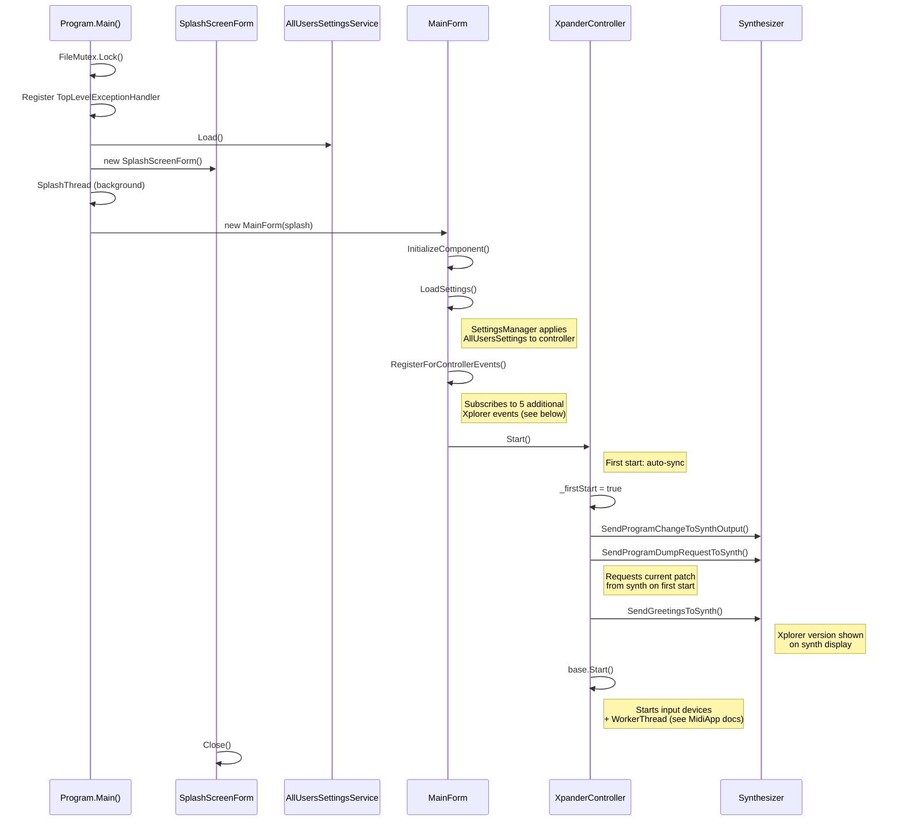

### Xplorer Event Registration

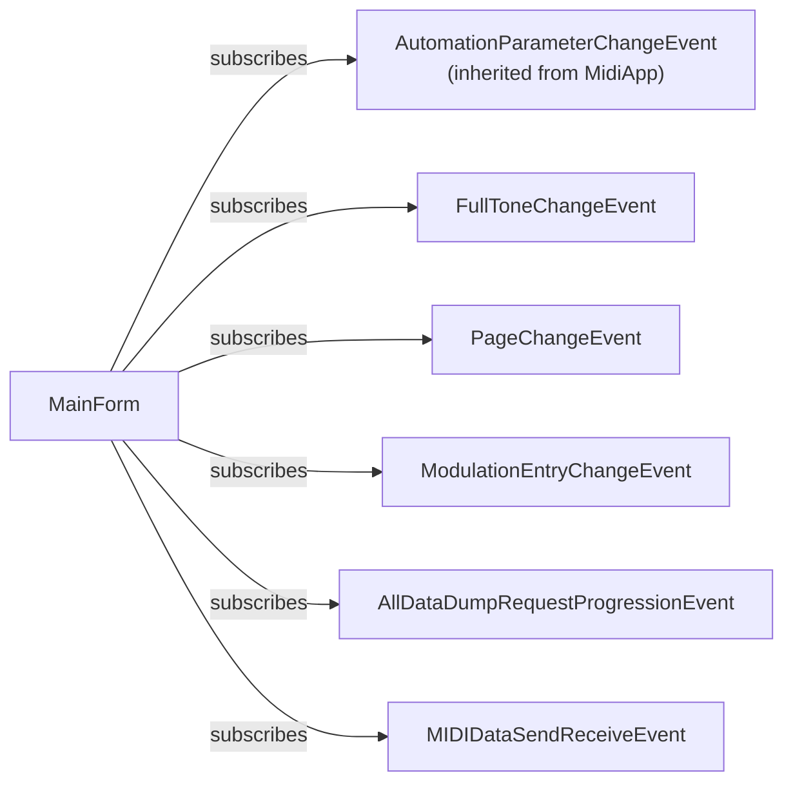

---

## 2. WorkerThread Override — Page-Select Before Send

Xplorer overrides the base `WorkerThreadProc` to add automatic Xpander page-select SysEx before each parameter message.

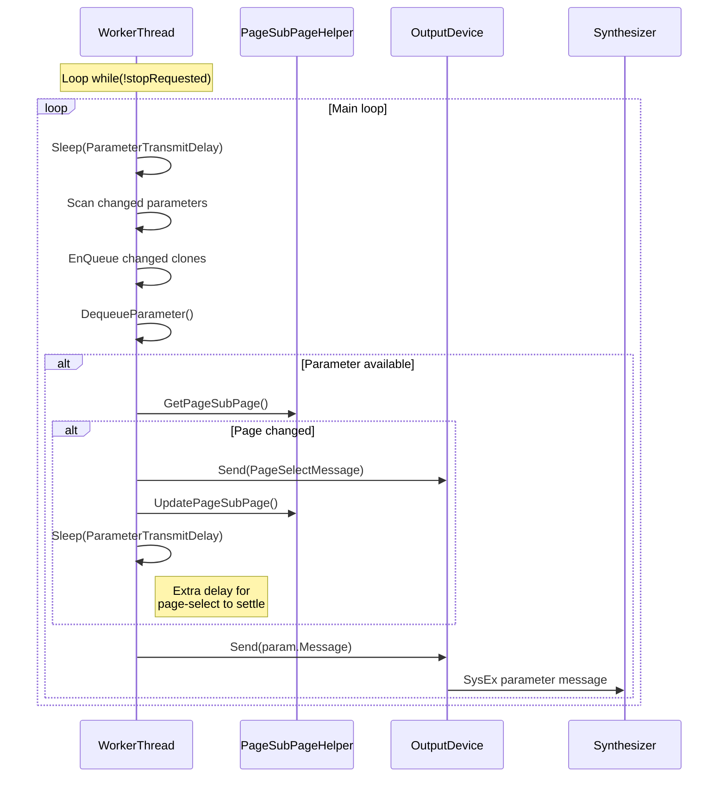

---

## 3. SysEx Reception from Synth (Xpander protocol)

The base `SynthInputDeviceSysExMessageReceived` is overridden to handle Xpander-specific SysEx messages.

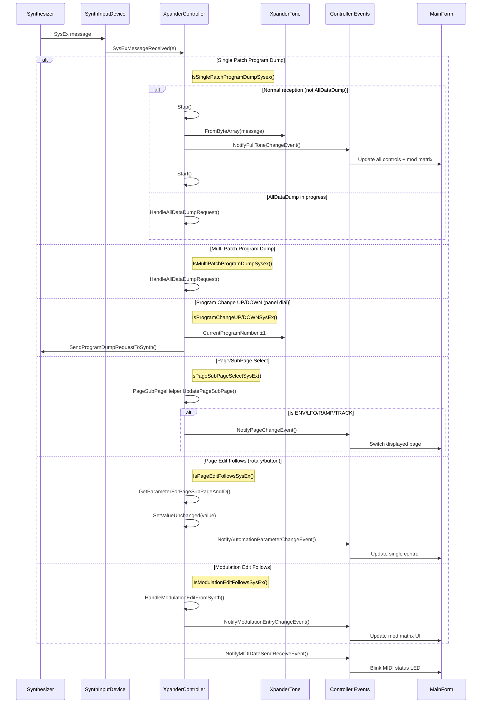

---

## 4. Page Refresh (Page Change Handler)

When the user clicks a page radio button or the controller receives a page-select message from the synth, `PageRefreshManager` coordinates the page switch and control refresh.

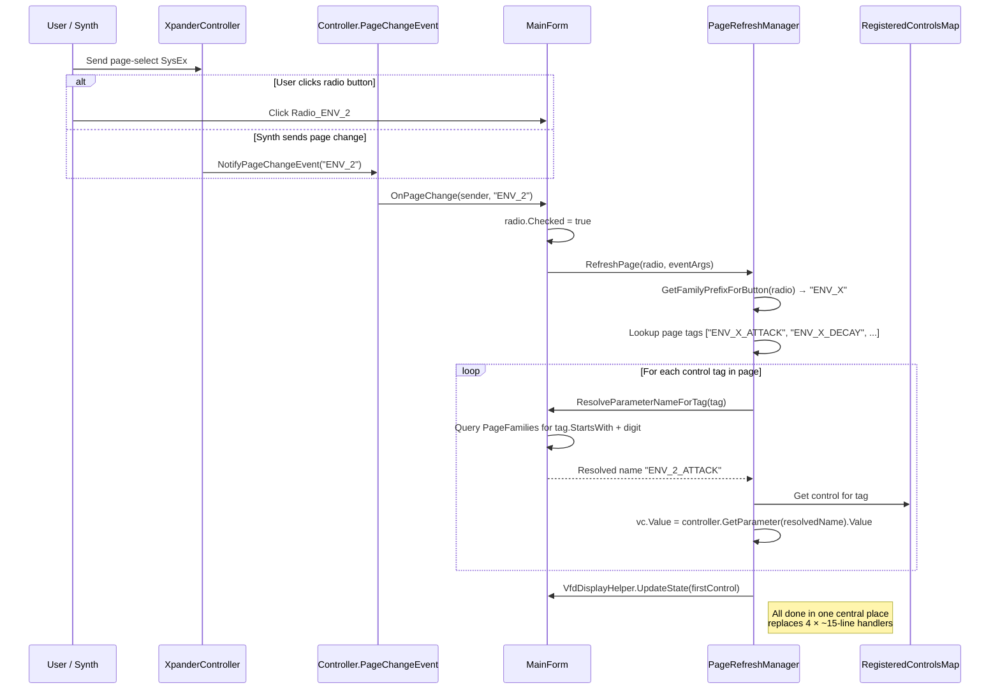

---

## 5. Trigger Mutual-Exclusion Rules

When the user changes an ENV or RAMP trigger mode (external, LFO, gated), `TriggerRuleManager` enforces the synthesizer's mutual-exclusion rules.

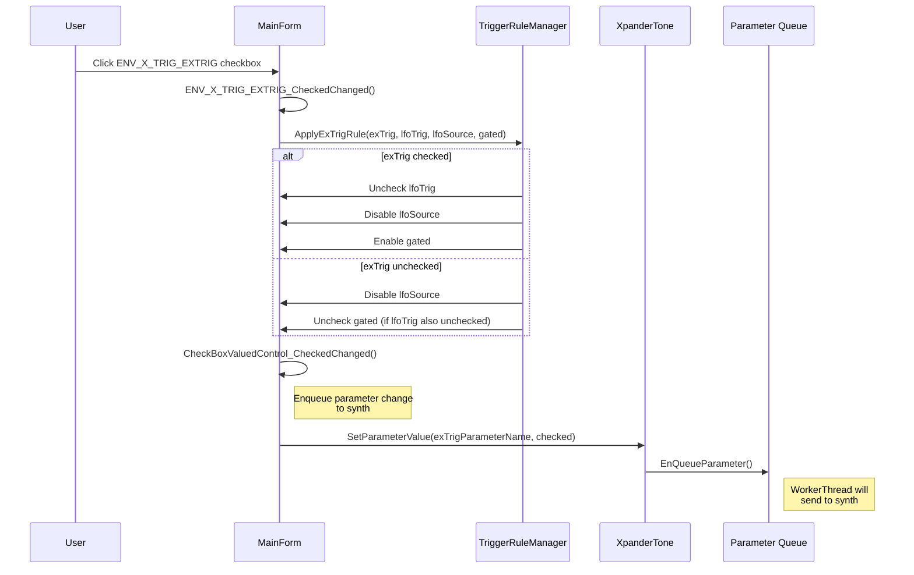

---

## 6. All Data Dump (Backup / Restore)

### 6a. Backup from Synth

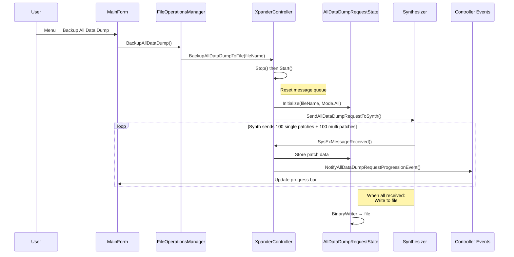

### 6b. Restore to Synth

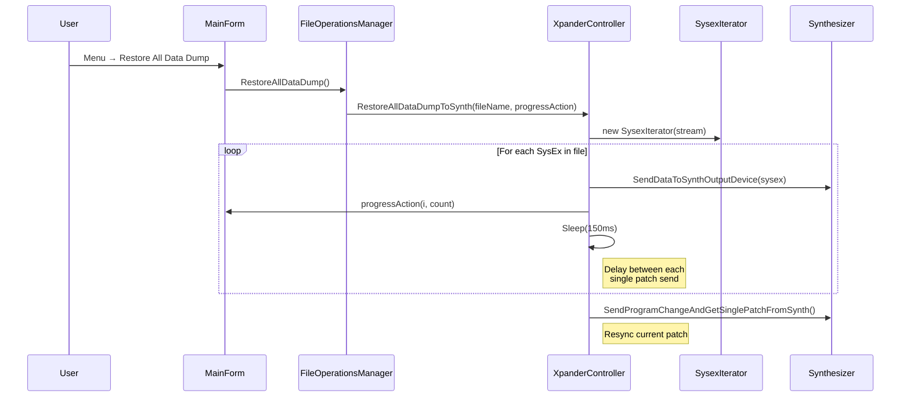

---

## 7. Modulation Matrix Editing

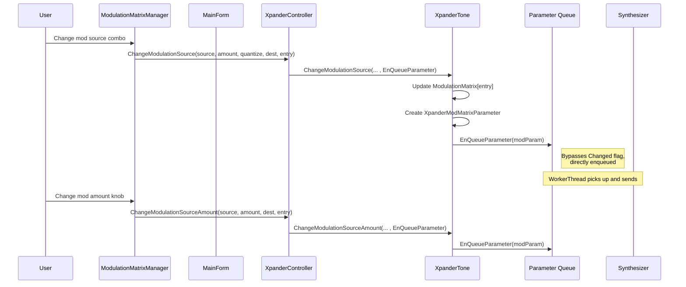

---

## 8. Page Clipboard (Copy / Paste)

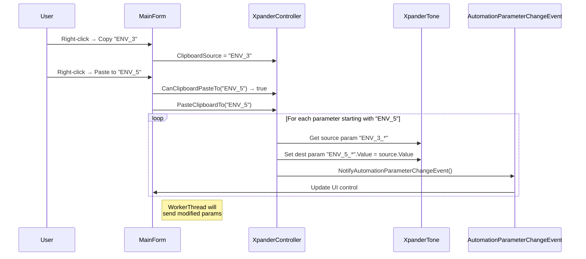

---

## 9. Tone Morphing

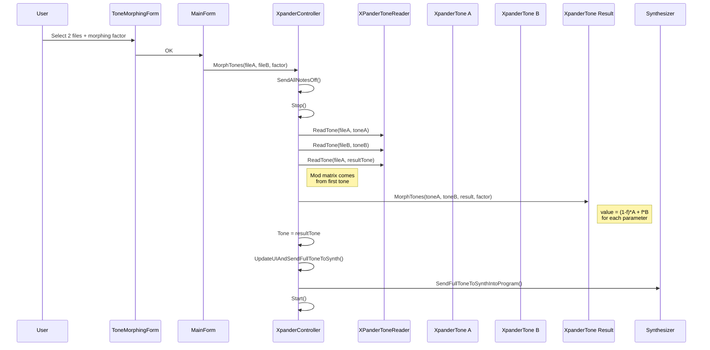

---

## 10. Randomization (Xplorer-specific additions)

The base randomization is described in the MidiApp docs. Xplorer adds synthesizer-specific logic:

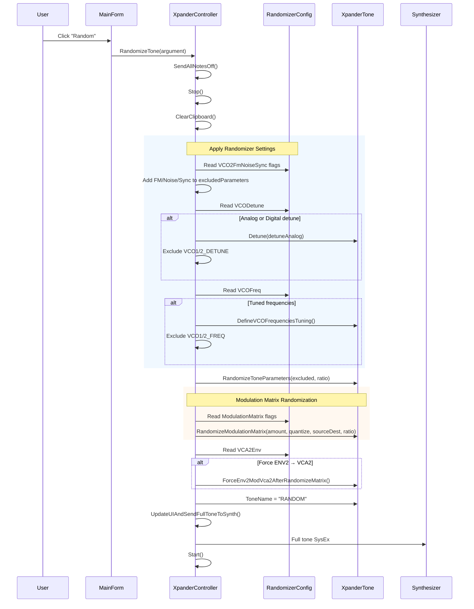

---

## 9. Synth Display Control

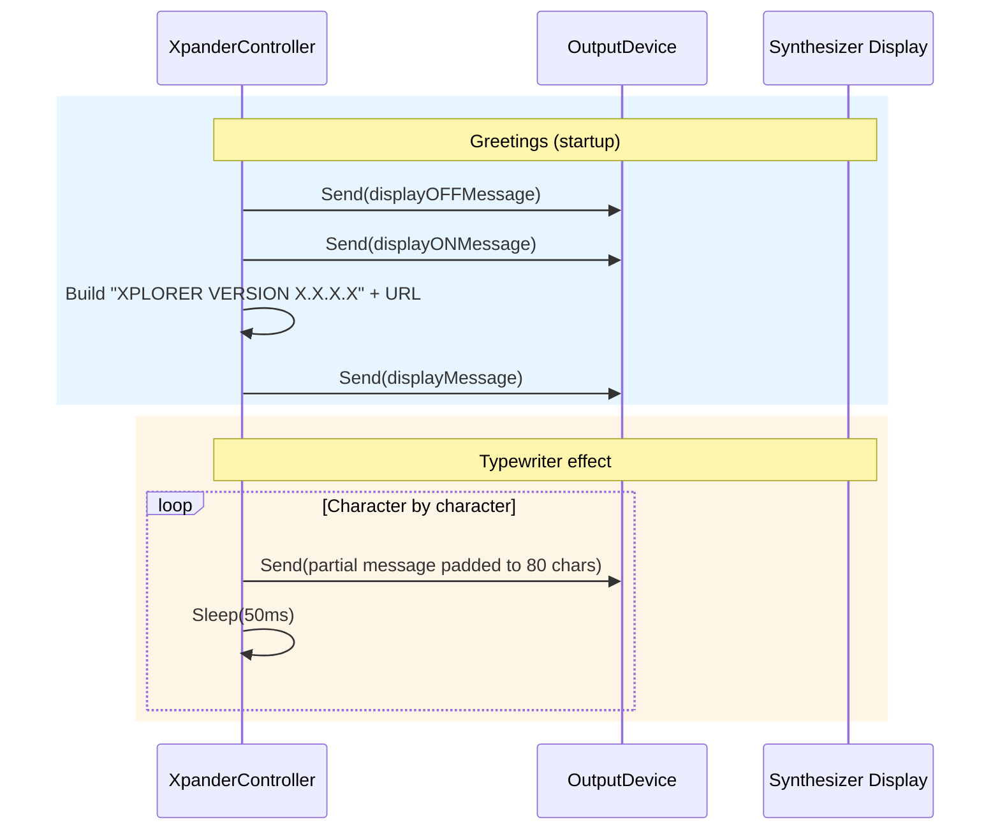

---

## 10. Automation Input Override (Program Change handling)

Xplorer extends the base CC# automation handler to also handle `ProgramChange` messages from the DAW.

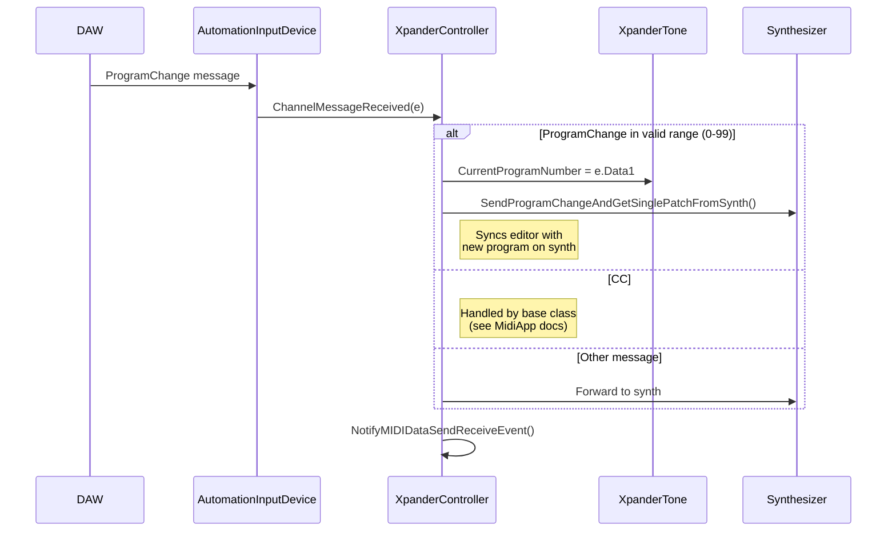

---

## Thread Summary (additions to MidiApp base)

| Thread | Additional Xplorer Responsibility |
|---|---|
| **UI Thread** | Manager classes (Settings, FileOps, ModMatrix), VFD display update, page radio buttons |
| **WorkerThread** | Page-select SysEx injection before each parameter send |
| **MIDI Input Callbacks** | Xpander SysEx protocol parsing (page edit, mod edit, program dump, all-data-dump state machine) |
| **SplashScreen Thread** | Dedicated thread for splash screen form during startup |
