# Xplorer — Static Architecture

> This document covers only the Xplorer-specific classes.  
> For the base framework (abstract classes, service layer, base view), see [`MidiApp.MidiController` — Static Architecture](../../MidiApp/MidiApp.MidiController/docs/architecture-static.md).

## Overview

The **Xplorer** project is the concrete application built on top of `MidiApp.MidiController`. It implements a real-time patch editor for the **Oberheim Xpander** and **Matrix-12** analog synthesizers. It provides the concrete controller, tone model, parameter types, modulation matrix, and a full WinForms user interface.

---

## How Xplorer Extends MidiApp.MidiController

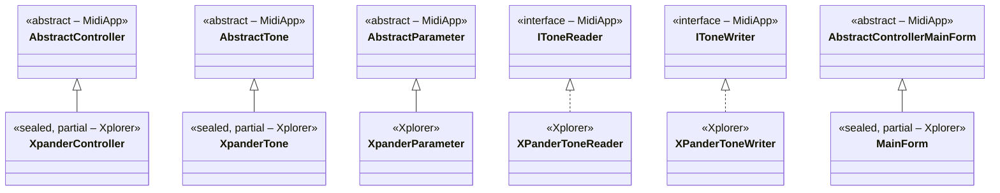

---

## Controller Layer

### XpanderController (partial, 6 files)

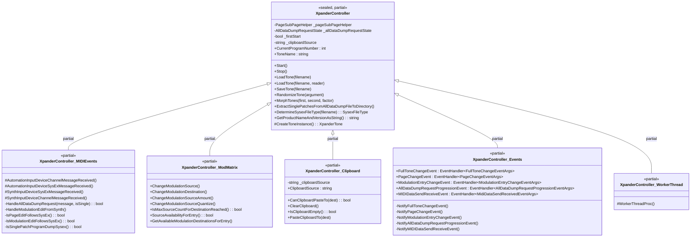

### Controller Support Classes

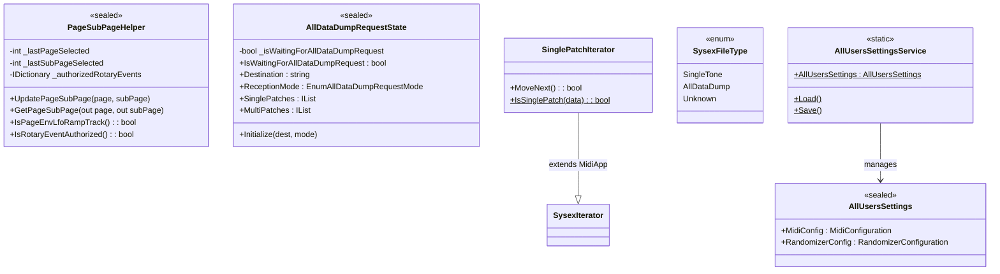

### Xplorer-Specific Events

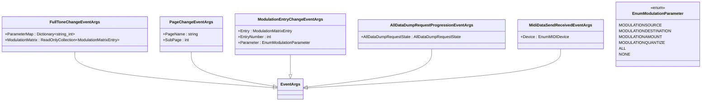

---

## Model Layer

### XpanderTone (partial, 3 files)

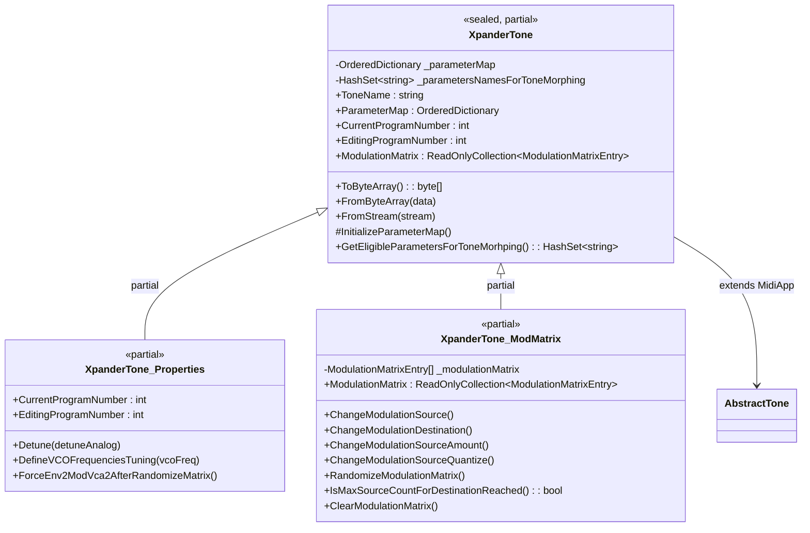

### Parameter Hierarchy

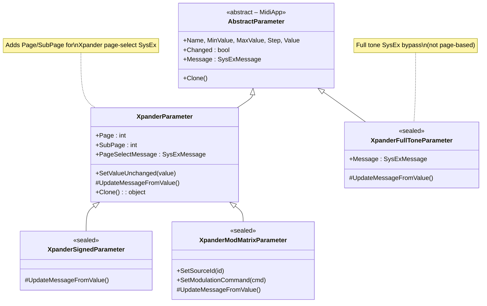

### SysEx Data Model

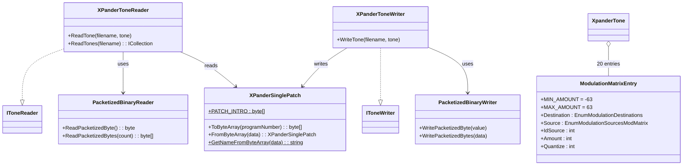

---

## View Layer

### MainForm and Managers

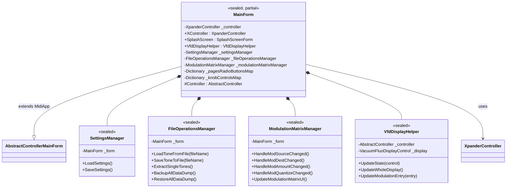

### Auxiliary Forms

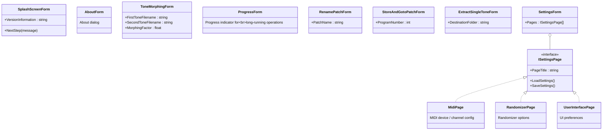

---

## Common Layer

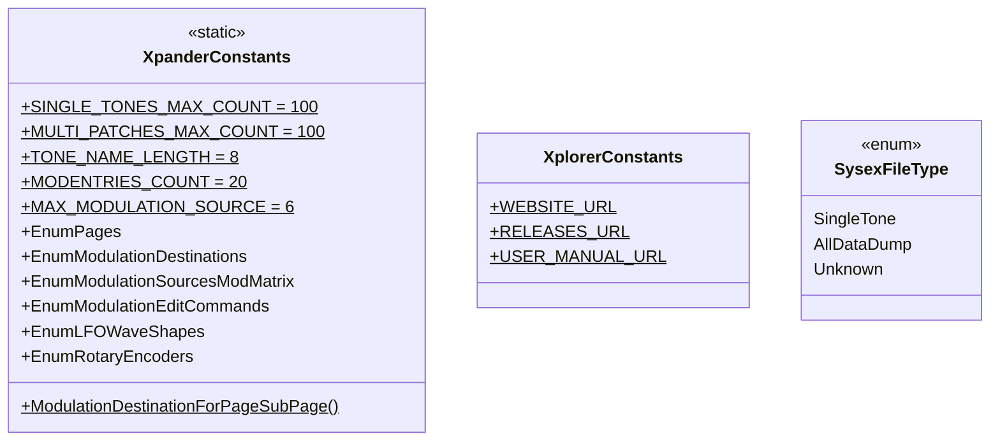

---

## File Organization by Layer

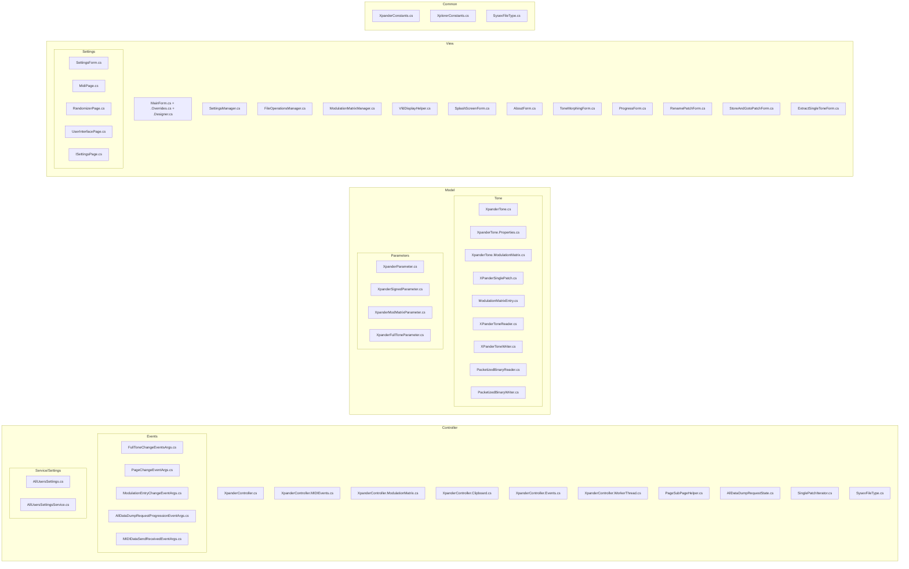

---

## External Dependencies

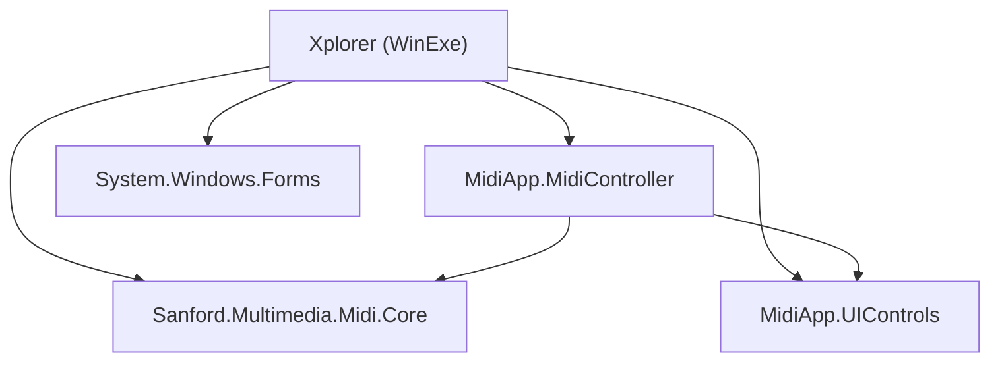

---

## Key Differences from MidiApp.MidiController

| Concern | MidiApp.MidiController (base) | Xplorer (concrete) |
|---|---|---|
| **Controller** | `AbstractController` — generic MIDI lifecycle | `XpanderController` — Xpander/Matrix-12 SysEx protocol, page/subpage, display, clipboard, all-data-dump |
| **Tone** | `AbstractTone` — ordered parameter map | `XpanderTone` — 20-entry modulation matrix, VCO detune, `ToByteArray`/`FromByteArray` serialization |
| **Parameters** | `AbstractParameter` — generic min/max/step/value | `XpanderParameter` + `SignedParameter` + `ModMatrixParameter` + `FullToneParameter` — page-select SysEx, signed encoding |
| **Reader/Writer** | `IToneReader`/`IToneWriter` interfaces | `XPanderToneReader`/`XPanderToneWriter` — packetized binary format, `SinglePatchIterator` |
| **View** | `AbstractControllerMainForm` — generic registration | `MainForm` — VFD display, mod matrix UI, settings pages, 8+ auxiliary forms |
| **Events** | `AutomationParameterChangeEvent` only | 5 additional events: `FullToneChange`, `PageChange`, `ModulationEntryChange`, `AllDataDumpProgression`, `MIDIDataSendReceive` |
| **WorkerThread** | Generic scan → enqueue → dequeue → send | Override adds automatic page-select before each parameter send |
| **Settings** | None | `AllUsersSettings` / `AllUsersSettingsService` — MIDI config, randomizer config, UI prefs |

---

## Xplorer-Specific Design Patterns

| Pattern | Where | Description |
|---|---|---|
| **Singleton (lazy)** | `MainForm.Controller` property | Lazy-init of `XpanderController` |
| **State Machine** | `AllDataDumpRequestState` | Tracks multi-step all-data-dump reception |
| **Page Clipboard** | `XpanderController.Clipboard` | Copy/paste of parameter pages (ENV, LFO, RAMP, TRACK) by name prefix matching |
| **Manager Delegation** | `SettingsManager`, `FileOperationsManager`, `ModulationMatrixManager` | Main form delegates complex operations to focused manager classes |
| **Packetized I/O** | `PacketizedBinaryReader`/`Writer` | Oberheim's 7-bit SysEx encoding for binary data |
| **Filtered Iterator** | `SinglePatchIterator` | Extends `SysexIterator` to skip non-single-patch data |
