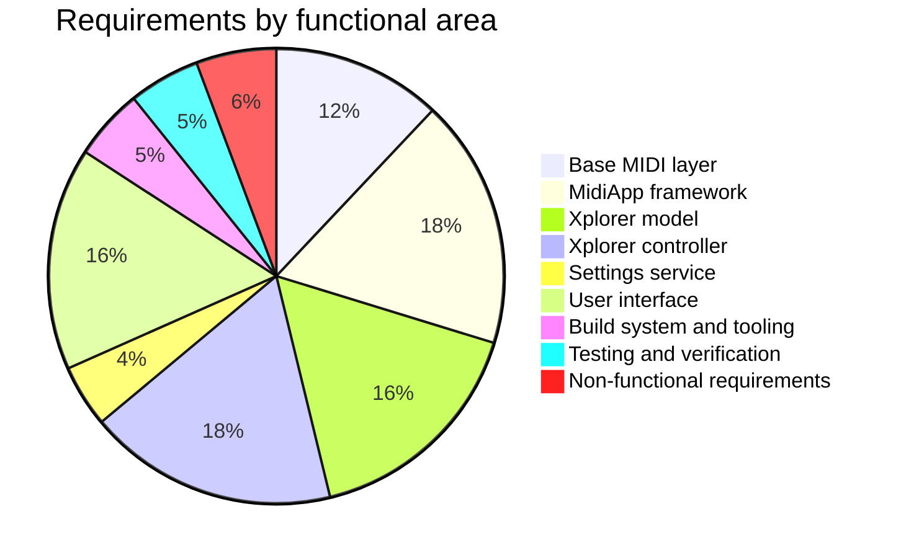

# Migration Requirements — Xplorer to JUCE

> Process: EARS-formatted requirements, IDs `RQ-<FTR>-<NNN>`.
> Behavioral reference: the existing C# implementation (Xplorer + MidiApp + Sanford usage surface) on branch `improvements`.
> Ground truth for MIDI formats: [Oberheim Xpander/Matrix-12 MIDI spec](https://github.com/xplorer2716/OberheimXpanderMidiSpec) and existing `.syx` files.

## Functional area codes

| FTR | Area | File |
|---|---|---|
| MID | Base MIDI layer (JUCE, replaces Sanford usage surface) | [RQ-MID-midi-layer.md](RQ-MID-midi-layer.md) |
| FMW | MidiApp framework port (abstract controller/model) | [RQ-FMW-midiapp-framework.md](RQ-FMW-midiapp-framework.md) |
| MOD | Xplorer model (tone, parameters, SysEx I/O, mod matrix) | [RQ-MOD-xplorer-model.md](RQ-MOD-xplorer-model.md) |
| CTL | Xplorer controller (features, bidirectional sync) | [RQ-CTL-xplorer-controller.md](RQ-CTL-xplorer-controller.md) |
| SET | Settings service | [RQ-SET-settings.md](RQ-SET-settings.md) |
| GUI | User interface (JUCE) | [RQ-GUI-user-interface.md](RQ-GUI-user-interface.md) |
| BLD | Build system & tooling | [RQ-BLD-build-tooling.md](RQ-BLD-build-tooling.md) |
| TST | Testing & verification | [RQ-TST-testing.md](RQ-TST-testing.md) |
| NFR | Non-functional requirements | [RQ-NFR-non-functional.md](RQ-NFR-non-functional.md) |

## Requirements statistics

- Total requirements: 140

| Functional area | Requirements |
|---|---:|
| MID | 19 |
| FMW | 28 |
| MOD | 26 |
| CTL | 28 |
| SET | 7 |
| GUI | 25 |
| BLD | 8 |
| TST | 8 |
| NFR | 9 |
| Total | 140 |

## Traceability

- Every ADR, source file, test and commit references the `RQ-` IDs it fulfils.
- Commits follow `TASK-JUCE-NNN: 
 [RQ-...]`.
- The implementation plan (`docs/3_plan/implementation-plan.md`) maps every task to requirements.

## Definitions

- **Reference implementation**: the C# code on branch `improvements` (this repo + `MidiApp` + `Sanford.Multimedia.Midi` submodules).
- **Bit-exact**: byte-for-byte identical MIDI/SysEx payloads and file formats versus the reference implementation.
- **Synth**: an Oberheim Xpander or Matrix-12 connected via MIDI IN/OUT.
