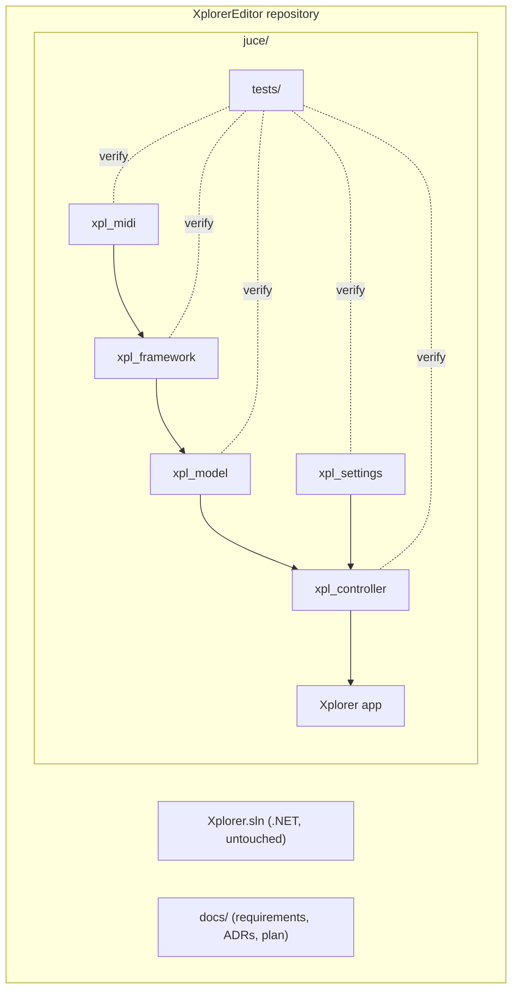

# ADR-002: C++ Project Layout Inside This Repository

## Status
Accepted

## Requirements
RQ-BLD-004, RQ-BLD-005, RQ-MID-040, RQ-NFR-007

## Context
The reference spans 3 repos (XplorerEditor, MidiApp, Sanford). The C# solution must keep building during the migration. Multiplying repos would slow iteration and complicate traceability; the owner accepted hosting the C++ tree in this repo.

## Decision
Create a top-level **`juce/`** directory holding the whole C++ implementation, one static library per layer mirroring the reference boundaries, and the app target:

```
juce/
├── CMakeLists.txt          # root: fetches JUCE, adds subdirs, CTest
├── midi/                   # xpl_midi      → RQ-MID  (backend interface + JUCE + mock backends)
├── framework/              # xpl_framework → RQ-FMW  (port of MidiApp.MidiController core)
├── model/                  # xpl_model     → RQ-MOD  (Xpander tone, parameters, sysex I/O)
├── controller/             # xpl_controller→ RQ-CTL  (XpanderController port)
├── settings/               # xpl_settings  → RQ-SET
├── app/                    # Xplorer JUCE application (GUI) → RQ-GUI
└── tests/                  # per-layer test executables + fixtures/ (.syx)
```

Naming: C# namespaces map to C++ namespaces (`MidiApp.MidiController.Model` → `midiapp::model`; Xplorer code → `xplorer::…`). One class per header/source pair; C# partial classes merge into one class split across `.cpp` files when large.

## Consequences
- The .NET solution and `juce/` coexist; nothing outside `juce/` and `docs/` is touched until cut-over (RQ-BLD-004).
- Layer libraries enforce the dependency direction bottom-up; the GUI is the only JUCE-GUI-linked target.
- Sanford/MidiApp submodules remain read-only references for behavior extraction.

## Diagram

