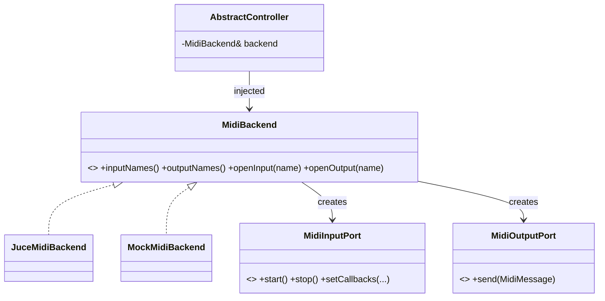

# ADR-004: MIDI Backend Abstraction (Ports & Adapters)

## Status
Accepted

## Requirements
RQ-MID-040, RQ-MID-041, RQ-MID-024, RQ-TST-004

## Context
The reference couples `AbstractController` directly to Sanford's `InputDevice`/`OutputDevice`. Porting that coupling to `juce::MidiInput/MidiOutput` would make the framework untestable without hardware and lock it to JUCE. RQ-MID-040/041 demand a backend-agnostic interface plus a mock backend.

## Decision
- Define pure interfaces in `xpl_midi`: `MidiBackend` (device enumeration/factory), `MidiInputPort` (open/start/stop, callback registration), `MidiOutputPort` (send channel/SysEx/common messages), plus a small value type `MidiMessage` (owned bytes + decoded accessors) independent of JUCE.
- Provide two implementations: `JuceMidiBackend` (adapters over `juce::MidiInput/MidiOutput/MidiMessage`) and `MockMidiBackend` (in-memory ports with scriptable input injection and captured output, plus a loopback wiring helper).
- The framework controller receives a `MidiBackend&` at construction (dependency injection); no JUCE type crosses the `xpl_midi` public headers.
- Per-port callback dispatch is serialized (RQ-MID-024): the JUCE adapter relies on JUCE's per-device callback thread; the mock delivers synchronously on the injecting thread, documented as such for tests.

## Consequences
- All controller/model tests run against `MockMidiBackend` with byte-level assertions (RQ-TST-004); hardware/loopback tests only exercise the thin JUCE adapter (RQ-TST-005).
- Slight indirection cost (one virtual call per message) — negligible at MIDI rates.
- Fixes the reference's DIP violation noted in `architecture-analysis.md` §5.

## Diagram

