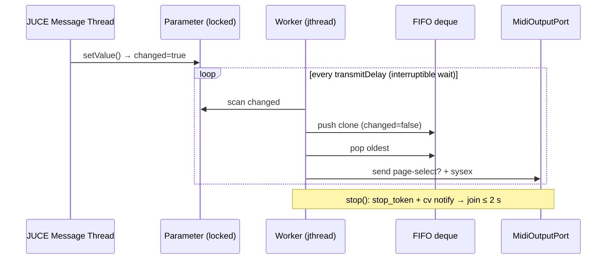

# ADR-005: Threading Model — Faithful Port First, Modern Primitives

## Status
Accepted

## Requirements
RQ-FMW-040, RQ-FMW-041, RQ-FMW-061, RQ-NFR-001, RQ-NFR-002, RQ-NFR-009

## Context
The reference uses a polling worker (`Thread.Sleep(delay)` + changed-flag scan + FIFO) whose *observable* pacing behavior the synth depends on (one SysEx per tick). `architecture-analysis.md` §8 flags the busy-sleep and `Application.DoEvents()` as defects, but re-architecting timing during the port would confound porting bugs with design changes.

## Decision
- **Preserve the observable semantics** of the reference transmit loop (tick = transmit delay; scan → enqueue clones → send one per tick) in the port.
- Implement it with a `std::jthread` + `std::condition_variable_any` wait-for (interruptible sleep honoring `stop_token`, 2 s join bound per RQ-FMW-041) and a mutex-guarded `std::deque` — no busy-wait, no thread kill.
- Long operations (dump backup/restore, get-all-patches) run on a dedicated task thread reporting progression via callback; **no UI pumping** (replaces `DoEvents`, RQ-NFR-009, RQ-GUI-021).
- UI-bound events cross threads through an injected `EventDispatcher` interface; the app supplies a JUCE implementation (`juce::MessageManager::callAsync`), tests supply a synchronous one (RQ-FMW-061).
- Parameter and automation-table thread-safety mirror the reference (fine-grained locks in `AbstractParameter`, `DualDictionary`).

## Consequences
- Byte streams and pacing on the wire are indistinguishable from the reference → hardware behavior identical (RQ-NFR-001).
- Worker is deterministic and testable: tests can inject a manual clock/tick or run with delay 0 against the mock backend.
- A later modernization (e.g. event-driven queue instead of scan) stays possible behind the same class boundary and would require a new ADR.

## Diagram

