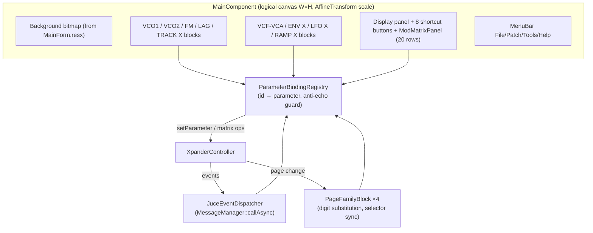

# ADR-006: GUI Architecture — Logical Canvas, Binding Registry, Functional-First Look

## Status
Accepted

## Requirements
RQ-GUI-001..008, RQ-GUI-010..012, RQ-GUI-015..017, RQ-GUI-020, RQ-GUI-029, RQ-GUI-030..032, RQ-FMW-061

## Context
The WinForms View is the largest migration effort: 234 custom controls positioned over a background bitmap (block diagram), shared page-family blocks (ENV/LFO/RAMP/TRACK) rebinding to the selected instance, a 20-row modulation matrix, a VFD display and in-house tag-based control⇄parameter binding. Owner decisions (2026-07): reuse the existing background bitmap; resizable window; standard JUCE controls first, custom skin later.

## Decision
1. **Logical canvas + uniform scale.** All components are laid out once in fixed logical coordinates (the background bitmap's pixel space). The main component applies `juce::AffineTransform::scale(f)` where `f = min(w/W, h/H)` on every resize: one layout, free resizing, aspect ratio preserved (RQ-GUI-005). The bitmap (extracted from `MainForm.resx` to a PNG committed under `juce/app/assets/`) is drawn scaled behind the controls (RQ-GUI-007).
2. **Binding registry.** A `ParameterBindingRegistry` maps control-id strings (the reference WinForms tags, unchanged: `VCO1_FREQ`, `MOD_AMNT_SRC_7`, `ENV_X_ATTACK`, …) to model parameters. Registration walks a declarative table (id, control, kind); the registry wires: control change → `disabledControlChangeNumber` + `setParameter`; controller parameter-change/full-tone events → control refresh with an anti-echo reentrancy guard (RQ-GUI-002..004). A local-edit fan-out (`setLocalEditHandler`, skipped under the anti-echo guard) and a `displayTextFor` accessor let the app feed the VFD on genuine user edits; each control formats its own value via `IBoundControl::displayText()` (combo/radio label, checkbox Y/N, knob numeric).
3. **Page-family view model.** One `PageFamilyBlock` component per family (descriptor-driven from `PageFamilies`): holds the shared controls with `_X_` ids; selecting an instance rewrites the effective parameter name (digit substitution, as `PageRefreshManager`), refreshes values, and asks the controller for the page-select. Synth page-change events drive the selectors in reverse (RQ-GUI-010..012).
4. **Standard controls first.** Phase 5 uses `juce::Slider` (rotary), `ComboBox`, `ToggleButton`, `TextButton`; a later `XplorerLookAndFeel` pass reproduces knobs/LED ring, image buttons (existing GIFs) and the VFD glyph rendering without touching behavior (RQ-GUI-030..031). The display starts as a fixed-width-font multiline text panel (RQ-GUI-020); a `VfdDisplayHelper` (port of the reference class) builds its content — friendly parameter name (from a `Resources.resx`-derived `GeneratedParameterNames.inc` table), value-by-control-type, MIDI CC, and modulation-matrix `SRC/DEST/AMNT/QTZ` — keeping the content logic headless-testable while the panel stays a dumb renderer (its bitmap-glyph replacement is ADR-007).
7. **File drop.** The top-level `ScaledCanvasComponent` is a `juce::FileDragAndDropTarget` (reference `MainForm.AllowDrop`); a dropped `.syx` is dispatched through `MainComponent::loadSysexFileByType`, the shared load-by-type path also used by File → Open (RQ-GUI-029).
5. **Threading.** The app installs a `JuceEventDispatcher` (`juce::MessageManager::callAsync`) into the controller; long operations run on `juce::ThreadPool`/dedicated thread with progression callbacks marshalled to a progress window (RQ-GUI-006, RQ-GUI-026).
6. **Testability.** The registry, family digit-substitution and matrix row⇄controller glue are plain classes unit-tested headless; only thin `Component` wrappers stay untested until Windows validation (RQ-TST-001 scope).

## Consequences
- One layout to maintain; resize is O(1) (transform), bitmap interpolation acceptable per owner (vector redraw = post-parity ADR if wanted).
- Reusing the reference tag vocabulary makes the 234-control table mechanically extractable from `MainForm.Designer.cs` (same approach as the parameter map extraction).
- Skin work is isolated in a LookAndFeel + custom components, zero behavioral risk.
- Windows-only visual validation remains with the owner; logic behind the components is CI-tested.

## Diagram

