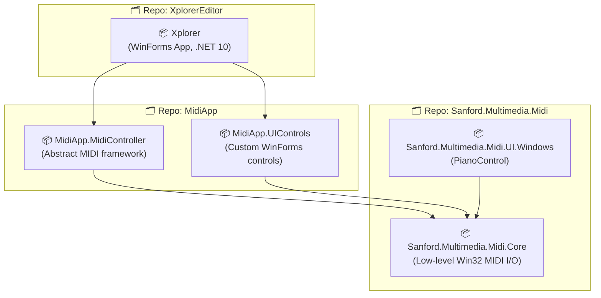
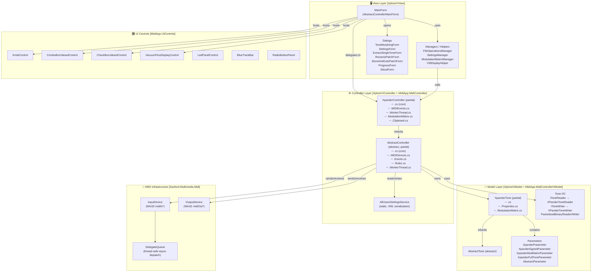
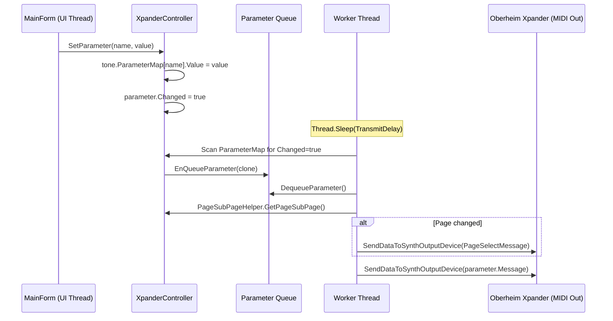
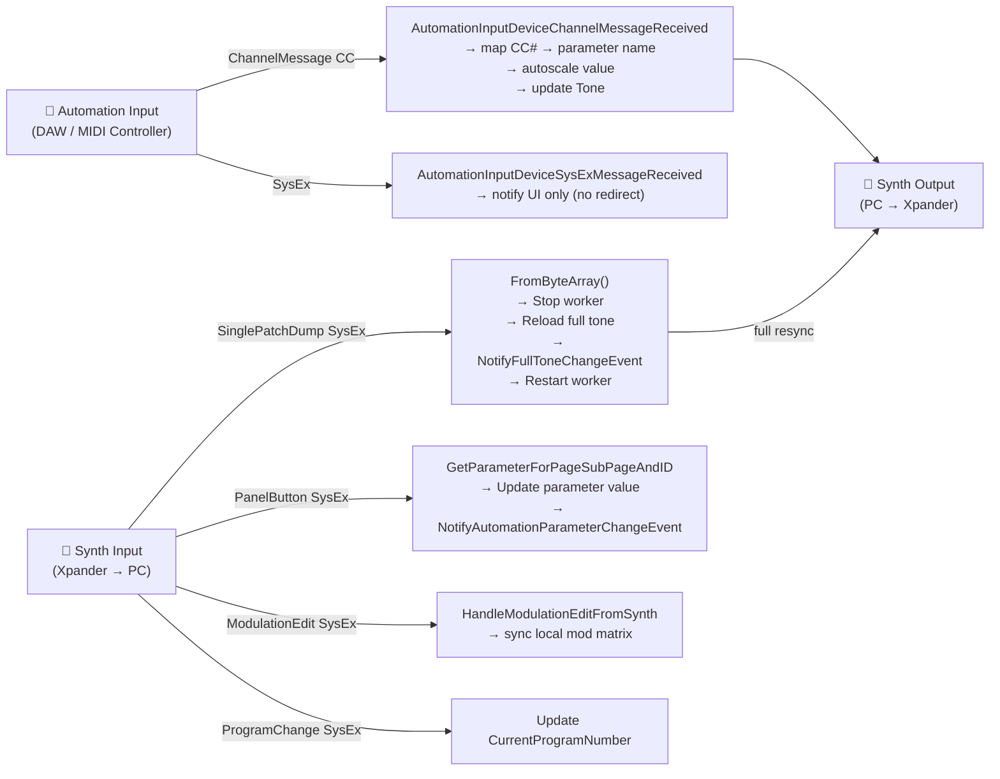
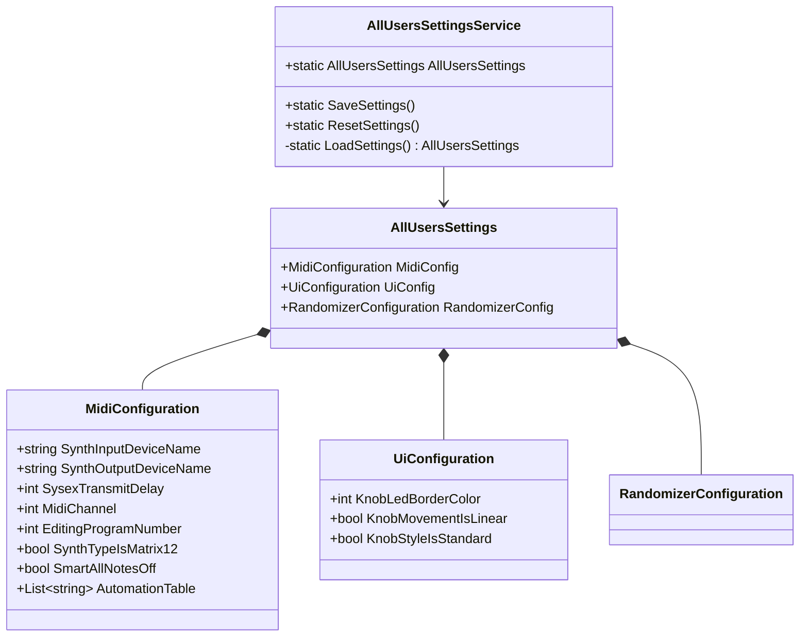
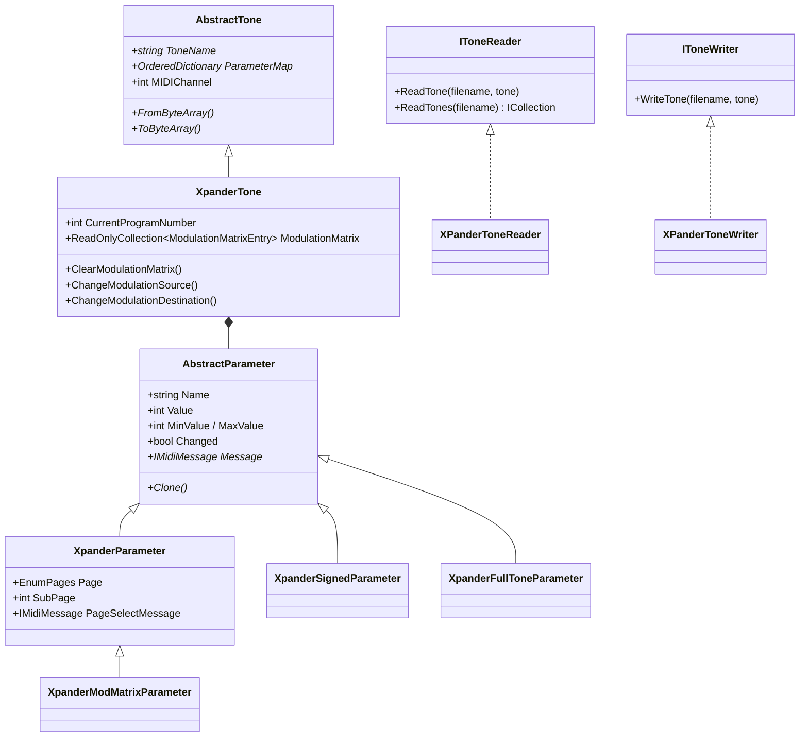
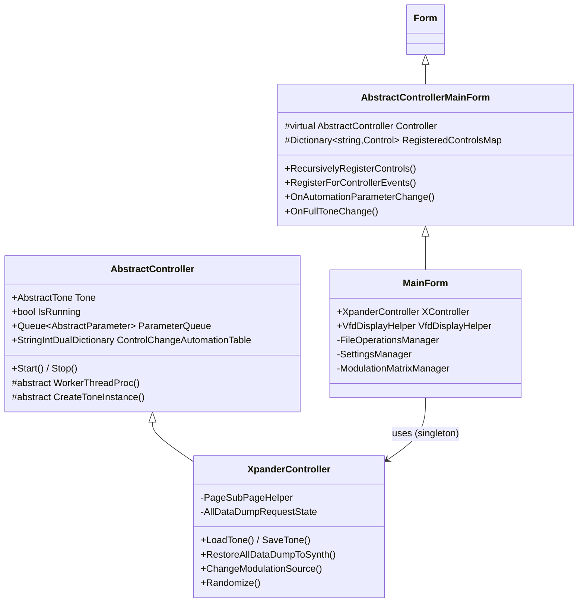
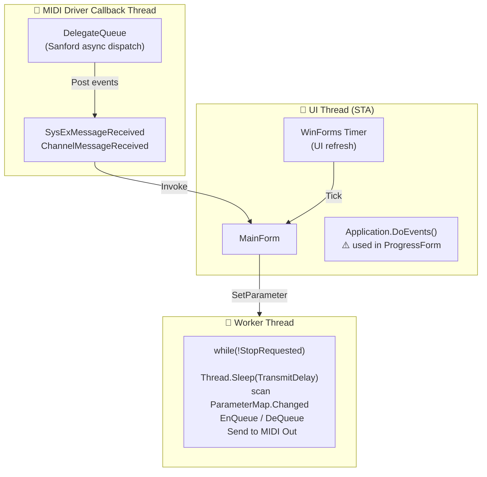
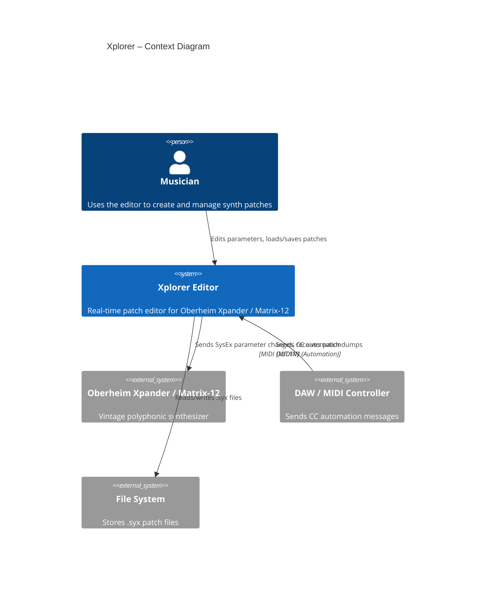

# Xplorer – Software Architecture Analysis

> **Author**: GitHub Copilot (Senior Software Architect review)  
> **Date**: 2026  
> **Target**: .NET 10 · Windows Forms · 3 Git repositories · 5 projects  
> **Purpose**: Oberheim Xpander / Matrix-12 real-time MIDI patch editor

---

## 1. Repository & Project Map

The solution spans **3 Git repositories** and **5 C# projects**:

---

## 2. Layered Architecture

The application follows a **3-layer MVC-inspired architecture** with clear separation between View, Controller, and Model.

---

## 3. Key Subsystems

### 3.1 Parameter Queue & Worker Thread

The core real-time engine uses an **old-school polling worker thread** pattern:

### 3.2 MIDI Event Flow (Bidirectional)

The application manages **3 MIDI devices** simultaneously:

### 3.3 Settings Architecture

### 3.4 Tone Model & I/O

---

## 4. Class Inheritance Overview

---

## 5. SOLID Analysis

| Principle | Assessment | Detail |
|---|---|---|
| **S** – Single Responsibility | ✅ Mostly respected | `FileOperationsManager`, `SettingsManager`, `ModulationMatrixManager`, `VfdDisplayHelper` correctly offload MainForm responsibilities. Controller partial classes separate MIDI events, worker thread, mod matrix. |
| **O** – Open/Closed | ✅ Good | `AbstractController` / `AbstractTone` are designed for extension without modification. `IToneReader` / `IToneWriter` allow new synth formats. |
| **L** – Liskov Substitution | ✅ Respected | `XpanderController` fully extends `AbstractController`. `XpanderTone` fully extends `AbstractTone`. |
| **I** – Interface Segregation | ✅ Good | `IValuedControl`, `IToneReader`, `IToneWriter`, `ISettingsPage` are small, focused interfaces. |
| **D** – Dependency Inversion | ⚠️ Partial violations | `AbstractController` casts `AbstractTone` to `XpanderTone` in several places. `FileOperationsManager` holds a concrete `MainForm` reference. `AllUsersSettingsService` is a static class (untestable). |

---

## 6. Key Design Patterns Used

| Pattern | Where |
|---|---|
| **Template Method** | `AbstractController`, `AbstractTone` — abstract methods for tone creation, worker thread, sysex handling |
| **Observer / Events** | Controller fires `FullToneChangeEvent`, `AutomationParameterChangeEvent`, `MIDIDataSendReceiveEvent` → View updates |
| **Command Queue** | `Queue<AbstractParameter>` + worker thread — decouples UI from MIDI timing |
| **Strategy** | `IToneReader` / `IToneWriter` — swappable serialization |
| **Partial Classes** | `XpanderController`, `XpanderTone`, `MainForm` split by concern |
| **Manager / Helper** | `FileOperationsManager`, `SettingsManager`, `VfdDisplayHelper` decompose MainForm |
| **Clone (Prototype)** | `AbstractParameter.Clone()` used before enqueuing to avoid race conditions |

---

## 7. Threading Model

> ⚠️ **Known issue**: `Application.DoEvents()` is used during all-data-dump restore and is even flagged with `#warning` in the source code. This is a UI freeze risk.

---

## 8. Improvement Proposals

### 8.1 🔴 High Priority

| # | Issue | Recommendation |
|---|---|---|
| 1 | `Application.DoEvents()` in `ProgressForm` + `#warning` in code | Replace with `async/await` + `IProgress<T>` pattern. Use `Task.Run()` for the dump operation. |
| 2 | Worker thread uses `Thread.Sleep` polling | Replace with `System.Threading.Channels.Channel<T>` (or `BlockingCollection<T>`) for a proper producer/consumer queue. Eliminates busy-sleep. |
| 3 | `AllUsersSettingsService` is a static class | Convert to an interface `ISettingsService` with a singleton implementation. Inject it into the controller. Enables unit testing. |

### 8.2 🟡 Medium Priority

| # | Issue | Recommendation |
|---|---|---|
| 4 | Concrete `XpanderTone` cast from `AbstractTone` in controller | Introduce a synth-specific interface (e.g. `IXpanderTone`) or use generics: `AbstractController<TTone>` where `TTone : AbstractTone`. |
| 5 | `FileOperationsManager` depends on concrete `MainForm` | Extract an interface `IMainFormFileOperations` and depend on it. |
| 6 | `OrderedDictionary` (non-generic) for `ParameterMap` | Migrate to `Dictionary<string, AbstractParameter>` + `List<string>` for order, or `OrderedDictionary<string, AbstractParameter>` (.NET 9+). |
| 7 | No DI container | Introduce `Microsoft.Extensions.DependencyInjection` for controller/service wiring. Would also solve the static settings service issue. |

### 8.3 🟢 Low Priority / Modernization

| # | Issue | Recommendation |
|---|---|---|
| 8 | No unit tests | Only a placeholder NUnit `Assert.Pass()` exists. Add tests for `XpanderTone` serialization, parameter bounds, modulation matrix logic. |
| 9 | `TODO: multi patch support` comment in MIDI event handler | Track this as a proper issue/backlog item. |
| 10 | XML settings serialization (`XmlSerializer`) | Consider migrating to `System.Text.Json` for consistency with .NET modern stack. |
| 11 | `SplashScreenForm` uses a raw `Thread` | Replace with `Task.Run()` + proper `CancellationToken`. |

---

## 9. Architecture Summary

### Strengths
- Clean separation between a **reusable MidiApp framework** (MidiApp.MidiController, MidiApp.UIControls) and the **Xpander-specific application** (Xplorer)
- Good use of abstract base classes enabling future support for other synths
- Thoughtful partial class decomposition of large classes
- Robust error reporting via `BugReportFactory` with MIDI-aware exception details
- Custom hardware-accurate UI controls (VFD display, knob, LED panel)

### Weaknesses
- **No async/await** — threading is entirely manual (Thread + Thread.Sleep)
- **No unit tests** for core business logic (tone serialization, modulation matrix, parameter bounds)
- **Static service** (`AllUsersSettingsService`) creates hidden global state
- **Concrete type casting** leaks abstraction at the controller/model boundary
- `Application.DoEvents()` is a known UI anti-pattern still present in the codebase
