# Xplorer — Software Architecture

> **Subject**: Xplorer, a real-time MIDI patch editor for the Oberheim Xpander and Matrix-12.
> **Stack**: C++20 · JUCE 8.0.9 · CMake + FetchContent · Catch2 v3.
> **Licence**: AGPL-3.0-or-later (ADR-ABT-002 — required by JUCE 8's open-source tier).
> **Status**: shipping. The application is feature-complete; this document describes what
> exists, not what is planned.
> **Audience**: maintainers and AI coding agents working on this repository.

This is a **reference document, not a narrative**. It answers "where does X live, what
guarantees it, and what breaks if I change it". It deliberately avoids describing the
project's history: the migration from the original .NET/WinForms implementation is
finished, that codebase is archived at
[`xplorer2716/XplorerEditor-dotnet-archive`](https://github.com/xplorer2716/XplorerEditor-dotnet-archive),
and it is referred to below only as **"the reference"** and only where its behaviour is
still a binding constraint on this one (§8).

---

## Contents

| § | Section | Read it when |
|---|---|---|
| [0](#0-orientation-read-this-first) | **Orientation** | Always — routing table + the rules that prevent most defects |
| [1](#1-executive-summary) | Executive summary | You need the shape of the system in one page |
| [2](#2-repository--build-architecture) | Repository & build | You touch CMake, CI, packaging or versioning |
| [3](#3-layered-architecture) | Layered architecture | You add a dependency or wonder where code belongs |
| [4](#4-generated-sources--single-sources-of-truth) | **Generated sources** | **Before editing any file — check it is not generated** |
| [5](#5-the-application-layer) | The application layer | You touch anything under `juce/app/` |
| [6](#6-core-subsystems) | Core subsystems | You touch controller, model, MIDI or settings |
| [7](#7-threading-model) | Threading model | You add async work or touch the worker |
| [8](#8-behavioural-invariants) | **Behavioural invariants** | **Before "fixing" anything that looks wrong on the wire** |
| [9](#9-solid--design-patterns) | SOLID & patterns | You design a new seam |
| [10](#10-testing-architecture) | Testing architecture | You add code and need to know where its test goes |
| [11](#11-known-gaps--technical-debt) | Known gaps & debt | You are looking for work, or hit something unfinished |
| [12](#12-architecture-summary) | Architecture summary | You want the context diagram and the honest trade-offs |
| [13](#13-licensing-disclosure--governance) | Licensing & governance | You add a dependency or change a licence header |
| [14](#14-open-points-still-to-verify) | **Open points still to verify** | You need to know what is *not* proven — hardware, platforms, unconfirmed wire behaviours |
| [A](#appendix-a--decision-index) | Decision index | You need the ADR that governs an area |
| [B](#appendix-b--glossary) | Glossary | An identifier or acronym is unfamiliar |

---

## 0. Orientation (read this first)

### 0.1 Task → location routing

| If your task is about… | Go to | Section |
|---|---|---|
| A knob/combo/checkbox's **position, size or caption** | `juce/app/core/src/GeneratedControlTable.inc` — **generated**, see §4 | [§4](#4-generated-sources--single-sources-of-truth) |
| A **colour, stroke width, font size, spacing token** | `juce/tools/design-tokens.yaml` → regenerates `juce/app/src/DesignTokens.hpp` | [§4](#4-generated-sources--single-sources-of-truth), [§5.9](#59-skin-design-tokens-and-themeable-blocks) |
| The **background artwork** (frames, rails, captions, signal lines) | `juce/app/src/BackgroundRenderer.cpp` + `juce/tools/generate_background_mockup.py` (must stay in lock-step) | [§5.2](#52-logical-canvas--uniform-scaling) |
| **What a control does** when the user moves it | `juce/app/core/src/ParameterBindingRegistry.cpp` | [§5.4](#54-control--parameter-binding) |
| The **VFD** text, layout or glyphs | `VfdDisplayHelper` (content) / `DisplayPanel` + `VfdSegmentRenderer` (rendering) | [§5.6](#56-vfd-display) |
| **Menus**, shortcuts, menu ids | `juce/app/core/include/xplorer/app/MenuIds.hpp` (identity) + `MainComponent.cpp` (labels/actions) | [§5.8](#58-menus-dialogs--long-operations) |
| A **dialog** (settings, rename, goto, store, extract, about) | `juce/app/src/Dialogs.cpp`, `SettingsDialog.cpp` | [§5.8](#58-menus-dialogs--long-operations) |
| **SysEx bytes** on the wire | `juce/model/src/XpanderParameter.cpp`, `juce/controller/src/XpanderController*.cpp` | [§6.2](#62-midi-event-flow), [§8](#8-behavioural-invariants) |
| **Patch file** read/write | `juce/model/src/XpanderToneIO.cpp`, `XpanderSinglePatch.cpp` | [§6.4](#64-tone-model--io) |
| **Settings** schema or persistence | `juce/settings/src/XmlSettingsService.cpp`, `AllUsersSettingsDefaults.cpp` | [§6.3](#63-settings) |
| The **transmit worker** / MIDI pacing | `juce/framework/src/AbstractControllerWorker.cpp`, `XpanderController::workerThreadProc` | [§7](#7-threading-model) |
| **Controller lifecycle** (start/stop) | `MainComponent` ctor/dtor, `SettingsContent` ctor/dtor | [§6.5](#65-controller-lifecycle) |
| **CI, packaging, versioning** | `juce/tools/generate_workflows.py` → `.github/workflows/` — **generated**; logic in `.github/actions/` | [§2.4](#24-ci-three-streams-generated-workflows) |
| A **new requirement / ADR / plan** | `process/1.requirements/`, `process/2.architecture/`, `process/3.plan/` | [§A](#appendix-a--decision-index) |

### 0.2 The five rules

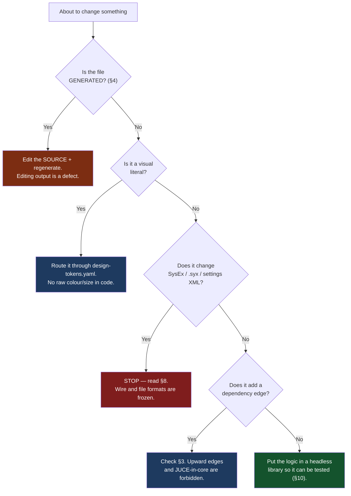
```mermaid
flowchart TD
    START["About to change something"] --> GEN{"Is the file<br/>GENERATED? (§4)"}
    GEN -->|Yes| SRC["Edit the SOURCE + regenerate.<br/>Editing output is a defect."]
    GEN -->|No| VIS{"Is it a visual<br/>literal?"}
    VIS -->|Yes| TOK["Route it through design-tokens.yaml.<br/>No raw colour/size in code."]
    VIS -->|No| WIRE{"Does it change<br/>SysEx / .syx / settings XML?"}
    WIRE -->|Yes| INV["STOP — read §8.<br/>Wire and file formats are frozen."]
    WIRE -->|No| LAYER{"Does it add a<br/>dependency edge?"}
    LAYER -->|Yes| L3["Check §3. Upward edges<br/>and JUCE-in-core are forbidden."]
    LAYER -->|No| TEST["Put the logic in a headless<br/>library so it can be tested (§10)."]

    style SRC fill:#7c2d12,color:#fff
    style TOK fill:#1e3a5f,color:#fff
    style INV fill:#7f1d1d,color:#fff
    style L3 fill:#1e3a5f,color:#fff
    style TEST fill:#14532d,color:#fff
```

1. **Never hand-edit a generated file.** Six `.inc` files, `DesignTokens.hpp` and all 17 CI
   workflows are outputs. Editing one is a defect that the next regeneration silently
   reverts. §4 lists every one with its source and generator.
2. **No raw visual literal in UI code.** Colours, strokes, sizes, alphas and motion
   durations come from `DesignTokens.hpp`. A local named constant may *alias* a token; it
   may not *hold* a value.
3. **Wire and file formats are frozen.** SysEx frames, the 399-byte patch dump and the
   settings XML schema interchange with an archived implementation and with real hardware.
   Several of them look wrong and are correct — §8 lists each with the reason.
4. **Logic goes in a headless library.** `xpl_app_core` links no UI framework, so anything
   put there is machine-testable. JUCE components stay thin and are eye-validated only.
5. **Every artefact carries its requirement ID.** Code comments, tests, commits and ADRs
   reference `RQ-…` / `ADR-…` / `DEC-…` ids so any decision is greppable to its rationale.

### 0.3 Scale of the system

| Dimension | Count |
|---|---|
| Production code | **19 829 lines** across **135** files (`juce/`, excluding tests and tooling) |
| Test code | **8 412 lines** across **40** files |
| Catch2 scenarios | **170** definitions; **2 911** assertions in the headless configuration |
| Build targets | 7 static libraries + 1 asset library + 1 GUI executable + 9 test executables |
| Requirements | **287** `RQ-*` ids |
| Architecture decisions | **50** ADRs carrying **176** `DEC-*` ids |
| Plans / tasks | **46** plans, **217** `TASK-*` ids |
| CI workflows | **17** (15 generated + 2 hand-written) |
| Bound controls | **208** rows in the generated control table; **227** tone parameters |

---

## 1. Executive summary

### 1.1 What Xplorer is, and the problem it solves

The Oberheim Xpander and Matrix-12 are analogue polysynths from the mid-1980s with
extraordinary modulation capability and a **two-line, six-character display**. Editing them
on the instrument means paging through numbered menus, one parameter at a time, with no view
of the patch as a whole. A single voice has **227 parameters** and a **20-slot modulation
matrix**; the front panel can show six characters of it.

**Xplorer puts the entire patch on one screen, laid out like the instrument itself**, and
keeps it in sync with the hardware in real time. Turn a knob on screen and the synth hears
it immediately; turn a knob on the synth and the screen follows. It is not a librarian that
uploads patches — it is a live control surface.

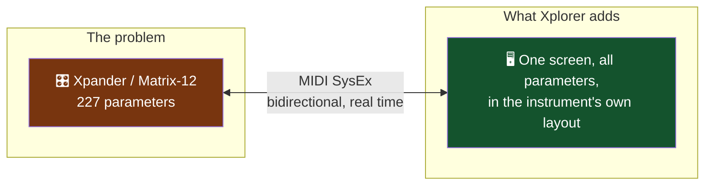
```mermaid
flowchart LR
    subgraph P ["The problem"]
        SYN["🎛 Xpander / Matrix-12<br/>227 parameters<br/>"]
    end
    subgraph S ["What Xplorer adds"]
        SCR["🖥 One screen, all parameters,<br/>in the instrument's own layout"]
    end
    SYN <-->|"MIDI SysEx<br/>bidirectional, real time"| SCR

    style SYN fill:#78350f,color:#fff
    style SCR fill:#14532d,color:#fff
```

### 1.2 What the user sees

One window, no tabs, no navigation. The layout reproduces the instrument's signal flow left
to right — oscillators, filter, amplifier — with the modulation matrix and the display panel
below.

| Area | What it is |
|---|---|
| **Functional blocks** | VCO 1/2, VCF/VCA, ENV, LFO, RAMP, TRACK, LAG — each framed, each with its own themeable identity colour |
| **Page families** | ENV, LFO, RAMP and TRACK exist in numbered instances (ENV 1-5, LFO 1-5, RAMP 1-4, TRACK 1-3). One set of controls is shown; a selector switches which instance it edits |
| **Modulation matrix** | 20 rows of *source → amount → destination*, the instrument's defining feature |
| **VFD display** | A vacuum-fluorescent-style readout echoing the synth's own display: patch name and number, the parameter being edited and its value, the modulation entry being edited, incoming CC |
| **Quick buttons** | Eight shortcuts under the display: previous/next patch, go to patch, randomize, load, save, store, settings |
| **MIDI activity lamps** | Three lamps — automation in, synth in, synth out — that flash on traffic |
| **Menu bar** | File, Patch, View, Tools, Help |

### 1.3 How a session works

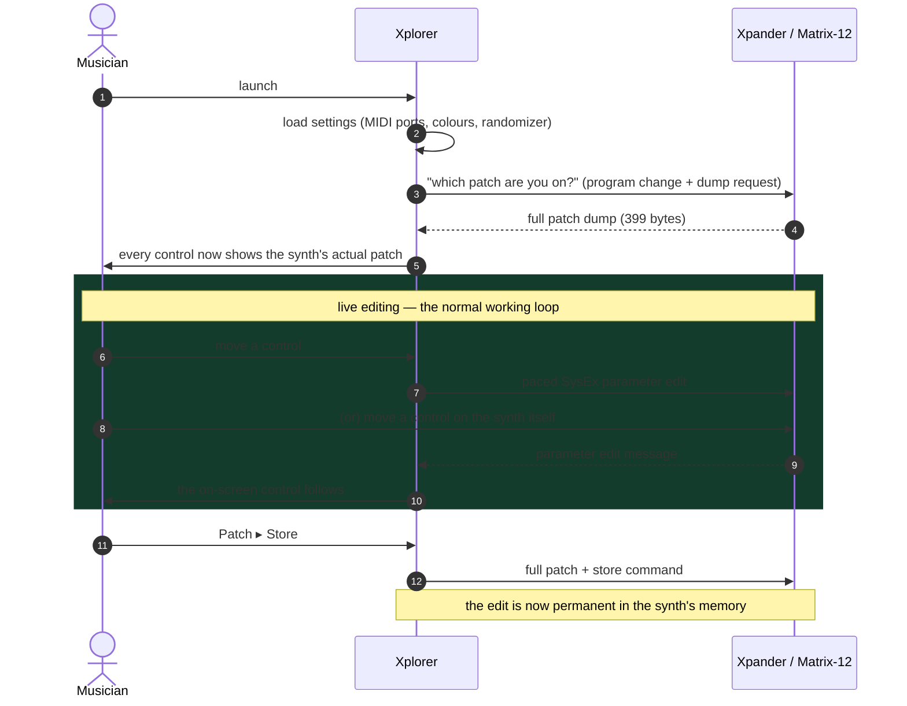
```mermaid
sequenceDiagram
    autonumber
    actor U as Musician
    participant X as Xplorer
    participant S as Xpander / Matrix-12

    U->>X: launch
    X->>X: load settings (MIDI ports, colours, randomizer)
    X->>S: "which patch are you on?" (program change + dump request)
    S-->>X: full patch dump (399 bytes)
    X->>U: every control now shows the synth's actual patch

    rect rgb(20,60,45)
    Note over U,S: live editing — the normal working loop
    U->>X: move a control
    X->>S: paced SysEx parameter edit
    U->>S: (or) move a control on the synth itself
    S-->>X: parameter edit message
    X->>U: the on-screen control follows
    end

    U->>X: Patch ▸ Store
    X->>S: full patch + store command
    Note over X,S: the edit is now permanent in the synth's memory
```

The two directions are symmetric and that symmetry is the product: **the screen and the
instrument are two views of one state.** Everything else in the architecture exists to keep
that true — the anti-echo guard (§5.4), the paced transmit worker (§6.1), the reload-on-dump
path (§6.2) and the lifecycle rules (§6.5).

Beyond live editing the application also does: load and save `.syx` patch files (including
by drag & drop), fetch or restore the synth's entire memory with a progress window,
randomize a patch under constraints the user chooses, rename a patch, and drive an on-screen
piano keyboard for auditioning without touching the instrument.

### 1.4 The four architectural properties

**A fixed logical canvas, scaled by one transform.** Every control is placed once in a
1260×786 logical space; the whole canvas is scaled by a single `AffineTransform` on resize.
Nothing else in the codebase knows about scaling or DPI — a property later decisions
deliberately preserve rather than duplicate.

**The façade is vector, not bitmap.** Background diagram and VFD glyphs alike are drawn with
`juce::Graphics` primitives from a generated token set, so the interface is crisp at any
window size or display scale and re-themeable from one YAML file.

**Logic is separated from widgets, by build target.** `xpl_app_core` holds the control
table, the binding registry, page-family resolution, menu identity, segment-font decoding
and window-size arithmetic — and links no UI framework at all, so it is fully
headless-tested. The JUCE layer above it is thin wrappers and painting.

**Wire and file compatibility are contractual.** SysEx framing, the 399-byte patch dump and
the settings file are byte-compatible with the archived implementation and verified against
real hardware dumps. Several deliberate oddities are preserved for that reason (§8).


```mermaid
flowchart LR
    U["🎹 User"] -->|"turns a knob"| UI["JUCE control"]
    UI -->|"setParameter(name, value)"| REG["ParameterBindingRegistry<br/>(headless)"]
    REG --> CTL["XpanderController"]
    CTL -->|"mark changed"| TONE["XpanderTone<br/>227 parameters"]
    TONE -.->|"scanned each tick"| W["Transmit worker<br/>(paced)"]
    W -->|"SysEx"| SYNTH["🎛 Xpander / Matrix-12"]
    SYNTH -->|"panel edits, dumps"| CB["MIDI callback thread"]
    CB -->|"EventDispatcher"| REG
    REG -->|"refresh"| UI

    style REG fill:#14532d,color:#fff
    style W fill:#78350f,color:#fff
```

---

## 2. Repository & build architecture

One repository, one CMake invocation. JUCE and Catch2 are pinned FetchContent
dependencies — no vendored binaries.

### 2.1 Source tree

```
juce/
├─ midi/          xpl_midi        — backend-agnostic MIDI types & the MidiBackend port
├─ framework/     xpl_framework   — AbstractController, AbstractTone, parameters, services
├─ model/         xpl_model       — XpanderTone, parameters, patch I/O, constants
├─ settings/      xpl_settings    — ISettingsService, XML persistence, defaults
├─ controller/    xpl_controller  — XpanderController (split by topic across .cpp files)
├─ app/
│  ├─ core/       xpl_app_core    — UI logic, NO UI framework  ← put logic here
│  ├─ src/        XplorerApp      — JUCE components (24 .cpp/.hpp pairs)
│  ├─ assets/     XplorerAssets   — font, icons, About image, VFD fitting reference
│  └─ sbom/                       — SPDX dependency manifest
├─ tests/         9 Catch2 executables, one per layer
└─ tools/         generators: design tokens, background mockup, segment font, workflows
```

### 2.2 Targets & dependency graph

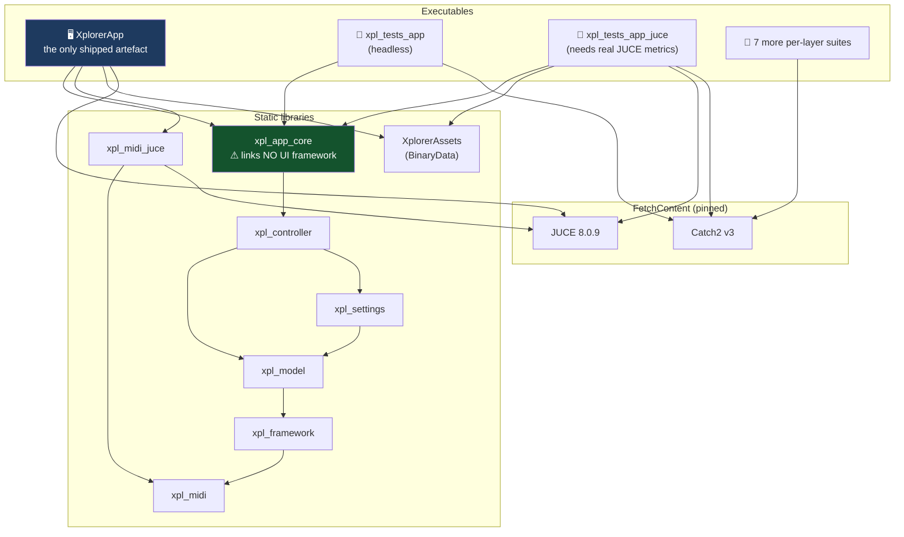
```mermaid
graph TD
    subgraph exe ["Executables"]
        App["🖥 XplorerApp<br/>the only shipped artefact"]
        T1["🧪 xpl_tests_app<br/>(headless)"]
        T2["🧪 xpl_tests_app_juce<br/>(needs real JUCE metrics)"]
        Tn["🧪 7 more per-layer suites"]
    end

    subgraph libs ["Static libraries"]
        AppCore["xpl_app_core<br/>⚠ links NO UI framework"]
        Controller["xpl_controller"]
        Settings["xpl_settings"]
        Model["xpl_model"]
        Framework["xpl_framework"]
        MidiJuce["xpl_midi_juce"]
        Midi["xpl_midi"]
        Assets["XplorerAssets<br/>(BinaryData)"]
    end

    subgraph ext ["FetchContent (pinned)"]
        JUCE["JUCE 8.0.9"]
        Catch2["Catch2 v3"]
    end

    App --> AppCore & MidiJuce & Assets & JUCE
    AppCore --> Controller
    Controller --> Model & Settings
    Settings --> Model
    Model --> Framework
    Framework --> Midi
    MidiJuce --> Midi & JUCE
    T1 --> AppCore & Catch2
    T2 --> AppCore & Assets & JUCE & Catch2
    Tn --> Catch2

    style AppCore fill:#14532d,color:#fff
    style App fill:#1e3a5f,color:#fff
```

**The forbidden edge**: `xpl_app_core` must never link JUCE. That single constraint is what
makes the UI logic testable; it is why `MenuIds.hpp` carries menu *identity* while the
`juce::KeyPress` shortcut table stays in `MainComponent.cpp` (ADR-QLT-001, DEC-QLT-003).

| Target | Kind | Notes |
|---|---|---|
| `xpl_midi` … `xpl_app_core` (7) | Static lib | One per layer. Never shipped standalone. |
| `XplorerAssets` | `juce_add_binary_data` | Menu icons, About image, Roboto Condensed, `oberheim.syx`, the SPDX SBOM — all compiled in, no sibling files (ADR-BLD-005). |
| `XplorerApp` | GUI executable | Exists only when `XPL_BUILD_APP=ON`. **The sole deliverable.** |
| `xpl_tests_*` (8) | Catch2 exe | Headless — run in every CI job. |
| `xpl_tests_app_juce` | Catch2 exe | Needs real font/graphics metrics; exists only when `XPL_BUILD_APP=ON`. |

### 2.3 Build options

| Option | Default | Effect |
|---|---|---|
| `XPL_BUILD_APP` | **`OFF`** | Gates `XplorerApp` **and** `xpl_tests_app_juce`. A default developer build produces no GUI. |
| `XPL_BUILD_TESTS` | `ON` | Gates all nine test executables. |

Warnings are errors everywhere: `-Wall -Wextra -Wpedantic -Werror` (`xpl_warnings`
interface target).

> **Consequence for agents**: a change confined to `juce/app/src/` is **not compiled** by a
> default configure. Build with `-DXPL_BUILD_APP=ON` before claiming a GUI change compiles.

### 2.4 CI: three streams, generated workflows

Delivery runs on three **streams**, distinguished only by their trigger, so no two ever
fire on the same commit (DEC-BLD-024):

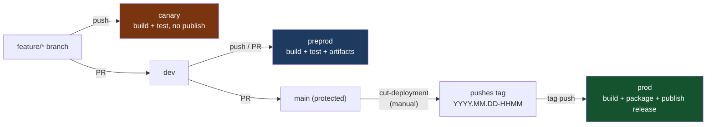
```mermaid
flowchart LR
    FB["feature/* branch"] -->|push| CAN["canary<br/>build + test, no publish"]
    FB -->|PR| DEVB["dev"]
    DEVB -->|push / PR| PRE["preprod<br/>build + test + artifacts"]
    DEVB -->|PR| MAIN["main (protected)"]
    MAIN -->|"cut-deployment<br/>(manual)"| TAG["pushes tag<br/>YYYY.MM.DD-HHMM"]
    TAG -->|tag push| PROD["prod<br/>build + package + publish release"]

    style CAN fill:#78350f,color:#fff
    style PRE fill:#1e3a5f,color:#fff
    style PROD fill:#14532d,color:#fff
```

15 of the 17 workflow files are **generated** by `juce/tools/generate_workflows.py` from a
matrix of (os, arch, configuration, stream). Two are hand-written: `cut-deployment.yml`
(the only workflow that writes a ref) and `linux-headless-release.yml`. All real logic
lives in four composite actions — `resolve-version`, `build-app`, `package-deployment`,
`publish-deployment` — so the generated files contain only a name, a trigger and a call
sequence.

| Platform | Runner | Artefact |
|---|---|---|
| Windows x64 | `windows-2022` | `Xplorer.exe` |
| Linux x64 | pinned image (glibc forward-compat) | AppImage |
| macOS arm64 | `macos-latest` | `Xplorer.app` |

### 2.5 Versioning

**The version is a function of the commit, never typed by a human** (DEC-BLD-014). One
composite action, `resolve-version`, derives it from the commit's own committer timestamp;
`check_no_version_literals.sh` guards against a literal creeping in anywhere. `cut-deployment`
computes the tag and pushes it — which is what triggers the prod build — so a hand-written
tag can never disagree with what the binaries report.

---

## 3. Layered architecture

A 3-layer MVC-inspired separation with two seams that make it testable: the **MIDI backend
port** (ADR-JUC-004) and the split of the View into **headless logic** vs **JUCE
components** (ADR-JUC-006).

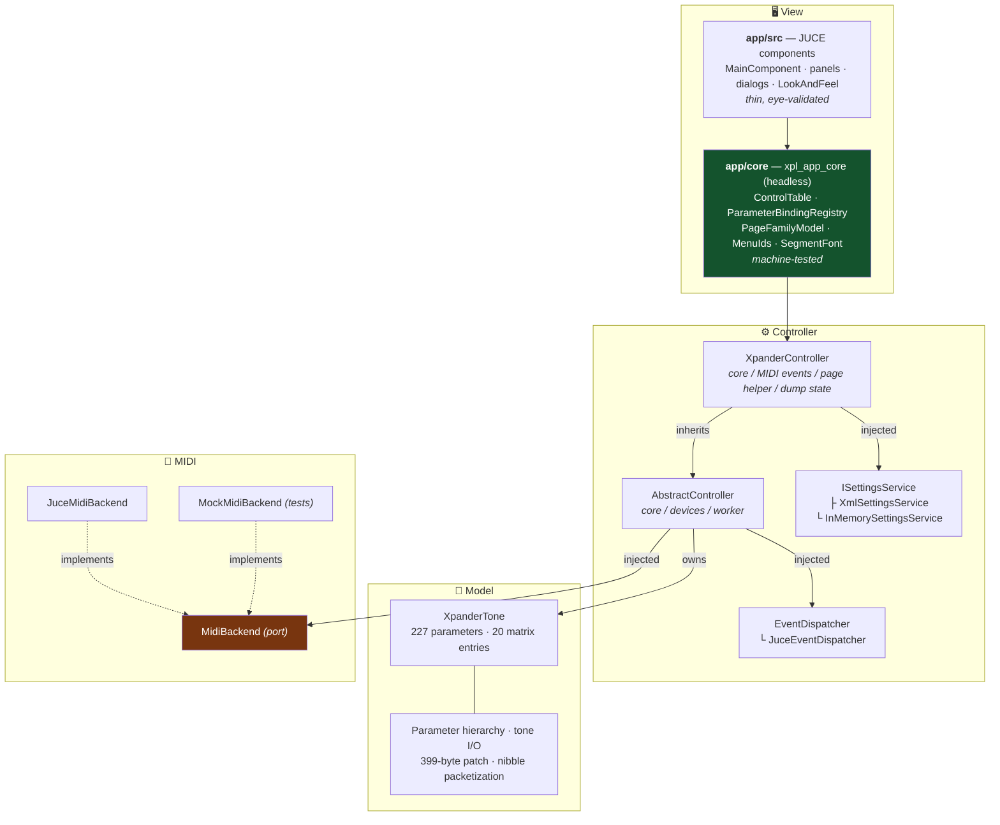
```mermaid
flowchart TB
    subgraph VIEW ["🖥 View"]
        direction TB
        JuceApp["<b>app/src</b> — JUCE components<br/>MainComponent · panels · dialogs · LookAndFeel<br/><i>thin, eye-validated</i>"]
        AppCore["<b>app/core</b> — xpl_app_core (headless)<br/>ControlTable · ParameterBindingRegistry<br/>PageFamilyModel · MenuIds · SegmentFont<br/><i>machine-tested</i>"]
    end

    subgraph CTRL ["⚙️ Controller"]
        XC["XpanderController<br/><i>core / MIDI events / page helper / dump state</i>"]
        AC["AbstractController<br/><i>core / devices / worker</i>"]
        SS["ISettingsService<br/>├ XmlSettingsService<br/>└ InMemorySettingsService"]
        ED["EventDispatcher<br/>└ JuceEventDispatcher"]
    end

    subgraph MODEL ["📐 Model"]
        Tone["XpanderTone<br/>227 parameters · 20 matrix entries"]
        Par["Parameter hierarchy · tone I/O<br/>399-byte patch · nibble packetization"]
    end

    subgraph MIDIL ["🎹 MIDI"]
        BE["MidiBackend <i>(port)</i>"]
        JB["JuceMidiBackend"]
        MB["MockMidiBackend <i>(tests)</i>"]
    end

    JuceApp --> AppCore --> XC
    XC -->|inherits| AC
    XC -->|injected| SS
    AC -->|owns| Tone --- Par
    AC -->|injected| ED
    AC -->|injected| BE
    JB -.implements.-> BE
    MB -.implements.-> BE

    style AppCore fill:#14532d,color:#fff
    style BE fill:#78350f,color:#fff
```

**Dependency rules**

| Rule | Enforced by |
|---|---|
| Dependencies point downward only | CMake target graph — an upward `target_link_libraries` fails to configure |
| `xpl_app_core` links no UI framework | CMake — it has no JUCE dependency; adding one breaks the headless suites |
| The controller never touches a concrete MIDI device | `MidiBackend` port; `MockMidiBackend` substitutes in every controller test |
| The View never marshals threads itself | `EventDispatcher` — injected, `JuceEventDispatcher` in the app, synchronous in tests |
| Settings are never read from a global | `ISettingsService`, constructor-injected |

---

## 4. Generated sources & single sources of truth

**This is the section that prevents the most expensive class of mistake.** Nine artefacts
in this repository are outputs. Editing one by hand appears to work, passes review if
nobody notices, and is silently reverted by the next regeneration.

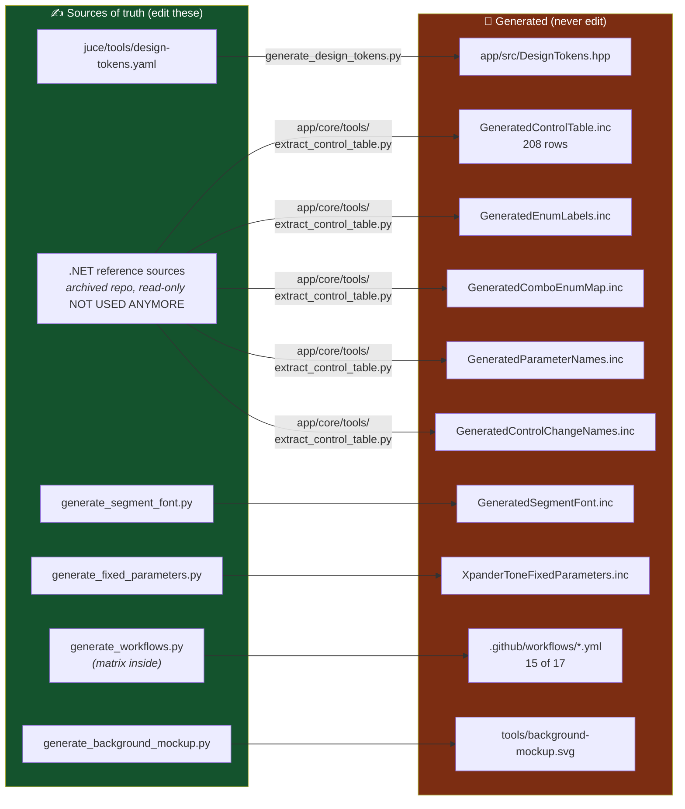
```mermaid
flowchart LR
    subgraph SRC ["✍️ Sources of truth (edit these)"]
        DTY["juce/tools/design-tokens.yaml"]
        REF[".NET reference sources<br/><i>archived repo, read-only</i> NOT USED ANYMORE"]
        SVG["generate_background_mockup.py"]
        MTX["generate_workflows.py<br/><i>(matrix inside)</i>"]
        SEG["generate_segment_font.py"]
        FIX["generate_fixed_parameters.py"]
    end

    subgraph OUT ["🤖 Generated (never edit)"]
        DTH["app/src/DesignTokens.hpp"]
        CT["GeneratedControlTable.inc<br/>208 rows"]
        EL["GeneratedEnumLabels.inc"]
        CE["GeneratedComboEnumMap.inc"]
        PN["GeneratedParameterNames.inc"]
        CC["GeneratedControlChangeNames.inc"]
        GS["GeneratedSegmentFont.inc"]
        XF["XpanderToneFixedParameters.inc"]
        WF[".github/workflows/*.yml<br/>15 of 17"]
        BG["tools/background-mockup.svg"]
    end

    DTY -->|generate_design_tokens.py| DTH
    REF -->|"app/core/tools/<br/>extract_control_table.py"| CT & EL & CE & PN & CC
    SEG --> GS
    FIX --> XF
    MTX --> WF
    SVG --> BG

    style OUT fill:#7c2d12,color:#fff
    style SRC fill:#14532d,color:#fff
```

| Generated artefact | Source | Generator | Staleness gate |
|---|---|---|---|
| `app/src/DesignTokens.hpp` | `juce/tools/design-tokens.yaml` | `generate_design_tokens.py` | `--check` mode exists; **not wired into CI** (§11) |
| `GeneratedControlTable.inc` (208 rows) | .NET `MainForm.Designer.cs` + `.resx` | `app/core/tools/extract_control_table.py` | Headless anchor test in `xpl_tests_app` |
| `GeneratedEnumLabels.inc`, `GeneratedComboEnumMap.inc`, `GeneratedParameterNames.inc`, `GeneratedControlChangeNames.inc` | same | same | table/label tests |
| `GeneratedSegmentFont.inc` | glyph definitions | `generate_segment_font.py` | `SegmentFont` decode tests |
| `XpanderToneFixedParameters.inc` | .NET `XpanderTone.cs` | `generate_fixed_parameters.py` | parameter-count + round-trip tests |
| `.github/workflows/*.yml` (15) | matrix in the script | `generate_workflows.py` | `--check` mode |
| `juce/tools/background-mockup.svg` | geometry in the script | `generate_background_mockup.py` | must match `BackgroundRenderer.cpp` by review |

### Coupled edits

Some changes are only correct if made in **two places at once**. These are the ones that
have historically drifted:

| If you change… | You must also change… | Why |
|---|---|---|
| `BackgroundRenderer.cpp` geometry | `generate_background_mockup.py` (and regenerate the SVG) | The SVG is the owner-validated mockup; the two renderers must agree (ADR-JUC-013) |
| A menu item's id or order | `MenuIds.hpp` only — never the switch labels | Identity is single-source (ADR-QLT-001); the tests assert id uniqueness and View-range non-overlap |
| `WINDOW_SCALE_PRESETS` | nothing — but check `viewScaleIdEnd()` | Adding a 6th preset would grow the computed id range over a fixed id; a test catches it (RQ-QLT-002) |
| A design token's name | every consumer | The generator emits a compile error, not a silent default |
| A settings field | `XmlSettingsService` read **and** write, `AllUsersSettingsDefaults`, the dialog page, the round-trip test | Four places; the round-trip test catches three of them |

---

## 5. The application layer

The largest part of the codebase: 24 component files over a headless logic library.

### 5.1 Application shell

`Main.cpp` hosts two objects:

- **`XplorerApplication`** (`juce::JUCEApplication`) — single-instance enforcement
  (`moreThanOneInstanceAllowed() = false`, RQ-FMW-072) and the top-level exception dialog
  (`unhandledException` → alert with file/line and a bug-report pointer, RQ-GUI-035).
  `shutdown()` resets the window, which is what triggers the controller teardown chain (§6.5).
- **`MainWindow`** (`juce::DocumentWindow`) — native title bar, freely resizable, owns a
  `ScaledCanvasComponent`.

There is **no splash screen**: it existed, and was removed once the façade became vector,
resizable and user-themeable, because a bitmap copy of the panel could no longer match the
window that follows it at any delay or size (ADR-JUC-030).

### 5.2 Logical canvas & uniform scaling

Every control is laid out **once**, in a fixed logical pixel space of
`1260×786` (`LOGICAL_CANVAS_WIDTH/HEIGHT`, `ControlTable.hpp`).
`ScaledCanvasComponent` hosts the menu-bar strip and applies one `AffineTransform` on
resize — `scale = min(w/1260, h/786)`, centred. **Nothing else in the codebase knows about
scaling** (ADR-JUC-006 §1).

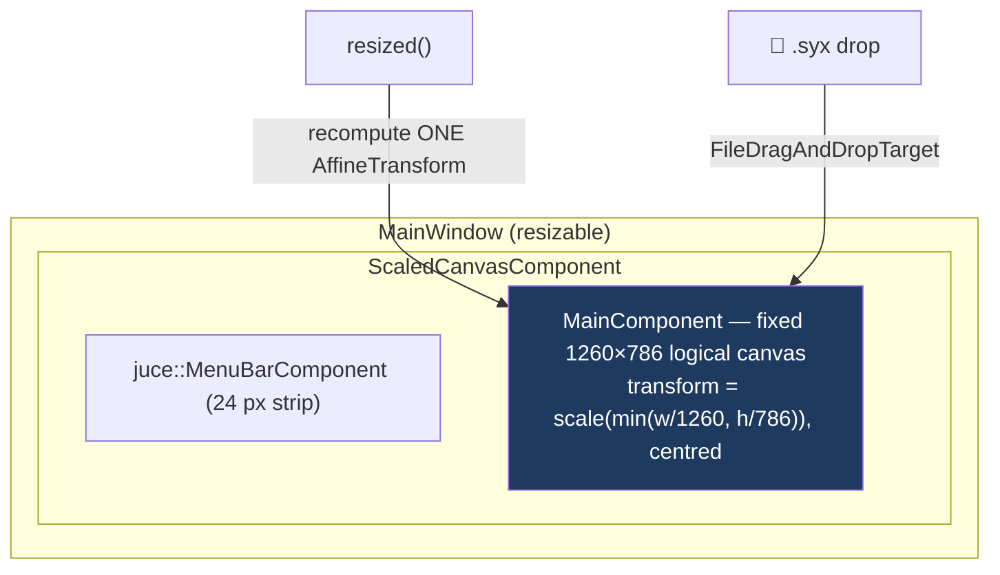
```mermaid
flowchart TB
    subgraph W ["MainWindow (resizable)"]
        subgraph SCC ["ScaledCanvasComponent"]
            MB["juce::MenuBarComponent (24 px strip)"]
            MC["MainComponent — fixed 1260×786 logical canvas<br/>transform = scale(min(w/1260, h/786)), centred"]
        end
    end
    R["resized()"] -->|"recompute ONE AffineTransform"| MC
    D["📄 .syx drop"] -->|FileDragAndDropTarget| MC

    style MC fill:#1e3a5f,color:#fff
```

**The façade is fully vector.** The background — plate, wood rails, block frames, signal
lines, captions, section-title bars — is painted with `juce::Graphics` primitives by
`BackgroundRenderer::paintVectorBackground`, from geometry transcribed from an
owner-validated SVG mockup (ADR-JUC-013).

> **Deliberate non-optimisation**: the background is **not** `setBufferedToImage`-cached. An
> image cache would be rescaled by the canvas transform and reintroduce exactly the blur the
> vector change removed. The ~300 primitives are repainted directly on every (infrequent)
> background repaint.

**Window sizing is deterministic, not layout-derived.** One headless, unit-tested function
`windowSizeForScale(scale)` computes a content size from a single constant
`WINDOW_WIDTH_AT_1X = 1440`, preserving the canvas aspect ratio. Both the startup size and
every View-menu entry call it; nothing reads `getWidth()` back to infer what size it already
is (ADR-JUC-025). Five presets (`WINDOW_SCALE_PRESETS = {1.0, 1.25, 1.5, 1.75, 2.0}`) plus
Full Screen; a preset that would not fit the display falls back to Full Screen rather than
producing an off-screen window.

`ScaledCanvasComponent` is also the window-wide **`FileDragAndDropTarget`**: a dropped
`.syx` goes through `MainComponent::loadSysexFileByType` — classify (RQ-MOD-043), then
load / confirm-and-restore / warn — the same path as File ▸ Open.

### 5.3 The extraction pipeline

The UI is not re-described by hand. `app/core/tools/extract_control_table.py` regenerated
all UI facts mechanically from the archived WinForms sources during the migration process.
Now the control table has its onw life.

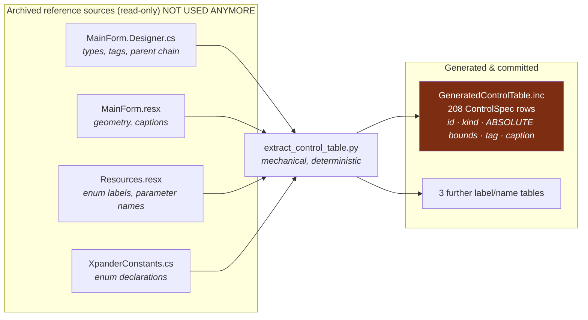
```mermaid
flowchart LR
    subgraph ref ["Archived reference sources (read-only) NOT USED ANYMORE"]
        D["MainForm.Designer.cs<br/><i>types, tags, parent chain</i>"]
        R["MainForm.resx<br/><i>geometry, captions</i>"]
        RS["Resources.resx<br/><i>enum labels, parameter names</i>"]
        C["XpanderConstants.cs<br/><i>enum declarations</i>"]
    end
    S["extract_control_table.py<br/><i>mechanical, deterministic</i>"]
    subgraph gen ["Generated & committed"]
        T["GeneratedControlTable.inc<br/>208 ControlSpec rows<br/><i>id · kind · ABSOLUTE bounds · tag · caption</i>"]
        O["3 further label/name tables"]
    end
    D & R & RS & C --> S --> T & O

    style T fill:#7c2d12,color:#fff
```

**Key detail**: WinForms `Location` is *parent-relative*. The script resolves each control
through the `Controls.Add` parent chain to **absolute canvas coordinates**, which is what
`ControlSpec` stores — so the runtime never walks a parent hierarchy. A headless test locks
the table against known anchors.

### 5.4 Control ⇄ parameter binding

`ParameterBindingRegistry` (headless) maps parameter names — the reference WinForms tags,
unchanged — to `IBoundControl`s. Thin JUCE wrappers (`BoundKnob`, `BoundComboBox`,
`BoundCheckBox`, `BoundRadioGroup`) implement the interface.

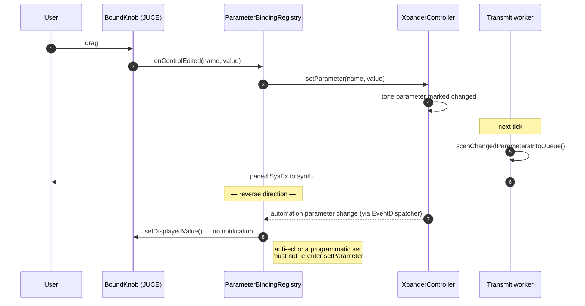
```mermaid
sequenceDiagram
    autonumber
    participant U as User
    participant K as BoundKnob (JUCE)
    participant R as ParameterBindingRegistry
    participant C as XpanderController
    participant W as Transmit worker

    U->>K: drag
    K->>R: onControlEdited(name, value)
    R->>C: setParameter(name, value)
    C->>C: tone parameter marked changed
    Note over W: next tick
    W->>W: scanChangedParametersIntoQueue()
    W-->>U: paced SysEx to synth

    Note over R: — reverse direction —
    C-->>R: automation parameter change (via EventDispatcher)
    R->>K: setDisplayedValue() — no notification
    Note right of R: anti-echo: a programmatic set<br/>must not re-enter setParameter
```

The **anti-echo guard** is the subtle part and it is machine-tested: a value arriving from
the synth updates the widget without re-triggering the edit path that would send it straight
back.

### 5.5 Page-family blocks

ENV, LFO, RAMP and TRACK exist in multiple numbered instances that share one set of
controls. `PageFamilyModel` (headless) resolves a family tag such as `ENV_X_ATTACK` plus a
selected instance into the concrete parameter name `ENV_3_ATTACK`; `PageFamilyBlock`
rebinds the registry when the selector changes. The resolution is pure data and fully
tested; the widget is not.

### 5.6 VFD display

Content and rendering are deliberately separate:

| Concern | Class | Testable |
|---|---|---|
| *What text* is shown (patch info, control edits, modulation entries, CC line, typewriter) | `VfdDisplayHelper` | logic testable |
| *How glyphs* are drawn (16-segment paths, device-pixel snapping) | `VfdSegmentRenderer`, `SegmentFont` (headless decoder) | `SegmentFont` headless; renderer in the JUCE suite |
| The panel, bezel, glass | `DisplayPanel` | eye-validated |

Glyphs are **vector 16-segment paths**, built once in cell-normalised units and reused at
every cell (a flyweight), snapped to whole device pixels at any canvas scale so the display
stays crisp rather than only at 100 % (ADR-JUC-023, ADR-JUC-026). All 95 printable ASCII
glyphs render.

Double-clicking the VFD opens the patch-rename dialog — `DisplayPanel` sets
`setInterceptsMouseClicks(false, false)` so the click lands on `MainComponent` (RQ-GUI-025).

### 5.7 Modulation matrix & MIDI LED panel

**`ModMatrixPanel`** renders the 20-entry matrix as rows of source / amount / quantize /
destination controls, enforcing the max-6-sources-per-destination rule with a VFD notice
rather than a silent refusal (ADR-JUC-036). Hovering a source or destination highlights the
matching functional block, driven by the shared headless `ModulationHighlight` resolver — the
same resolver that drives the VFD's active-destination marker (ADR-JUC-010).

**`LedPanelComponent`** shows three lamps — automation-in, synth-in, synth-out — each held
lit ~100 ms past its last event and decayed by a 30 ms timer **that runs only while a lamp is
lit** (ADR-JUC-008). Its component bounds are the extracted panel rect inflated by
`ledGlowMarginPx()` on every side, because a lit lamp's radial glow does not fit in the
8 px-tall panel; `paint()` re-derives the un-inflated rect from its own bounds so no lamp
moves when the margin changes. This is the one place in the app where a component's bounds
deliberately differ from its control-table spec.

### 5.8 Menus, dialogs & long operations

**Menu identity is single-source.** `MenuIds.hpp` (headless) declares `TopLevelMenu` and
`MenuItem` enumerations plus the View scale id range; `MainComponent.cpp` holds only labels,
`juce::KeyPress` shortcuts and actions. Invariants that no reader can verify by inspection —
22 ids pairwise distinct, no fixed id inside the *computed* View scale range, top-level
order matching the `MenuBarModel` indices — are asserted by headless tests (ADR-QLT-001).

**Long operations never block the message thread.** All-data backup and restore run on a
`ThreadWithProgressWindow` with a progression callback marshalled back through the
dispatcher (RQ-GUI-026).

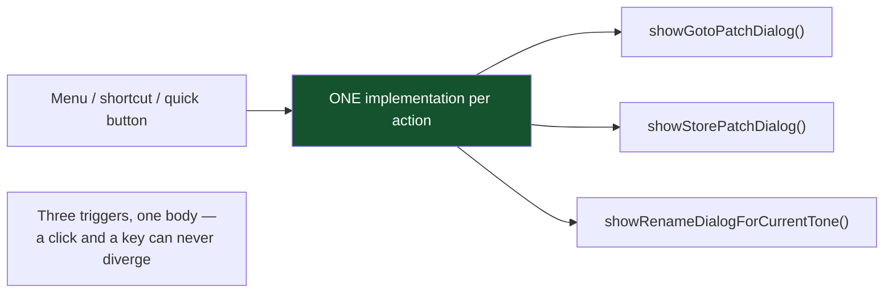
```mermaid
flowchart LR
    M["Menu / shortcut / quick button"] --> ONE["ONE implementation per action"]
    ONE --> D1["showGotoPatchDialog()"]
    ONE --> D2["showStorePatchDialog()"]
    ONE --> D3["showRenameDialogForCurrentTone()"]
    Note["Three triggers, one body —<br/>a click and a key can never diverge"]

    style ONE fill:#14532d,color:#fff
```

### 5.9 Skin: design tokens and themeable blocks

A three-tier token system — global → semantic → component — is generated into
`DesignTokens.hpp` from `design-tokens.yaml` (ADR-JUC-014/015). `XplorerLookAndFeel` is the
single consumer for control painting; `BackgroundRenderer` for the façade.

Each of the eight functional blocks (VCO, LAG, TRACK, VCF, ENV, LFO, RAMP, MATRIX) carries
its own **themeable identity colour** — fill tint plus frame relief — that the page-family
selector buttons pick up too. Per-block overrides persist as *optional* entries: a block
left at its default stores **no** entry, so users who never customised keep following future
palette revisions (ADR-JUC-020, DEC-JUC-039).

Colour changes **preview live**: the settings dialog mutates the palette in place and calls
`sendLookAndFeelChange()`; a non-accept close restores the snapshot taken on open. There is
no `LookAndFeel` rebuild, so a customised palette survives with nothing to carry across.

### 5.10 Piano keyboard window

An auxiliary window (`PianoWindow`) with an on-screen keyboard whose keys are labelled with
the computer-keyboard characters that play them. The label plan is computed by the headless
`PianoKeyLabelPlan` from a platform layout query (`PianoKeyboardLayoutQuery_{linux,mac,windows}.cpp`),
so an AZERTY user sees AZERTY letters.

---

## 6. Core subsystems

### 6.1 Parameter queue & transmit worker

The UI never sends MIDI. It marks parameters changed; a worker thread scans, clones and
sends at a paced interval.

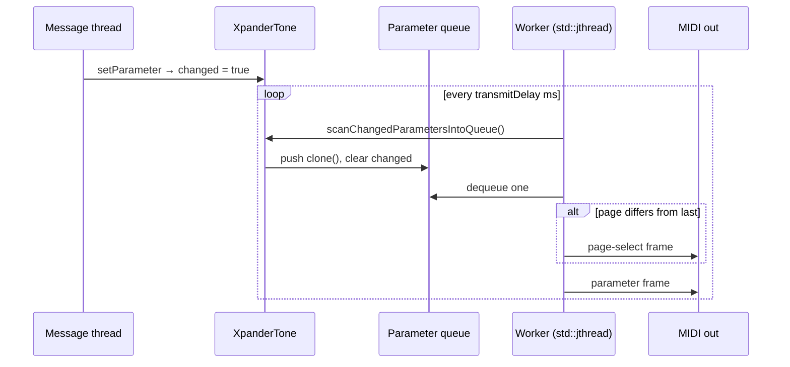
```mermaid
sequenceDiagram
    participant UI as Message thread
    participant T as XpanderTone
    participant Q as Parameter queue
    participant W as Worker (std::jthread)
    participant O as MIDI out

    UI->>T: setParameter → changed = true
    loop every transmitDelay ms
        W->>T: scanChangedParametersIntoQueue()
        T->>Q: push clone(), clear changed
        W->>Q: dequeue one
        alt page differs from last
            W->>O: page-select frame
        end
        W->>O: parameter frame
    end
```

Two properties matter: **a clone is enqueued**, so the snapshot is immune to later value
changes; and **one transmission per tick**, which is what preserves the reference's pacing
against hardware that cannot absorb a burst.

### 6.2 MIDI event flow

Bidirectional. Incoming SysEx is classified and dispatched; a full program dump reloads the
tone wholesale.

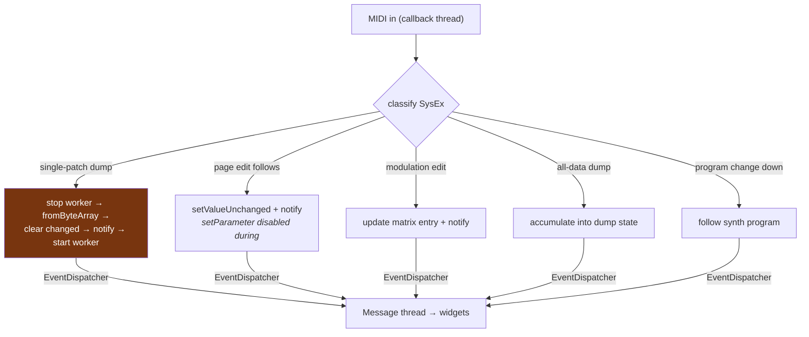
```mermaid
flowchart TB
    IN["MIDI in (callback thread)"] --> CLS{"classify SysEx"}
    CLS -->|single-patch dump| RELOAD["stop worker → fromByteArray →<br/>clear changed → notify → start worker"]
    CLS -->|page edit follows| PE["setValueUnchanged + notify<br/><i>setParameter disabled during</i>"]
    CLS -->|modulation edit| ME["update matrix entry + notify"]
    CLS -->|all-data dump| AD["accumulate into dump state"]
    CLS -->|program change down| PC["follow synth program"]
    RELOAD & PE & ME & AD & PC -->|EventDispatcher| UI["Message thread → widgets"]

    style RELOAD fill:#78350f,color:#fff
```

`setSetParameterEnabled(false)` around every inbound mutation is what stops an incoming
value from being echoed straight back to the synth.

### 6.3 Settings

`ISettingsService` with two implementations: `XmlSettingsService` (the on-disk format,
interchangeable with the archived implementation) and `InMemorySettingsService` (tests).

The storage directory resolves **per-machine when writable, else per-user** (ADR-SET-001):
the reference's per-machine location is root-owned on Linux and macOS and this project ships
no privileged installer, so writes there always failed silently. `preferredSettingsDirectory()`
falls back to `~/.config/Xplorer/Xplorer` / `~/Library/Xplorer/Xplorer`. Windows is
unaffected — `%ProgramData%` already accepts a standard user's write.

Unknown XML elements are **ignored, not rejected**, which is what lets settings files
written by older versions (and by the archived implementation) load unchanged.

### 6.4 Tone model & I/O

`XpanderTone` owns **227 parameters** (187 patch + 40 matrix) in an ordered map plus the
20-entry modulation matrix. `toByteArray()`/`fromByteArray()` produce and consume the
**399-byte single-patch dump** bit-exactly; `deserialize(serialize(t)) == t` is a tested
identity, and byte streams captured from real hardware round-trip unchanged.

The Oberheim **nibble packetization** (two 4-bit nibbles per transmitted byte, low nibble
first) lives in `PacketizedBinaryReader`/`Writer`.

### 6.5 Controller lifecycle

The application owns the controller's run state (ADR-BUG-002). This is not incidental — the
worker thread and the startup synchronisation both hang off it.

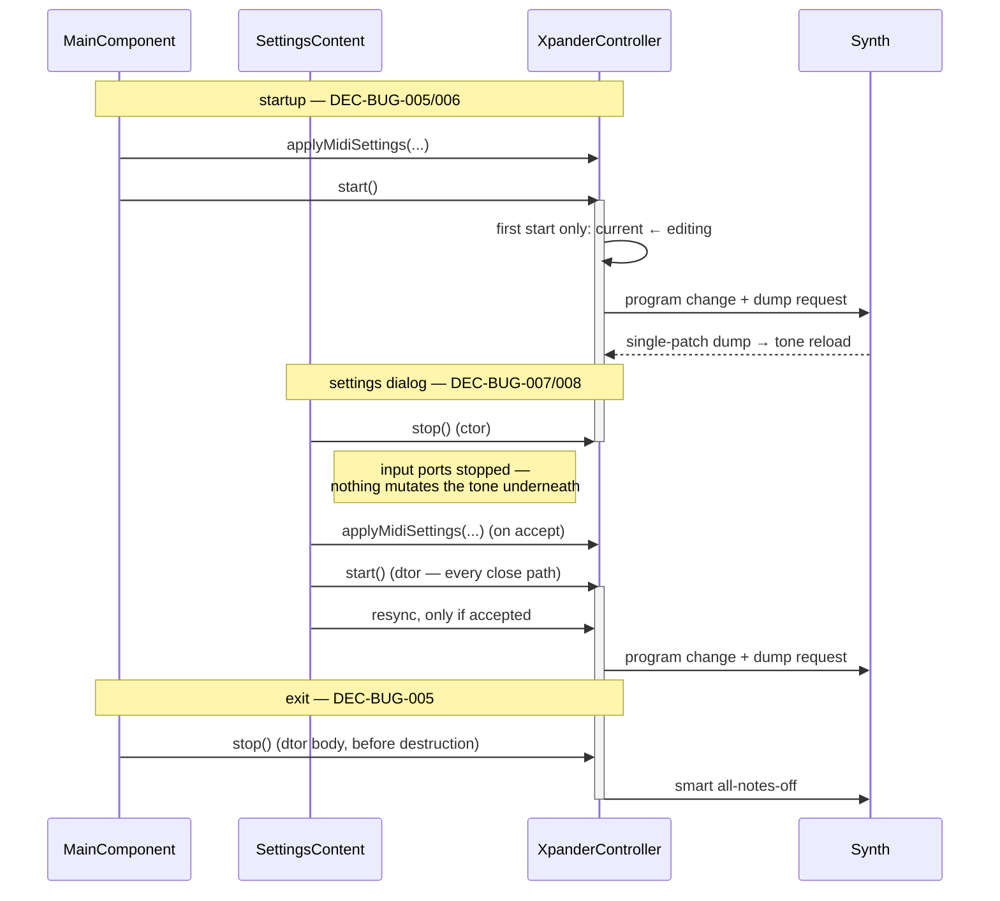
```mermaid
sequenceDiagram
    participant MC as MainComponent
    participant SD as SettingsContent
    participant C as XpanderController
    participant S as Synth

    Note over MC,C: startup — DEC-BUG-005/006
    MC->>C: applyMidiSettings(...)
    MC->>C: start()
    activate C
    C->>C: first start only: current ← editing
    C->>S: program change + dump request
    S-->>C: single-patch dump → tone reload

    Note over SD,C: settings dialog — DEC-BUG-007/008
    SD->>C: stop() (ctor)
    deactivate C
    Note right of SD: input ports stopped —<br/>nothing mutates the tone underneath
    SD->>C: applyMidiSettings(...) (on accept)
    SD->>C: start() (dtor — every close path)
    activate C
    SD->>C: resync, only if accepted
    C->>S: program change + dump request

    Note over MC,C: exit — DEC-BUG-005
    MC->>C: stop() (dtor body, before destruction)
    C->>S: smart all-notes-off
    deactivate C
```

Three points that are easy to get wrong and are documented as decisions:

- `start()`'s synchronisation branch fires **once per process** (`_firstStart`). The second
  and later calls only restart ports and worker. Consuming it at startup is what stops a
  later `start()` — the one at the end of `loadTone`, `randomizeTone`, `morphTones`,
  `backupAllDataDumpToFile`, `getSingleTonesFromSynth` or the dump handler — from firing a
  patch request that would overwrite what the user just did.
- The settings dialog's restart lives in `~SettingsContent`, not after `launchAsync`. JUCE's
  dialog is asynchronous, so a `finally`-shaped restart would fire before the user saw the
  dialog. The destructor runs on every close path — accept, cancel, Escape, title bar.
- `stop()` at exit is in the **destructor body**, which runs *before* the controller is
  destroyed, so the output device is still open and the all-notes-off actually goes out.
  `~AbstractController` runs afterwards and only closes devices — it sends nothing.

---

## 7. Threading model

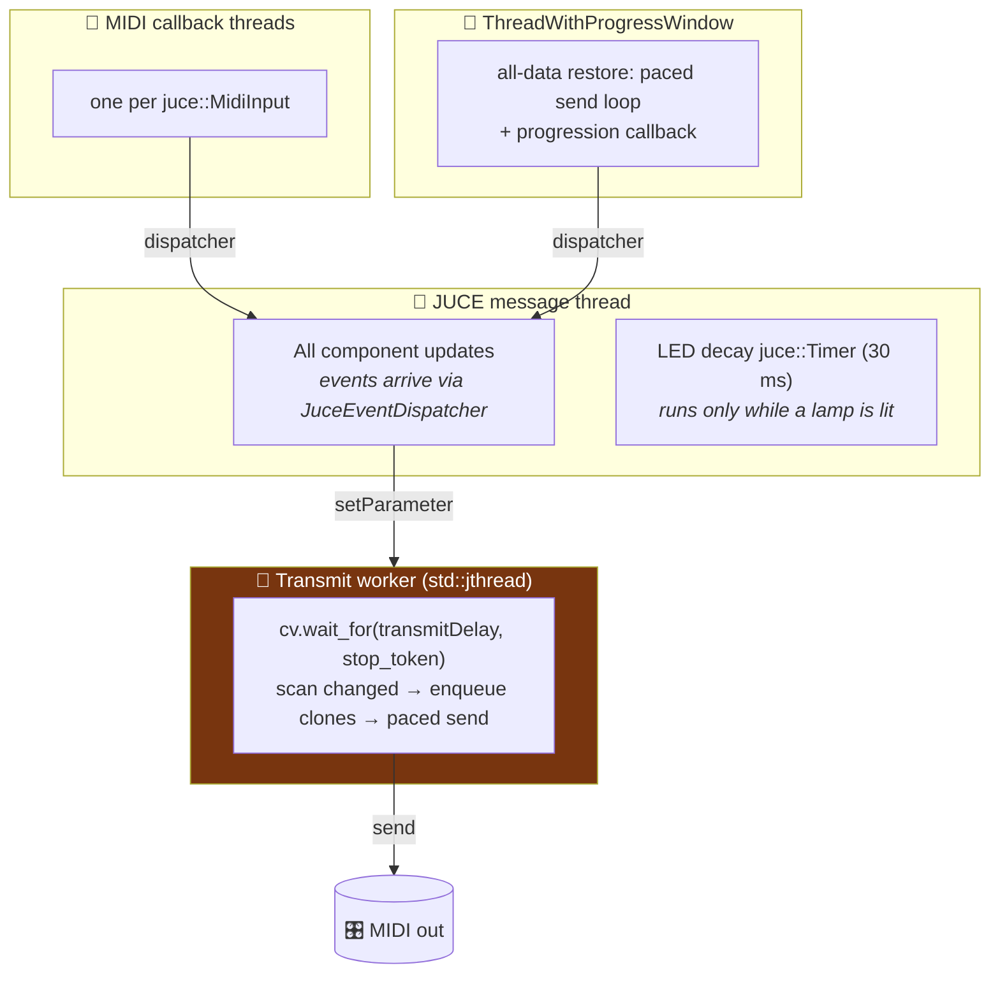
```mermaid
flowchart TB
    subgraph UIT ["🧵 JUCE message thread"]
        H["All component updates<br/><i>events arrive via JuceEventDispatcher</i>"]
        LT["LED decay juce::Timer (30 ms)<br/><i>runs only while a lamp is lit</i>"]
    end
    subgraph WT ["🧵 Transmit worker (std::jthread)"]
        L["cv.wait_for(transmitDelay, stop_token)<br/>scan changed → enqueue clones → paced send"]
    end
    subgraph CT ["🧵 MIDI callback threads"]
        J["one per juce::MidiInput"]
    end
    subgraph RT ["🧵 ThreadWithProgressWindow"]
        DU["all-data restore: paced send loop<br/>+ progression callback"]
    end

    J -->|dispatcher| H
    DU -->|dispatcher| H
    H -->|setParameter| WT
    L -->|send| OUT[("🎛 MIDI out")]

    style WT fill:#78350f,color:#fff
```

| Property | Guarantee |
|---|---|
| No UI polling | The UI is fully event-driven; the only periodic work (LED decay) is self-stopping |
| No busy-sleep | The worker uses an interruptible `condition_variable` wait bound to a `stop_token` (ADR-JUC-005) |
| Cooperative shutdown | `std::jthread` + `request_stop()` + `join()` — no abandoned threads |
| Cross-thread UI updates | Always via `EventDispatcher`; components are never touched from a MIDI callback thread |

**Known blocking spots**, preserved from the reference for timing fidelity:
`storeSinglePatchToSynth`, `sendProgramChangeAndGetSinglePatchFromSynth` and the VFD
typewriter sleep on their calling thread — the message thread when reached from a menu. An
async refactor is a tracked candidate (§11) and would need an ADR, because the sleeps *are*
the pacing that real hardware needs.

---

## 8. Behavioural invariants

**Read this before "fixing" anything that looks wrong.** These are properties of the running
system that are deliberate. Several look like defects. Each is preserved because the wire
format, the file format or real hardware depends on it.

### 8.1 Frozen formats

| Invariant | Where | Why it cannot change |
|---|---|---|
| 399-byte single-patch dump, 6-byte header | `XpanderToneIO.cpp` | Round-trips with real hardware and archived patch libraries |
| Nibble packetization, low nibble first | `PacketizedBinaryReader/Writer` | Oberheim MIDI spec |
| Unused matrix entries wire as `0x1F`/`0x3F`, `NONE` in memory | `XpanderSinglePatch.cpp` | Byte-identical round-trip is tested |
| Settings XML element names | `XmlSettingsService.cpp` | Files interchange with the archived implementation |
| 227 parameters, 20 matrix entries, 8-char names, max 6 sources per destination | `XpanderConstants.hpp` | Instrument-defined |

### 8.2 Deliberate oddities — do not "correct"

| # | Behaviour | Location | Status |
|---|---|---|---|
| 1 | Programmer-mode frame has a **duplicated leading `0xF0`**: `{F0, F0, 10, 02, 0D, 01, 00, F7}` | `XpanderController::sendProgrammerModeSinglePatch` | Verbatim, commented — the synth accepts this frame |
| 2 | Tune Request sent as `{F0, F6, F7}` — a System Common byte wrapped in SysEx, non-standard | `sendTuneRequestToSynth` | Verbatim, commented |
| 3 | All-notes-off uses the **settings** MIDI channel while everything else uses the tone's | `sendAllNotesOffToSynthOutput` | Verbatim; channel mismatch is the reference's |
| 4 | `IsLfoRetrig` compares a sub-page against a page constant — nearly always true | `PageSubPageHelper` | Verbatim, commented |
| 5 | Humanize `addValue` is always false (`Next(0,1)` is always 0); range collapses to `{0}` at value 0 | randomizer | Behaviour preserved; inverted negative ranges swapped only where unreachable, to avoid UB |
| 6 | An unterminated trailing SysEx frame is dropped; scanning resumes at the closing `0xF7` | `SysexStreamIterator` | Verbatim, tested |
| 7 | One non-single-patch frame classifies a whole file as `AllDataDump`, not `Unknown` | `determineSysexFileType` | Verbatim |
| 8 | Renaming a tone triggers a **full transmission + program change + dump request** | `setToneName` | Verbatim — the UI depends on the side effect |
| 9 | `Changed` flags are cleared **after** the full-tone send in load/randomize/morph epilogues | `XpanderController` | Order matters; verbatim |
| 10 | Sign mixing between entry sign and unsigned value in `changeModulationSourceAmount` | `XpanderToneModulationMatrix.cpp` | Verbatim; covered by model tests |
| 11 | `MockMidiBackend` delivers synchronously on the injecting thread | tests | Port-specific design choice, documented |

### 8.3 Corrected defects

Two reference behaviours were **deliberately not preserved**, each under an ADR:

| Behaviour | Reference | Here | Decision |
|---|---|---|---|
| Randomizer `Octave` VCO strategy | Shares the `Free` branch — the option does nothing | `VCO1_FREQ = 0`, `VCO2_FREQ = 12`, its own case between `Seventh` and `Ninth` | ADR-BUG-001 (DEC-BUG-001/003) |
| Resync after accepting MIDI settings | Re-applies settings, never re-requests the patch | Re-requests the current patch after restarting the controller | ADR-BUG-002 (DEC-BUG-008) |

The boundary that makes these admissible is **DEC-BUG-002**: reference-exactness binds
everything observable *outside* the application — SysEx, `.syx`, settings XML — and does not
oblige reproducing an affordance the reference offered but never implemented. A divergence
that would change a byte on the wire remains forbidden.

### 8.4 Also improved on the reference

| Behaviour | Change |
|---|---|
| All-data restore | Was a blocking UI-thread loop pumped by `DoEvents`; now a `ThreadWithProgressWindow` worker |
| Morph failure handling | Exceptions were swallowed and the tone nulled (latent null-reference); now state is restored and the exception rethrown |
| Clipboard paste check | Unchecked `Substring(0,4)`; now length-checked |
| Display-control command (0x05/0x06) | Was frozen at static init — a synth-type change needed a restart; now read from settings per call |

---

## 9. SOLID & design patterns

| Principle | Assessment | Detail |
|---|---|---|
| **S** — Single Responsibility | ✅ | Content vs rendering split (`VfdDisplayHelper` / `DisplayPanel`); logic vs widgets split (`xpl_app_core` / `app/src`); large controller split across `.cpp` files by topic |
| **O** — Open/Closed | ✅ | Virtual handlers, worker override, `IToneReader`/`IToneWriter`, `MidiBackend`; `IBoundControl` lets a new control kind join the registry without touching it |
| **L** — Liskov | ✅ | Mock and JUCE backends interchangeable in every test; bound-control fakes substitute JUCE wrappers |
| **I** — Interface Segregation | ✅ | `MidiBackend`, `IToneReader`, `IToneWriter`, `ISettingsService`, `EventDispatcher`, `IBoundControl` are all small |
| **D** — Dependency Inversion | ✅ | MIDI behind a port, settings behind an interface, UI marshalling behind a dispatcher; no singletons. **Residual**: `XpanderController` downcasts `AbstractTone` → `XpanderTone` in one private accessor (§11) |

| Pattern | Where |
|---|---|
| **Template Method** | `AbstractController` (worker proc, input handlers), `AbstractTone`, `AbstractParameter::updateMessageFromValue` |
| **Ports & Adapters** | `MidiBackend` + JUCE/mock adapters; `IBoundControl` + JUCE wrappers / test fakes |
| **Observer** | 7 controller/registry event channels as `std::function`, marshalled via `EventDispatcher` |
| **Command Queue** | parameter clone deque + worker — decouples UI from MIDI timing |
| **Registry** | `ParameterBindingRegistry` — name-keyed, rebindable for page families |
| **Strategy** | `IToneReader`/`IToneWriter`; `ISettingsService` implementations |
| **Dependency Injection** | backend, tone, dispatcher, settings — all constructor-injected |
| **Prototype** | `AbstractParameter::clone()` before enqueuing |
| **Pimpl** | `XmlSettingsService`, `JuceMidiBackend` — keeps JUCE types out of public headers |
| **Flyweight** | VFD segment `Path`s built once in cell-normalised units, reused per glyph cell |
| **Table-driven construction** | the whole main window is built from `GeneratedControlTable.inc` — no per-control code |
| **Generated single source of truth** | §4 — hand-editing any output is a reviewable defect |

---

## 10. Testing architecture

Two tiers by construction (ADR-JUC-003, ADR-JUC-006 §6): **everything with logic is
headless-testable; only thin wrappers need eyes.**

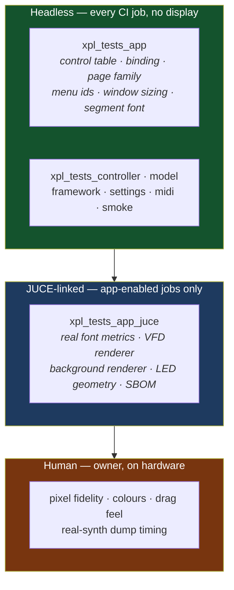
```mermaid
flowchart TB
    subgraph HL ["Headless — every CI job, no display"]
        direction LR
        A["xpl_tests_app<br/><i>control table · binding · page family<br/>menu ids · window sizing · segment font</i>"]
        B["xpl_tests_controller · model<br/>framework · settings · midi · smoke"]
    end
    subgraph JU ["JUCE-linked — app-enabled jobs only"]
        C["xpl_tests_app_juce<br/><i>real font metrics · VFD renderer<br/>background renderer · LED geometry · SBOM</i>"]
    end
    subgraph HU ["Human — owner, on hardware"]
        D["pixel fidelity · colours · drag feel<br/>real-synth dump timing"]
    end
    HL --> JU --> HU

    style HL fill:#14532d,color:#fff
    style JU fill:#1e3a5f,color:#fff
    style HU fill:#78350f,color:#fff
```

| Tier | Executables | Covers |
|---|---|---|
| Headless (all CI) | `xpl_tests_{smoke,midi,midi_juce,framework,model,settings,controller,app}` | MIDI framing/splitting, parameter semantics, byte-exact tone round-trips, controller state machines (dump, page follow, matrix ops, lifecycle), settings round-trip + legacy import, control-table anchors, binding registry (anti-echo, CC disable, rebinding), page-family resolution, menu-id invariants, window-size arithmetic, modulation-highlight resolution, segment-font decoding |
| JUCE-linked (`XPL_BUILD_APP=ON` jobs) | `xpl_tests_app_juce` | Real-metrics combo-box fit, VFD segment renderer, background renderer (including the token-ordering guard `strokeBorder < strokeDiagram < strokeLine`), bound radio group, LED-panel geometry envelope, dialog patch-name validation, SBOM reader |
| Opportunistic | `xpl_tests_midi_juce` | JUCE backend against a virtual MIDI cable — auto-skipped when no cable exists |
| Human | — | Pixel fidelity, colours, drag feel, real-synth timing — from CI artefacts |

**Conventions**: Catch2 `SCENARIO`/`GIVEN`/`WHEN`/`THEN` throughout (no bare `TEST_CASE` in
new code); every scenario tagged with the requirement it covers (`"[RQ-MOD-033]"`), so
`ctest -R` and a requirement id are the same query.

**Rule**: a failing test is never modified to make it pass. A test changes only when the
expected behaviour genuinely changed, and the change is recorded in the plan.

---

## 11. Known gaps & technical debt

An index, ordered by what would hurt most. **The full register, with what each item needs in
order to close, is [§14](#14-open-points-still-to-verify).**

| Severity | Item | Detail |
|---|---|---|
| 🔴 Blocking field support | Diagnostic logging never enabled — no log file is ever written (issue #68) | [§14.4](#144-functional-gaps-carried-forward) |
| 🟠 Unproven | Hardware validation and cross-compatibility campaigns both still in progress | [§14.1](#141-hardware-validation--not-complete) |
| 🟠 Unproven | Five wire behaviours preserved verbatim but never confirmed on the instrument | [§14.2](#142-wire-behaviours-believed-correct-but-unconfirmed-on-hardware) |
| 🟠 Unproven | macOS arm64 has never run on real Apple hardware | [§14.3](#143-platform-coverage-gaps) |
| 🟡 Design constraint | Blocking sleeps reachable from the message thread — they *are* the hardware pacing | [§14.5](#145-structural-debt) |
| 🟡 Safety net missing | Generator staleness gates exist but are not wired into CMake or CI | [§14.5](#145-structural-debt) |
| 🟡 Incomplete | Design tokens cover appearance only; spacing and texture are still file-local | [§14.5](#145-structural-debt) |
| 🟢 Feature gap | `BugReportFactory` payload, tone-morphing UX, multi-patch mode, keyboard-focus indicator | [§14.4](#144-functional-gaps-carried-forward) |
| 🟢 Code debt | `AbstractTone` → `XpanderTone` downcast in one private accessor | [§14.5](#145-structural-debt) |
| 🟢 Doc hygiene | 9 ADRs formally `Proposed` while their code ships | [§14.5](#145-structural-debt) |

---

## 12. Architecture summary

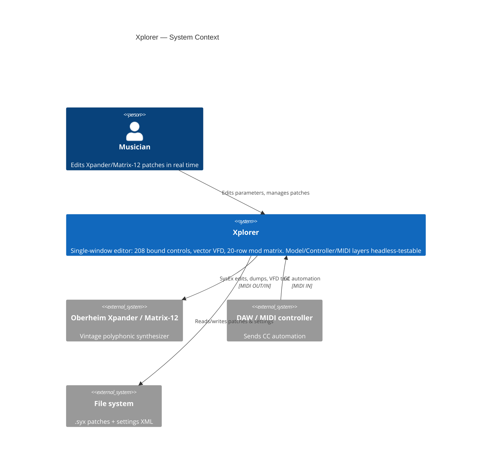
```mermaid
C4Context
    title Xplorer — System Context

    Person(user, "Musician", "Edits Xpander/Matrix-12 patches in real time")
    System(xplorer, "Xplorer", "Single-window editor: 208 bound controls, vector VFD, 20-row mod matrix. Model/Controller/MIDI layers headless-testable")
    System_Ext(synth, "Oberheim Xpander / Matrix-12", "Vintage polyphonic synthesizer")
    System_Ext(daw, "DAW / MIDI controller", "Sends CC automation")
    System_Ext(fs, "File system", ".syx patches + settings XML")

    Rel(user, xplorer, "Edits parameters, manages patches")
    Rel(xplorer, synth, "SysEx edits, dumps, VFD text", "MIDI OUT/IN")
    Rel(daw, xplorer, "CC automation", "MIDI IN")
    Rel(xplorer, fs, "Reads/writes patches & settings")
```

### Strengths

- **Testability by construction.** Every seam is an injected interface and all UI logic sits
  in a UI-framework-free library. 170 requirement-tagged scenarios, 2 911 assertions,
  three platforms.
- **No hand-copied facts.** Layout, captions, enum labels, parameter names, design tokens,
  segment glyphs and 15 CI workflows are all generated from single sources; drift is a
  regeneration away from being caught, not a review away from being missed.
- **Resolution independence.** Background and VFD are vector and device-pixel-aware, so the
  interface is crisp at any window size and OS scale; a colour or metric change is a one-line
  YAML edit.
- **Wire and file compatibility**, verified against real hardware dumps and against archived
  patch libraries and settings files.
- **Traceability as a first-class artefact.** 287 requirements, 50 ADRs with 176 numbered
  decisions, 217 tasks — including decisions later reversed, kept with their reasoning
  rather than deleted.
- Fully event-driven UI, cooperative threading, reference timing preserved.

### Weaknesses

- **Diagnostic logging does not work at all** (§11-3) — the one gap that makes field
  diagnosis of a user's problem impossible.
- Hardware-only behaviours (dump timing against a real synth, LED colours under traffic)
  still await validation on the instrument.
- A few reference-faithful blocking sleeps are reachable from the message thread.
- Design-token coverage stops at appearance; spacing and texture parameters are still
  file-local constants, and the staleness gate is not enforced by CI.
- Appearance has a single validator, and pixel review is milestone-gated.
- A handful of ADRs are implemented but formally `Proposed`.

---

## 13. Licensing, disclosure & governance

### 13.1 Licence: AGPL-3.0-or-later

The project is AGPLv3 because **JUCE 8's open-source tier is AGPLv3-only** (ADR-ABT-002).
GPLv3 §13 permits combining a GPLv3 work with an AGPLv3 one, but the combination is then
bound by the AGPL as a whole — so a project cannot correctly call itself GPLv3 while linking
JUCE under its open-source option, and JUCE's own terms require an application built on that
tier to be AGPLv3 itself. Scope of the licence statement: the root `LICENSE`, every source
header, the CMake `SPDX-License-Identifier`, the About dialog and the SBOM's own entry.

In practice AGPLv3's added obligation stays dormant: Xplorer is a desktop application with
no server or hosted component.

### 13.2 Dependency disclosure — About ▸ Dependencies

An SPDX 2.3 JSON document is generated **at build time from CMake's own knowledge** (pinned
JUCE tag, project version, curated component list), so the disclosed version can never drift
from what was actually built (RQ-BLD-022). It is **compiled into the executable as
BinaryData** (ADR-BLD-005) — the same treatment as the default patch `oberheim.syx` — so the
application ships as one self-contained file with no sibling data. `SbomReader` parses it
straight from memory, resolves SPDX's `NOASSERTION`/`NONE` sentinels to a neutral
placeholder rather than showing them literally, filters the SBOM's self-describing root
package, and returns a discriminated failure result — never a silent empty list.

Trade-off accepted in ADR-BLD-005: embedding means a generated SBOM can no longer be swapped
in post-build without a rebuild.

### 13.3 Governance

| File | Role |
|---|---|
| `CODE_OF_CONDUCT.md` | Contributor Covenant v2.1, verbatim; enforcement contact is the maintainer's GitHub handle |
| `CONTRIBUTING.md` | Links to the AGNOS process instructions as the single source of truth rather than restating them |
| `.github/ISSUE_TEMPLATE/*.yml` | GitHub **Issue Forms** with required fields; `blank_issues_enabled: false` makes structured intake non-negotiable |
| `.github/PULL_REQUEST_TEMPLATE.md` | Mandatory traceability field (requirement/ADR/task ids) and a checkbox confirming an AI agent, if used, followed the process |

The driving force is specific to this project: it uses AI coding agents in its own SDLC, so
issue intake must be structured enough for an agent to reformulate a raw submission without
inventing information, and any AI-assisted contribution must carry the same traceability the
project's own commits do.

---

## 14. Open points still to verify

Everything below was left open at the end of the migration and is **not yet closed**. It is
kept in one place deliberately: these are the claims this document makes that rest on
reasoning, tests or a single platform rather than on observation against the real
instrument.

### 14.1 Hardware validation — not complete

| Item | Task | State |
|---|---|---|
| Manual hardware validation checklist against a real Xpander / Matrix-12 | `TASK-JUC-071` (RQ-TST-006) | **In progress** — started by the owner, not yet fully covered |
| Cross-compatibility campaign: patch libraries and settings files exchanged with the archived implementation, both directions | `TASK-JUC-072` (RQ-MOD-050, RQ-SET-006, RQ-NFR-003) | **In progress** — started by the owner, not yet fully covered |
| Dump timing against a real synth under sustained traffic | — | Not observed; the transmit pacing is reference-derived, not measured here |
| MIDI activity lamp behaviour under real traffic | — | Not observed |

### 14.2 Wire behaviours believed correct but unconfirmed on hardware

Each of these is preserved verbatim from the reference (§8.2) on the assumption that the
instrument accepts it. None has been confirmed against the hardware by this project.

| # | Behaviour | What to confirm |
|---|---|---|
| 1 | Programmer-mode frame carries a **duplicated leading `0xF0`** | That the synth accepts the frame as sent, rather than the duplication being a reference bug the instrument tolerated by luck |
| 2 | Tune Request sent as `{F0, F6, F7}` — System Common wrapped in SysEx | That the synth acts on it; a standards-conformant `0xF6` alone may be what actually works |
| 3 | All-notes-off uses the **settings** MIDI channel while everything else uses the tone's channel | Whether the mismatch is intentional or a reference defect. If the two channels differ in a user's setup, all-notes-off goes to the wrong channel |
| 4 | `IsLfoRetrig` compares a sub-page against a page constant — the condition is almost always true | Whether the near-constant result is the behaviour the instrument expects |
| 5 | Humanize `addValue` can never be true, and its range collapses to `{0}` at value 0 | Whether the randomizer's humanize feature is meaningfully doing anything at all |

### 14.3 Platform coverage gaps

| Platform | State |
|---|---|
| Windows x64 | Primary development and validation platform |
| Linux x64 | CI-built and headless-tested; GUI validated by the owner |
| **macOS arm64** | **Experimental** — CI builds and tests it, but it has never been run on real Apple hardware by this project. Reported as experimental in the README and the user manual |

Appearance in general has a **single validator** and pixel review is milestone-gated, so a
regression that only shows on one platform, one DPI or one theme could ship unnoticed.

### 14.4 Functional gaps carried forward

| Item | State |
|---|---|
| **Diagnostic logging never enabled** | `Logger::configure()`/`setLevel()` are called only by tests. No log file is written, no message at any severity is emitted — so a user's field problem cannot be diagnosed from a log. Violates RQ-FMW-070 / RQ-NFR-008. Tracked as GitHub issue **#68** |
| `BugReportFactory` payload | Not ported. The top-level exception dialog exists (RQ-GUI-035) but without the diagnostic payload (RQ-FMW-071) |
| Tone morphing UX | Deferred — the reference form was unfinished (empty OK/Cancel, unwired). The controller primitive is ported and tested; the UX has no specification |
| Multi-patch mode | Out of scope, as in the reference. Backlog |
| Keyboard-focus visual indicator | Implemented, then removed after two rounds of adjustment were each judged visually wrong (ADR-JUC-029). **Accepted residual gap**: a keyboard-only user tabbing without acting gets no positional feedback. Revisiting means reopening RQ-GUI-054 |

### 14.5 Structural debt

| Item | State |
|---|---|
| Blocking sleeps reachable from the message thread (`storeSinglePatchToSynth`, `sendProgramChangeAndGetSinglePatchFromSynth`, VFD typewriter) | The sleeps *are* the hardware pacing, so removing them is not a pure refactor. An async redesign needs an ADR and hardware measurement (§14.1) to size the delays |
| `AbstractTone` → `XpanderTone` downcast in one private accessor | Kept for port fidelity; redesign candidate |
| Design-token coverage is appearance-only | Spacing/layout geometry and procedural texture parameters are still file-local constants, pending an owner-approved spacing scale |
| Token staleness gate not enforced | `generate_design_tokens.py --check` and `generate_workflows.py --check` exist but are **not wired into CMake or CI**. A hand-edited or stale generated file would not fail a build |
| 9 ADRs formally `Proposed` while their code ships | `ADR-ABT-001`, `ADR-BLD-002/003/004`, `ADR-JUC-022/023/024/027/028`. Documentation hygiene, not a code defect: they are implemented and referenced as such by later `Accepted` ADRs. A housekeeping pass should flip them with an implementation note |

### 14.6 How to close an item

An open point closes the same way any change lands: a requirement (or an amendment to one)
in `process/1.requirements/`, an ADR if it is a structural or behavioural decision, a plan
with Gherkin acceptance criteria in `process/3.plan/`, then the code and its test. For the
hardware items in §14.1 and §14.2 the "test" is an observation on the instrument, recorded
in the task — there is no way to automate it, which is exactly why they are still open.

---

## Appendix A — Decision index

Architecture decisions live in `process/2.architecture/`, one file per ADR, each carrying
numbered `DEC-*` decisions that code comments reference directly. **50 ADRs, 176 decisions.**

| Series | Count | Domain |
|---|---|---|
| `ADR-JUC-*` | 36 | UI and application architecture — canvas, tokens, VFD, matrix, menus, threading |
| `ADR-BLD-*` | 5 | Build, versioning, packaging, delivery streams |
| `ADR-ABT-*` | 2 | Licensing and dependency disclosure |
| `ADR-BUG-*` | 2 | Defect corrections that diverge from the reference; controller lifecycle |
| `ADR-GUI-*`, `ADR-SET-*`, `ADR-QLT-*`, `ADR-GOV-*`, `ADR-CLR-*` | 5 | Vector shortcut buttons; settings directory fallback; menu identity; governance; section rhythm |

**High-traffic decisions** — the ones most likely to constrain a new change:

| ADR | Governs |
|---|---|
| `ADR-JUC-006` | GUI architecture: the logical canvas, and the headless/JUCE split |
| `ADR-JUC-004` | The `MidiBackend` port |
| `ADR-JUC-005` | Threading: interruptible worker wait |
| `ADR-JUC-013` | Vector background; the renderer/mockup lock-step |
| `ADR-JUC-014/015` | Three-tier design tokens and their generation |
| `ADR-JUC-020` | Themeable block palette, optional-entry persistence |
| `ADR-JUC-023/026` | Vector VFD glyphs, device-pixel snapping |
| `ADR-JUC-025` | Deterministic window sizing |
| `ADR-BLD-003` | Two-branch delivery, commit-derived version |
| `ADR-BLD-005` | Ancillary files embedded as `BinaryData` |
| `ADR-SET-001` | Settings directory fallback |
| `ADR-QLT-001` | Single-source menu identity |
| `ADR-BUG-002` | Controller lifecycle ownership |

The process artefacts as a whole: **287 requirements** (`process/1.requirements/`, EARS
format), **46 plans / 217 tasks** (`process/3.plan/`, Gherkin acceptance criteria).

---

## Appendix B — Glossary

| Term | Meaning |
|---|---|
| **Bound control** | A JUCE widget registered against a parameter name in `ParameterBindingRegistry` |
| **Control table** | `GeneratedControlTable.inc` — 208 rows of id, kind, absolute bounds, tag, caption |
| **Logical canvas** | The fixed 1260×786 coordinate space every control is laid out in |
| **Page family** | A parameter group existing in numbered instances (ENV 1-5, LFO 1-5, RAMP 1-4, TRACK 1-3) sharing one set of controls |
| **Page / sub-page** | The Xpander's own addressing scheme for parameter edit messages |
| **Quick buttons** | The eight shortcut buttons beneath the display |
| **Reference** | The archived .NET/WinForms implementation — a behavioural constraint, not a dependency |
| **Stream** | A delivery lane: canary (feature branches), preprod (`dev`), prod (tags) |
| **Tone** | One patch: 227 parameters plus a 20-entry modulation matrix |
| **VFD** | The vacuum-fluorescent-style display panel, rendered as vector 16-segment glyphs |
