# Xplorer (JUCE Port) – Software Architecture Analysis

> **Author**: Claude (architecture upkeep pass)
> **Date**: 2026-08 (updated after the GFX/GUI/ABT/GOV sessions — vector rendering throughout,
> a generated design-token system, window scale control, and the project's licensing/dependency-
> disclosure/governance posture)
> **Target**: C++20 · JUCE 8.0.9 · CMake · 1 Git repository · 7 library targets + 1 asset library +
> GUI app + 9 test executables
> **Purpose**: Oberheim Xpander / Matrix-12 real-time MIDI patch editor
> **License**: AGPL-3.0-or-later (relicensed from GPLv3, ADR-ABT-002 — required by JUCE 8's own
> open-source licensing option)
> **Scope**: the complete port — all layers including the JUCE View, which is now vector-rendered
> end to end (background and VFD alike) and driven by a single generated design-token source. The
> application is a near-total functional equivalent of the .NET original (remaining gaps: §10).

## Document structure

| Section | Content |
|---|---|
| [1. Executive summary](#1-executive-summary) | Where the port stands, at a glance |
| [2. Repository & build architecture](#2-repository--build-architecture) | Targets, dependencies, CI pipelines |
| [3. Layered architecture](#3-layered-architecture) | The four layers and their seams |
| [4. The JUCE application architecture](#4-the-juce-application-architecture) | **The View layer in detail** — shell, canvas, extraction pipeline, binding, panels, dialogs, threading |
| [5. Core subsystems](#5-core-subsystems) | Worker queue, bidirectional MIDI flow, settings, tone model |
| [6. SOLID analysis](#6-solid-analysis) | Principle-by-principle assessment |
| [7. Key design patterns](#7-key-design-patterns) | Patterns and where they live |
| [8. Threading model](#8-threading-model) | Every thread in the running application |
| [9. Testing architecture](#9-testing-architecture) | What is machine-tested vs owner-validated |
| [10. Remaining gaps & improvement backlog](#10-remaining-gaps--improvement-backlog) | Open items, each with a status |
| [11. Architecture summary](#11-architecture-summary) | Context diagram, strengths, weaknesses |
| [12. Notable differences vs the C# implementation](#12-notable-differences-vs-the-c-implementation) | Every deliberate deviation (comparison heritage of this document) |
| [13. Edge cases, reference quirks and verbatim conversions](#13-edge-cases-reference-quirks-and-verbatim-conversions) | Latent reference bugs and how each was handled |
| [14. Licensing, dependency disclosure & governance](#14-licensing-dependency-disclosure--governance) | AGPLv3 relicense, the SBOM-driven Dependencies window, community-health files |

Sections 12–13 preserve this document's original 1:1-comparison role; sections 4, 8 and 9
carry the new emphasis: **how the JUCE application itself is built**; §2's build-targets table and
§14 are new with this revision.

---

## 1. Executive summary

All five migration phases are implemented and the GUI application runs the full reference
feature set: the single main window with all ~230 controls over the reference artwork,
page families, the 20-row modulation matrix, the vector-rendered VFD, the MIDI traffic
panel, a reference-matched menu bar (icons, order and keyboard shortcuts) and every dialog
workflow (settings, store/goto, rename, extract, backup / restore with progress, piano
keyboard, about + a dependency-disclosure window), plus `.syx` drag & drop. Wire and file
formats are byte-compatible with the .NET version (verified against real hardware dumps);
settings files interchange in both directions.

Since the previous revision of this document (Phase 5 completion), the port has gone
through a second wave of work that touches presentation more than function: the whole
façade — background diagram and VFD alike — is now vector-drawn from a single generated
design-token source instead of bitmaps (§4.2, §4.7, §4.10); the window is freely resizable
plus a View-menu scale/full-screen control (§4.2); a licensing defect was found and fixed —
the project is now AGPLv3, not GPLv3 (§14); and the project gained a dependency-disclosure
window and standard GitHub community-health files (§14).

- **9 CMake targets are executables**: 1 GUI app + 8 always-built test suites, plus a 9th
  test suite that only exists in app-enabled builds (§2, build-targets table). 127
  Catch2 `TEST_CASE`/`SCENARIO` definitions across 30 source files (up from 81 at the
  previous revision) run headless in Linux CI; native Windows and macOS CI jobs build
  `Xplorer.exe` / `Xplorer.app` and run the same suites, plus the JUCE-metrics-dependent
  ninth suite. The most recent owner-verified full run recorded 2982 assertions, 0 tests
  modified (ADR-JUC-029..032).
- Every UI *logic* concern (control table, binding registry, page-family resolution,
  metadata) lives in a UI-framework-free library (`xpl_app_core`) and is machine-tested;
  thin JUCE wrappers stay visual-validation-only (owner, on Windows/macOS).
- **38 ADRs** across four series (`ADR-JUC-*` UI/architecture, `ADR-BLD-*` build/release,
  `ADR-ABT-*` licensing/about, `ADR-GOV-*` governance) document every structural decision
  and deviation; a handful (ADR-JUC-024/026/027/028) remain formally `Proposed` while their
  code is already shipped — a documentation-hygiene gap noted in §10.
- Not ported (deliberate): tone morphing UX (reference form is unfinished), multi-patch
  mode (out of scope, as reference), `BugReportFactory` payload (§10). Two owner-requested
  simplifications vs. the reference: the keyboard-focus visual indicator and the startup
  splash screen were both implemented, then removed after review (ADR-JUC-029, ADR-JUC-030).

---

## 2. Repository & build architecture

One repository; the .NET solution remains untouched and buildable during the whole
migration (RQ-BLD-004) and serves as the behavioral reference. The C++ tree builds with a
single CMake invocation (RQ-BLD-005); JUCE and Catch2 are pinned FetchContent dependencies
— no copied binaries.

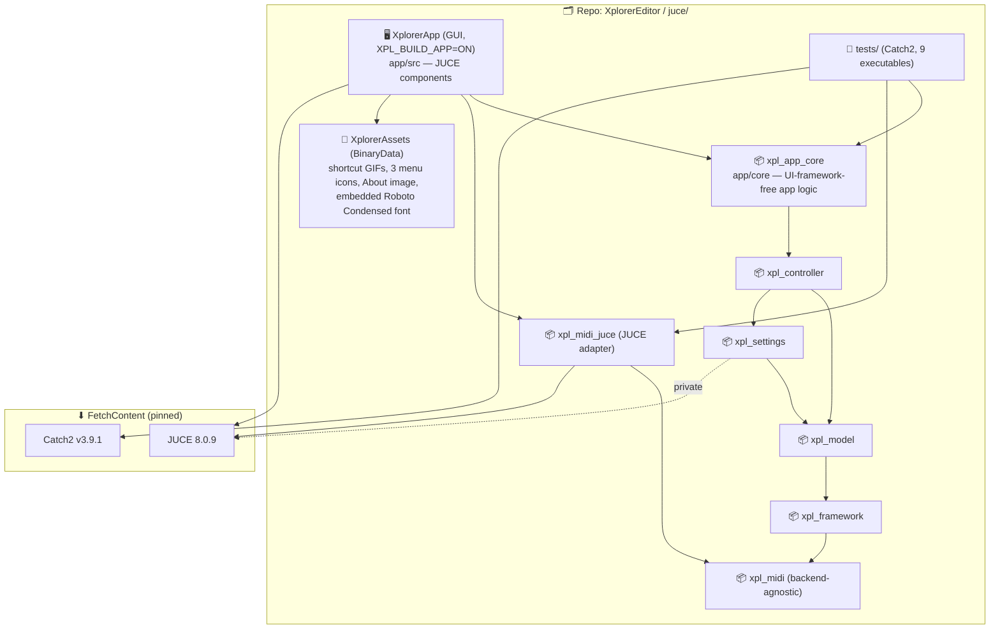
```mermaid
graph TD
    subgraph repo ["🗂 Repo: XplorerEditor / juce/"]
        App["🖥 XplorerApp (GUI, XPL_BUILD_APP=ON)\napp/src — JUCE components"]
        AppCore["📦 xpl_app_core\napp/core — UI-framework-free app logic"]
        Controller["📦 xpl_controller"]
        Settings["📦 xpl_settings"]
        Model["📦 xpl_model"]
        Framework["📦 xpl_framework"]
        MidiJuce["📦 xpl_midi_juce (JUCE adapter)"]
        Midi["📦 xpl_midi (backend-agnostic)"]
        Assets["🎨 XplorerAssets (BinaryData)\nshortcut GIFs, 3 menu icons, About image,\nembedded Roboto Condensed font"]
        Tests["🧪 tests/ (Catch2, 9 executables)"]
    end

    subgraph external ["⬇ FetchContent (pinned)"]
        JUCE["JUCE 8.0.9"]
        Catch2["Catch2 v3.9.1"]
    end

    App --> AppCore
    App --> MidiJuce
    App --> Assets
    App --> JUCE
    AppCore --> Controller
    Controller --> Model
    Controller --> Settings
    Settings --> Model
    Model --> Framework
    Framework --> Midi
    MidiJuce --> Midi
    MidiJuce --> JUCE
    Settings -.private.-> JUCE
    Tests --> AppCore
    Tests --> MidiJuce
    Tests --> Catch2
```

**CI pipelines** (GitHub Actions):

| Workflow | Runner | Role |
|---|---|---|
| `linux-headless-release.yml` | ubuntu-latest | Configure, build, `ctest` — headless scenarios on every push (RQ-BLD-007). `XPL_BUILD_APP` stays OFF, so the JUCE-linked suite is not built here. |
| `windows-app-release.yml` | windows-2022 | MSVC x64 build of `Xplorer.exe` + same test suite; uploads the binary as artifact for owner validation. `workflow_dispatch` input `run_tests` allows a binary-only run. MinGW cross-compile is not viable — JUCE `#error`s on it (RQ-BLD-008). On `main`, also publishes an alpha pre-release (RQ-BLD-009, ADR-BLD-001). |
| `windows-app-debug.yml` | windows-2022 | MSVC x64 Debug build with tests on — compiles the `#if JUCE_DEBUG` paths and runs the real-metrics combo-box fit test `xpl_tests_app_juce` (RQ-GUI-047, RQ-GUI-048, ADR-JUC-022). |
| `macos-app-release.yml` | macos-latest | arm64 Release build of `Xplorer.app` + test suite; uploads the bundle as a CI artifact. Artifact-only — no GitHub Release (RQ-BLD-011, ADR-BLD-002). |
| `macos-app-debug.yml` | macos-latest | arm64 Debug build with tests on — the macOS counterpart of `windows-app-debug`, extending the combo-box fit verification to macOS font metrics (RQ-BLD-012, ADR-BLD-002). |

All five follow RQ-BLD-010: workflow file name, `name:` and job key are the same `<os>-<application>-<build>` string, one build configuration per file.

### Build targets & executables

The build is CMake, not a hand-written Makefile — on Linux/macOS the default generator
happens to emit one, on Windows it emits Visual Studio projects; the targets below are the
same regardless of generator. `option(XPL_BUILD_APP)` (default `OFF`) and
`option(XPL_BUILD_TESTS)` (default `ON`) gate which of them exist in a given configure.

| Target | Kind | Purpose | Output location |
|---|---|---|---|
| `xpl_midi`, `xpl_midi_juce`, `xpl_framework`, `xpl_model`, `xpl_controller`, `xpl_settings`, `xpl_app_core` | Static libraries | One per architectural layer (§3) — never shipped standalone, only linked into `XplorerApp` and/or the test executables | `<build-dir>/<layer>/` — intermediate `.a`/`.lib`, not a deliverable |
| `XplorerAssets` | Static library (`juce_add_binary_data`) | Embeds the shortcut-button GIFs, the three reference menu icons, the About image and the Roboto Condensed font as in-memory `BinaryData` (§4.10) | Same as above — linked into `XplorerApp` and `xpl_tests_app_juce` only |
| `XplorerApp` | **GUI executable** (`juce_add_gui_app`; only exists when `XPL_BUILD_APP=ON`) | The Xplorer editor itself — the one artefact end users run and CI uploads/releases | `<build-dir>/app/XplorerApp_artefacts/<Config>/Xplorer[.exe \| .app]`. A `POST_BUILD` step copies `oberheim.syx` (the "New" default patch, ADR-JUC-032) and `xplorer.sbom.spdx.json` (dependency disclosure, ADR-ABT-001) beside the binary |
| `xpl_tests_smoke`, `xpl_tests_midi`, `xpl_tests_midi_juce`, `xpl_tests_framework`, `xpl_tests_model`, `xpl_tests_settings`, `xpl_tests_controller`, `xpl_tests_app` (8 executables) | Catch2 test executables (exist when `XPL_BUILD_TESTS=ON`, the default) | One per layer (§9), headless — no display needed, so these run in every CI job including the Linux headless one | `<build-dir>/tests/[<Config>/]<target-name>[.exe]`, registered with CTest via `catch_discover_tests` |
| `xpl_tests_app_juce` | Catch2 test executable (only exists when `XPL_BUILD_APP=ON`, **and** `XPL_BUILD_TESTS=ON`) | The one suite that needs real JUCE font/graphics metrics to be meaningful: combo-box real-metrics fit, VFD segment renderer, background renderer, bound radio group, LED-panel geometry, dialog patch-name validation, SBOM reader (§9) | Same layout as the other test executables; produced and run only in app-enabled CI jobs (`windows-app-*`, `macos-app-*`), never in `linux-headless-release` |

None of the seven layer libraries or `XplorerAssets` is directly runnable — `XplorerApp` is
the sole shipping artefact. Each of the five CI workflows (table above) configures its own
build directory (`build`, `build-win[-debug]`, `build-mac[-debug]`) precisely so a given
runner's artefacts never collide with another workflow's, and each picks its own
`XPL_BUILD_APP`/`XPL_BUILD_TESTS` combination — e.g. `linux-headless-release` never sets
`XPL_BUILD_APP`, so `XplorerApp` and `xpl_tests_app_juce` are not even configured there.

---

## 3. Layered architecture

Same 3-layer MVC-inspired separation as the reference, plus two seams the reference did
not have: the **MIDI backend interface** (ADR-JUC-004) and the split of the View into
**headless app logic** (`xpl_app_core`) vs **JUCE components** (`app/src`, ADR-JUC-006).

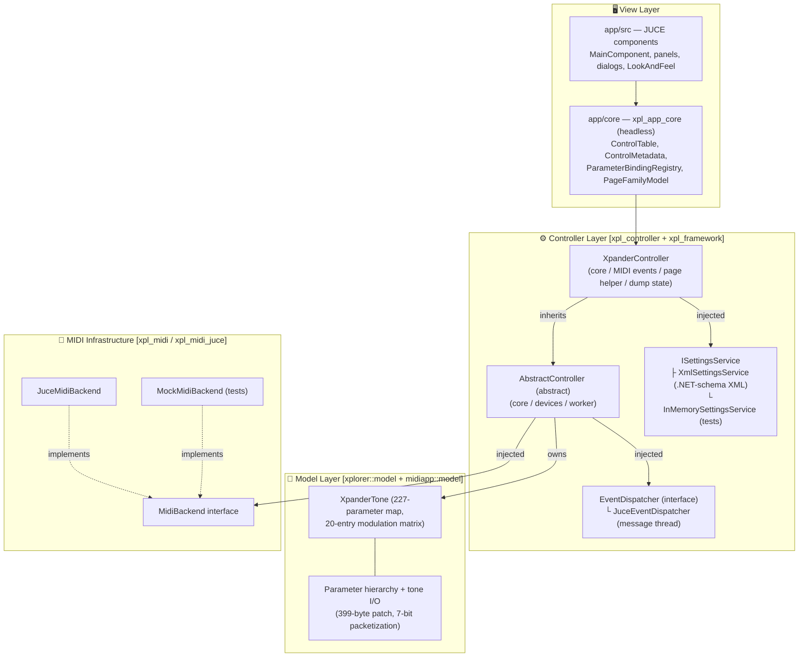
```mermaid
flowchart TB
    subgraph VIEW ["🖥 View Layer"]
        JuceApp["app/src — JUCE components\nMainComponent, panels, dialogs, LookAndFeel"]
        AppCore["app/core — xpl_app_core (headless)\nControlTable, ControlMetadata,\nParameterBindingRegistry, PageFamilyModel"]
    end

    subgraph CTRL ["⚙️ Controller Layer  [xpl_controller + xpl_framework]"]
        XpanderController["XpanderController\n(core / MIDI events / page helper / dump state)"]
        AbstractController["AbstractController (abstract)\n(core / devices / worker)"]
        SettingsSvc["ISettingsService\n├ XmlSettingsService (.NET-schema XML)\n└ InMemorySettingsService (tests)"]
        Dispatcher["EventDispatcher (interface)\n└ JuceEventDispatcher (message thread)"]
    end

    subgraph MODEL ["📐 Model Layer  [xplorer::model + midiapp::model]"]
        XpanderTone["XpanderTone (227-parameter map,\n20-entry modulation matrix)"]
        Params["Parameter hierarchy + tone I/O\n(399-byte patch, 7-bit packetization)"]
    end

    subgraph MIDI ["🎹 MIDI Infrastructure  [xpl_midi / xpl_midi_juce]"]
        Backend["MidiBackend interface"]
        JuceBackend["JuceMidiBackend"]
        MockBackend["MockMidiBackend (tests)"]
    end

    JuceApp --> AppCore
    AppCore --> XpanderController
    XpanderController -->|inherits| AbstractController
    XpanderController -->|injected| SettingsSvc
    AbstractController -->|owns| XpanderTone
    AbstractController -->|injected| Dispatcher
    XpanderTone --- Params
    AbstractController -->|injected| Backend
    JuceBackend -.implements.-> Backend
    MockBackend -.implements.-> Backend
```

---

## 4. The JUCE application architecture

This section is the detailed map of the View layer — the largest part of the port and the
main subject of this revision.

### 4.1 Application shell

`Main.cpp` hosts the JUCE application object and the top-level window:

- `XplorerApplication` (`juce::JUCEApplication`): single-instance enforcement
  (`moreThanOneInstanceAllowed() = false`, RQ-FMW-072) and the **top-level exception
  dialog** (`unhandledException` override → alert with file/line and a bug-report pointer,
  RQ-GUI-035 — the reference `TopLevelExceptionHandler`). **No splash screen**: the
  reference's splash was a copy of the panel bitmap, and once the panel became vector,
  resizable and user-themeable (§4.2, §4.10) a copy of it could no longer match the window
  that follows it at any delay or size — it was implemented, then removed rather than kept
  and re-aligned a third time (RQ-GUI-055, ADR-JUC-030).
- `MainWindow` (`juce::DocumentWindow`): native title bar, **freely resizable**
  (owner decision, RQ-GUI-005) plus five discrete scale presets and Full Screen from the
  View menu (§4.2), owns a `ScaledCanvasComponent`.

### 4.2 Logical canvas & uniform scaling

Every control is laid out **once**, in the fixed logical pixel space of the original
reference layout (`1260×786`, `LOGICAL_CANVAS_WIDTH/HEIGHT`). `ScaledCanvasComponent` hosts
the menu bar strip and applies one `AffineTransform` on resize — `scale = min(w/1260,
h/786)` — centered; nothing else knows about scaling (ADR-JUC-006 §1). This is the *only*
place the logical canvas and the physical window size meet, a property later decisions
(window sizing, VFD device-pixel snapping) deliberately preserve rather than duplicate.

**The façade itself is fully vector**, not a bitmap. The background diagram — plate,
wood rails, block frames, signal lines, captions, section-title bars — is painted directly
with `juce::Graphics` primitives (`BackgroundRenderer::paintVectorBackground`) from geometry
transcribed from an owner-validated SVG mockup (`juce/tools/background-mockup.svg`,
generated by `juce/tools/generate_background_mockup.py`), replacing the original
1260×813 JPEG (ADR-JUC-013). The background is deliberately **not** cached via
`setBufferedToImage`: an image cache would be rescaled by the canvas transform and
reintroduce the exact blur the change removes, so the ~300 primitives are repainted
directly on every (infrequent) background repaint. Colours, strokes and section-bar
gradients resolve through the design-token system (§4.10); each of the eight functional
blocks (VCO1/VCO2, VCF/VCA, ENV, LFO, RAMP, TRACK, MOD MATRIX, …) carries its own themeable
identity colour (fill tint + frame relief) that is also picked up by the page-family
selector buttons (ADR-JUC-018, ADR-JUC-019, ADR-JUC-020).

**Window sizing is deterministic, not layout-derived.** A single headless, unit-tested
function `windowSizeForScale(scale)` (`xpl_app_core`) computes a content size from one
constant, `WINDOW_WIDTH_AT_1X = 1440`, keeping the canvas aspect ratio; both the startup
size and every View-menu entry call it, so nothing re-derives the arithmetic or reads
`getWidth()/getHeight()` back to infer what size it already is (ADR-JUC-025). The `View`
menu — a fifth entry between `Patch` and `Tools` — offers five presets (`1x` = 1440×922
through `2x` = 2880×1821) plus Full Screen; a preset that would not fit the current display
falls back to Full Screen instead of producing an off-screen window, and the checked menu
item is always read from the window's *actual* current width, never from remembered state.
This is a display-convenience feature only: only `1.75x` happens to land on an exact canvas
render scale, so it does not by itself guarantee a crisp, device-pixel-aligned VFD at every
size — that is a separate concern, handled in the VFD renderer itself (§4.7).

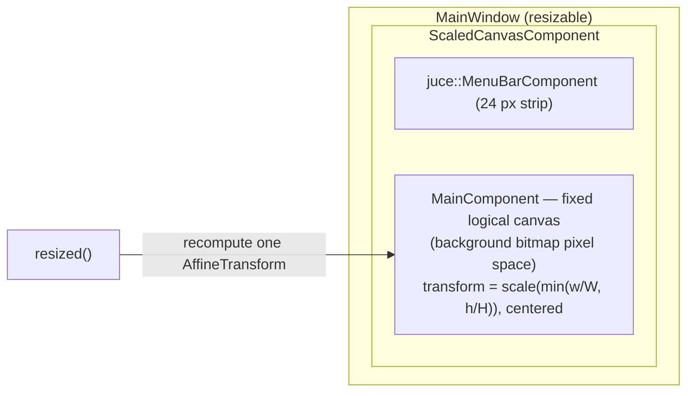
```mermaid
flowchart LR
    subgraph Window ["MainWindow (resizable)"]
        subgraph SCC ["ScaledCanvasComponent"]
            Menu["juce::MenuBarComponent (24 px strip)"]
            Canvas["MainComponent — fixed logical canvas\n(background bitmap pixel space)\ntransform = scale(min(w/W, h/H)), centered"]
        end
    end
    Resize["resized()"] -->|"recompute one AffineTransform"| Canvas
```

`ScaledCanvasComponent` is also the window-wide **`FileDragAndDropTarget`**: the first
dropped `.syx` goes through `MainComponent::loadSysexFileByType` — classification
(RQ-MOD-043), then load / confirm-and-restore / warn — the same path as File → Open
(RQ-GUI-029).

### 4.3 The extraction pipeline

The reference UI is not re-described by hand: a single script,
`app/core/tools/extract_control_table.py`, regenerates **all** UI facts from the WinForms
sources. This is what makes the 1:1 layout tractable and re-checkable.

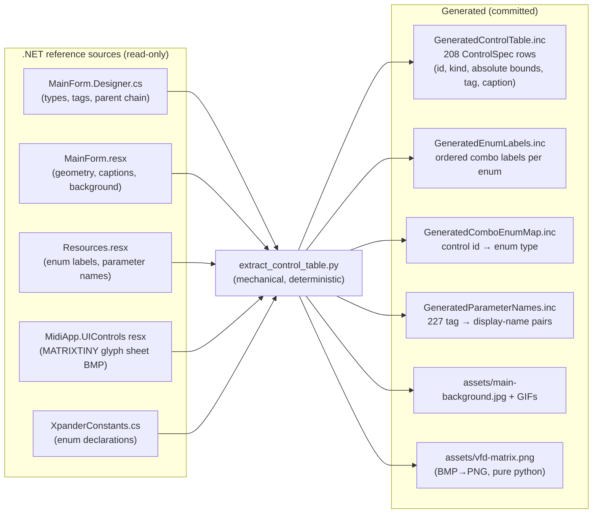
```mermaid
flowchart LR
    subgraph dotnet [".NET reference sources (read-only)"]
        Designer["MainForm.Designer.cs\n(types, tags, parent chain)"]
        Resx["MainForm.resx\n(geometry, captions, background)"]
        Resources["Resources.resx\n(enum labels, parameter names)"]
        UIRes["MidiApp.UIControls resx\n(MATRIXTINY glyph sheet BMP)"]
        Constants["XpanderConstants.cs\n(enum declarations)"]
    end

    Script["extract_control_table.py\n(mechanical, deterministic)"]

    subgraph generated ["Generated (committed)"]
        Table["GeneratedControlTable.inc\n208 ControlSpec rows\n(id, kind, absolute bounds, tag, caption)"]
        Enums["GeneratedEnumLabels.inc\nordered combo labels per enum"]
        Combo["GeneratedComboEnumMap.inc\ncontrol id → enum type"]
        Names["GeneratedParameterNames.inc\n227 tag → display-name pairs"]
        Bg["assets/main-background.jpg + GIFs"]
        Vfd["assets/vfd-matrix.png\n(BMP→PNG, pure python)"]
    end

    Designer --> Script
    Resx --> Script
    Resources --> Script
    UIRes --> Script
    Constants --> Script
    Script --> Table & Enums & Combo & Names & Bg & Vfd
```

Key detail: WinForms `Location` is parent-relative; the script resolves each control
through the `Controls.Add` parent chain to **absolute canvas coordinates**, which is what
`ControlSpec` stores. A headless test locks the table against known anchors.

### 4.4 Control ⇄ parameter binding

The heart of the UI: `ParameterBindingRegistry` (headless, `xpl_app_core`) maps parameter
names (= the reference WinForms tags, unchanged) to `IBoundControl`s. Thin JUCE wrappers
(`BoundKnob`/`BoundComboBox`/`BoundCheckBox`, radio panels rendered as combos in the
functional phase) implement the interface.

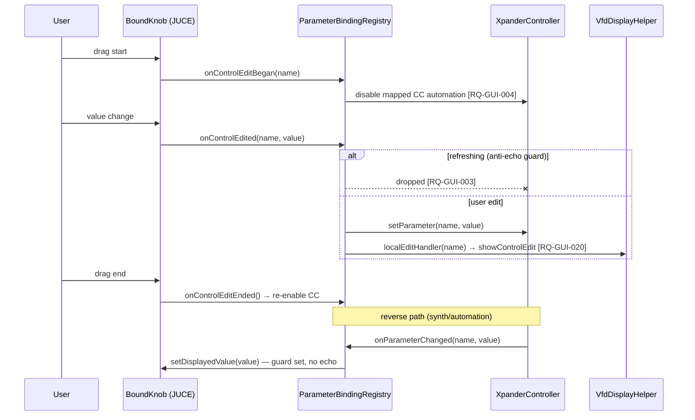
```mermaid
sequenceDiagram
    participant U as User
    participant BC as BoundKnob (JUCE)
    participant Reg as ParameterBindingRegistry
    participant Ctrl as XpanderController
    participant VFD as VfdDisplayHelper

    U->>BC: drag start
    BC->>Reg: onControlEditBegan(name)
    Reg->>Ctrl: disable mapped CC automation [RQ-GUI-004]
    U->>BC: value change
    BC->>Reg: onControlEdited(name, value)
    alt refreshing (anti-echo guard)
        Reg--xCtrl: dropped [RQ-GUI-003]
    else user edit
        Reg->>Ctrl: setParameter(name, value)
        Reg->>VFD: localEditHandler(name) → showControlEdit [RQ-GUI-020]
    end
    U->>BC: drag end
    BC->>Reg: onControlEditEnded() → re-enable CC

    Note over Ctrl,Reg: reverse path (synth/automation)
    Ctrl->>Reg: onParameterChanged(name, value)
    Reg->>BC: setDisplayedValue(value)  — guard set, no echo
```

Two registry fan-outs beyond `setParameter`:
- `setLocalEditHandler` — fires only on genuine user edits (guard-checked); the app wires
  it to the VFD.
- `displayTextFor(name)` — asks the bound control to format its own value for display
  (`IBoundControl::displayText()`: combo label, checkbox Y/N, knob numeric), so the VFD
  shows `VCF MODE:4 POLE LOW`, not `:3`.

### 4.5 Page-family blocks (ENV / LFO / RAMP / TRACK)

One shared block of controls per family edits the selected instance. The resolution logic
(`PageFamilyModel`: tag `ENV_X_ATTACK` + instance 3 → `ENV_3_ATTACK`, and the reverse
mapping for synth-driven page changes) is headless-tested; `PageFamilyBlock` (JUCE) owns
the selector buttons and rebinds each control through the registry on switch — the
rebinding is just `unbind` + `bind`, values refreshed from the model, then a page-select
goes to the synth (RQ-GUI-010..012).

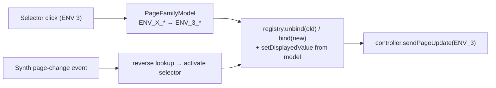
```mermaid
flowchart LR
    Sel["Selector click (ENV 3)"] --> PFM["PageFamilyModel\nENV_X_* → ENV_3_*"]
    PFM --> Rebind["registry.unbind(old) / bind(new)\n+ setDisplayedValue from model"]
    Rebind --> Page["controller.sendPageUpdate(ENV_3)"]
    Synth["Synth page-change event"] --> PFM2["reverse lookup → activate selector"] --> Rebind
```

### 4.6 Modulation matrix panel

`ModMatrixPanel`: 20 rows × {source combo, amount knob, destination combo, quantize
check}, placed from the extracted table, wired to the controller's dedicated matrix
operations (not plain parameters — port of `ModulationMatrixManager`). It tracks the
previous destination per row (the change-destination operation needs old + new), refreshes
row-wise on the modulation-entry event and wholesale on full-tone changes, and exposes an
edit callback the app routes to the VFD (`SRC TO DEST: / AMNT / QTZ`).

### 4.7 VFD display

Two cleanly separated halves (ADR-JUC-006 §4), now both vector:

- **Content** — `VfdDisplayHelper` (port of the reference class): builds the 5 text lines
  — `* Snn NAME *`, parameter line (friendly name from the generated table + value by
  control type, wrapped at the panel's column count), `MIDI CC:` line, or the
  modulation-entry lines. Pure logic over the display's grid metrics; unchanged by the
  rendering rewrite below.
- **Rendering** — `DisplayPanel` + `VfdSegmentRenderer`: the original 12×16 bitmap sprite
  blit (`vfd-matrix.png`, a port of the reference `MATRIXTINY` sheet) is **replaced by
  vector 16-segment glyph rendering**, superseding ADR-JUC-007 (ADR-JUC-023). The change
  was forced by three findings, not a stylistic preference: the sprite sheet only drew 51
  of 95 printable characters (every lowercase letter was byte-identical to a space and
  silently vanished); it cannot survive a scale change (bitmap resampling degrades further
  from crisp as the window is enlarged or on HiDPI); and the sheet's own source `.resx` left
  the repository for the archive, so it was no longer regenerable. The segment topology is
  adopted from the vendored `dmadison/LED-Segment-ASCII` table (MIT, ASCII 32–126, one
  16-bit mask per character), with a small override table for the three glyphs a pure
  16-segment model cannot represent (`:` as two dots, `_` as a sub-baseline bar, `x` split
  from `X`). Segment paths are built once in cell-normalised units and scaled at paint time
  by the accumulated physical pixel scale factor, so glow radii stay correct at any window
  size or OS DPI setting; the glyph glow is a single-Gaussian scalar radiance field over an
  always-drawn unlit bed, tone-mapped once, fitted against the original sprite sheet (kept
  in the repository purely as that fitting reference — it is no longer a runtime asset).
  Grid metrics, centering and the `setBufferedToImage(true)` + identical-text early-out
  caching strategy carry over unchanged from ADR-JUC-007 (the cache follows the physical
  device resolution, not the logical size, so it is not a resolution trap). The display's
  glyph grid is further **snapped to whole device pixels** so the same crisp rendering holds
  at fractional canvas scales, which is most of them (ADR-JUC-026). A recessed bezel frames
  the glass so the display reads as mounted in the panel rather than laid on it
  (ADR-JUC-024). Every geometric and photometric constant is a design token (§4.10).

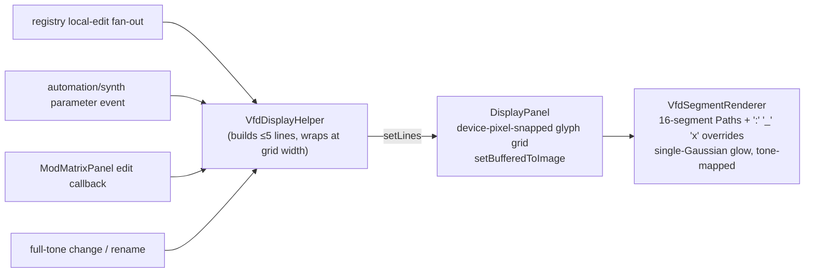
```mermaid
flowchart LR
    Reg["registry local-edit fan-out"] --> Helper
    Auto["automation/synth parameter event"] --> Helper
    Matrix["ModMatrixPanel edit callback"] --> Helper
    Tone["full-tone change / rename"] --> Helper
    Helper["VfdDisplayHelper\n(builds ≤5 lines, wraps at grid width)"] -->|setLines| Panel["DisplayPanel\ndevice-pixel-snapped glyph grid\nsetBufferedToImage"]
    Panel --> Seg["VfdSegmentRenderer\n16-segment Paths + ':' '_' 'x' overrides\nsingle-Gaussian glow, tone-mapped"]
```

### 4.8 MIDI LED panel

`LedPanelComponent` (port of `LedPanelControl`, ADR-JUC-008): three LEDs at the extracted
bounds — automation-in **green**, synth-in **blue**, synth-out **red**. Each MIDI-activity
event stamps its LED's expiry (now + 100 ms); a 30 ms decay timer runs **only while a LED is
lit** and stops itself — same observable behaviour as the reference's permanent 30 ms UI poll
(which also drove the VFD there; both are event-driven here), with zero idle work.
Presentation was later refined so the LEDs read as **lamps mounted in the panel, not flat
controls**: round glass with a rim and a soft glow instead of the original flat squares,
positioned against the VFD bezel it sits under (ADR-JUC-031, constrained by the bezel
geometry of ADR-JUC-024). The behavioural half — device mapping, retriggerable hold, the
self-stopping decay timer — is untouched by that pass.

### 4.9 Menus, dialogs & long operations

`MainComponent` implements `juce::MenuBarModel` with five menus: File / Patch / **View** /
Tools / Help. `View` is the scale/full-screen control described in §4.2 (ADR-JUC-025); the
other four were audited item-by-item against the reference `MainForm.Designer.cs`/`.resx`
and corrected to match exactly — order, the three items that carry reference icons (New,
Open, Save — the only menu items the reference itself decorates), and sixteen keyboard
shortcuts that are both displayed and functionally live via one `{id, KeyPress, displayText}`
table feeding both the `PopupMenu` build and a `MainComponent::keyPressed` override
(ADR-JUC-032). The only two sanctioned departures from the reference menu content are
"Save as" (dropped — Save already always opens a file picker, so a second identical item
would be redundant) and "Piano keyboard" (an addition with no reference counterpart,
RQ-GUI-028). Dialog inventory:

| Dialog | Implementation | Notes |
|---|---|---|
| Settings | `SettingsDialog` — `TabbedComponent`, 3 pages (MIDI / User interface / Randomizer) | Persists via `ISettingsService`, re-applies MIDI devices live, LED-ring colour change rebuilds the LookAndFeel without restart; the User interface page also carries per-block colour overrides (§4.10) |
| Store / Goto program | shared numeric prompt | |
| Rename | reference character-set validation | rename triggers the reference's full retransmission side effect |
| Extract single tones | chained file→folder pickers (`ExtractFlow`) | |
| Backup / Get-all-patches | **modeless** `ProgressWindow` | progression is event-driven (fed by incoming MIDI dumps) |
| Restore all data | `RestoreThread` (`ThreadWithProgressWindow`) | blocking paced send loop off the message thread; progression marshalled — no `DoEvents` equivalent |
| Piano keyboard | `PianoWindow` (`MidiKeyboardComponent`) | Note On/Off to the synth |
| About | standard alert, project licence (AGPLv3) and link | Carries a **Dependencies** button opening a second window (§14) |

All file choosers are async (`launchAsync`) — JUCE 8 removes modal loops by default; the
port never relies on `JUCE_MODAL_LOOPS_PERMITTED`.

### 4.10 Skin — design tokens, `XplorerLookAndFeel` and themeable block colours

**Design tokens are the single source of truth for every visual constant.** A three-tier
model — `tokens::global` (raw literals: hex colours, point sizes, pixel radii),
`tokens::semantic` (roles aliasing globals: `surfaceRecessed`, `textPrimary`,
`diagramFrame`, …), `tokens::component` (per-control usages aliasing semantics, only where a
transform exists) — replaced the file-by-file scattered literals the JUCE UI originally
hard-coded (ADR-JUC-014). The tiers live in generated `DesignTokens.hpp`
(`juce/app/src/`, GUI-app-only — `xpl_app_core` stays deliberately JUCE-graphics-free,
ADR-JUC-006/002), **generated, not hand-written**, from one YAML source
(`juce/tools/design-tokens.yaml`) by `generate_design_tokens.py`; the same generator's
`resolve()` is reused by the SVG mockup tool so the C++ tokens and the prototype cannot
diverge (ADR-JUC-015). A token change is a one-line YAML edit plus regeneration —
`--check` catches a stale committed header. Scope is deliberately bounded to *appearance*
(colour, font size, corner radius, stroke width, motion/timing); spacing/layout geometry
and procedural texture parameters are not yet tokenised (documented gap, §10).

**`XplorerLookAndFeel`**, a single `final` subclass installed as the global default,
restyles every control with zero behavioral code, consuming the token tiers above:
rotary knobs render **LED-ring only** — no pointer tick, and no Standard/vintage style
switch (removed outright once confirmed unwired to any rendering, ADR-JUC-009) — with the
configurable accent colour (live-rebuilt from the settings dialog); compact tick-boxes with
height-fitted caption fonts; white control text; hover brightens an existing element and
disabled scales its alpha, both consistent across every control type (ADR-JUC-017).
**The keyboard-focus ring was implemented, iterated twice, and then removed**: after two
rounds of repositioning it, the owner judged a fourth concentric rectangle in a fourth
colour language visually incompatible with the block-identity and cross-reference framing
already carried by matrix combos and selector buttons: the VFD's last-action readout
(§4.7) partially — but not fully — compensates, a trade-off recorded rather than hidden
(ADR-JUC-029, superseding the Focused half of ADR-JUC-017/ADR-JUC-028). Shortcut buttons use
the reference GIF triples (normal/hover/down) as `ImageButton`s. **Settings-dialog controls**
(combo boxes, check boxes, radios, row labels) are sized by a context branch inside this
one `LookAndFeel` — 15px inside any `DialogWindow`, unchanged 12px on the main panel — never
by a second `LookAndFeel` subclass or by each control's own content (ADR-JUC-033).

**Each of the eight functional blocks carries a themeable identity colour**, resolved at
paint time from a `BlockPalette` (default palette + optional per-block user overrides
persisted via `ISettingsService`), consumed by the background painter, the page-family
selector buttons and the modulation-matrix panel alike — never cached, so a live colour
change from the settings dialog repaints everywhere at once with no stale copies
(ADR-JUC-018, ADR-JUC-019, ADR-JUC-020). Diagram stroke weights and paint order were tuned
so the coloured block frames read as foreground over the diagram's connecting lines
(ADR-JUC-027), and the modulation matrix's cross-reference highlight shares the same block
family and stroke roles (ADR-JUC-028).

### 4.11 Application event flow & threading

The controller emits 7 event channels (parameter change, full tone, page change,
modulation entry, MIDI activity, all-data-dump progression, and the local-edit fan-out at
registry level). Everything reaching JUCE components is marshalled to the message thread
by `JuceEventDispatcher` (`MessageManager::callAsync`) — components never see a foreign
thread.

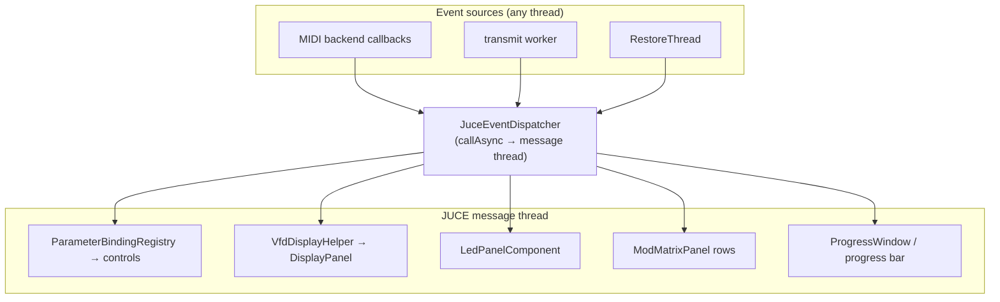
```mermaid
flowchart TB
    subgraph SRC ["Event sources (any thread)"]
        MidiCb["MIDI backend callbacks"]
        Worker["transmit worker"]
        Restore["RestoreThread"]
    end
    Dispatcher["JuceEventDispatcher\n(callAsync → message thread)"]
    subgraph UI ["JUCE message thread"]
        Registry["ParameterBindingRegistry → controls"]
        Vfd["VfdDisplayHelper → DisplayPanel"]
        Leds["LedPanelComponent"]
        MatrixP["ModMatrixPanel rows"]
        Progress["ProgressWindow / progress bar"]
    end
    MidiCb --> Dispatcher
    Worker --> Dispatcher
    Restore --> Dispatcher
    Dispatcher --> Registry & Vfd & Leds & MatrixP & Progress
```

---

## 5. Core subsystems

### 5.1 Parameter queue & worker thread

Same observable pacing as the reference (scan → enqueue clones → send at most one per
tick, page-select first when the page changes), implemented with interruptible primitives
instead of `Thread.Sleep` polling (ADR-JUC-005).

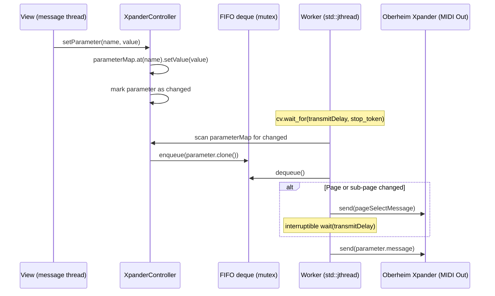
```mermaid
sequenceDiagram
    participant UI as View (message thread)
    participant Ctrl as XpanderController
    participant Queue as FIFO deque (mutex)
    participant WT as Worker (std::jthread)
    participant Synth as Oberheim Xpander (MIDI Out)

    UI->>Ctrl: setParameter(name, value)
    Ctrl->>Ctrl: parameterMap.at(name).setValue(value)
    Ctrl->>Ctrl: mark parameter as changed
    Note over WT: cv.wait_for(transmitDelay, stop_token)
    WT->>Ctrl: scan parameterMap for changed
    Ctrl->>Queue: enqueue(parameter.clone())
    WT->>Queue: dequeue()
    alt Page or sub-page changed
        WT->>Synth: send(pageSelectMessage)
        Note over WT: interruptible wait(transmitDelay)
    end
    WT->>Synth: send(parameter.message)
```

### 5.2 MIDI event flow (bidirectional)

Three simultaneous devices; handlers are virtual methods receiving a backend-agnostic
`MidiMessage` value type.

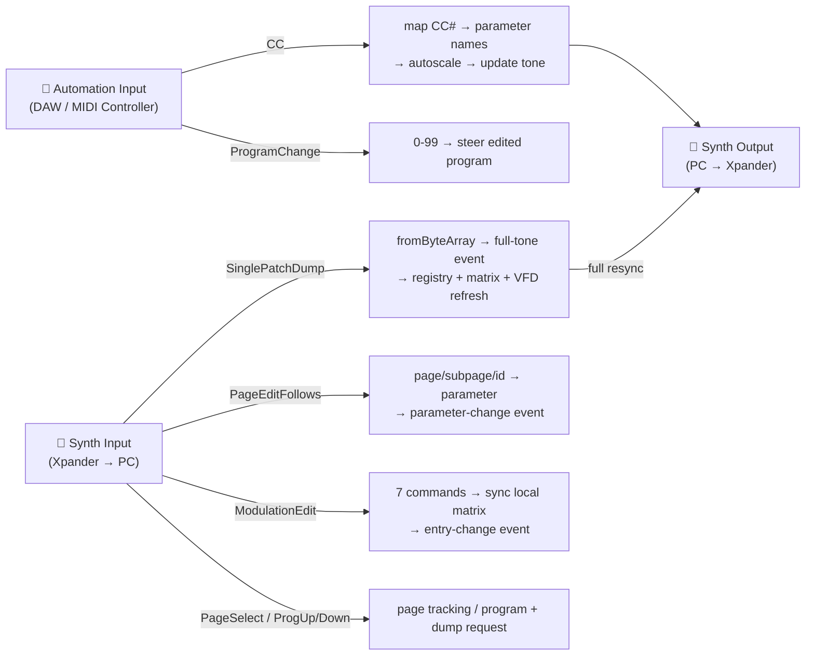
```mermaid
flowchart LR
    AutoIn["🎹 Automation Input\n(DAW / MIDI Controller)"]
    SynthIn["🔌 Synth Input\n(Xpander → PC)"]
    SynthOut["🔌 Synth Output\n(PC → Xpander)"]

    AutoIn -->|CC| AutoHandler["map CC# → parameter names\n→ autoscale → update tone"]
    AutoIn -->|ProgramChange| AutoPC["0-99 → steer edited program"]
    SynthIn -->|SinglePatchDump| ToneUpdate["fromByteArray → full-tone event\n→ registry + matrix + VFD refresh"]
    SynthIn -->|PageEditFollows| ParamUpdate["page/subpage/id → parameter\n→ parameter-change event"]
    SynthIn -->|ModulationEdit| ModMatrix["7 commands → sync local matrix\n→ entry-change event"]
    SynthIn -->|PageSelect / ProgUp/Down| ProgChange["page tracking / program + dump request"]
    AutoHandler --> SynthOut
    ToneUpdate -->|full resync| SynthOut
```

### 5.3 Settings

Injected `ISettingsService`; the XML format stays schema-compatible with the .NET
`XmlSerializer` output so existing `xplorer.users.config` files import unchanged
(round-trip and .NET-import scenarios in CI). `AllUsersSettings` aggregates
`MidiConfiguration`, `UiConfiguration` (knob LED colour, mouse mode, style) and
`RandomizerConfiguration` (VCO2 flags, matrix flags, VCO freq/detune, VCA2 env) — all three
editable from the settings dialog.

### 5.4 Tone model & I/O

Unchanged since the Phase 3 analysis: `XpanderTone` (227-parameter ordered map + 20-entry
matrix), parameter hierarchy (`XpanderParameter` / signed / mod-matrix / full-tone),
`IToneReader/Writer`, 399-byte single-patch layout with 7-bit packetization; byte-exact
round-trips against a real hardware dump are CI-verified.

---

## 6. SOLID analysis

| Principle | Assessment | Detail |
|---|---|---|
| **S** – Single Responsibility | ✅ Respected | One class per concern throughout; in the View, content vs rendering are split (VfdDisplayHelper / DisplayPanel), logic vs widgets are split (`xpl_app_core` / `app/src`), and large controller classes are split across `.cpp` files by topic, mirroring the reference partial-class decomposition. |
| **O** – Open/Closed | ✅ Good | Extension points preserved (virtual handlers, worker override, `IToneReader/Writer`, `MidiBackend`); `IBoundControl` lets new control kinds join the registry without touching it. |
| **L** – Liskov Substitution | ✅ Respected | Mock and JUCE backends interchangeable in every test; bound-control fakes substitute JUCE wrappers in registry tests. |
| **I** – Interface Segregation | ✅ Good | `MidiBackend`/ports, `IToneReader`, `IToneWriter`, `ISettingsService`, `EventDispatcher`, `IBoundControl` are small and focused. |
| **D** – Dependency Inversion | ✅ **Fixed vs reference** | The reference's three partial violations resolved (MIDI behind `MidiBackend`, settings behind `ISettingsService`, UI marshalling behind `EventDispatcher`); the View depends on the controller's abstractions only. Residual: `XpanderController` downcasts `AbstractTone` → `XpanderTone` in one private accessor (port fidelity). |

---

## 7. Key design patterns

| Pattern | Where |
|---|---|
| **Template Method** | `AbstractController` (worker proc, input handlers), `AbstractTone`, `AbstractParameter::updateMessageFromValue` |
| **Ports & Adapters** | `MidiBackend` + `JuceMidiBackend` / `MockMidiBackend`; `IBoundControl` + JUCE wrappers / test fakes |
| **Observer / Callbacks** | 7 controller/registry event channels as `std::function`, marshalled via `EventDispatcher` |
| **Command Queue** | parameter clone deque + worker — decouples UI from MIDI timing |
| **Registry** | `ParameterBindingRegistry` — name-keyed control bindings, rebindable (page families) |
| **Strategy** | `IToneReader` / `IToneWriter`; `ISettingsService` implementations |
| **Dependency Injection** | backend, tone, dispatcher, settings — constructor-injected; no singletons |
| **Clone (Prototype)** | `AbstractParameter::clone()` before enqueuing |
| **Pimpl** | `XmlSettingsService`, `JuceMidiBackend` (JUCE types out of public headers) |
| **Flyweight** | VFD segment `Path`s built once in cell-normalised units, reused at every glyph cell (ADR-JUC-023, supersedes the ADR-JUC-007 sprite-sheet flyweight) |
| **Table-driven construction** | the whole main window is built from `GeneratedControlTable.inc` — no per-control code |
| **Generated single source of truth** | `DesignTokens.hpp` generated from `design-tokens.yaml` (ADR-JUC-015); `GeneratedControlTable.inc` et al. from the .NET sources (§4.3) — hand-editing either class of generated file is a reviewable defect |

---

## 8. Threading model

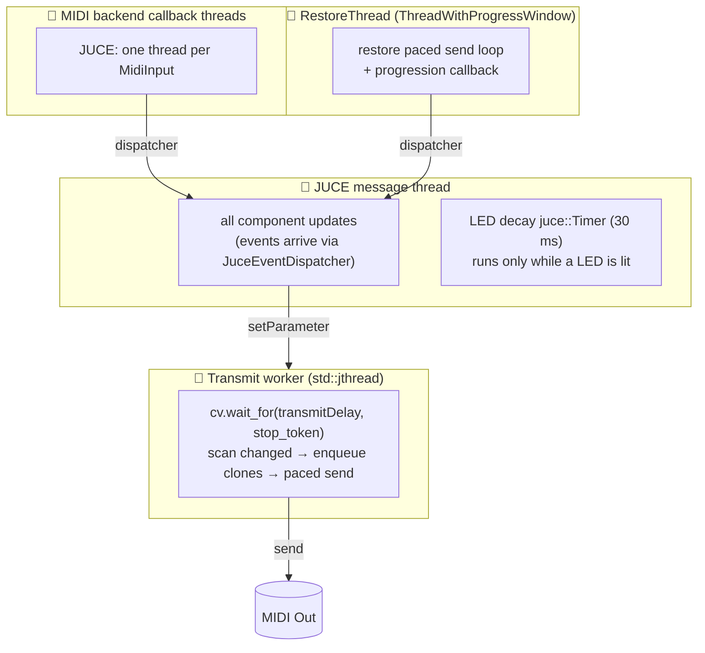
```mermaid
flowchart TB
    subgraph UIThread ["🧵 JUCE message thread"]
        Handlers["all component updates\n(events arrive via JuceEventDispatcher)"]
        LedTimer["LED decay juce::Timer (30 ms)\nruns only while a LED is lit"]
    end

    subgraph WorkerThread ["🧵 Transmit worker (std::jthread)"]
        Loop["cv.wait_for(transmitDelay, stop_token)\nscan changed → enqueue clones → paced send"]
    end

    subgraph MidiCallbackThread ["🧵 MIDI backend callback threads"]
        JuceCb["JUCE: one thread per MidiInput"]
    end

    subgraph RestoreThread ["🧵 RestoreThread (ThreadWithProgressWindow)"]
        Dump["restore paced send loop\n+ progression callback"]
    end

    JuceCb -->|dispatcher| Handlers
    Loop -->|send| OUT[(MIDI Out)]
    Dump -->|dispatcher| Handlers
    Handlers -->|setParameter| WorkerThread
```

The reference's two threading defects remain absent (no `DoEvents` pumping, no busy-sleep)
and its permanent 30 ms UI timer has no equivalent — the UI is fully event-driven; the
only periodic work (LED decay) is self-stopping (ADR-JUC-008).

Known reference-faithful blocking spots: `storeSinglePatchToSynth`,
`sendProgramChangeAndGetSinglePatchFromSynth` and the VFD typewriter sleep on their
calling thread (the message thread when invoked from menus) — verbatim from the reference,
tracked as a post-migration async candidate (§10).

---

## 9. Testing architecture

Two-tier strategy (ADR-JUC-003, ADR-JUC-006 §6): everything with logic is headless-testable by
construction; only thin JUCE wrappers need eyes. Nine Catch2 executables (§2, build-targets
table), 127 `TEST_CASE`/`SCENARIO` definitions across 30 files (up from 81 at the previous
revision — growth mainly from the app-layer suites below).

| Tier | What | How verified |
|---|---|---|
| Machine (CI, headless — `xpl_tests_smoke/midi/midi_juce/framework/model/settings/controller/app`) | MIDI framing/splitting, parameter semantics, tone byte-exact round-trips, controller state machines (dump, page follow, matrix ops), settings round-trip + .NET import, control-table anchors, binding registry (anti-echo, CC disable, rebinding, local-edit fan-out), page-family resolution, friendly-name/label tables, window-size arithmetic (ADR-JUC-025), combo-box sizing, modulation-highlight resolution, segment-font decoding | Catch2, requirement-tagged (`[RQ-…]`), Linux + Windows + macOS CI |
| Machine (app-enabled CI only — `xpl_tests_app_juce`) | Real-metrics combo-box fit (ADR-JUC-022), VFD segment renderer, background renderer (including the token-ordering guard `strokeBorder < strokeDiagram < strokeLine`), bound radio group, LED-panel geometry envelope, dialog patch-name validation, SBOM reader field mapping/failure modes | Needs real JUCE font/graphics metrics; Windows + macOS CI only, absent from the Linux headless job |
| Machine (opportunistic) | JUCE backend against a virtual MIDI cable | auto-skipped when no cable exists |
| Human (owner, Windows/macOS) | pixel fidelity, colours, drag feel, real-synth timing | milestone builds from the CI artifacts |

Development-time smoke: the app is launched under Xvfb after GUI changes (render + clean
exit + screenshot inspection).

---

## 10. Remaining gaps & improvement backlog

Consolidated status of the original analysis' proposals plus items discovered during the
port.

| # | Item | Status |
|---|---|---|
| 1 | `Application.DoEvents()` / UI pumping | ✅ Gone — progression callbacks + worker threads everywhere |
| 2 | Worker `Thread.Sleep` polling | ✅ Interruptible cv-wait (ADR-JUC-005) |
| 3 | Static settings service | ✅ Injected interface |
| 4 | `AbstractTone` → `XpanderTone` downcast | ⚠️ Kept (single accessor, port fidelity); post-migration redesign candidate |
| 5 | `FileOperationsManager` → god-form coupling | ✅ Dissolved into focused components (load-by-type on `MainComponent`, dialogs in `Dialogs.cpp`) |
| 6 | Non-generic `OrderedDictionary` | ✅ Typed `OrderedParameterMap` |
| 7 | Unit tests | ✅ 127 test cases across 9 executables, requirement-tagged, three-platform CI |
| 8 | Multi-patch support | Out of scope (as reference); backlog |
| 9 | `BugReportFactory` payload | ❌ Not ported — the top-level exception dialog exists (RQ-GUI-035) but without the full diagnostic payload (RQ-FMW-071); app-phase follow-up |
| 10 | Blocking sleeps inside some controller ops (store, program-change+dump, typewriter) | ⚠️ Verbatim from reference; called from the message thread via menus. Async refactor candidate (needs an ADR) |
| 11 | Tone morphing UX | Deferred — reference form is unfinished (empty OK/Cancel, unwired); controller primitive ported & tested; awaits owner UX spec |
| 12 | VFD `.` active-modulation-destination marker | ✅ Done — TASK-JUC-076 / ADR-JUC-010: the shared `ModulationHighlight` resolver drives both the matrix hover highlight and this marker |
| 13 | Character scaling of the VFD | ✅ Done — ADR-JUC-023/ADR-JUC-026: vector 16-segment glyphs, snapped to whole device pixels at every canvas scale |
| 14 | Hardware validation | TASK-JUC-071 checklist (real Xpander/Matrix-12) still to run |
| 15 | Cross-compat campaign | TASK-JUC-072 (patch libraries + settings exchanged .NET ⇄ JUCE) still to run |
| 16 | CC automation table not loaded into the controller | ✅ Done — TASK-JUC-078 / ADR-JUC-012: `applyMidiSettings` persists but never parses `automationTable` into the controller dictionary, so incoming CCs drive nothing and the VFD CC line is blank; fixed together with the mapping editor (RQ-GUI-036) |
| 17 | Duplicated runtime LED-colour state | ✅ Done — TASK-JUC-077 / ADR-JUC-011: the matrix highlight cached its own colour copy; moving to a single LookAndFeel-owned source fixes the stale-colour-on-change bug |
| 18 | Bitmap background & VFD sprite sheet | ✅ Done — ADR-JUC-013 (background) / ADR-JUC-023 (VFD): both are now vector-rendered; the two source bitmaps are dropped from `BinaryData` (the VFD sheet is kept in-repo only as a fitting reference) |
| 19 | Scattered visual literals, no re-theming path | ✅ Done — ADR-JUC-014/015: three-tier design tokens generated from `design-tokens.yaml`. **Not yet complete**: spacing/layout geometry and procedural texture parameters remain untokenised, pending an owner-approved spacing scale |
| 20 | `design-tokens.yaml --check` staleness gate | ⚠️ Available as a manual step; not wired into CMake/CI yet (ADR-JUC-015) — a hand-edited or stale generated header would not currently fail a build |
| 21 | Project licence stated as GPLv3 while linking JUCE 8 (AGPL-only open-source option) | ✅ Done — ADR-ABT-002: relicensed to AGPLv3 project-wide (LICENSE, 39 source headers, CMake SPDX id, About dialog, SBOM) |
| 22 | No dependency/licence disclosure for bundled third-party components (JUCE, Roboto Condensed, Catch2) | ✅ Done — ADR-ABT-001: About ▸ Dependencies window reads a shipped SPDX SBOM at run time. **Interim**: the SBOM is hand-maintained (`juce/app/sbom/xplorer.sbom.spdx.json`) pending a CI step that substitutes GitHub's generated export verbatim |
| 23 | No standard GitHub community-health files / structured issue intake | ✅ Done — ADR-GOV-001: `CODE_OF_CONDUCT.md`, `CONTRIBUTING.md`, Issue Forms (bug/feature), PR template with a mandatory AGNOS-traceability field |
| 24 | Keyboard-focus visual indicator | Implemented, then removed after two rounds of adjustment were each judged visually wrong (ADR-JUC-029). Residual gap accepted: a keyboard-only user tabbing without acting gets no positional feedback; revisiting requires reopening RQ-GUI-054 |
| 25 | Startup splash screen | Implemented, then removed: a bitmap-era feature that could not be made to match a façade that is now resizable, vector and user-themeable at any delay (ADR-JUC-030) |
| 26 | ADR status field lags shipped code | ⚠️ Process debt, not a code defect — ADR-JUC-024 (VFD bezel), ADR-JUC-026 (device-pixel glyph grid), ADR-JUC-027 (diagram stroke/paint order) and ADR-JUC-028 (matrix block identity) are all implemented and referenced as such by later, `Accepted` ADRs, but their own `Status` field still reads `Proposed`. Recommend a housekeeping pass to flip these to `Accepted` with an implementation note, matching the convention every other shipped ADR already follows |

---

## 11. Architecture summary

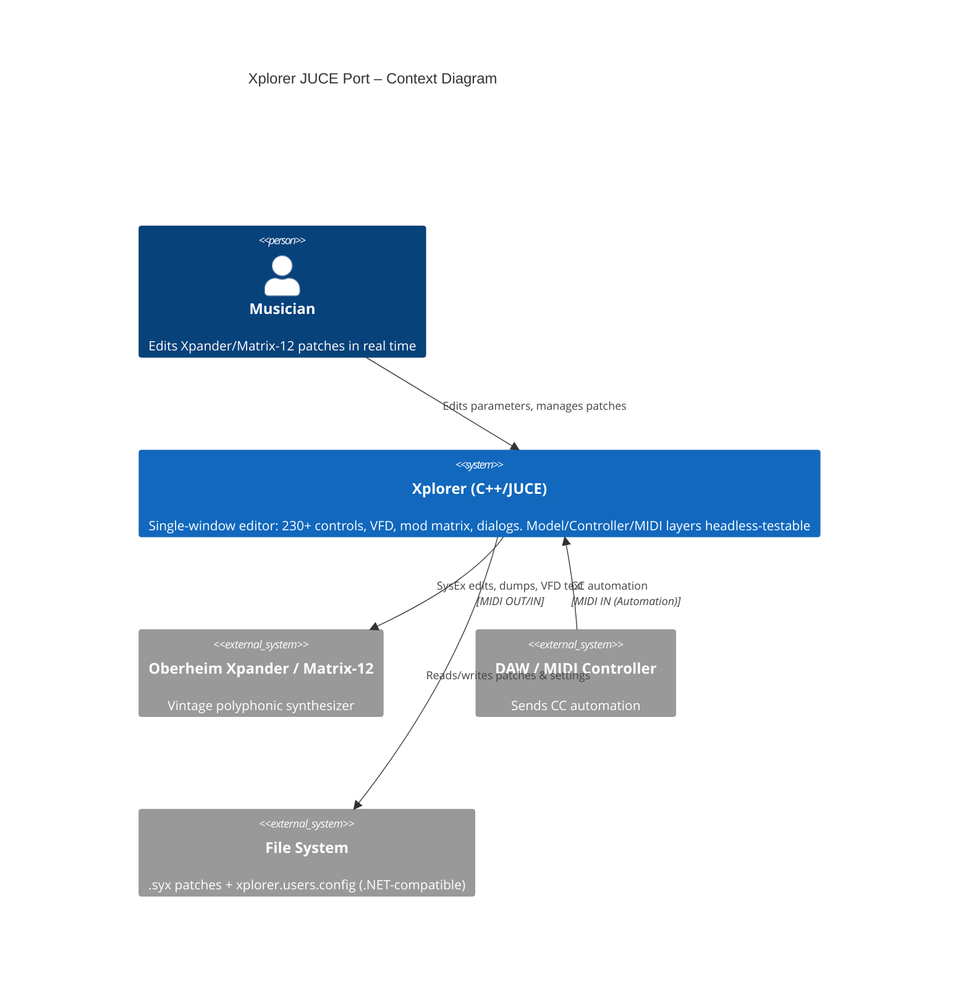
```mermaid
C4Context
    title Xplorer JUCE Port – Context Diagram

    Person(user, "Musician", "Edits Xpander/Matrix-12 patches in real time")
    System(xplorer, "Xplorer (C++/JUCE)", "Single-window editor: 230+ controls, VFD, mod matrix, dialogs. Model/Controller/MIDI layers headless-testable")
    System_Ext(synth, "Oberheim Xpander / Matrix-12", "Vintage polyphonic synthesizer")
    System_Ext(daw, "DAW / MIDI Controller", "Sends CC automation")
    System_Ext(fs, "File System", ".syx patches + xplorer.users.config (.NET-compatible)")

    Rel(user, xplorer, "Edits parameters, manages patches")
    Rel(xplorer, synth, "SysEx edits, dumps, VFD text", "MIDI OUT/IN")
    Rel(daw, xplorer, "CC automation", "MIDI IN (Automation)")
    Rel(xplorer, fs, "Reads/writes patches & settings")
```

### Strengths
- **Wire and file compatibility**: byte-exact SysEx and 399-byte patch round-trips
  verified against real hardware dumps; settings interchange with .NET
- **Testability by construction**: every seam is an injected interface; UI logic is a
  headless library; 127 requirement-tagged Catch2 cases across 9 executables, on three
  platforms
- **Mechanical UI fidelity**: layout, captions, enum labels and parameter names are
  regenerated from the WinForms sources by one script — no hand-copied facts to drift
- **Fully vector façade with one generated design-token source**: background and VFD alike
  render crisply at any window scale or OS DPI; a colour/size/motion change is a one-line
  YAML edit, not a hunt through scattered literals (ADR-JUC-013/014/015/023)
- Fully event-driven UI (no polling timers), modern cooperative threading, reference
  timing preserved
- **38 ADRs** across four series record every structural decision and deviation, including
  ones later reversed (splash, focus ring) with the reasoning kept rather than deleted;
  deviations enumerated per RQ-NFR-009
- Licence correctness verified against the actual vendored JUCE 8 terms rather than assumed
  (AGPLv3, ADR-ABT-002), with a run-time dependency-disclosure window backing it (ADR-ABT-001)

### Weaknesses
- Hardware-only behaviors (dump timing against a real synth, LED colours under traffic)
  still await owner validation
- A few reference-faithful blocking sleeps reachable from the message thread (§10-10)
- The `AbstractTone` downcast and the morphing/bug-report gaps carry over (§10)
- Single developer-validated visual pass so far — pixel-level UI review is milestone-gated
- Design-token coverage is appearance-only; spacing/layout geometry and procedural texture
  parameters are still file-local constants, and the token staleness check is not wired
  into CI (§10-19/20)
- A handful of ADRs (JUC-024/026/027/028) are implemented but still formally `Proposed` —
  a documentation-hygiene gap, not a code one (§10-26)

---

## 12. Notable differences vs the C# implementation

Deliberate deviations, each bounded and documented (RQ-NFR-009 requires observable
behavior preserved; ADR references given).

| # | Area | C# reference | JUCE port | Impact |
|---|---|---|---|---|
| 1 | MIDI coupling | Controller holds Sanford `InputDevice`/`OutputDevice` directly | `MidiBackend` interface + JUCE/mock adapters (ADR-JUC-004) | None on the wire; enables hardware-free tests |
| 2 | Worker loop | `Thread.Sleep` polling; `Join(2000)` then abandon | `std::jthread` + interruptible cv-wait; cooperative join (ADR-JUC-005) | Same pacing; clean shutdown |
| 3 | Settings access | Static class, read at call sites | Injected `ISettingsService` | None functionally; testable |
| 4 | Display-control command (0x05/0x06) | Frozen in `static readonly` at first use — synth-type change needs restart | Read from settings per call | Port applies a synth-type change immediately |
| 5 | Events | .NET events + `SynchronizationContext.Post` | `std::function` handlers + injected `EventDispatcher` | Same delivery guarantees, explicit dispatcher |
| 6 | Automation SysEx/Common/Realtime forwarding | Posted through `SynchronizationContext` then sent | Sent directly from the callback thread | Per-device ordering preserved; one less UI round-trip |
| 7 | Parameter map container | Non-generic `OrderedDictionary` | Typed `OrderedParameterMap` | Type safety; same iteration order |
| 8 | `StringIntDualDictionary` miss | Returns `int.MinValue` | `std::optional<int>` | Internal API only |
| 9 | Construction | Virtual dispatch from base constructors | Two-phase init (tone injected; `initializeValue()` last) | None observable |
| 10 | Randomizer determinism | Clock-seeded only | Optional explicit seed (tests) | None in production paths |
| 11 | Morph failure handling | Exceptions swallowed → tone nulled (latent NRE) | Exceptions propagate; state restored and rethrown | **Safer than reference** |
| 12 | `CanClipboardPasteTo` | `Substring(0,4)` without length check | Length-checked, returns false | Defensive only |
| 13 | `FileUtils` sanitization | Platform-dependent invalid-char set | Fixed set = Windows-invalid ∪ `":.)&"` | Same output on Windows; deterministic |
| 14 | Logger | `TraceSwitch`-driven, object caller | Level-filtered file sink + explicit `shutdown()` (Windows file-lock test fix) | Same intent |
| 15 | `SendPageUpdate(pageName)` | `Enum.Parse` with CASSETTE fallback | String check, same side effect | Equivalent for all real page names |
| 16 | BugReportFactory | Full exception+MIDI context report | Top-level exception dialog only (§10-9) | Gap tracked (RQ-FMW-071) |
| 17 | Window sizing | Fixed size, WinForms DPI autoscale at launch (the design-time `1260×813` the .NET resx declares is *not* what the user saw — the OS multiplied it by the display's scale factor, measured at ≈1473 px) | Freely resizable; opens at a fixed logical `1440×922` ("1x"), plus 5 View-menu scale presets and Full Screen (logical canvas + one `AffineTransform`, ADR-JUC-006, ADR-JUC-025) | Owner decision; layout identical at any size; the port has no display-dependent default to reproduce, because the reference never had a single one either |
| 18 | UI layout source | Hand-maintained `MainForm.Designer.cs` | Generated declarative tables from the same sources (§4.3) | Regenerable, drift-proof |
| 19 | VFD rendering mechanics | Offscreen buffer + changed-cell diffing + `DrawImageUnscaled` (12×16 sprite blit) | Vector 16-segment glyph rendering, device-pixel-snapped (ADR-JUC-023, ADR-JUC-026, supersedes the port's own earlier ADR-JUC-007 sprite-blit stage) | Same visual language, all 95 printable glyphs render (the sprite sheet drew only 51); crisp at every scale instead of only at 100 % |
| 20 | VFD size & framing | 267×75 (4 lines at 100 % DPI; 5th line needs DPI autoscale), no bezel | 267×82, grown upward — 5 lines always visible; recessed bezel around the glass (ADR-JUC-024) | Owner-arbitrated (ADR-JUC-007 option b); bezel is a port addition, not present in the reference |
| 21 | LED decay | Permanent 30 ms UI timer decrementing stamps | Event-driven retriggerable hold; timer only while lit (ADR-JUC-008) | Same visible behaviour; zero idle work |
| 22 | UI update timer | One 30 ms timer drives VFD + LEDs | Fully event-driven UI | No polling |
| 23 | Radio button panels | Custom `RadioButtonPanel` widgets | Rendered as combos in the functional phase | Skin-phase revisit if owner wants radios back |
| 24 | Settings UI | Separate modal Forms | One `TabbedComponent` dialog, 3 pages; LED colour applies live; per-block colour overrides (§4.10) | Same fields; restart not required |
| 25 | Keyboard-focus indicator | None specified by the reference (WinForms default focus rectangle only) | Implemented (accent ring), then removed after owner review found it visually incompatible with the block-identity framing (ADR-JUC-029) | Net: port ends up closer to the reference's absence of a bespoke focus treatment |
| 26 | Project licence & dependency disclosure | .NET solution: no explicit third-party disclosure UI | AGPLv3 (relicensed from GPLv3 once JUCE 8's AGPL-only open-source option was found, ADR-ABT-002); About ▸ Dependencies window reads a shipped SPDX SBOM at run time (ADR-ABT-001) | Port-only addition; JUCE itself forced the licence correction |

---

## 13. Edge cases, reference quirks and verbatim conversions

Items found in the C# source that look like latent bugs or were hard to interpret. Policy
applied: **when in doubt, port verbatim** and mark with a comment; each is listed here for
owner review.

| # | Location (reference) | Observation | Port decision |
|---|---|---|---|
| 1 | `XpanderController.SendProgrammerModeSinglePatch` | Frame `{F0, F0, 10, 02, 0D, 01, 00, F7}` — duplicated leading 0xF0 | Verbatim, commented. Worth testing on hardware. |
| 2 | `XpanderController.SendTuneRequestToSynth` | Tune Request sent as `{F0, F6, F7}` — System Common wrapped in SysEx, non-standard | Verbatim, commented. |
| 3 | `SendAllNotesOffToSynthOutput` | CC 123 on settings `MidiChannel` (default 1) while everything else uses `Tone.MIDIChannel` (default 0) | Verbatim, commented. Channel mismatch to confirm. |
| 4 | `PageSubPageHelper.IsLfoRetrig` | `parameterSubPage <= LFO_5` compares a sub-page to a page constant — almost always true | Verbatim, commented. |
| 5 | `AbstractTone.GetNextRandomValueForParameter` | `randomizer.Next(0, 1)` always 0 → humanize `addValue` always false; inverted ranges for negatives | Behavior preserved; inverted ranges swapped (unreachable) to avoid UB. |
| 6 | Same, current value 0 | Humanize range collapses to {0} | Verbatim. |
| 7 | `SysexIterator` | Unterminated trailing frame dropped; scan resumes on the closing 0xF7 | Verbatim (tested). |
| 8 | `XPanderSinglePatch` unused matrix entries | 0x1F/0x3F wire markers vs NONE in memory | Verbatim (byte-identical round-trip test). |
| 9 | `DetermineSysexFileType` | One non-single-patch frame → `AllDataDump`, not `Unknown` | Verbatim. |
| 10 | Automation CC handler override | Reference duplicates base scaling code | C++ delegates to base + adds ProgramChange branch — byte-identical, tested. |
| 11 | `ToneName` setter | Rename triggers full transmission + program change + dump request | Verbatim (heavy side effect expected by the UI). |
| 12 | Parameter count | README says 226; code registers 227 | Kept 227 (source of truth = code). |
| 13 | `ChangeModulationSourceAmount` | Sign mixing between entry sign and unsigned value | Verbatim; covered by model tests. |
| 14 | Load/Randomize/Morph epilogues | `Changed` flags cleared **after** full-tone send; order matters | Verbatim (same sequence). |
| 15 | `MockMidiBackend` delivery | (Port-specific) synchronous on the injecting thread | Documented design choice. |
| 16 | `ToneMorphingForm` | Flagged work-in-progress: empty OK/Cancel, unwired, cancel-restore `#warning` | **Deferred, not ported**; controller primitive fully ported & tested (§10-11). |
| 17 | All-data-dump restore | Blocking send loop on the UI thread pumped by `DoEvents` | `ThreadWithProgressWindow` worker; **improves on reference** (RQ-GUI-026). |
| 18 | TRACK page-family tags | Designer tags `TRACK_X_PT_n` while the parameter map registers `TRACK_n_POINT_m` — the reference resolves through its own map at runtime | Extraction normalized to the parameter names, **with explicit owner approval** (page-family review). |
| 19 | VFD line count | `VfdDisplayHelper` writes 5 lines but the 267×75 control fits 4 at 100 % DPI — the CC line only appears under Windows DPI autoscale | Surfaced to owner; display grown to 82 px (ADR-JUC-007 option b). |

---

## 14. Licensing, dependency disclosure & governance

Three related decisions, none present in the .NET reference, that the port added around the
same finding: reading JUCE 8's own vendored `LICENSE.md` while writing the dependency SBOM
(below) surfaced that JUCE 8 is dual-licensed **AGPLv3 / commercial**, not GPLv3 as this
project's requirements and headers had stated since early in the port (carried forward
unverified from when JUCE 6/7 was the working assumption).

### 14.1 Relicense: GPLv3 → AGPLv3

GPLv3 §13 permits combining a GPLv3 work with an AGPLv3 one, but the combination is then
bound by the AGPL's own §13 (network-source-disclosure) as a whole — so a project cannot
correctly call itself "GPLv3" while linking JUCE under its AGPL option. JUCE's own terms go
further still: an application built on the AGPLv3 tier must itself be AGPLv3. The project
was already fully open-source copyleft with no commercial offering or server component to
protect, so relicensing cost nothing real and was chosen over the alternative (purchase a
commercial JUCE licence, or downgrade to JUCE 7) (ADR-ABT-002). Scope of the mechanical
change: the root `LICENSE` file (canonical AGPLv3 text), 39 source-file headers, the CMake
`SPDX-License-Identifier`, the About dialog's licence notice, and the SBOM's own entry for
the Xplorer package itself. Historical requirement/ADR text that recorded the earlier GPLv3
state is corrected with an amendment note, not silently rewritten, following this
repository's established convention for reversed decisions (§10-24/25 use the same pattern).
In practice, AGPLv3's one added obligation is expected to stay dormant: Xplorer is a desktop
application with no server or hosted component.

### 14.2 Dependency disclosure: About ▸ Dependencies (SBOM-driven)

The About dialog previously named only the project's own licence. It now carries a
**Dependencies** button opening a window that lists every bundled third-party component
(currently: JUCE 8.0.9, the embedded Roboto Condensed typeface, and — test-build only —
Catch2) with name, version, licence and URL (ADR-ABT-001). The list is **never compiled into
the binary**: it is read at run time from an SPDX 2.3 JSON file
(`xplorer.sbom.spdx.json`) shipped as a sibling of the executable — the same
copied-next-to-the-binary convention already used for the default patch `oberheim.syx`
(§4.9, ADR-JUC-032). SPDX was chosen because it is what GitHub's dependency-graph export
emits natively, so a future CI step can drop that output in place with zero application
change. The reader (`SbomReader`, headless-testable, pure data in/out) resolves SPDX's
"unknown" sentinels (`NOASSERTION`/`NONE`) to a neutral placeholder rather than displaying
them literally, filters out the SBOM's own self-describing root package, and renders a
discriminated failure result — never a silent empty list — if the file is missing or
malformed. **Interim state**: the shipped SBOM is currently hand-maintained
(`juce/app/sbom/xplorer.sbom.spdx.json`); replacing it with GitHub's generated export is the
intended, application-transparent migration path (§10-22).

### 14.3 Repository governance: community-health files

The repository gained the standard GitHub community-health surface, previously absent
entirely (ADR-GOV-001):

- `CODE_OF_CONDUCT.md` — Contributor Covenant v2.1, verbatim; enforcement contact is the
  maintainer's GitHub handle, not an invented email address.
- `CONTRIBUTING.md` — links to the AGNOS process instructions
  (`.github/instructions/agnos-sw-eng.v2.instructions.md`, `CLAUDE.md`) as the single source
  of truth rather than restating them, mirroring the pattern already used for the
  git-workflow skill.
- `.github/ISSUE_TEMPLATE/bug_report.yml` and `feature_request.yml` — GitHub Issue Forms
  (structured YAML, required fields), not free-text Markdown; `blank_issues_enabled: false`
  makes the structured intake non-negotiable rather than one option among several.
- `.github/PULL_REQUEST_TEMPLATE.md` — a mandatory AGNOS-traceability field
  (requirement/ADR/task IDs, or "N/A") and a checkbox confirming an AI coding agent, if used,
  followed the AGNOS process.

The driving force, distinct from a generic "add community files" request: this project
explicitly uses AI coding agents in its own SDLC, so issue intake must be structured enough
for an agent to read a raw submission and reformulate it correctly with no invented
information, and any AI-assisted contribution must carry the same AGNOS traceability the
project's own commits already do.
