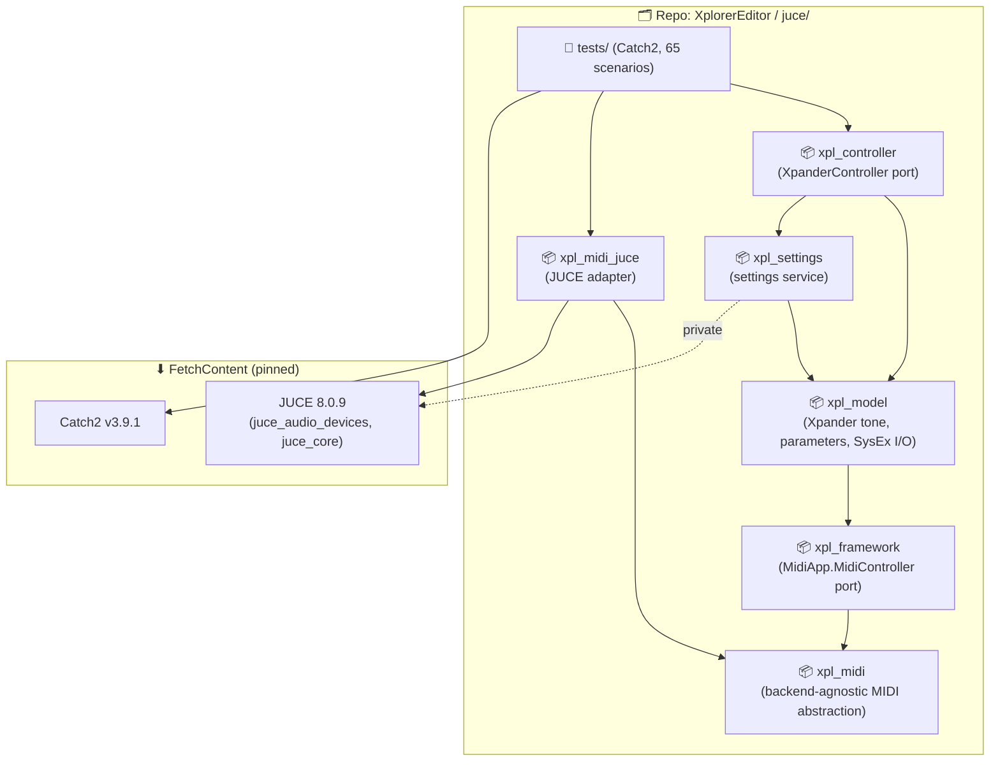
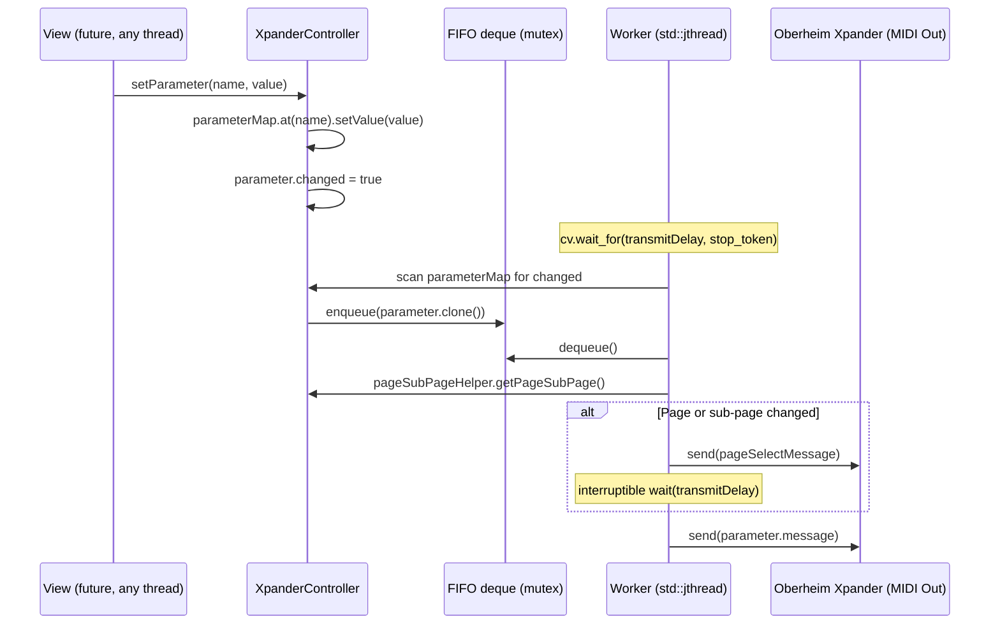
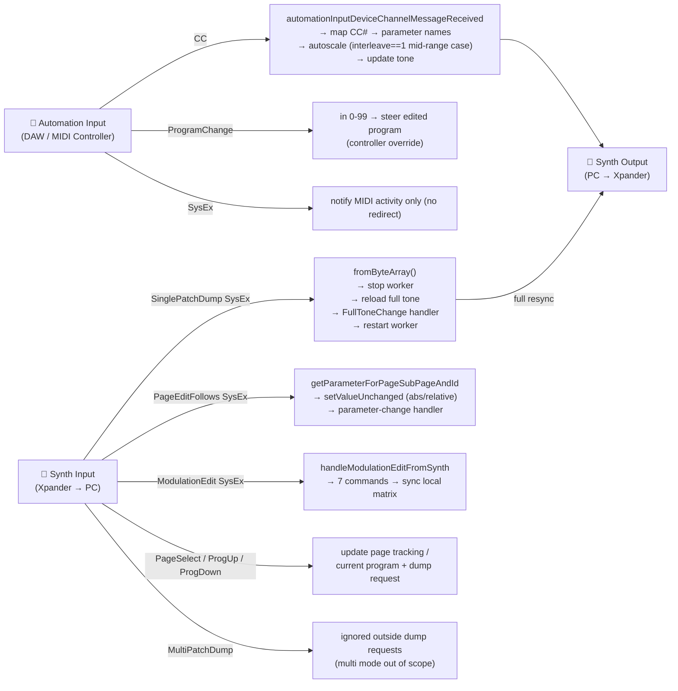
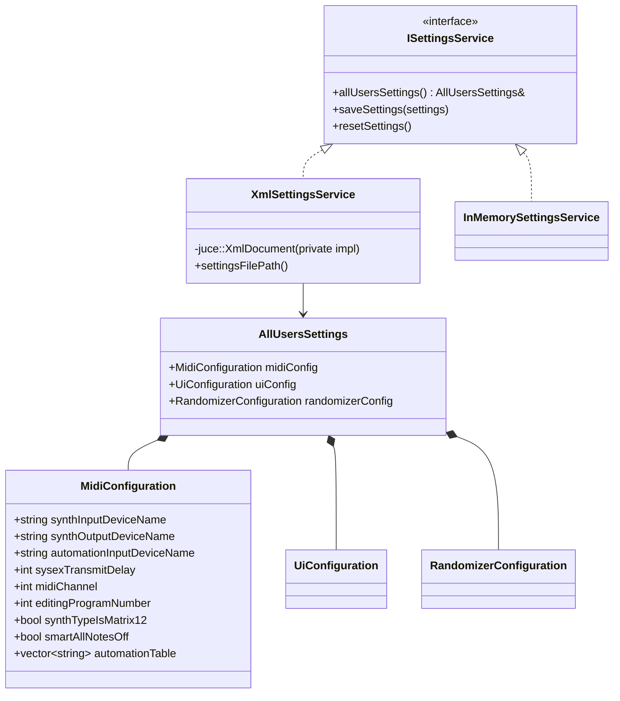
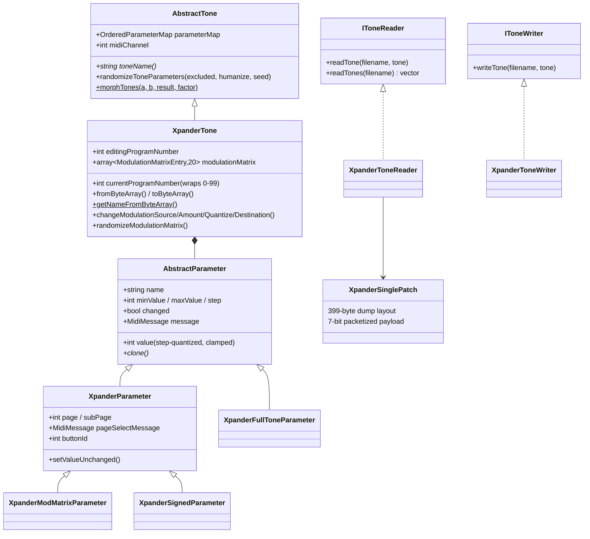
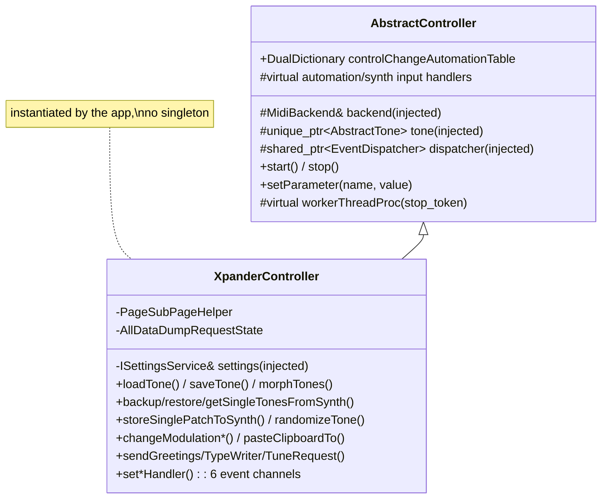
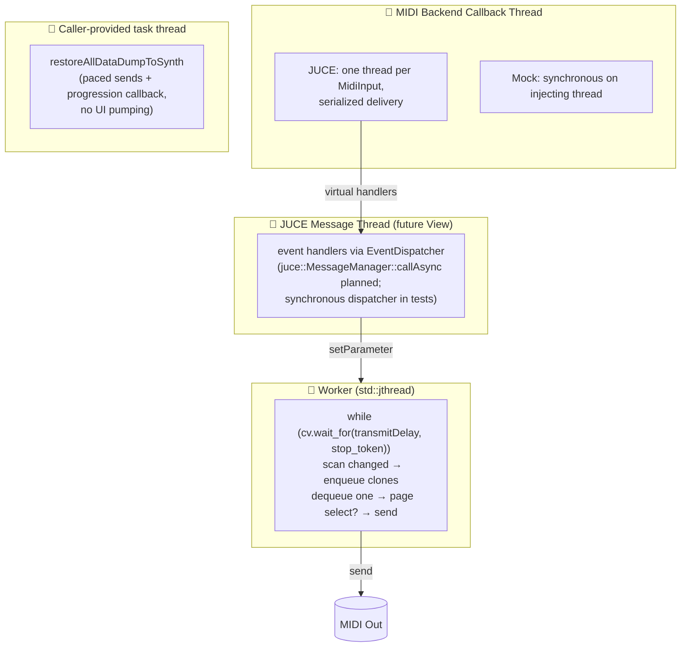
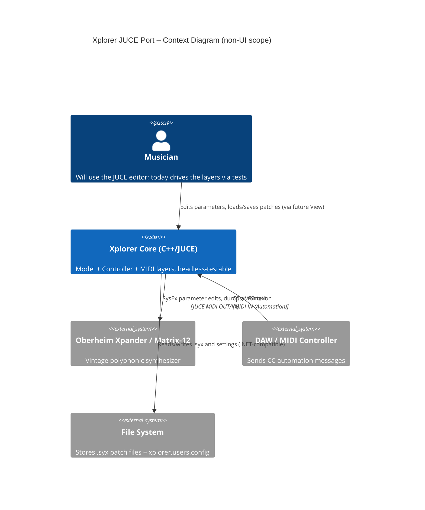

# Xplorer (JUCE Port) – Software Architecture Analysis

> **Author**: Claude (JUCE migration, branch `claude/xplorer-editor-juce-wl25q7`)
> **Date**: 2026
> **Target**: C++20 · JUCE 8.0.9 · CMake · 1 Git repository · 6 library targets + tests
> **Purpose**: Oberheim Xpander / Matrix-12 real-time MIDI patch editor
> **Scope**: non-UI layers only — the View layer (Phase 5) does not exist yet.
> Structure mirrors [`architecture-analysis.md`](architecture-analysis.md) for side-by-side comparison.

---

## 1. Repository & Project Map

The port lives in **one repository** (this one, under `juce/`), replacing the 3-repo split. The MidiApp and Sanford submodules remain as read-only behavioral references; JUCE and Catch2 are pinned external dependencies fetched at configure time.



---

## 2. Layered Architecture

Same 3-layer MVC-inspired separation; the View layer is **not yet implemented** (Phase 5). A new seam exists that the reference did not have: the **MIDI backend interface** (ADR-004), with a JUCE implementation and an in-memory mock.

```mermaid
flowchart TB
    subgraph VIEW ["🖥 View Layer — NOT YET IMPLEMENTED (Phase 5)"]
        Future["JUCE app: main window, custom widgets,\ndialogs, control⇄parameter binding"]
    end

    subgraph CTRL ["⚙️ Controller Layer  [xpl_controller + xpl_framework]"]
        XpanderController["XpanderController\n─ XpanderController.cpp (core)\n─ XpanderControllerMidiEvents.cpp\n─ PageSubPageHelper\n─ AllDataDumpRequestState"]
        AbstractController["AbstractController (abstract)\n─ AbstractController.cpp (core)\n─ AbstractControllerDevices.cpp\n─ AbstractControllerWorker.cpp"]
        SettingsSvc["ISettingsService (interface)\n├ XmlSettingsService (.NET-schema XML)\n└ InMemorySettingsService (tests)"]
        Dispatcher["EventDispatcher (interface)\n(UI-thread marshalling seam)"]
    end

    subgraph MODEL ["📐 Model Layer  [xplorer::model + midiapp::model]"]
        XpanderTone["XpanderTone\n─ XpanderTone.cpp (227-parameter map)\n─ XpanderToneModulationMatrix.cpp"]
        AbstractTone["AbstractTone (abstract)\n+ OrderedParameterMap (typed)"]
        Params["Parameters\nXpanderParameter\nXpanderSignedParameter\nXpanderModMatrixParameter\nXpanderFullToneParameter\nAbstractParameter"]
        IO["Tone I/O\nIToneReader → XpanderToneReader\nIToneWriter → XpanderToneWriter\nPacketizedBinary (7-bit split)\nXpanderSinglePatch (399-byte layout)"]
    end

    subgraph MIDI ["🎹 MIDI Infrastructure  [xpl_midi / xpl_midi_juce]"]
        Backend["MidiBackend (interface)\nMidiInputPort / MidiOutputPort"]
        JuceBackend["JuceMidiBackend\n(juce::MidiInput/MidiOutput)"]
        MockBackend["MockMidiBackend\n(scriptable, loopback, captured output)"]
    end

    XpanderController -->|inherits| AbstractController
    XpanderController -->|injected| SettingsSvc
    AbstractController -->|owns| XpanderTone
    AbstractController -->|injected| Dispatcher
    XpanderTone -->|inherits| AbstractTone
    XpanderTone -->|contains| Params
    XpanderController -->|uses| IO
    AbstractController -->|injected| Backend
    Backend <|.. JuceBackend
    Backend <|.. MockBackend
```

---

## 3. Key Subsystems

### 3.1 Parameter Queue & Worker Thread

Same observable pacing as the reference (scan → enqueue clones → send at most one per tick, page-select first when the page changes), implemented with modern interruptible primitives instead of `Thread.Sleep` polling (ADR-005).



### 3.2 MIDI Event Flow (Bidirectional)

Same 3 simultaneous devices; handlers are virtual methods receiving a backend-agnostic `MidiMessage` value type.



### 3.3 Settings Architecture

The static service becomes an **injected interface**; the XML file format stays schema-compatible with the .NET `XmlSerializer` output so existing `xplorer.users.config` files import unchanged.



### 3.4 Tone Model & I/O



---

## 4. Class Inheritance Overview

The View classes do not exist yet; the controller-side hierarchy mirrors the reference, with dependency injection replacing hidden construction.



---

## 5. SOLID Analysis

| Principle | Assessment | Detail |
|---|---|---|
| **S** – Single Responsibility | ✅ Respected | One class per concern; large classes split across `.cpp` files by topic (core / devices / worker / MIDI events), mirroring the reference partial-class decomposition. |
| **O** – Open/Closed | ✅ Good | `AbstractController` / `AbstractTone` extension points preserved (virtual handlers, worker override); `IToneReader/Writer` unchanged; `MidiBackend` allows new MIDI implementations without touching upper layers. |
| **L** – Liskov Substitution | ✅ Respected | `XpanderController` fully substitutes `AbstractController`; `MockMidiBackend` and `JuceMidiBackend` are interchangeable in every test. |
| **I** – Interface Segregation | ✅ Good | `MidiBackend`/`MidiInputPort`/`MidiOutputPort`, `IToneReader`, `IToneWriter`, `ISettingsService`, `EventDispatcher` are small and focused. |
| **D** – Dependency Inversion | ✅ **Fixed vs reference** | The three partial violations noted in the original analysis are resolved: MIDI devices behind `MidiBackend` (was: direct Sanford types), settings behind `ISettingsService` (was: static class), UI marshalling behind `EventDispatcher` (was: `SynchronizationContext`). Residual: `XpanderController` still downcasts `AbstractTone` → `XpanderTone` internally (kept for port fidelity; contained in one accessor). |

---

## 6. Key Design Patterns Used

| Pattern | Where |
|---|---|
| **Template Method** | `AbstractController` (worker proc, input handlers), `AbstractTone`, `AbstractParameter::updateMessageFromValue` |
| **Ports & Adapters (Hexagonal)** | `MidiBackend` interface + `JuceMidiBackend` / `MockMidiBackend` (new vs reference) |
| **Observer / Callbacks** | 6 controller event channels as `std::function` handlers, marshalled via `EventDispatcher` |
| **Command Queue** | `std::deque<unique_ptr<AbstractParameter>>` + worker — decouples UI from MIDI timing |
| **Strategy** | `IToneReader` / `IToneWriter`; `ISettingsService` implementations |
| **Dependency Injection** | Backend, tone, dispatcher, settings service all constructor-injected (no singletons, no statics) |
| **Clone (Prototype)** | `AbstractParameter::clone()` before enqueuing, as the reference |
| **Pimpl** | `XmlSettingsService`, `JuceMidiBackend` (keeps JUCE types out of public headers) |

---

## 7. Threading Model



> ✅ The reference's two known threading defects are gone: no `Application.DoEvents()` (long operations run on a task thread with progression callbacks) and no busy-sleep (interruptible `condition_variable` wait honoring the stop token; cooperative shutdown, no thread abort).

---

## 8. Improvement Proposals

Status of the original analysis' proposals in the port, plus remaining items.

### 8.1 🔴 High Priority (from reference analysis)

| # | Reference issue | Status in JUCE port |
|---|---|---|
| 1 | `Application.DoEvents()` in ProgressForm | ✅ Resolved by design: blocking operations expose progression callbacks; the future View runs them on a task thread (ADR-005). |
| 2 | Worker `Thread.Sleep` polling | ✅ Replaced by interruptible cv-wait with `std::stop_token`; observable pacing preserved. |
| 3 | Static `AllUsersSettingsService` | ✅ `ISettingsService` interface, constructor-injected, in-memory test double. |

### 8.2 🟡 Medium Priority (from reference analysis)

| # | Reference issue | Status in JUCE port |
|---|---|---|
| 4 | `XpanderTone` cast from `AbstractTone` | ⚠️ Kept (single private accessor) for port fidelity; generics-style redesign deferred post-migration. |
| 5 | `FileOperationsManager` → concrete `MainForm` | ⏳ View layer not yet ported (Phase 5 concern). |
| 6 | Non-generic `OrderedDictionary` | ✅ Typed `OrderedParameterMap` (insertion-ordered, unique names). |
| 7 | No DI container | ✅ Manual constructor injection everywhere; a container is unnecessary at this scale. |

### 8.3 🟢 Remaining / New items

| # | Issue | Recommendation |
|---|---|---|
| 8 | Unit tests | ✅ 65 Catch2 scenarios tagged with requirement IDs; CI on Linux. Remaining: hardware validation checklist (RQ-TST-006). |
| 9 | Multi patch support | Still out of scope (multi dumps ignored, as reference); tracked backlog item. |
| 10 | `BugReportFactory` equivalent | Deferred to the app phase (needs app/version/device context) — RQ-FMW-071. |
| 11 | Blocking `sleep` in some controller operations (`storeSinglePatchToSynth`, `sendProgramChangeAndGetSinglePatchFromSynth`, VFD typewriter) | Verbatim from reference (it sleeps on the UI thread). The future View should call these off the message thread; candidate for async refactor post-migration (would need an ADR). |
| 12 | View layer | Phase 5: JUCE components, control⇄parameter binding registry, dialogs. |

---

## 9. Architecture Summary



### Strengths
- **Wire and file compatibility**: byte-exact SysEx generation and 399-byte patch round-trips verified against a real hardware dump; settings files interchange with the .NET version
- **Testability by construction**: every external dependency (MIDI, settings, UI thread) is an injected interface; 65 headless scenarios cover the full non-UI behavior including the bidirectional handlers and the dump state machine
- Clean bottom-up layering enforced by separate static libraries
- Modern, cooperative threading with the reference's timing behavior preserved
- Requirement-tagged tests and commits (mechanical traceability)

### Weaknesses
- **No View layer yet** — the largest effort (Phase 5) remains
- `AbstractTone` → `XpanderTone` downcast retained (port fidelity)
- Several reference-faithful blocking sleeps inside controller operations (see §8.3-11)
- Windows build/packaging not yet exercised (developed and tested headless on Linux)
- Hardware-only behaviors (dump timing against a real synth, VFD rendering) still unvalidated

---

## 10. Notable Differences vs the C# Implementation

Deliberate deviations, each bounded and documented (RQ-NFR-009 requires observable behavior preserved; ADR references given).

| # | Area | C# reference | JUCE port | Impact |
|---|---|---|---|---|
| 1 | MIDI coupling | Controller holds Sanford `InputDevice`/`OutputDevice` directly | `MidiBackend` interface + JUCE/mock adapters (ADR-004) | None on the wire; enables hardware-free tests |
| 2 | Worker loop | `Thread.Sleep` polling; `Join(2000)` then abandon | `std::jthread` + interruptible cv-wait; cooperative join (ADR-005) | Same pacing; clean shutdown, no abandoned thread |
| 3 | Settings access | Static class, read at call sites | Injected `ISettingsService` | None functionally; testable |
| 4 | Display-control command (0x05/0x06) | Frozen in `static readonly` fields at first class use — changing synth type needs an app restart | Read from settings **per call** | Behavior differs only after changing the synth type mid-session (port applies it immediately) |
| 5 | Events | .NET events + `SynchronizationContext.Post` | `std::function` handlers + injected `EventDispatcher` | Same delivery guarantees; the dispatcher is explicit |
| 6 | Automation SysEx/Common/Realtime forwarding (framework level) | Posted through `SynchronizationContext` then sent | Sent directly from the callback thread | Ordering per device preserved; removes a UI-thread round-trip |
| 7 | Parameter map container | Non-generic `OrderedDictionary` | Typed `OrderedParameterMap` | Type safety; same iteration order |
| 8 | `StringIntDualDictionary` miss | Returns `int.MinValue` | Returns `std::optional<int>` | Internal API only |
| 9 | Construction | Base constructors virtual-dispatch (`CreateToneInstance`, `UpdateMessageFromValue`) | Two-phase: tone injected into controller ctor; parameters call `initializeValue()` last (C++ cannot virtual-dispatch in ctors) | None observable |
| 10 | Randomizer determinism | Seeded from the clock only | Optional explicit seed (tests); clock by default | None in production paths |
| 11 | Morph failure handling | `AbstractTone.MorphTones` swallows exceptions and nulls the result → controller assigns `Tone = null` (latent `NullReferenceException` on next use) | Exceptions propagate; controller restores state (re-enable parameters, restart) and rethrows | **Safer than reference**; failure now surfaces instead of corrupting state |
| 12 | `CanClipboardPasteTo` | Substring(0,4) on the destination without length check (throws on names < 4 chars) | Length-checked, returns false | Defensive only; real page names are ≥ 4 chars |
| 13 | `FileUtils` sanitization | Regex over `GetInvalidFileNameChars() + ":.)&"` (platform-dependent set on .NET) | Fixed character set = Windows-invalid ∪ `":.)&"` | Same output on Windows; deterministic cross-platform |
| 14 | Logger | `TraceSwitch`-driven, object caller | Level-filtered file sink, string source | Same intent; simpler API |
| 15 | `SendPageUpdate(pageName)` | `Enum.Parse` of the page name with CASSETTE fallback | String check (`empty`/`"CASSETTE"`), same side effect | Equivalent for all real page names |
| 16 | BugReportFactory | Full exception+MIDI context report | **Not yet ported** (app phase) | Gap tracked (RQ-FMW-071) |

## 11. Edge Cases, Reference Quirks and Verbatim Conversions

Items found in the C# source that look like latent bugs or were hard to interpret. Policy applied: **when in doubt, port verbatim** and mark with a comment; each is listed here for your review.

| # | Location (reference) | Observation | Port decision |
|---|---|---|---|
| 1 | `XpanderController.SendProgrammerModeSinglePatch` | The frame is `{F0, F0, 10, 02, 0D, 01, 00, F7}` — **duplicated leading 0xF0** (`SysExType.Start` prepended to an array that already starts with 0xF0). Likely a bug; the synth may tolerate or ignore the message. | Verbatim, commented. Worth testing on hardware. |
| 2 | `XpanderController.SendTuneRequestToSynth` | Tune Request is sent as `{F0, F6, F7}` — a raw System Common byte wrapped inside a SysEx frame, which is not standard MIDI. | Verbatim, commented. |
| 3 | `SendAllNotesOffToSynthOutput` | CC 123 goes out on `MidiConfig.MidiChannel` from **settings** (default **1**), while every other message uses `Tone.MIDIChannel` (default 0). If the two diverge, all-notes-off targets another channel. | Verbatim, commented. Possible off-by-one/channel mismatch to confirm with you. |
| 4 | `PageSubPageHelper.IsLfoRetrig` | Condition is `parameterPage >= LFO_1 && parameterSubPage <= LFO_5` — the second clause compares the **sub-page** to a page constant (0x34), so it is almost always true. Probably meant `parameterPage <= LFO_5`. Affects which rotary gets the button-to-rotary offset on non-LFO pages' sub-page 1. | Verbatim, commented. |
| 5 | `AbstractTone.GetNextRandomValueForParameter` (humanize branch) | `randomizer.Next(0, 1)` always returns 0, so `addValue` is always false and only min-clamping applies in this branch (the value setter clamps the max anyway). Also, for a negative current value the humanize range is inverted (`low > high`), which .NET's `Random.Next` would reject. | Behavior preserved (`addValue = false` hard-coded with comment); inverted ranges are swapped to avoid UB — unreachable for the reference's parameter defaults. |
| 6 | Same, humanize with current value 0 | Range collapses to {0}: humanized randomization never moves a parameter whose current value is 0. | Verbatim. |
| 7 | `SysexIterator` | An unterminated trailing frame (0xF0 without 0xF7) is silently dropped; garbage between frames is skipped; after a yield the scan resumes **on** the closing 0xF7. | Verbatim (covered by tests). |
| 8 | `XPanderSinglePatch` unused matrix entries | Unused entries encode source 0x1F / destination 0x3F on the wire; the in-memory model uses NONE markers. Round-tripping normalizes through these constants. | Verbatim (round-trip test against the real hardware dump passes byte-identical). |
| 9 | `DetermineSysexFileType` | A file with exactly one frame that is **not** a single patch is classified `AllDataDump` (not `Unknown`). | Verbatim. |
| 10 | `AutomationInputDeviceChannelMessageReceived` (controller override) | The override **duplicates** the base CC-scaling code instead of calling base, then adds ProgramChange steering. | Not duplicated: the C++ override delegates the CC branch to the base class and adds the ProgramChange branch — byte-identical output, verified by tests. |
| 11 | `XpanderController.ToneName` setter | Renaming a patch triggers a full tone transmission, a program change and a patch dump request — a heavy side effect for a property setter (the UI must expect it). | Verbatim (`setToneName` override). |
| 12 | Parameter count | The README announces **226** parameters; the reference `InitializeParameterMap` actually registers **227** entries (187 patch parameters + 40 modulation-matrix parameters). The C++ map is generated from the C# source and asserts 227. | Kept 227 (source of truth = code). |
| 13 | `ChangeModulationSourceAmount` via `SETUNSIGNEDVALUE`/`DIALVALUEAMOUNTOFCHANGE` | Sign handling mixes the entry's current sign with the incoming unsigned value (`value * amountSign`); amounts clamp to ±63 in the entry but the wire encodes sign+quantize in one byte. | Verbatim; matrix consistency covered by model tests. |
| 14 | `LoadTone`/`RandomizeTone`/`MorphTones` epilogues | Each clears every `Changed` flag *after* transmitting the full tone, so the worker never re-sends individual parameters; order matters. | Verbatim (same sequence). |
| 15 | `MockMidiBackend` delivery | (Port-specific) callbacks run synchronously on the injecting thread, unlike JUCE's per-device thread; documented in the header — tests relying on ordering stay valid, tests must not assume cross-thread async. | Documented design choice. |
| 16 | `ToneMorphingForm` | Flagged *"Work in progress"* in the reference: its OK/Cancel handlers are empty `//TODO`, it is not attached to any menu, and it carries a `#warning` about not restoring the current tone on cancel. | **Deferred, not ported.** The controller primitive (`morphTones`) is fully ported and tested; only the unfinished view is omitted. To be picked up when the owner specifies the intended UX (TASK-JUCE-067 note). |
| 17 | All-data-dump **restore** | Reference `RestoreAllDataDumpFromFile` runs the blocking send loop on the UI thread and pumps it with `Application.DoEvents()` (re-entrancy hazard, RQ-GUI-026). | Runs on a `ThreadWithProgressWindow` worker; the progression callback marshals to the modal progress window. **Improves on reference**: no event pumping, UI stays responsive. |
