# Xplorer (JUCE Port) – Software Architecture Analysis

> **Author**: Claude (JUCE migration, branch `claude/xplorer-editor-juce-wl25q7`)
> **Date**: 2026-07 (updated after Phase 5 — full GUI — completion)
> **Target**: C++20 · JUCE 8.0.9 · CMake · 1 Git repository · 7 library targets + GUI app + tests
> **Purpose**: Oberheim Xpander / Matrix-12 real-time MIDI patch editor
> **Scope**: the complete port — all layers including the JUCE View. The application is now
> a near-total functional equivalent of the .NET original (remaining gaps: §10).

## Document structure

| Section | Content |
|---|---|
| [1. Executive summary](#1-executive-summary) | Where the port stands, at a glance |
| [2. Repository & build architecture](#2-repository--build-architecture) | Targets, dependencies, CI pipelines |
| [3. Layered architecture](#3-layered-architecture) | The four layers and their seams |
| [4. The JUCE application architecture](#4-the-juce-application-architecture) | **The View layer in detail** — shell, canvas, extraction pipeline, binding, panels, dialogs, threading |
| [5. Core subsystems](#5-core-subsystems) | Worker queue, bidirectional MIDI flow, settings, tone model |
| [6. SOLID analysis](#6-solid-analysis) | Principle-by-principle assessment |
| [7. Key design patterns](#7-key-design-patterns) | Patterns and where they live |
| [8. Threading model](#8-threading-model) | Every thread in the running application |
| [9. Testing architecture](#9-testing-architecture) | What is machine-tested vs owner-validated |
| [10. Remaining gaps & improvement backlog](#10-remaining-gaps--improvement-backlog) | Open items, each with a status |
| [11. Architecture summary](#11-architecture-summary) | Context diagram, strengths, weaknesses |
| [12. Notable differences vs the C# implementation](#12-notable-differences-vs-the-c-implementation) | Every deliberate deviation (comparison heritage of this document) |
| [13. Edge cases, reference quirks and verbatim conversions](#13-edge-cases-reference-quirks-and-verbatim-conversions) | Latent reference bugs and how each was handled |

Sections 12–13 preserve this document's original 1:1-comparison role; sections 4, 8 and 9
carry the new emphasis: **how the JUCE application itself is built**.

---

## 1. Executive summary

All five migration phases are implemented and the GUI application runs the full reference
feature set: the single main window with all ~230 controls over the reference artwork,
page families, the 20-row modulation matrix, the bitmap-glyph VFD, the 3-LED MIDI traffic
panel, menus and every dialog workflow (settings, store/goto, rename, extract, backup /
restore with progress, piano keyboard, about), plus `.syx` drag & drop. Wire and file
formats are byte-compatible with the .NET version (verified against real hardware dumps);
settings files interchange in both directions.

- **79 Catch2 scenarios** run headless in CI (Linux); a native Windows CI job builds
  `Xplorer.exe` (x64, MSVC) and runs the same suite.
- Every UI *logic* concern (control table, binding registry, page-family resolution,
  metadata) lives in a UI-framework-free library (`xpl_app_core`) and is machine-tested;
  thin JUCE wrappers stay visual-validation-only (owner, on Windows).
- Eight ADRs document every structural decision and deviation.
- Not ported (deliberate): tone morphing UX (reference form is unfinished), multi-patch
  mode (out of scope, as reference), `BugReportFactory` payload (§10).

---

## 2. Repository & build architecture

One repository; the .NET solution remains untouched and buildable during the whole
migration (RQ-BLD-004) and serves as the behavioral reference. The C++ tree builds with a
single CMake invocation (RQ-BLD-005); JUCE and Catch2 are pinned FetchContent dependencies
— no copied binaries.

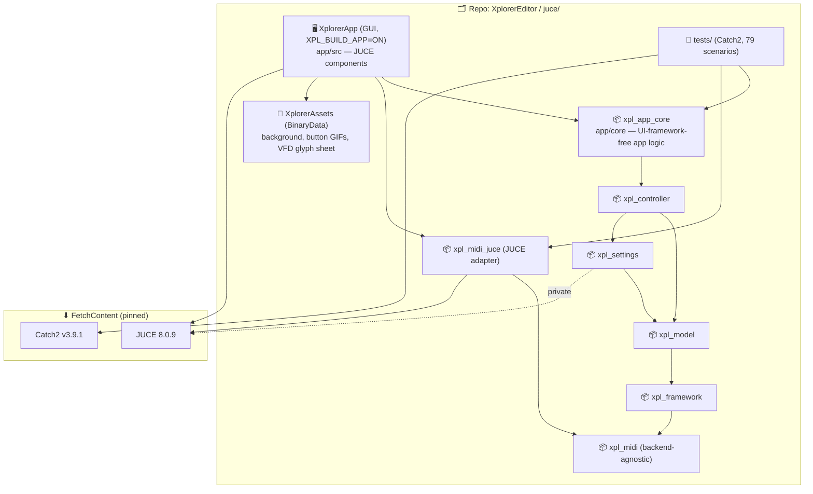

**CI pipelines** (GitHub Actions):

| Workflow | Runner | Role |
|---|---|---|
| `juce-ci.yml` | ubuntu-latest | Configure, build, `ctest` — the 79 headless scenarios on every push (RQ-BLD-007) |
| `juce-windows.yml` | windows-2022 | MSVC x64 build of `Xplorer.exe` + same test suite; uploads the binary as artifact for owner validation. `workflow_dispatch` input `run_tests` allows a binary-only run. MinGW cross-compile is not viable — JUCE `#error`s on it (RQ-BLD-008). |

---

## 3. Layered architecture

Same 3-layer MVC-inspired separation as the reference, plus two seams the reference did
not have: the **MIDI backend interface** (ADR-004) and the split of the View into
**headless app logic** (`xpl_app_core`) vs **JUCE components** (`app/src`, ADR-006).

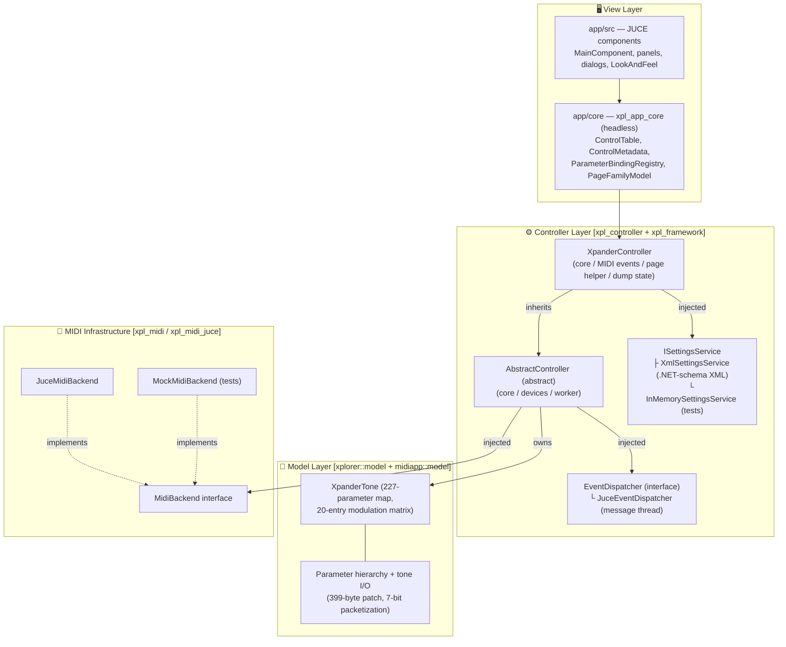

---

## 4. The JUCE application architecture

This section is the detailed map of the View layer — the largest part of the port and the
main subject of this revision.

### 4.1 Application shell

`Main.cpp` hosts the JUCE application object and the top-level window:

- `XplorerApplication` (`juce::JUCEApplication`): single-instance enforcement
  (`moreThanOneInstanceAllowed() = false`, RQ-FMW-072), splash screen (reference
  behavior: auto-dismissed), and the **top-level exception dialog**
  (`unhandledException` override → alert with file/line and a bug-report pointer,
  RQ-GUI-035 — the reference `TopLevelExceptionHandler`).
- `MainWindow` (`juce::DocumentWindow`): native title bar, **freely resizable**
  (owner decision, RQ-GUI-005), owns a `ScaledCanvasComponent`.

### 4.2 Logical canvas & uniform scaling

Every control is laid out **once**, in the fixed logical pixel space of the reference
background bitmap. `ScaledCanvasComponent` hosts the menu bar strip and applies one
`AffineTransform` on resize; nothing else knows about scaling (ADR-006 §1).

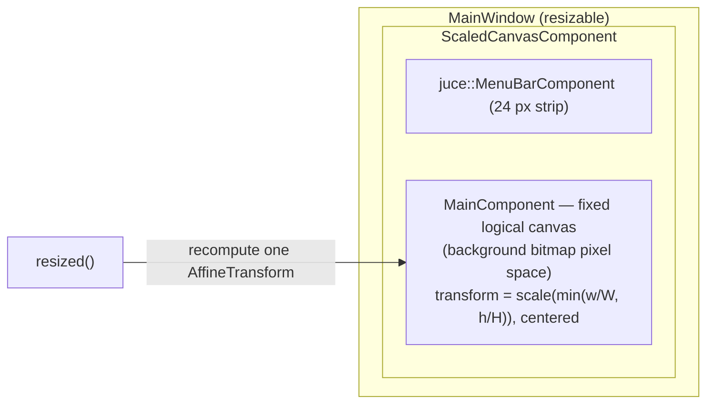

`ScaledCanvasComponent` is also the window-wide **`FileDragAndDropTarget`**: the first
dropped `.syx` goes through `MainComponent::loadSysexFileByType` — classification
(RQ-MOD-043), then load / confirm-and-restore / warn — the same path as File → Open
(RQ-GUI-029).

### 4.3 The extraction pipeline

The reference UI is not re-described by hand: a single script,
`app/core/tools/extract_control_table.py`, regenerates **all** UI facts from the WinForms
sources. This is what makes the 1:1 layout tractable and re-checkable.

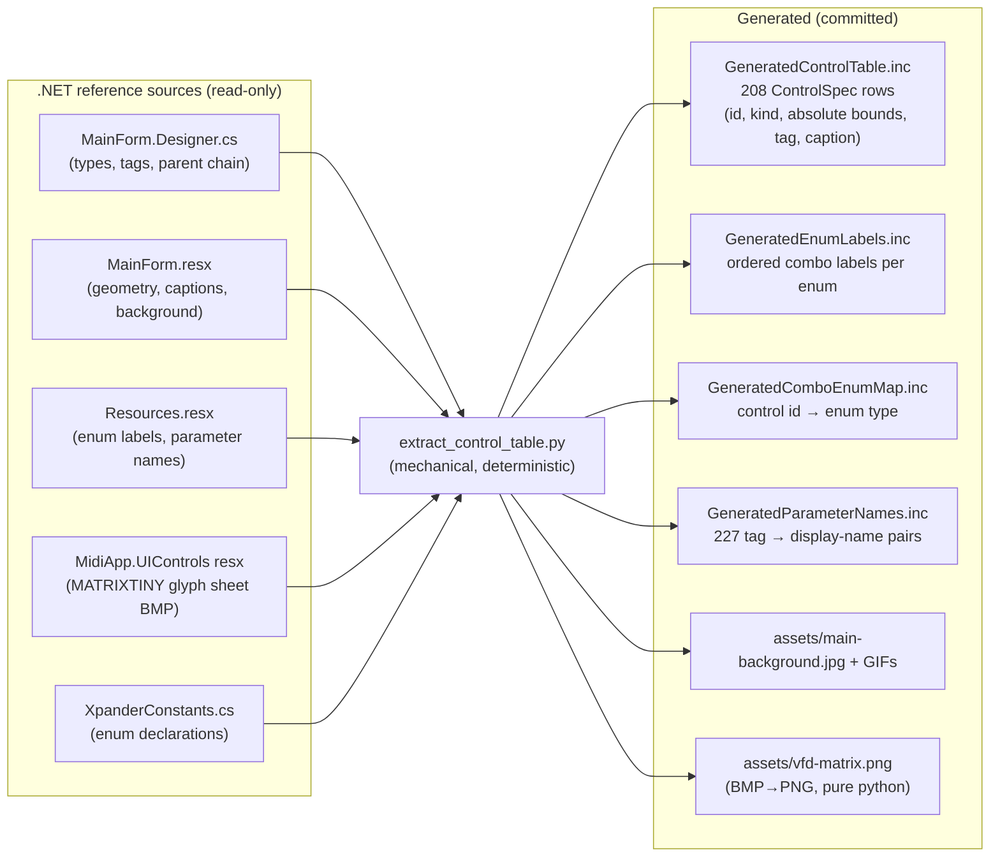

Key detail: WinForms `Location` is parent-relative; the script resolves each control
through the `Controls.Add` parent chain to **absolute canvas coordinates**, which is what
`ControlSpec` stores. A headless test locks the table against known anchors.

### 4.4 Control ⇄ parameter binding

The heart of the UI: `ParameterBindingRegistry` (headless, `xpl_app_core`) maps parameter
names (= the reference WinForms tags, unchanged) to `IBoundControl`s. Thin JUCE wrappers
(`BoundKnob`/`BoundComboBox`/`BoundCheckBox`, radio panels rendered as combos in the
functional phase) implement the interface.

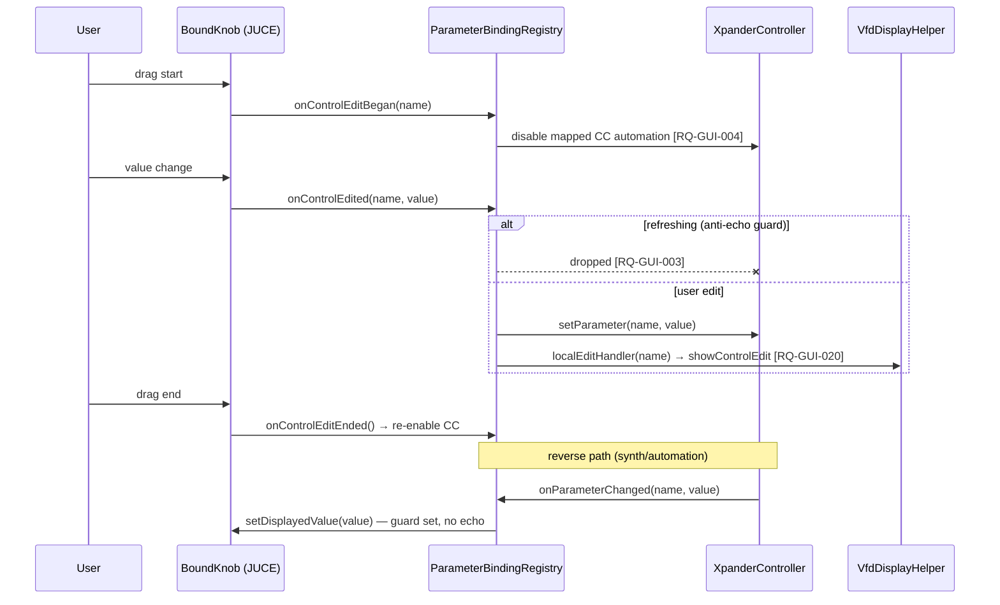

Two registry fan-outs beyond `setParameter`:
- `setLocalEditHandler` — fires only on genuine user edits (guard-checked); the app wires
  it to the VFD.
- `displayTextFor(name)` — asks the bound control to format its own value for display
  (`IBoundControl::displayText()`: combo label, checkbox Y/N, knob numeric), so the VFD
  shows `VCF MODE:4 POLE LOW`, not `:3`.

### 4.5 Page-family blocks (ENV / LFO / RAMP / TRACK)

One shared block of controls per family edits the selected instance. The resolution logic
(`PageFamilyModel`: tag `ENV_X_ATTACK` + instance 3 → `ENV_3_ATTACK`, and the reverse
mapping for synth-driven page changes) is headless-tested; `PageFamilyBlock` (JUCE) owns
the selector buttons and rebinds each control through the registry on switch — the
rebinding is just `unbind` + `bind`, values refreshed from the model, then a page-select
goes to the synth (RQ-GUI-010..012).

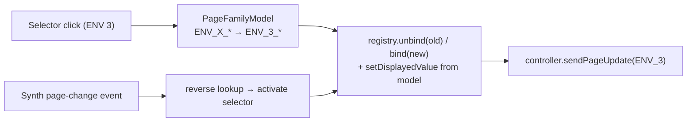

### 4.6 Modulation matrix panel

`ModMatrixPanel`: 20 rows × {source combo, amount knob, destination combo, quantize
check}, placed from the extracted table, wired to the controller's dedicated matrix
operations (not plain parameters — port of `ModulationMatrixManager`). It tracks the
previous destination per row (the change-destination operation needs old + new), refreshes
row-wise on the modulation-entry event and wholesale on full-tone changes, and exposes an
edit callback the app routes to the VFD (`SRC TO DEST: / AMNT / QTZ`).

### 4.7 VFD display

Two cleanly separated halves (ADR-006 §4, ADR-007):

- **Content** — `VfdDisplayHelper` (port of the reference class): builds the 5 text lines
  — `* Snn NAME *`, parameter line (friendly name from the generated table + value by
  control type, wrapped at the panel's column count), `MIDI CC:` line, or the
  modulation-entry lines. Pure logic over the display's grid metrics.
- **Rendering** — `DisplayPanel`: paints each character as a 12×16 cell blitted from the
  reference `MATRIXTINY` sprite sheet (96 glyphs, ASCII 32–126, cell = `(c−32)%32`,
  `(c−32)/32`), black background, block centered, grid = `⌊w/12⌋ × ⌊h/16⌋` — the
  reference formula. The reference's hand-managed buffer bitmap and changed-cell diffing
  are replaced by `setBufferedToImage(true)` + an identical-text early-out: JUCE's image
  cache gives the same "no work when nothing changed" property with no manual state
  (ADR-007). Nearest-neighbour resampling keeps the dot matrix crisp under the canvas
  transform. Display grown to 5 rows (267×82, upward) per owner arbitration so the
  `MIDI CC:` line is always visible.

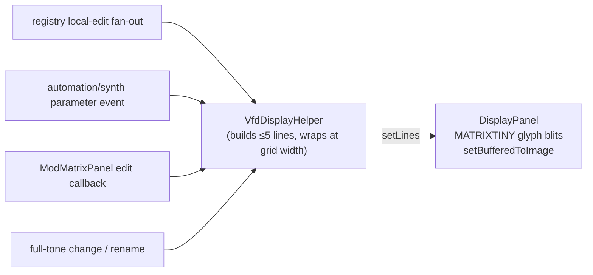

### 4.8 MIDI LED panel

`LedPanelComponent` (port of `LedPanelControl`, ADR-008): three 5 px square LEDs at the
extracted bounds — automation-in **green**, synth-in **blue**, synth-out **red**, exact
reference geometry and colours. Each MIDI-activity event stamps its LED's expiry
(now + 100 ms); a 30 ms decay timer runs **only while a LED is lit** and stops itself —
same observable behaviour as the reference's permanent 30 ms UI poll (which also drove the
VFD there; both are event-driven here), with zero idle work.

### 4.9 Menus, dialogs & long operations

`MainComponent` implements `juce::MenuBarModel` (File / Patch / Tools / Help, reference
menu tree, RQ-GUI-008). Dialog inventory:

| Dialog | Implementation | Notes |
|---|---|---|
| Settings | `SettingsDialog` — `TabbedComponent`, 3 pages (MIDI / User interface / Randomizer) | Persists via `ISettingsService`, re-applies MIDI devices live, LED-ring colour change rebuilds the LookAndFeel without restart |
| Store / Goto program | shared numeric prompt | |
| Rename | reference character-set validation | rename triggers the reference's full retransmission side effect |
| Extract single tones | chained file→folder pickers (`ExtractFlow`) | |
| Backup / Get-all-patches | **modeless** `ProgressWindow` | progression is event-driven (fed by incoming MIDI dumps) |
| Restore all data | `RestoreThread` (`ThreadWithProgressWindow`) | blocking paced send loop off the message thread; progression marshalled — no `DoEvents` equivalent |
| Piano keyboard | `PianoWindow` (`MidiKeyboardComponent`) | Note On/Off to the synth |
| About | standard alert | |

All file choosers are async (`launchAsync`) — JUCE 8 removes modal loops by default; the
port never relies on `JUCE_MODAL_LOOPS_PERMITTED`.

### 4.10 Skin — `XplorerLookAndFeel`

A single `LookAndFeel` subclass, installed as the global default, restyles every control
with zero behavioral code: rotary knobs with the configurable LED-ring colour
(`UiConfiguration.knobLedBorderColor`, live-rebuilt from the settings dialog), compact
tick-boxes with height-fitted caption fonts (short captions like TRI/SAW/PULSE fit the
tight reference bounds), white control text. Shortcut buttons use the reference GIF
triples (normal/hover/down) as `ImageButton`s.

### 4.11 Application event flow & threading

The controller emits 7 event channels (parameter change, full tone, page change,
modulation entry, MIDI activity, all-data-dump progression, and the local-edit fan-out at
registry level). Everything reaching JUCE components is marshalled to the message thread
by `JuceEventDispatcher` (`MessageManager::callAsync`) — components never see a foreign
thread.

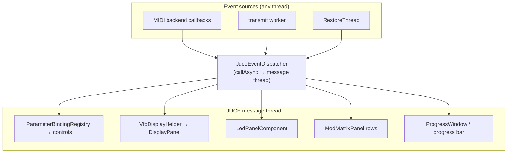

---

## 5. Core subsystems

### 5.1 Parameter queue & worker thread

Same observable pacing as the reference (scan → enqueue clones → send at most one per
tick, page-select first when the page changes), implemented with interruptible primitives
instead of `Thread.Sleep` polling (ADR-005).

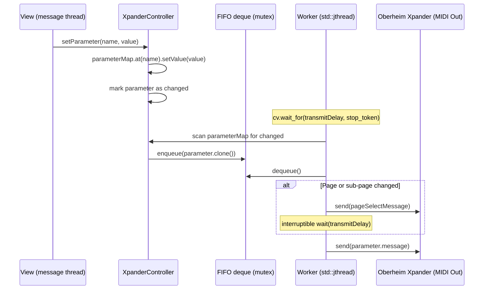

### 5.2 MIDI event flow (bidirectional)

Three simultaneous devices; handlers are virtual methods receiving a backend-agnostic
`MidiMessage` value type.

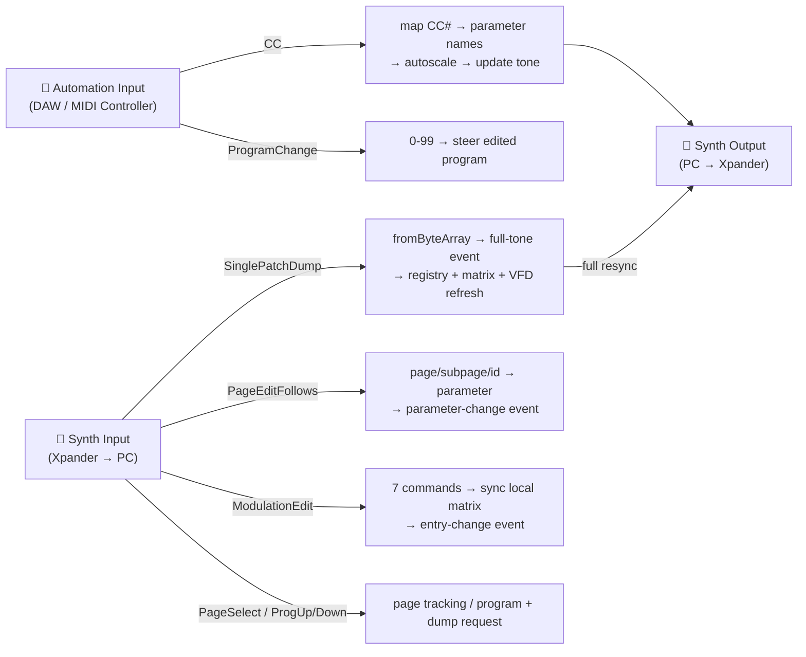

### 5.3 Settings

Injected `ISettingsService`; the XML format stays schema-compatible with the .NET
`XmlSerializer` output so existing `xplorer.users.config` files import unchanged
(round-trip and .NET-import scenarios in CI). `AllUsersSettings` aggregates
`MidiConfiguration`, `UiConfiguration` (knob LED colour, mouse mode, style) and
`RandomizerConfiguration` (VCO2 flags, matrix flags, VCO freq/detune, VCA2 env) — all three
editable from the settings dialog.

### 5.4 Tone model & I/O

Unchanged since the Phase 3 analysis: `XpanderTone` (227-parameter ordered map + 20-entry
matrix), parameter hierarchy (`XpanderParameter` / signed / mod-matrix / full-tone),
`IToneReader/Writer`, 399-byte single-patch layout with 7-bit packetization; byte-exact
round-trips against a real hardware dump are CI-verified.

---

## 6. SOLID analysis

| Principle | Assessment | Detail |
|---|---|---|
| **S** – Single Responsibility | ✅ Respected | One class per concern throughout; in the View, content vs rendering are split (VfdDisplayHelper / DisplayPanel), logic vs widgets are split (`xpl_app_core` / `app/src`), and large controller classes are split across `.cpp` files by topic, mirroring the reference partial-class decomposition. |
| **O** – Open/Closed | ✅ Good | Extension points preserved (virtual handlers, worker override, `IToneReader/Writer`, `MidiBackend`); `IBoundControl` lets new control kinds join the registry without touching it. |
| **L** – Liskov Substitution | ✅ Respected | Mock and JUCE backends interchangeable in every test; bound-control fakes substitute JUCE wrappers in registry tests. |
| **I** – Interface Segregation | ✅ Good | `MidiBackend`/ports, `IToneReader`, `IToneWriter`, `ISettingsService`, `EventDispatcher`, `IBoundControl` are small and focused. |
| **D** – Dependency Inversion | ✅ **Fixed vs reference** | The reference's three partial violations resolved (MIDI behind `MidiBackend`, settings behind `ISettingsService`, UI marshalling behind `EventDispatcher`); the View depends on the controller's abstractions only. Residual: `XpanderController` downcasts `AbstractTone` → `XpanderTone` in one private accessor (port fidelity). |

---

## 7. Key design patterns

| Pattern | Where |
|---|---|
| **Template Method** | `AbstractController` (worker proc, input handlers), `AbstractTone`, `AbstractParameter::updateMessageFromValue` |
| **Ports & Adapters** | `MidiBackend` + `JuceMidiBackend` / `MockMidiBackend`; `IBoundControl` + JUCE wrappers / test fakes |
| **Observer / Callbacks** | 7 controller/registry event channels as `std::function`, marshalled via `EventDispatcher` |
| **Command Queue** | parameter clone deque + worker — decouples UI from MIDI timing |
| **Registry** | `ParameterBindingRegistry` — name-keyed control bindings, rebindable (page families) |
| **Strategy** | `IToneReader` / `IToneWriter`; `ISettingsService` implementations |
| **Dependency Injection** | backend, tone, dispatcher, settings — constructor-injected; no singletons |
| **Clone (Prototype)** | `AbstractParameter::clone()` before enqueuing |
| **Pimpl** | `XmlSettingsService`, `JuceMidiBackend` (JUCE types out of public headers) |
| **Flyweight** | VFD sprite sheet: one image, per-character source rectangles (ADR-007) |
| **Table-driven construction** | the whole main window is built from `GeneratedControlTable.inc` — no per-control code |

---

## 8. Threading model

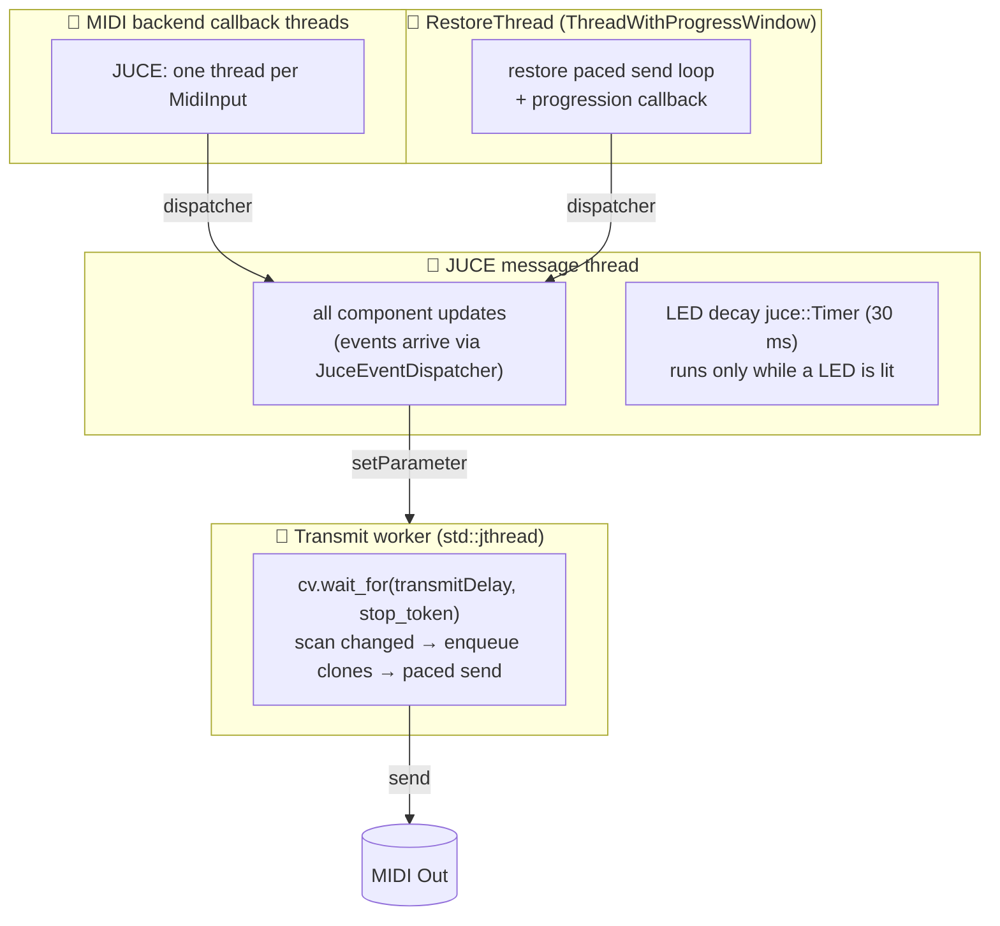

The reference's two threading defects remain absent (no `DoEvents` pumping, no busy-sleep)
and its permanent 30 ms UI timer has no equivalent — the UI is fully event-driven; the
only periodic work (LED decay) is self-stopping (ADR-008).

Known reference-faithful blocking spots: `storeSinglePatchToSynth`,
`sendProgramChangeAndGetSinglePatchFromSynth` and the VFD typewriter sleep on their
calling thread (the message thread when invoked from menus) — verbatim from the reference,
tracked as a post-migration async candidate (§10).

---

## 9. Testing architecture

Two-tier strategy (ADR-003, ADR-006 §6): everything with logic is headless-testable by
construction; only thin JUCE wrappers need eyes.

| Tier | What | How verified |
|---|---|---|
| Machine (CI, 79 scenarios) | MIDI framing/splitting, parameter semantics, tone byte-exact round-trips, controller state machines (dump, page follow, matrix ops), settings round-trip + .NET import, control-table anchors, binding registry (anti-echo, CC disable, rebinding, local-edit fan-out), page-family resolution, friendly-name/label tables | Catch2, requirement-tagged (`[RQ-…]`), Linux + Windows CI |
| Machine (opportunistic) | JUCE backend against a virtual MIDI cable | auto-skipped when no cable exists |
| Human (owner, Windows) | pixel fidelity, colours, drag feel, real-synth timing | milestone builds (M1/M2/M3) from the Windows CI artifact |

Development-time smoke: the app is launched under Xvfb after GUI changes (render + clean
exit + screenshot inspection).

---

## 10. Remaining gaps & improvement backlog

Consolidated status of the original analysis' proposals plus items discovered during the
port.

| # | Item | Status |
|---|---|---|
| 1 | `Application.DoEvents()` / UI pumping | ✅ Gone — progression callbacks + worker threads everywhere |
| 2 | Worker `Thread.Sleep` polling | ✅ Interruptible cv-wait (ADR-005) |
| 3 | Static settings service | ✅ Injected interface |
| 4 | `AbstractTone` → `XpanderTone` downcast | ⚠️ Kept (single accessor, port fidelity); post-migration redesign candidate |
| 5 | `FileOperationsManager` → god-form coupling | ✅ Dissolved into focused components (load-by-type on `MainComponent`, dialogs in `Dialogs.cpp`) |
| 6 | Non-generic `OrderedDictionary` | ✅ Typed `OrderedParameterMap` |
| 7 | Unit tests | ✅ 79 scenarios, requirement-tagged, dual-platform CI |
| 8 | Multi-patch support | Out of scope (as reference); backlog |
| 9 | `BugReportFactory` payload | ❌ Not ported — the top-level exception dialog exists (RQ-GUI-035) but without the full diagnostic payload (RQ-FMW-071); app-phase follow-up |
| 10 | Blocking sleeps inside some controller ops (store, program-change+dump, typewriter) | ⚠️ Verbatim from reference; called from the message thread via menus. Async refactor candidate (needs an ADR) |
| 11 | Tone morphing UX | Deferred — reference form is unfinished (empty OK/Cancel, unwired); controller primitive ported & tested; awaits owner UX spec |
| 12 | VFD `.` active-modulation-destination marker | ✅ Done — TASK-JUCE-076 / ADR-010: the shared `ModulationHighlight` resolver drives both the matrix hover highlight and this marker |
| 13 | Character scaling of the VFD | Owner announced a later spec pass (nearest vs smooth under canvas scale) |
| 14 | Hardware validation | TASK-JUCE-071 checklist (real Xpander/Matrix-12) still to run |
| 15 | Cross-compat campaign | TASK-JUCE-072 (patch libraries + settings exchanged .NET ⇄ JUCE) still to run |
| 16 | CC automation table not loaded into the controller | 📋 Scheduled — TASK-JUCE-078 / ADR-012: `applyMidiSettings` persists but never parses `automationTable` into the controller dictionary, so incoming CCs drive nothing and the VFD CC line is blank; fixed together with the mapping editor (RQ-GUI-036) |
| 17 | Duplicated runtime LED-colour state | 📋 Scheduled — TASK-JUCE-077 / ADR-011: the matrix highlight cached its own colour copy; moving to a single LookAndFeel-owned source fixes the stale-colour-on-change bug |

---

## 11. Architecture summary

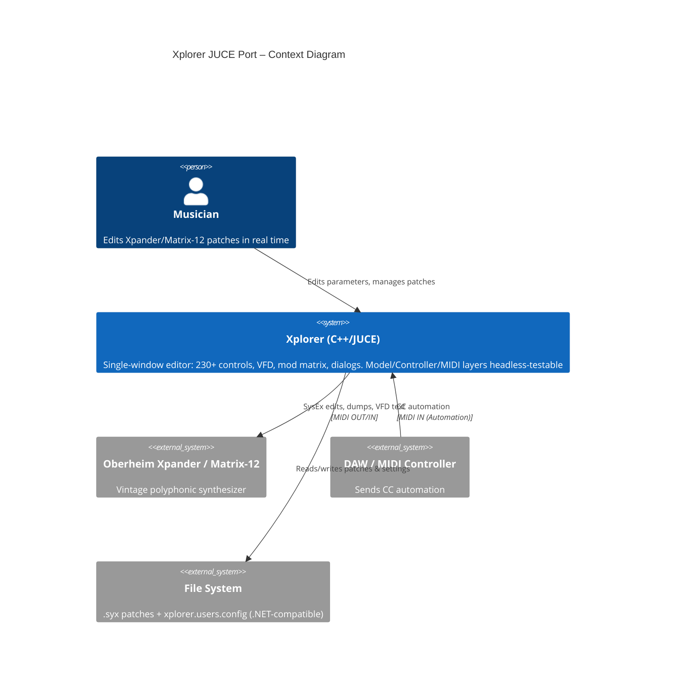

### Strengths
- **Wire and file compatibility**: byte-exact SysEx and 399-byte patch round-trips
  verified against real hardware dumps; settings interchange with .NET
- **Testability by construction**: every seam is an injected interface; UI logic is a
  headless library; 79 requirement-tagged scenarios on two platforms
- **Mechanical UI fidelity**: layout, captions, enum labels, parameter names and both
  bitmap assets are regenerated from the WinForms sources by one script — no hand-copied
  facts to drift
- Fully event-driven UI (no polling timers), modern cooperative threading, reference
  timing preserved
- Every structural decision recorded (ADR-001…008); deviations enumerated per RQ-NFR-009

### Weaknesses
- Hardware-only behaviors (dump timing against a real synth, VFD look at real scale
  factors, LED colours under traffic) still await owner validation
- A few reference-faithful blocking sleeps reachable from the message thread (§10-10)
- The `AbstractTone` downcast and the morphing/bug-report gaps carry over (§10)
- Single developer-validated visual pass so far — pixel-level UI review is milestone-gated

---

## 12. Notable differences vs the C# implementation

Deliberate deviations, each bounded and documented (RQ-NFR-009 requires observable
behavior preserved; ADR references given).

| # | Area | C# reference | JUCE port | Impact |
|---|---|---|---|---|
| 1 | MIDI coupling | Controller holds Sanford `InputDevice`/`OutputDevice` directly | `MidiBackend` interface + JUCE/mock adapters (ADR-004) | None on the wire; enables hardware-free tests |
| 2 | Worker loop | `Thread.Sleep` polling; `Join(2000)` then abandon | `std::jthread` + interruptible cv-wait; cooperative join (ADR-005) | Same pacing; clean shutdown |
| 3 | Settings access | Static class, read at call sites | Injected `ISettingsService` | None functionally; testable |
| 4 | Display-control command (0x05/0x06) | Frozen in `static readonly` at first use — synth-type change needs restart | Read from settings per call | Port applies a synth-type change immediately |
| 5 | Events | .NET events + `SynchronizationContext.Post` | `std::function` handlers + injected `EventDispatcher` | Same delivery guarantees, explicit dispatcher |
| 6 | Automation SysEx/Common/Realtime forwarding | Posted through `SynchronizationContext` then sent | Sent directly from the callback thread | Per-device ordering preserved; one less UI round-trip |
| 7 | Parameter map container | Non-generic `OrderedDictionary` | Typed `OrderedParameterMap` | Type safety; same iteration order |
| 8 | `StringIntDualDictionary` miss | Returns `int.MinValue` | `std::optional<int>` | Internal API only |
| 9 | Construction | Virtual dispatch from base constructors | Two-phase init (tone injected; `initializeValue()` last) | None observable |
| 10 | Randomizer determinism | Clock-seeded only | Optional explicit seed (tests) | None in production paths |
| 11 | Morph failure handling | Exceptions swallowed → tone nulled (latent NRE) | Exceptions propagate; state restored and rethrown | **Safer than reference** |
| 12 | `CanClipboardPasteTo` | `Substring(0,4)` without length check | Length-checked, returns false | Defensive only |
| 13 | `FileUtils` sanitization | Platform-dependent invalid-char set | Fixed set = Windows-invalid ∪ `":.)&"` | Same output on Windows; deterministic |
| 14 | Logger | `TraceSwitch`-driven, object caller | Level-filtered file sink + explicit `shutdown()` (Windows file-lock test fix) | Same intent |
| 15 | `SendPageUpdate(pageName)` | `Enum.Parse` with CASSETTE fallback | String check, same side effect | Equivalent for all real page names |
| 16 | BugReportFactory | Full exception+MIDI context report | Top-level exception dialog only (§10-9) | Gap tracked (RQ-FMW-071) |
| 17 | Window sizing | Fixed size, WinForms DPI autoscale at launch | Freely resizable; logical canvas + one `AffineTransform` (ADR-006) | Owner decision; layout identical at any size |
| 18 | UI layout source | Hand-maintained `MainForm.Designer.cs` | Generated declarative tables from the same sources (§4.3) | Regenerable, drift-proof |
| 19 | VFD rendering mechanics | Offscreen buffer + changed-cell diffing + `DrawImageUnscaled` | Direct sprite-sheet paint + `setBufferedToImage` (ADR-007) | Same glyph artwork & behaviour; less state |
| 20 | VFD size | 267×75 (4 lines at 100 % DPI; 5th line needs DPI autoscale) | 267×82, grown upward — 5 lines always visible | Owner-arbitrated (ADR-007 option b) |
| 21 | LED decay | Permanent 30 ms UI timer decrementing stamps | Event-driven retriggerable hold; timer only while lit (ADR-008) | Same visible behaviour; zero idle work |
| 22 | UI update timer | One 30 ms timer drives VFD + LEDs | Fully event-driven UI | No polling |
| 23 | Radio button panels | Custom `RadioButtonPanel` widgets | Rendered as combos in the functional phase | Skin-phase revisit if owner wants radios back |
| 24 | Settings UI | Separate modal Forms | One `TabbedComponent` dialog, 3 pages; LED colour applies live | Same fields; restart not required |

---

## 13. Edge cases, reference quirks and verbatim conversions

Items found in the C# source that look like latent bugs or were hard to interpret. Policy
applied: **when in doubt, port verbatim** and mark with a comment; each is listed here for
owner review.

| # | Location (reference) | Observation | Port decision |
|---|---|---|---|
| 1 | `XpanderController.SendProgrammerModeSinglePatch` | Frame `{F0, F0, 10, 02, 0D, 01, 00, F7}` — duplicated leading 0xF0 | Verbatim, commented. Worth testing on hardware. |
| 2 | `XpanderController.SendTuneRequestToSynth` | Tune Request sent as `{F0, F6, F7}` — System Common wrapped in SysEx, non-standard | Verbatim, commented. |
| 3 | `SendAllNotesOffToSynthOutput` | CC 123 on settings `MidiChannel` (default 1) while everything else uses `Tone.MIDIChannel` (default 0) | Verbatim, commented. Channel mismatch to confirm. |
| 4 | `PageSubPageHelper.IsLfoRetrig` | `parameterSubPage <= LFO_5` compares a sub-page to a page constant — almost always true | Verbatim, commented. |
| 5 | `AbstractTone.GetNextRandomValueForParameter` | `randomizer.Next(0, 1)` always 0 → humanize `addValue` always false; inverted ranges for negatives | Behavior preserved; inverted ranges swapped (unreachable) to avoid UB. |
| 6 | Same, current value 0 | Humanize range collapses to {0} | Verbatim. |
| 7 | `SysexIterator` | Unterminated trailing frame dropped; scan resumes on the closing 0xF7 | Verbatim (tested). |
| 8 | `XPanderSinglePatch` unused matrix entries | 0x1F/0x3F wire markers vs NONE in memory | Verbatim (byte-identical round-trip test). |
| 9 | `DetermineSysexFileType` | One non-single-patch frame → `AllDataDump`, not `Unknown` | Verbatim. |
| 10 | Automation CC handler override | Reference duplicates base scaling code | C++ delegates to base + adds ProgramChange branch — byte-identical, tested. |
| 11 | `ToneName` setter | Rename triggers full transmission + program change + dump request | Verbatim (heavy side effect expected by the UI). |
| 12 | Parameter count | README says 226; code registers 227 | Kept 227 (source of truth = code). |
| 13 | `ChangeModulationSourceAmount` | Sign mixing between entry sign and unsigned value | Verbatim; covered by model tests. |
| 14 | Load/Randomize/Morph epilogues | `Changed` flags cleared **after** full-tone send; order matters | Verbatim (same sequence). |
| 15 | `MockMidiBackend` delivery | (Port-specific) synchronous on the injecting thread | Documented design choice. |
| 16 | `ToneMorphingForm` | Flagged work-in-progress: empty OK/Cancel, unwired, cancel-restore `#warning` | **Deferred, not ported**; controller primitive fully ported & tested (§10-11). |
| 17 | All-data-dump restore | Blocking send loop on the UI thread pumped by `DoEvents` | `ThreadWithProgressWindow` worker; **improves on reference** (RQ-GUI-026). |
| 18 | TRACK page-family tags | Designer tags `TRACK_X_PT_n` while the parameter map registers `TRACK_n_POINT_m` — the reference resolves through its own map at runtime | Extraction normalized to the parameter names, **with explicit owner approval** (page-family review). |
| 19 | VFD line count | `VfdDisplayHelper` writes 5 lines but the 267×75 control fits 4 at 100 % DPI — the CC line only appears under Windows DPI autoscale | Surfaced to owner; display grown to 82 px (ADR-007 option b). |
