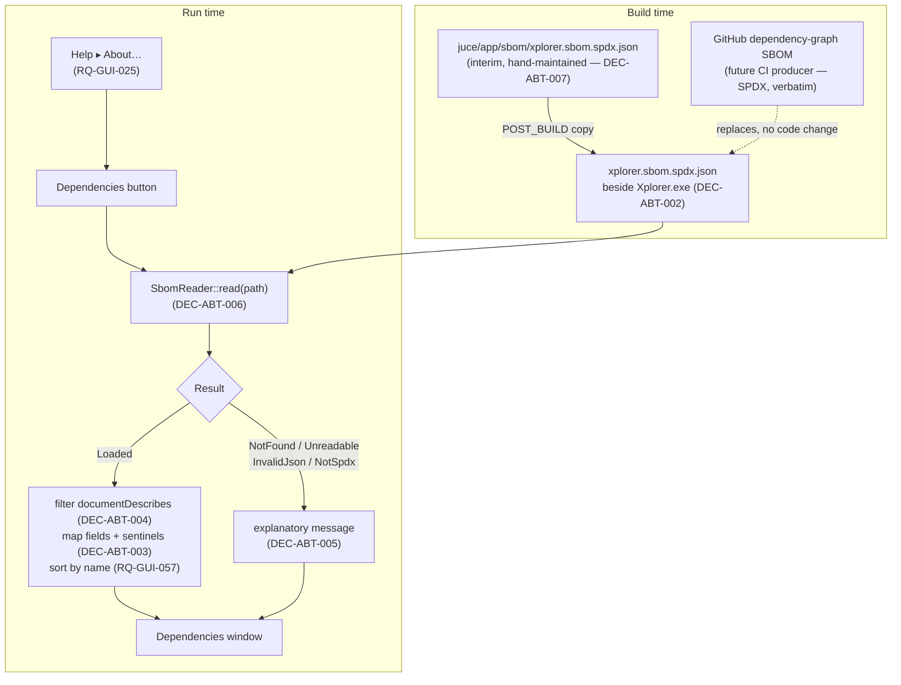

# ADR-ABT-001: SBOM-Driven Dependency Disclosure (SPDX, Read at Run Time)

## Status
Proposed

<!-- Motivated by RQ-GUI-057 (dependencies window), RQ-BLD-014 (build ships the
SBOM beside the executable) and the RQ-GUI-025 amendment (About dialog carries
only the project's own licence plus a control opening that window). New
functional area — licence/dependency disclosure — distinct from both the
JUCE UI series (ADR-JUC-*) and the build/release automation series (ADR-BLD-*),
hence the ADR-ABT-* series opened here. Builds on RQ-BLD-006 (the project's own
GPL v3 / JUCE licensing position). -->

## Context

The product bundles third-party components whose licences carry attribution
obligations, and until now the UI discharged none of them: the About dialog
named the project's own GPL v3 and nothing else. Two components are actually
shipped inside the binary — the **JUCE framework** (8.0.9) and the embedded
**Roboto Condensed** typeface (RQ-DSN-096, ADR-JUC-022) — and the test build
additionally pulls **Catch2**.

A material finding surfaced while specifying this: **JUCE 8 is dual-licensed
AGPLv3 / commercial, not GPLv3.** The vendored `LICENSE.md` of the pinned 8.0.9
tag states the modules are "dual-licensed under the AGPLv3 and the commercial
JUCE licence". RQ-BLD-006 says "JUCE shall be used under its GPL option", which
was accurate for JUCE 6/7 but is not for 8. This ADR does not resolve that
requirement's wording — it is flagged to the owner separately — but the
disclosure surface it specifies must state **AGPL v3**, because a licence notice
that names the wrong licence is worse than none.

The first design considered (and implemented far enough to be judged) was to
enumerate the components as extra rows inside the About dialog. The owner
rejected it in favour of a dedicated window reached by a button, with the list
itself sourced from a **Software Bill of Materials** shipped with the build, so
that it can later be produced automatically from GitHub's dependency graph.

The forces, then:

- A licence disclosure must be **accurate and complete**, and stay so as
  dependencies change — a hand-maintained C++ list silently rots at the first
  dependency bump, and nothing fails when it does.
- The eventual producer is **GitHub's dependency-graph SBOM export**, which
  emits **SPDX** JSON natively. Choosing any other format would mean writing and
  maintaining a converter for no gain.
- The application must not require the SBOM to exist: a locally-built binary is
  a legitimate configuration, and so is a future CI change that moves the file.
- The About dialog is a fixed-size port of the reference `AboutForm`; an
  open-ended list cannot live in it without either clipping or a redesign.

## Decision

- **DEC-ABT-001 — The dependency list is a build artifact read at run time,
  never source code.** The application SHALL obtain every dependency name,
  version, licence and URL by parsing an SBOM file at the moment the window is
  opened. No dependency metadata is compiled into the binary. *Consequence made
  explicit:* the shipped SBOM is the single source of truth, and a wrong or
  stale SBOM produces a wrong disclosure — correctness is delegated to whatever
  generates it, which is precisely the point, since the intended generator
  (GitHub) derives it from the manifests rather than from a human's memory.
  (RQ-GUI-057, RQ-BLD-014)

- **DEC-ABT-002 — Format: SPDX 2.3 JSON; file name `xplorer.sbom.spdx.json`;
  location: sibling of the executable.** SPDX because it is what GitHub's export
  emits natively, so a later CI step can drop that output in place **verbatim**
  with no application change — the reader is written against the SPDX schema,
  never against this repository's particular file. The sibling-of-executable
  convention is the one already established for the default patch
  `oberheim.syx` (ADR-JUC-032 DEC-JUC-100), resolved from
  `juce::File::currentExecutableFile`, so a relocated install keeps working.
  CycloneDX was the alternative and is rejected below. (RQ-BLD-014)

- **DEC-ABT-003 — Field mapping, with SPDX no-value sentinels resolved, not
  displayed.** Per package: name ← `name`; version ← `versionInfo`; licence ←
  `licenseConcluded`, falling back to `licenseDeclared`; website ← `homepage`,
  falling back to `downloadLocation`. SPDX encodes "unknown" as the string
  literals `NOASSERTION` and `NONE`; these SHALL be treated as *absent* at the
  parse boundary — triggering the fallback, then a neutral placeholder — and
  SHALL never reach the screen as text. *Why a decision and not an
  implementation detail:* every one of these fields is optional in the schema
  and GitHub populates them inconsistently, so a reader that trusts them
  produces a window reading "NOASSERTION" three times per row. (RQ-GUI-057)

- **DEC-ABT-004 — The document's own subject is excluded.** Packages listed in
  the document's `documentDescribes` (equivalently, the target of the SPDX
  `DESCRIBES` relationship) are what the SBOM is *about* — Xplorer itself — not
  what it depends on, and SHALL be filtered out. GitHub's export always includes
  such a root package, so without this the window's first entry would be the
  product listing itself as its own dependency. (RQ-GUI-057)

- **DEC-ABT-005 — Failure is a displayed outcome, not an assertion or an empty
  window.** The reader returns a discriminated result — loaded, file-not-found,
  unreadable, invalid-JSON, not-SPDX/empty — and the window renders the
  corresponding explanation. No `jassert`, no silent empty list, no built-in
  fallback inventory. *Rationale:* a fallback list would reintroduce exactly the
  hard-coded inventory DEC-ABT-001 exists to abolish, and would do it in the one
  situation where it is guaranteed to disagree with reality. (RQ-GUI-057)

- **DEC-ABT-006 — The parser is a separate, headlessly-testable unit; the window
  only renders its output.** SBOM parsing lives in its own translation unit
  (`SbomReader`) whose public surface is pure data in / pure data out, with no
  `juce::Component` involvement, and is compiled into both the application and
  the JUCE-linked test executable (`xpl_tests_app_juce`) — the pattern already
  used for `Dialogs.cpp`, `BackgroundRenderer.cpp` and `BoundControls.cpp`. It
  uses `juce::JSON` (already present via `juce_core`) rather than a new
  third-party JSON library: adding a dependency to a feature whose purpose is
  disclosing dependencies is a cost with no benefit here, and `juce::JSON`
  parses the whole SPDX document adequately. *Consequence:* the parser sits in
  the app layer rather than the JUCE-free `xpl_app_core`, so its tests run only
  in app-enabled builds (Windows/macOS CI), not in the Linux headless job —
  accepted, and identical to the existing real-metrics and painter tests.
  (RQ-GUI-057, ADR-JUC-002)

- **DEC-ABT-007 — The repository ships a hand-maintained SBOM until CI
  generates one.** `juce/app/sbom/xplorer.sbom.spdx.json` is version-controlled,
  accurate for the three components above, and copied beside the executable by a
  `POST_BUILD` step (same mechanism as `oberheim.syx`). It is explicitly
  **interim**: RQ-BLD-014's acceptance requires that GitHub's generated SBOM can
  replace it verbatim, which is the migration path. Test SBOMs are **not**
  version-controlled — the tests write their own fixtures to temporary files, so
  there is no generated artifact to ignore and no fixture that can drift from
  the cases it claims to cover. (RQ-BLD-014)

## Consequences

- **Easier:** a dependency change is discharged by regenerating a JSON file —
  no C++ edit, no rebuild of the disclosure logic, no review of a list nobody
  remembers to update. Swapping in GitHub's SBOM later is a CI-only change.
- **Easier:** the About dialog keeps the reference form's fixed size regardless
  of how many dependencies exist.
- **Harder / constrained:** the shipped SBOM becomes a release-correctness
  concern — if CI forgets to attach it, users see "SBOM not found" instead of a
  licence list. This is visible rather than silent (DEC-ABT-005), which is the
  trade deliberately taken, but it is a new artifact that must survive
  packaging on all three platforms.
- **Harder:** the interim hand-maintained SBOM (DEC-ABT-007) has exactly the
  rot problem DEC-ABT-001 abolishes, for as long as it lasts. It is small
  (three packages) and its replacement is specified, but it is a real, dated
  liability, not a solved problem.
- **Neutral:** no change to any other dialog, to the panel, to the controller,
  or to the design system's token set — the window consumes existing roles.

## Alternatives Considered

- **Enumerate the components as rows in the About dialog (first implementation,
  owner-rejected):** rejected — hard-codes the inventory in C++ (rots silently),
  grows the fixed-size reference dialog for every new dependency, and forecloses
  the automation path the owner wants.
- **CycloneDX instead of SPDX:** rejected — GitHub's dependency-graph export is
  SPDX, so CycloneDX would require a conversion step in CI whose only purpose is
  to change format, plus a reader that then disagrees with the upstream source
  of truth. CycloneDX's richer component typing buys nothing for a four-field
  display.
- **Embed the SBOM in the binary (`juce_add_binary_data`, as with the fonts and
  icons):** rejected — it would make the disclosure immutable at build time,
  which defeats DEC-ABT-001's whole purpose of letting CI supply the content,
  and would require a rebuild to correct a licence error found post-release.
- **A hard-coded fallback list used when the SBOM is missing:** rejected — see
  DEC-ABT-005. It reinstates the rotting inventory in the exact case where it
  cannot be cross-checked against anything, and it hides a packaging bug behind
  plausible-looking output.
- **Parsing with a dedicated JSON library (nlohmann/json, RapidJSON):**
  rejected — a new third-party dependency (itself needing disclosure) for a
  document `juce::JSON` already parses correctly.

## Diagram

