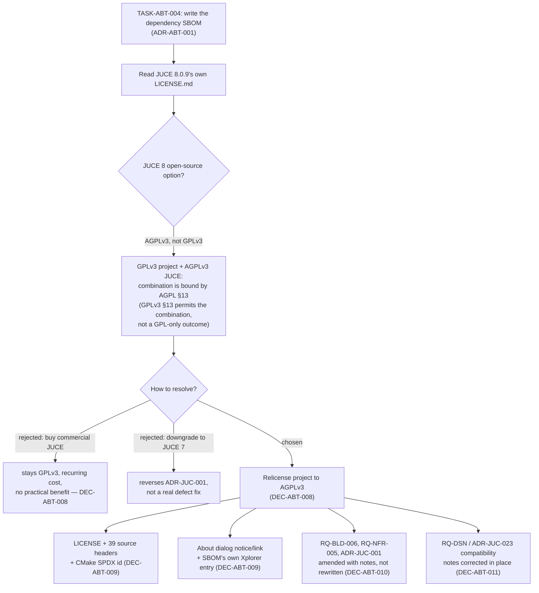

# ADR-ABT-002: Relicense the Project from GPLv3 to AGPLv3

## Status
Accepted

<!-- Motivated by RQ-BLD-006 (source header / JUCE licence option) and
RQ-NFR-005 (project licensing), both amended 2026-08-05. Sibling to
ADR-ABT-001, which is where the underlying licence mismatch first surfaced;
this ADR is the decision record for what to do about it, since a licence
change is a project-wide, legally material decision distinct from the SBOM
mechanism ADR-ABT-001 specifies. -->

## Context

Every requirement, ADR and source header in this repository has, until now,
stated the project is licensed **GPLv3**, and that JUCE is used "under its GPL
option." That statement was correct for JUCE 6 and 7. It is not correct for
**JUCE 8**, the version this project has pinned since ADR-JUC-001: the pinned
`8.0.9` tag's own `LICENSE.md` (vendored under `_deps/juce-src/`) states plainly
that JUCE 8's modules are "dual-licensed under the AGPLv3 and the commercial
JUCE licence" — GPLv3 is not one of the two options any more. This was never
checked against the actual vendored file until TASK-ABT-004 read it while
writing the SPDX dependency-disclosure SBOM (ADR-ABT-001); the "GPL option"
wording had simply been carried forward from when JUCE 6/7 was the working
assumption, unverified since.

Two questions follow, and this ADR answers both:

1. **Is combining AGPL-licensed JUCE with a GPLv3 project even a problem?**
   Yes. GPLv3 §13 explicitly *permits* linking/combining a GPLv3 work with an
   AGPLv3 work — the two licences were designed by the FSF to interoperate —
   but the same section says the AGPL's own §13 (the network-source-disclosure
   requirement) **applies to the combination as a whole**. A project that links
   AGPL-licensed JUCE cannot correctly describe itself as "GPLv3" and stop
   there: the combined work carries AGPL obligations regardless of what the
   project's own code is labelled. Declaring the project GPLv3 while depending
   on JUCE's AGPL option is therefore not a viable steady state — either the
   declaration is wrong, or JUCE must be used under a different option.
2. **Does JUCE's own EULA go further than bare copyright law requires?** Yes.
   Raw Material Software's stated terms for the AGPLv3 tier are that an
   application built on it **must itself be licensed AGPLv3** and make its
   source available to users who interact with it over a network — a condition
   of using the framework under that specific offering, not just the abstract
   copyleft-combination logic of point 1.

Xplorer is a desktop MIDI editor with no server or hosted component, so
AGPLv3's added obligation (§13, serving source to remote users of a modified,
network-facing deployment) will in practice likely never be triggered. That is
irrelevant to whether the *declared* licence is correct — it only means the
extra clause is expected to stay dormant.

## Decision

- **DEC-ABT-008 — Relicense the whole project to AGPLv3, not just amend the
  JUCE-usage wording.** The project was already 100% open-source copyleft
  software with no commercial offering to protect and no server component
  whose source it needed to shield — AGPLv3 costs nothing real here, and it is
  the licence JUCE's own terms require for this framework version used this
  way. The alternative (stay GPLv3, buy a commercial JUCE licence) is rejected
  below. (RQ-BLD-006, RQ-NFR-005)

- **DEC-ABT-009 — Scope of the mechanical change: the canonical licence text,
  every source header, and every place that names the licence.** Concretely:
  the root `LICENSE` file (replaced with the canonical AGPLv3 text from
  gnu.org, not paraphrased), the 39 source files that carry the project's
  boilerplate header (`GNU General Public License` → `GNU Affero General
  Public License`, the FSF's own recommended wording — no other line of the
  header changes), `juce/CMakeLists.txt`'s `SPDX-License-Identifier`, the About
  dialog's licence notice and link (`Dialogs.cpp`), the SBOM's own entry for
  the Xplorer package itself (`xplorer.sbom.spdx.json`), and every doc
  (`README.md`, `CONTRIBUTING.md`) that states the licence in prose. Files that
  do **not** currently carry the header (a pre-existing RQ-BLD-006 gap — not
  every source file has one) are **not** newly stamped by this change; adding
  missing headers is a separate concern from correcting the ones that exist.

- **DEC-ABT-010 — Historical requirement/ADR/task text that recorded a past
  state is corrected with an amendment note, never silently rewritten.**
  Following this repository's established convention (e.g. RQ-GUI-008's
  correction, RQ-GUI-042's withdrawal), `RQ-BLD-006`, `RQ-NFR-005` and
  `ADR-JUC-001` all keep their original wording intact with an `*Amended*` /
  blockquote note explaining what changed and why, rather than having their
  history erased. `PLAN.md` task-completion logs describing already-shipped
  work (e.g. the About box's original GPLv3 notice, TASK-JUC-104) are left
  entirely untouched — they are accurate records of what was true when written.

- **DEC-ABT-011 — Compatibility notes naming "GPLv3" get a one-line correction,
  not a re-justification.** `RQ-DSN-design-system.md` (Roboto Condensed /
  Apache-2.0) and `ADR-JUC-023` (the vendored MIT segment table) each state a
  third-party licence is "compatible with this project's GPLv3." Both
  conclusions still hold under AGPLv3 — MIT and Apache-2.0 are permissive
  licences, one-way compatible with the whole GPL family including AGPL — so
  only the licence name in each sentence is corrected, with a pointer to this
  ADR; the compatibility analysis itself is not reopened.

## Consequences

- **Easier:** the project's declared licence now matches what linking against
  JUCE 8's open-source option actually requires — no latent compliance gap, no
  "GPLv3 project depending on an AGPL framework" question left unanswered for
  a future contributor or downstream user to trip over.
- **Neutral in practice:** AGPLv3's one added obligation (§13, network source
  disclosure) has no practical bearing on Xplorer today — it is a local desktop
  application with no server or hosted-service component that could trigger it.
- **Harder / constrained:** anyone who forks Xplorer into a hosted/network
  service now inherits a real, non-dormant obligation to offer that service's
  users its modified source — a genuine behavioural difference from GPLv3,
  accepted here because it costs this project nothing and matches JUCE's own
  terms.
- **Neutral:** all existing third-party dependencies (JUCE, Roboto Condensed,
  the vendored MIT segment table, Catch2) remain licence-compatible; nothing
  needed to be swapped out.

## Alternatives Considered

- **Stay GPLv3; purchase a commercial JUCE licence instead of using the
  open-source AGPL option:** rejected — it exchanges a $0 licence change for a
  recurring commercial cost, for a hobby/community synth-editor project with no
  revenue model, to preserve a licence distinction (GPL vs AGPL) that has no
  practical effect on this application's actual deployment (no server
  component). Disproportionate.
- **Stay GPLv3; pin JUCE 7 instead of 8:** rejected — JUCE 7 is not the version
  this project has built against and tested for its whole JUCE-port history
  (ADR-JUC-001 onward); downgrading a major framework version to preserve a
  licence label, rather than to fix an actual defect, is exactly the kind of
  scope-inverted change this process's anti-patterns section warns against, and
  JUCE 7 is not maintained with the same currency as JUCE 8.
- **Leave the mismatch undocumented / decide later:** rejected — the whole
  point of surfacing it (per the owner's direct question) was to resolve it,
  not to record it as a known-but-unfixed gap; an incorrect licence
  declaration is a correctness defect in a legal document, not a stylistic one.
- **Rewrite historical ADR/requirement/task text in place instead of amending
  with a note:** rejected — see DEC-ABT-010; this repository's own established
  convention treats requirement/ADR history as append-only, and a relicensing
  is exactly the kind of change future readers need the *history* of, not just
  the current state.

## Diagram

