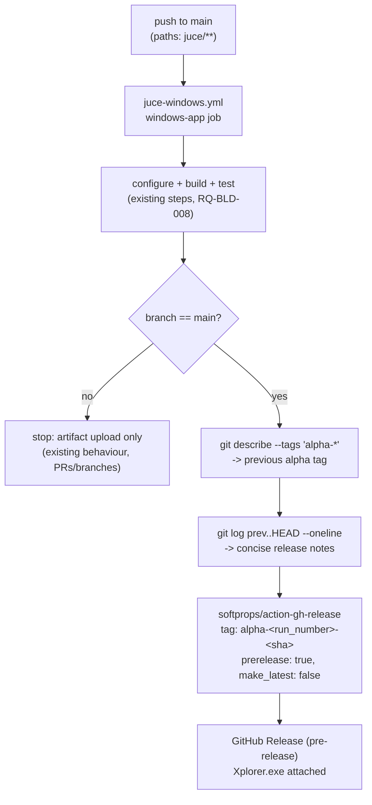

# ADR-BLD-001: Alpha Pre-Release on Every `main` CI Build

## Status
Proposed

<!-- Motivated by RQ-BLD-009 (alpha pre-release on every main push). New
functional area (build/release automation) distinct from the JUCE UI/model
architecture the ADR-JUC-* series covers, hence the ADR-BLD-* series. -->

## Context

`juce-windows.yml` (RQ-BLD-008) already builds `Xplorer.exe` (MSVC/x64) on
every push touching `juce/**`, uploading it as a CI artifact — but CI
artifacts expire (repo default retention), are not linked from the Releases
page, and carry no changelog. The owner wants every successful `main` build to
also produce a clearly-labelled **alpha/pre-release** GitHub Release, so
testers always have a current preview build without it ever being mistaken
for a production release (the existing tag stream, e.g. `v2025.12.7.1`,
RQ-BLD-002).

Two GitHub-native mechanisms are available and sufficient — no custom
scripting needed for the parts they cover:
- `softprops/action-gh-release` (already the de-facto standard action) creates
  a Release from a workflow, accepts `prerelease: true`, a tag, a body, and
  file assets in one step.
- Release **notes**: `git log <previous-alpha-tag>..HEAD --oneline` gives
  exactly "commits since the previous main-branch build" with no extra
  bookkeeping (no stored state — the previous alpha tag IS the bookmark).

## Decision

- **DEC-BLD-001 — Scope: `main` push only, Windows job only, additive step.**
  The alpha-release step SHALL run only when `github.ref == 'refs/heads/main'`
  on the existing `windows-app` job of `juce-windows.yml`, after the existing
  build/test/locate steps succeed — not on PRs, not on other branches, not as
  a new workflow. The Linux CI (`juce-ci.yml`, tests-only, no packaged binary)
  is out of scope (owner decision: Windows only, RQ-BLD-009). (RQ-BLD-009)

- **DEC-BLD-002 — Tag scheme: `alpha-<run_number>-<short-sha>`.** Monotonic
  (`run_number`) for human ordering + `short-sha` for exact traceability to a
  commit; the `alpha-` prefix keeps it lexically and visually distinct from
  production tags (`vX.Y.Z`) so the two streams can never collide or be
  confused on the Releases page. (RQ-BLD-009)

- **DEC-BLD-003 — Release notes = commit log since the previous alpha tag.** A
  step runs `git describe --tags --match 'alpha-*' --abbrev=0` (previous
  build) then `git log <that>..HEAD --pretty='- %s (%h)'` for the body; first
  ever alpha release (no prior tag) falls back to the last 20 commits so the
  step never fails on an empty range. This is genuinely "concise" (commit
  subjects only, no diffs) and requires no external tool. (RQ-BLD-009)

- **DEC-BLD-004 — `softprops/action-gh-release` with `prerelease: true`,
  `make_latest: false`.** `make_latest: false` is the mechanism that keeps a
  production release as GitHub's "Latest" badge even after a newer alpha is
  published — without it every alpha would silently become "Latest" and
  eclipse the real release, defeating the "never mistaken for production"
  requirement. (RQ-BLD-009)

- **DEC-BLD-005 — No retention/cleanup policy in this change.** Alpha releases
  accumulate indefinitely; the owner prunes manually if the Releases page gets
  noisy. Simpler, reversible, and not requested — revisit as a follow-up ADR
  if it becomes a real problem. (scope guard, no RQ — explicitly deferred)

## Consequences

- **Easier:** every `main` build is a one-click-downloadable, dated, changelog-
  bearing preview; no manual release-cutting for interim testing.
- **Harder / constrained:** the Releases page grows one entry per `main` push
  that touches `juce/**` (mitigated by DEC-BLD-005 — accepted, not solved,
  here); `GITHUB_TOKEN` needs `contents: write` permission on this job, absent
  today (`juce-windows.yml` currently requests no explicit `permissions:`
  block, defaulting to the repo setting) — must be added explicitly.
- **Neutral:** zero effect on the PR/branch build path (tests-only, same as
  today) and zero effect on the production tag/release process (RQ-BLD-002).

## Alternatives Considered

- **A separate `release-alpha.yml` workflow:** rejected — it would rebuild
  what `juce-windows.yml` just built (double build time, double MSVC cost) or
  need artifact hand-off between workflows, both more complex than one
  additive step in the job that already has the binary in hand.
- **Custom changelog generation (categorized by RQ/TASK prefix, etc.):**
  rejected as disproportionate — the owner asked for a "very concise summary",
  and a plain commit-subject list already satisfies that; a categorizing
  script is speculative complexity for a pre-release artifact.
- **GitHub's built-in `generate_release_notes: true`:** considered — it
  produces a fuller PR-based changelog (contributors, categories) which is
  more scaffolding than "concise summary since last build" asks for, and
  behaves inconsistently on repos with many direct-to-`main` commits (this
  one). The explicit `git log` approach in DEC-BLD-003 is simpler and matches
  the ask exactly.

## Diagram

