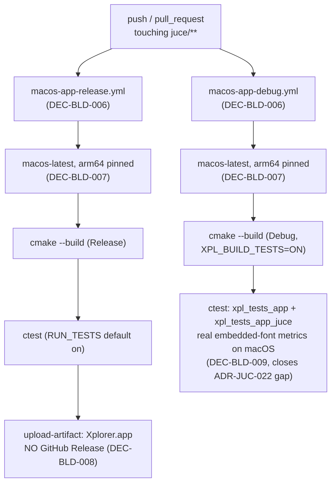

# ADR-BLD-002: macOS CI Build (arm64, Artifact-Only, Release + Debug)

## Status
Proposed

<!-- Motivated by RQ-BLD-011 (macOS Release build + CI artifact) and RQ-BLD-012
(macOS Debug build extending the RQ-GUI-047/048 font-fit verification to a
third platform). Sibling to ADR-BLD-001 (Windows alpha-release automation),
same functional area (build/release automation), hence ADR-BLD-002. Builds on
RQ-BLD-010 (workflow naming convention) and ADR-JUC-022 (the combo-box font
embedding whose fit guarantee this extends to macOS). -->

## Context

The JUCE GUI application has so far only been built as a native binary in CI
on Windows (`windows-app-release.yml`, `windows-app-debug.yml`); Linux CI
(`linux-headless-release.yml`) deliberately stays headless
(`XPL_BUILD_APP=OFF`, ADR-JUC-002) and never builds the GUI app or the
JUCE-linked test executable. macOS is a real target platform for the JUCE
port (RQ-BLD-002 originally names Windows as *primary*, not *exclusive*), and
nothing in CI currently builds it, so a macOS-only compile error or a
macOS-specific font-metric regression (ADR-JUC-022 already flagged that
embedded-font advance widths are deterministic per rasteriser, not
identical across platforms) would only be caught by the owner's own machine.

The owner scoped this explicitly: **arm64 only** (current Apple Silicon
hardware, no universal/Intel binary), **artifact-only** (no GitHub Release
publish, unlike the Windows alpha stream), and **a Debug job alongside
Release**, matching the Windows Release/Debug split and its rationale
(`#if JUCE_DEBUG` code only compiles in Debug, and the real-metrics
combo-box test only means something when it runs on the platform in
question).

## Decision

- **DEC-BLD-006 — Two workflows, same split as Windows, same naming rule.**
  `macos-app-release.yml` (Release, artifact upload) and
  `macos-app-debug.yml` (Debug, tests on, no artifact) — one build
  configuration per file, file/`name:`/job key identical
  (`macos-app-release`, `macos-app-debug`), per RQ-BLD-010. A single
  `macos-app.yml` carrying both jobs was rejected for the same reason the
  Windows workflow was split: one file name cannot describe two different
  build configurations. (RQ-BLD-010, RQ-BLD-011, RQ-BLD-012)

- **DEC-BLD-007 — arm64 only, pinned explicitly.** Both jobs run on
  `macos-latest` (Apple Silicon) with `-DCMAKE_OSX_ARCHITECTURES=arm64` set
  explicitly rather than left to the runner's default, so the scope decision
  is visible in the workflow file itself and not an accident of whatever
  `macos-latest` happens to resolve to. A universal (arm64+x86_64) binary is
  out of scope (owner decision) — see Alternatives. (RQ-BLD-011)

- **DEC-BLD-008 — Artifact-only: no GitHub Release, no alpha stream.**
  Unlike `windows-app-release.yml`, the macOS Release job does not gain a
  `permissions: contents: write` block or a `softprops/action-gh-release`
  step. ADR-BLD-001's alpha pre-release stream (DEC-BLD-001) stays scoped to
  `main`-branch Windows builds only; macOS builds are downloadable from the
  Actions run itself. This is a narrower, easily-extended starting point, not
  a rejection of ever adding a macOS release stream. (RQ-BLD-011)

- **DEC-BLD-009 — The Debug job closes the "font metrics unverified on
  macOS" gap ADR-JUC-022 left open.** `macos-app-debug.yml` builds with
  `XPL_BUILD_TESTS=ON` and runs the full suite, including
  `xpl_tests_app_juce` — the same JUCE-linked, real-embedded-font test that
  already runs on Windows. Because it measures actual `juce::Font` advance
  widths, running it on macOS is what turns "the embedded typeface should
  make widths deterministic across platforms" (ADR-JUC-022's own reasoning)
  into a build that would actually fail if that turned out to be wrong on
  this platform's text-rendering stack. No new test code is written — the
  existing JUCE-free and JUCE-linked suites are reused unchanged.
  (RQ-BLD-012, RQ-GUI-047, RQ-GUI-048, RQ-DSN-096, ADR-JUC-022)

## Consequences

- **Easier:** a macOS-specific compile error or font-metric regression now
  fails a CI run instead of surfacing only on the owner's machine; the owner
  gets a downloadable arm64 build from every run without any local Xcode
  setup.
- **Harder / constrained:** two more jobs to keep in step with any future
  toolchain change (e.g. a JUCE upgrade that changes macOS SDK requirements);
  Intel Mac users are not covered by CI (though nothing prevents them from
  building locally — RQ-BLD-001's plain CMake invocation is
  platform-agnostic).
- **Neutral:** zero effect on the Windows or Linux jobs; zero effect on the
  alpha-release stream (ADR-BLD-001), which remains Windows/`main`-only.
- **Reversible:** both workflows are additive files; dropping either (or
  widening to a universal binary, or adding a release-publish step later) is
  a local, narrow change.

## Alternatives Considered

- **Universal binary (arm64 + x86_64):** rejected for now — doubles build
  time for a slice of users (older Intel Macs) the owner did not ask to
  cover; can be added later by widening `CMAKE_OSX_ARCHITECTURES` without
  touching anything else in these workflows.
- **Extend the alpha pre-release stream (ADR-BLD-001) to macOS:** rejected —
  explicitly out of scope for this change ("artefact CI seulement"); would
  also need its own tag/notes design decision, which is a separate ADR-sized
  question if the owner wants it later.
- **A `workflow_dispatch` tests-toggle input, matching
  `windows-app-release.yml`:** rejected for now — not requested, and the
  Windows toggle exists for a specific manual-build workflow the owner uses;
  can be added later without any other change if the same need arises here.
- **Single combined `macos-app.yml` with both jobs:** rejected — would
  violate RQ-BLD-010 the same way the original `juce-windows.yml` did.

## Diagram

