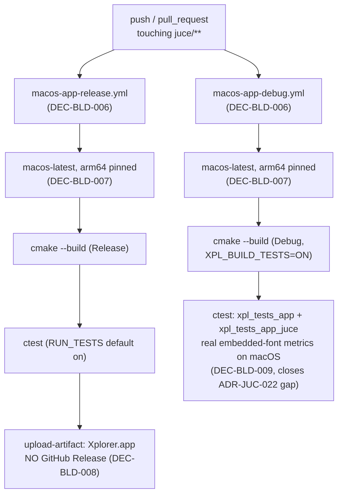

# ADR-BLD-002: macOS CI Build (arm64, Artifact-Only, Release + Debug)

## Status
Proposed

<!-- Motivated by RQ-BLD-011 (macOS Release build + CI artifact) and RQ-BLD-012
(macOS Debug build extending the RQ-GUI-047/048 font-fit verification to a
third platform). Sibling to ADR-BLD-001 (Windows alpha-release automation),
same functional area (build/release automation), hence ADR-BLD-002. Builds on
RQ-BLD-010 (workflow naming convention) and ADR-JUC-022 (the combo-box font
embedding whose fit guarantee this extends to macOS). -->

## Context

The JUCE GUI application has so far only been built as a native binary in CI
on Windows (`windows-app-release.yml`, `windows-app-debug.yml`); Linux CI
(`linux-headless-release.yml`) deliberately stays headless
(`XPL_BUILD_APP=OFF`, ADR-JUC-002) and never builds the GUI app or the
JUCE-linked test executable. macOS is a real target platform for the JUCE
port (RQ-BLD-002 originally names Windows as *primary*, not *exclusive*), and
nothing in CI currently builds it, so a macOS-only compile error or a
macOS-specific font-metric regression (ADR-JUC-022 already flagged that
embedded-font advance widths are deterministic per rasteriser, not
identical across platforms) would only be caught by the owner's own machine.

The owner scoped this explicitly: **arm64 only** (current Apple Silicon
hardware, no universal/Intel binary), **artifact-only** (no GitHub Release
publish, unlike the Windows alpha stream), and **a Debug job alongside
Release**, matching the Windows Release/Debug split and its rationale
(`#if JUCE_DEBUG` code only compiles in Debug, and the real-metrics
combo-box test only means something when it runs on the platform in
question).

## Decision

- **DEC-BLD-006 — Two workflows, same split as Windows, same naming rule.**
  `macos-app-release.yml` (Release, artifact upload) and
  `macos-app-debug.yml` (Debug, tests on, no artifact) — one build
  configuration per file, file/`name:`/job key identical
  (`macos-app-release`, `macos-app-debug`), per RQ-BLD-010. A single
  `macos-app.yml` carrying both jobs was rejected for the same reason the
  Windows workflow was split: one file name cannot describe two different
  build configurations. (RQ-BLD-010, RQ-BLD-011, RQ-BLD-012)

- **DEC-BLD-007 — arm64 only, pinned explicitly.** Both jobs run on
  `macos-latest` (Apple Silicon) with `-DCMAKE_OSX_ARCHITECTURES=arm64` set
  explicitly rather than left to the runner's default, so the scope decision
  is visible in the workflow file itself and not an accident of whatever
  `macos-latest` happens to resolve to. A universal (arm64+x86_64) binary is
  out of scope (owner decision) — see Alternatives. (RQ-BLD-011)

- **DEC-BLD-008 — ~~Artifact-only: no GitHub Release, no alpha stream.~~**
  *Superseded by DEC-BLD-010 (2026-07-29, same session), before ever being
  merged.* The original decision kept the macOS builds downloadable only from
  the Actions run, leaving ADR-BLD-001's alpha stream scoped to `main`-branch
  Windows builds. The owner asked instead that macOS — and both Debug
  configurations — publish alongside Windows, which DEC-BLD-010 records. Kept
  here rather than deleted so the reversal is legible. (RQ-BLD-011)

- **DEC-BLD-009 — The Debug job closes the "font metrics unverified on
  macOS" gap ADR-JUC-022 left open.** `macos-app-debug.yml` builds with
  `XPL_BUILD_TESTS=ON` and runs the full suite, including
  `xpl_tests_app_juce` — the same JUCE-linked, real-embedded-font test that
  already runs on Windows. Because it measures actual `juce::Font` advance
  widths, running it on macOS is what turns "the embedded typeface should
  make widths deterministic across platforms" (ADR-JUC-022's own reasoning)
  into a build that would actually fail if that turned out to be wrong on
  this platform's text-rendering stack. No new test code is written — the
  existing JUCE-free and JUCE-linked suites are reused unchanged.
  (RQ-BLD-012, RQ-GUI-047, RQ-GUI-048, RQ-DSN-096, ADR-JUC-022)

- **DEC-BLD-010 — One alpha pre-release per commit, four publishers, tag
  derived from the commit alone.** All four build workflows attach their
  binary to the *same* release, so a tester opens one page and finds every
  platform and configuration for that commit. Making that work forces the tag
  scheme to change: ADR-BLD-001's `alpha-<run_number>-<sha>` (DEC-BLD-002)
  cannot be used, because `github.run_number` is **per workflow** — the four
  publishers would each compute a different tag and produce four releases for
  one commit. ~~The tag becomes `alpha-<commit-count>-<short-sha>`, where
  `git rev-list --count HEAD` is identical in all four runs while keeping the
  monotonic ordering DEC-BLD-002 wanted; the short sha keeps the exact
  traceability.~~ *Tag format superseded by DEC-BLD-011 (2026-08-06) — the
  "derived from the commit alone" requirement below still holds.* The
  derivation, the notes and the create/upload sequence live in a single
  composite action (`.github/actions/alpha-prerelease`) rather than being
  copy-pasted four times — with four publishers, "they all compute the same
  tag" has to be a property of the code, not of review. Publication is
  idempotent and race-tolerant: whichever workflow arrives first creates the
  release, the others tolerate losing that race and upload with `--clobber`;
  the upload itself is unguarded, so a genuinely failed creation still fails
  the run. Assets are renamed on upload (`Xplorer-<os>-<arch>-<config>.<ext>`)
  so the four coexist and each states what it is. (RQ-BLD-009, RQ-BLD-011,
  RQ-BLD-013, ADR-BLD-001)

- **DEC-BLD-011 — Tag's per-commit component becomes HEAD's UTC committer
  timestamp, `YYYYMMDD-HHmmSS`, not `<commit-count>-<short-sha>`.** Owner
  report (2026-08-06): the hex short-sha reads as noise next to "alpha". The
  replacement must still satisfy DEC-BLD-010's own hard constraint — all four
  independently-run publishers compute the identical tag for one commit — so
  it cannot be "now" (`date` at the moment each workflow happens to run):
  the four jobs finish seconds to minutes apart and would each mint a
  different tag, silently reintroducing the exact four-releases-per-commit
  bug DEC-BLD-010 was written to fix. Reading the timestamp **off the commit
  object itself**
  (`TZ=UTC git log -1 --format=%cd --date=format-local:'%Y%m%d-%H%M%S' HEAD`)
  keeps it a pure function of `HEAD`, identical everywhere `HEAD` is the same
  commit — the same property `git rev-list --count HEAD` had. `TZ=UTC` is
  forced explicitly rather than trusting each runner's own default, so
  `windows-latest` and `macos-latest` cannot disagree even if their
  images ever diverge on that default. Committer date, not author date: it
  reflects when the object was actually written, not a possibly-stale
  original authoring time carried through a rebase. **Traded off knowingly:**
  the short-sha's exact-commit traceability is no longer in the tag text
  itself (the release remains linked to its commit through GitHub's own
  tag→commit association, so it is not lost, only no longer visible at a
  glance); two commits within the same UTC second would collide — accepted
  as negligible for this project's actual commit cadence rather than solved
  with an additional disambiguator the owner did not ask for. (RQ-BLD-013)

## Consequences

- **Easier:** a macOS-specific compile error or font-metric regression now
  fails a CI run instead of surfacing only on the owner's machine; the owner
  gets a downloadable arm64 build from every run without any local Xcode
  setup.
- **Harder / constrained:** two more jobs to keep in step with any future
  toolchain change (e.g. a JUCE upgrade that changes macOS SDK requirements);
  Intel Mac users are not covered by CI (though nothing prevents them from
  building locally — RQ-BLD-001's plain CMake invocation is
  platform-agnostic).
- **Neutral:** zero effect on the Windows or Linux jobs; zero effect on the
  alpha-release stream (ADR-BLD-001), which remains Windows/`main`-only.
- **Reversible:** both workflows are additive files; dropping either (or
  widening to a universal binary, or adding a release-publish step later) is
  a local, narrow change.
- **(Amendment, DEC-BLD-011)** Alpha tags read as `alpha-YYYYMMDD-HHmmSS`
  instead of `alpha-<count>-<sha>` — a tester can read the build date off the
  tag itself; the exact commit is still one click away via the release, just
  not spelled out in the tag text.

## Alternatives Considered

- **Universal binary (arm64 + x86_64):** rejected for now — doubles build
  time for a slice of users (older Intel Macs) the owner did not ask to
  cover; can be added later by widening `CMAKE_OSX_ARCHITECTURES` without
  touching anything else in these workflows.
- **Extend the alpha pre-release stream (ADR-BLD-001) to macOS:** rejected —
  explicitly out of scope for this change ("artefact CI seulement"); would
  also need its own tag/notes design decision, which is a separate ADR-sized
  question if the owner wants it later.
- **A `workflow_dispatch` tests-toggle input, matching
  `windows-app-release.yml`:** rejected for now — not requested, and the
  Windows toggle exists for a specific manual-build workflow the owner uses;
  can be added later without any other change if the same need arises here.
- **Single combined `macos-app.yml` with both jobs:** rejected — would
  violate RQ-BLD-010 the same way the original `juce-windows.yml` did.

## Diagram

