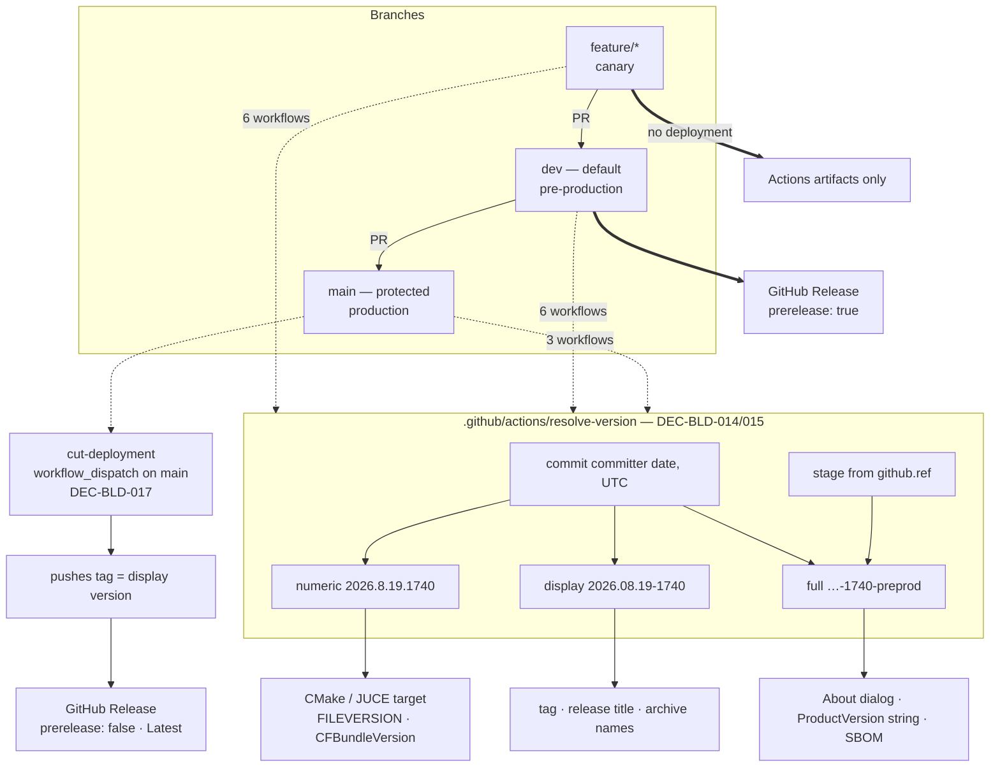

# ADR-BLD-003: Two-Branch Delivery, Commit-Derived Version and Deployment Streams

## Status
Proposed (session BLD, 2026-08-16).

<!-- Motivated by RQ-BLD-019 (two branches, three streams), RQ-BLD-020 (version derivation),
RQ-BLD-023 (workflow layout) and RQ-BLD-028 (production gate). Supersedes ADR-BLD-001's
single-stream model. Per-platform build and packaging decisions live in ADR-BLD-004, so that
this file stays about *when and under what name* something is delivered, and that one about
*how it is built and wrapped*. -->

## Requirements
RQ-BLD-019, RQ-BLD-020, RQ-BLD-023, RQ-BLD-028. Reworks RQ-BLD-015, RQ-BLD-016.
Supersedes RQ-BLD-009, RQ-BLD-010, RQ-BLD-013, RQ-BLD-017, RQ-BLD-018.

## Context

The project has one long-lived branch. Every push to `main` publishes an `alpha-*` pre-release
carrying four bare binaries (`ADR-BLD-001`, `ADR-BLD-002`), and there has never been a production
stream — RQ-BLD-009 presumed one and it was never built. So there is nowhere to integrate a change
before it reaches the only page a user is pointed at, and nothing a user could be pointed at that
is not labelled alpha.

Four facts about the existing pipeline constrain anything that replaces it, and they were
established by defects, not by preference:

1. **The release tag must be a function of the commit.** Four workflows publish into one release.
   `DEC-BLD-010` derived the tag from a commit count and short SHA precisely because
   `github.run_number` is per-workflow and would have produced four releases for one commit;
   `DEC-BLD-011` changed the *format* to the commit's own committer timestamp and kept the
   property, forcing `TZ=UTC` so runners on three operating systems agree.
2. **Publication must be idempotent.** Whichever workflow arrives first creates the release; the
   others only upload. Losing that race is not an error.
3. **A workflow file names exactly one configuration** (`RQ-BLD-010`), so a pull-request status
   check reads as its own os/target/configuration without cross-referencing.
4. **The version is written out four times and nothing keeps the copies equal** —
   `juce/CMakeLists.txt`, `juce/app/CMakeLists.txt`, `MainComponent.cpp:963`
   (`showAboutDialog("Xplorer 0.1.0")`) and the committed SBOM.

The owner's requirement adds a second long-lived branch, a third (non-publishing) stream, and a
version of the shape `YYYY.MM.DD-XX` where `XX` is *"le numéro de build sur cette journée,
quelle que soit la branche"*. That last clause is the one that does not fit, and most of this
ADR is about what was done with it.

## Decision

### DEC-BLD-013 — Two long-lived branches, `dev` as the default, `main` protected explicitly

`main` is production, `dev` is integration and the **repository default**, `feature/*` are canary.
Making `dev` the default is not cosmetic: it is what makes pull requests target `dev` without
anyone remembering to change the base, and it is what points the AGNOS rule "never work on the
default branch" at the branch features are actually cut from.

Its consequence is easy to miss and is recorded here for that reason: **`main` stops being the
default and therefore stops being protected by default.** A protection rule naming `main`
explicitly is part of this decision, not an afterthought.

*Rejected:* keeping `main` as default and adding `dev` beside it. It leaves every new pull request
pointing at production until someone re-bases it, which is a mistake that only shows up after it
has been merged.

### DEC-BLD-014 — The version is derived from the commit, never assigned by a counter

```
version = <commit committer date, UTC> formatted YYYY.MM.DD-HHMM   + stage suffix
```

**The owner asked for a daily build counter across all branches. It was put to them that this
cannot be built without shared mutable state, and they chose the derivation instead** (2026-08-16).
The reasoning is recorded because the counter is the obvious thing to reach for and will be
proposed again:

- Six workflows build one `dev` commit concurrently. A counter must hand all six the same value,
  which means an atomic reservation — GitHub has no such primitive.
- The default `GITHUB_TOKEN` cannot write repository variables; a counter kept there needs a
  stored PAT and a global `concurrency` lock, serialising all fifteen workflows behind one gate.
- Canary builds consume numbers while publishing nothing, so the counter cannot be reconstructed
  by counting releases — it must be persisted somewhere that is written even when nothing ships.
- Re-running a failed workflow would burn a fresh number, giving one commit two versions.

`HHMM` keeps the shape the owner wanted, orders identically, is globally unique without any state,
and — the property that actually matters — is computed identically by six workflows that never
talk to each other. That is fact (1) from the Context, preserved rather than rebuilt.

**Three forms, because one string cannot serve every consumer.** This is not gold-plating; it is
forced by Windows. `FILEVERSION` is four **16-bit** fields, so `2026.8.19.1740` fits and the
unpunctuated `20260819` the owner first wrote overflows, and no field can hold `-preprod` at all.

| form | example | consumers |
|---|---|---|
| numeric | `2026.8.19.1740` | CMake, JUCE target, `FILEVERSION`, `CFBundleVersion` |
| display | `2026.08.19-1740` | tag, release title, archive names |
| full | `2026.08.19-1740-preprod` | About, `ProductVersion` string, `CFBundleShortVersionString`, SBOM |

**A tag ref is the production stream, not an unknown one.** The stage is read from `github.ref`,
and the obvious rule — `main` is production, `dev` is pre-production, everything else is canary —
is wrong for the one case that matters most: a production build is triggered by the tag
`cut-deployment` pushes (DEC-BLD-017), so it never sees `refs/heads/main`, and "everything else"
would have stamped every production binary `-canary`. Tags are minted by that action alone, so
matching `refs/tags/*` as production states the truth rather than patching around it. *Found by the
test fixture of TASK-BLD-002 before any workflow existed;* it is the kind of defect that would
otherwise have surfaced on the first real deployment, in the About box of a shipped binary.

**The stage suffix travels everywhere it can be text**, not only into the About box as the
requirement first said. Otherwise a pre-production executable and a production one carrying the
same number are indistinguishable in their file properties and in their SBOM — the numeric field
is the single place it cannot go, because it holds integers.

*Rejected:* semantic versioning (`MAJOR.MINOR.PATCH`), which the unimplemented RQ-BLD-017/018
draft assumed. It needs a human to decide each bump and a check that the pushed tag agrees with a
declared literal; the owner's model wants the version to state *when this artefact was built*,
which a date does directly and a semantic triple only by convention.

### DEC-BLD-015 — One derivation, in a composite action, injected outward

`.github/actions/resolve-version` is the only place a version is computed. It emits the three forms
as step outputs; CMake takes the numeric form on the configure line and everything else flows from
there (`JUCE_APPLICATION_VERSION_STRING` is already wired at `juce/app/CMakeLists.txt:87`).

This is what turns RQ-BLD-015 from *single declaration* into *single derivation*. The distinction
matters: with a computed version there is no literal anywhere to be the authoritative copy, so
"no other file contains a literal product version" becomes checkable by searching for **any**
version-shaped literal, not by comparing four files.

**One consumer cannot be served and it is stated rather than quietly dropped:** the workflow run's
own title. `run-name:` is evaluated before the run starts and can only read the `github`, `inputs`
and `vars` contexts — never a job output — so the version reaches the run through its **summary**
and through every artifact name, not through the title in the Actions list.

### DEC-BLD-016 — Ten thin workflows over composite actions

`<os>-<arch>-<config>-<stage>`, file name = `name:` = job key, one job per file — RQ-BLD-010's
property, extended to a matrix that now also has an architecture and a stream. Every step
delegates to a composite action, so the build logic exists once.

*Rejected: reusable workflows (`workflow_call`).* They remove the duplication just as well, but a
called workflow reports its status check as `<caller> / <called job>`, which is no longer the
single self-describing string the naming rule exists to produce. The rule and the mechanism are in
direct conflict; the rule wins, because it is the thing the owner asked for.

*Rejected: three workflows with a platform × configuration matrix.* Fewest files by far, and it
turns every check name into `preprod / build (windows, release)`. Same conflict, same outcome.

*Rejected: one workflow per platform, branch-filtered.* `on.push.branches` can select the stream,
but then one file carries three names, and a check cannot say which stream it ran for.

`linux-headless-release` stays outside the scheme entirely. It builds no application and deploys
nothing; giving it a deployment-shaped name would state something false about it.

### DEC-BLD-017 — Production is cut by an explicit action, which computes and pushes the tag

A push to `main` publishes nothing. A `workflow_dispatch` on `main` derives the version, pushes it
as a tag, and the three production workflows trigger on that tag.

**The human never types a version.** This resolves a contradiction the owner's requirement carried:
a tag was to trigger production, while the version was to be assigned by the build — so the tag
would have had to name something that did not exist yet. Computing the tag removes the possibility
of disagreement rather than checking for it afterwards, which is why RQ-BLD-018's
tag-versus-declaration check is superseded instead of carried forward.

**Accepted, not solved: `main` rebuilds, so production carries a different version from the
pre-release that was tested.** The merge into `main` is a new commit with a new timestamp. The
alternative — promoting the `dev` artefact instead of rebuilding — contradicts the owner's
requirement that `main` always builds in Release, and would ship a binary whose embedded version
says `-preprod`. The mitigation is that production release notes name the pre-release they promote,
so the chain stays readable.

### DEC-BLD-024 — One trigger event per stream, chosen so no two ever fire on the same commit

The generated canary and preprod triggers originally carried both `push` and `pull_request`,
inherited unexamined from the superseded `ADR-BLD-002` workflows. On a feature branch with an open
PR the two fire on the same commit — `push` builds the branch tip, `pull_request` builds the PR's
merge commit against `dev` — doubling every canary build for no benefit once `dev` has not moved
since the branch was cut, which `TASK-BLD-010`'s first real PR (#49) made visible: eight canary
runs for four platform/configuration cells. `linux-headless-release` (RQ-BLD-007) carried the
identical pair, unrestricted by branch, with the identical defect.

*Revised twice in the same session before merging*, once the owner walked through what each stream
is actually for:

- **Canary (`feature/*`, anything that is not `main` or `dev`) — `push` alone,
  `branches-ignore: [main, dev]`.** Fast, unconditional feedback on every push to a feature branch;
  no need to open a pull request first to get a build. This is the opposite of the first cut of this
  decision, which put canary on `pull_request` alone — reversed because gating even the *first*
  feedback behind opening a PR was slower than the owner wanted, not because the duplication
  argument above was wrong.
- **Preprod (`dev`) — both `push: branches: [dev]` and `pull_request: branches: [dev]`, but
  only the `push` one publishes.** A PR that targets `dev` builds and tests the merge result before
  it lands — real verification, not a courtesy — but `PUBLISH`'s own `if: github.event_name ==
  'push'` guard keeps it from creating a pre-release for a commit that was never merged. Only the
  push that actually lands on `dev` publishes. The PR-triggered build's own version stage still
  reads `-canary` (resolve-version.sh's existing `pull_request` → `refs/pull/N/merge` rule,
  DEC-BLD-020) — accurate, since that exact commit was never merged into `dev`, whichever workflow
  built it.
- **`linux-headless-release` — `workflow_dispatch` only, no automatic trigger at all.** Owner
  decision: rather than pick which of `push`/`pull_request` it should keep, drop both — it runs by
  hand when Linux coverage is wanted. It was, at that moment, the *only* Linux build in the
  pipeline, so this traded automatic Linux regression coverage for a pipeline whose triggers are
  legible at a glance — a trade taken as temporary and **since closed**: `TASK-BLD-006` added
  `linux-x64` to the generated matrix, so Linux now has five deployment workflows of its own and
  this one is again just the headless non-UI suite.

Each stream now has exactly one event that can put a commit through it — no single generated
workflow file fires twice on the same commit anymore, which was the defect PR #49 exposed. What
this decision does **not** remove is two *different* streams both building the same commit: a push
to a feature branch that already has an open PR into `dev` fires canary (its own `push`) **and**
preprod's verification build (`pull_request`, base `dev`) at once — eight runs, not four, for that
one push. That is accepted, not overlooked: the two builds test different things (the branch tip,
and what `dev` would become if the PR merged), so it is overlap between two purposes, not the same
check running twice.

| Event | canary (×4) | preprod (×4) | prod (×2) | `linux-headless-release` |
|---|:-:|:-:|:-:|:-:|
| `push` to `feature/*`, no open PR | ✅ | — | — | — (manual only) |
| `push` to `feature/*` **with** an open PR into `dev` | ✅ (`push`) | ✅ (`pull_request`, build+test only) | — | — |
| PR opened/updated, base `dev` | — | ✅ (`pull_request`, build+test only) | — | — |
| that PR **merged** into `dev` (= a `push` lands on `dev`) | — | ✅ (`push`, publishes) | — | — |
| PR **closed without merging** | — | — (`closed` is not in `pull_request`'s default types) | — | — |
| `push` directly to `main` (ruleset blocks only delete + force-push) | — | — | — | — |
| `cut-deployment` (`workflow_dispatch` on `main`) → pushes a version tag | — | — | ✅ (tag `push`) | — |

*Rejected: canary and preprod both on `pull_request` only.* Matches the "verification happens
through review" philosophy uniformly, but the owner wants canary's feedback available before a PR
exists — reserving pull-request gating for the branch that actually publishes.

*Rejected: keep both events on every stream, accept the duplication.* Was the status quo;
accepted as a defect once the duplication was counted rather than assumed harmless.

*Rejected: give `linux-headless-release` the same push/pull_request split as canary or preprod.*
Would restore automatic Linux coverage, but the owner explicitly asked for it to have no trigger to
reason about while the rest of the scheme was being re-examined; revisit when `TASK-BLD-006` gives
Linux a real place in the generated matrix instead.

## Consequences

**Easier.** There is somewhere to integrate before publishing, and a stream a user can be pointed
at. A version now identifies an artefact everywhere it is stated, so a bug report names one build
rather than "the latest alpha". Re-running a failed workflow reproduces the same version.

**Harder.** Ten workflow files instead of five, and the build logic moves one level of
indirection away into composite actions — the same trade DEC-JUC-075 made for the background
painter, for the same reason and with the same cost. Cutting production is now a deliberate act
rather than a side effect of merging.

**Constrained.** The version can never carry information that is not in the commit. Anything that
would need a counter, a sequence or a human decision is out of reach by construction — that is the
price of the property that makes six concurrent workflows agree.

**Unchanged.** The idempotent publish (fact 2), the one-configuration-per-workflow rule (fact 3),
`linux-headless-release`, and everything about how the application itself is built.

**Two commitments that only a reader can keep.** `main` must carry an explicit protection rule, and
the AGNOS git skill must learn that sessions branch from `dev`. Neither is enforced by CI.

## Alternatives Considered

- **Global daily build counter, as originally specified.** Rejected under DEC-BLD-014 after the
  cost was put to the owner: a stored PAT, a global serialising lock, an unresolved re-run policy,
  and persistence that must survive builds which publish nothing.
- **`github.run_number` as the counter.** Rejected for the same reason `DEC-BLD-010` rejected it:
  it is per-workflow, so the six `dev` workflows would compute six different versions for one
  commit.
- **Semantic versioning with a hand-pushed `vX.Y.Z` tag** (the unimplemented RQ-BLD-017/018 draft).
  Rejected under DEC-BLD-014 — see there.
- **Every push to `main` deploys.** Simplest possible gate, and it makes every merge a public
  production release. The owner chose an explicit cut.
- **Promote the `dev` artefact into production rather than rebuild.** Ships exactly what was
  tested, which is the stronger supply-chain position — and contradicts "`main` is always built in
  Release" while shipping a binary that reports `-preprod`. Recorded under DEC-BLD-017 as accepted
  rather than solved.
- **Keep `main` as the default branch.** Rejected under DEC-BLD-013.

## Diagram


