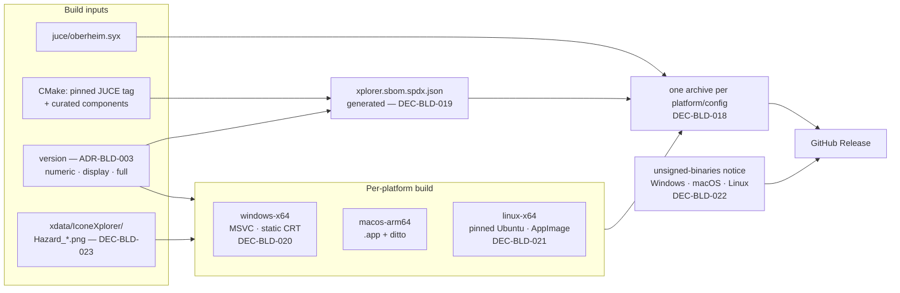

# ADR-BLD-004: Deployment Packaging, per Platform

## Status
Proposed (session BLD, 2026-08-16).

<!-- Motivated by RQ-BLD-021 (what a deployment contains), RQ-BLD-022 (generated SBOM),
RQ-BLD-024 (Windows Debug runtime), RQ-BLD-025 (Linux GUI + AppImage), RQ-BLD-026 (application
icon) and RQ-BLD-027 (unsigned-binaries notice). ADR-BLD-003 decides *when* something is
delivered and under *what name*; this file decides *how it is built and wrapped*. Refines
ADR-ABT-001 (the SBOM's producer) and ADR-BLD-002 (the macOS build). -->

## Requirements
RQ-BLD-021, RQ-BLD-022, RQ-BLD-024, RQ-BLD-025, RQ-BLD-026, RQ-BLD-027.
Refines RQ-BLD-014, RQ-BLD-002, RQ-BLD-008.

## Context

A deployment must now carry three things per platform — executable, `oberheim.syx`, SBOM — where
today it carries one bare binary. Auditing the tree against that turned up four gaps, three of
which are live defects rather than missing features:

1. **`oberheim.syx` reaches no release at all.** It is copied beside the executable by CMake
   (`juce/app/CMakeLists.txt`, `POST_BUILD`), and no workflow uploads it. A user downloading
   `Xplorer-windows-x64-release.exe` today gets an application whose File > New cannot work.
2. **The SBOM is a committed file, not a generated one.** `juce/app/sbom/xplorer.sbom.spdx.json`
   is copied beside the executable by the same mechanism. It cannot state a version that is only
   known at build time.
3. **Windows Debug binaries are already published and are not distributable.** No
   `MSVC_RUNTIME_LIBRARY` policy is set anywhere in the CMake tree, so the build takes the dynamic
   debug CRT — `MSVCP140D.dll`, `VCRUNTIME140D.dll`, which Microsoft does not permit redistributing
   and which exist only where Visual Studio is installed. `windows-app-debug.yml` has been
   uploading such a binary into every alpha pre-release. Under RQ-BLD-019 the `dev` stream ships
   Debug deliberately, so this stops being incidental.
4. **The application has no icon of any kind.** `juce_add_gui_app` declares neither `ICON_BIG` nor
   `ICON_SMALL` and `juce/app/assets/` holds no icon file — which is why the executable and the
   main window show the platform's generic one, and why the dialogs of RQ-GUI-070 inherited a
   default before they were given their own.

There is no Linux GUI build to audit: CI covers only `linux-headless-release`, which builds the
non-UI layers.

## Decision

### DEC-BLD-018 — A deployment asset is one archive per platform and configuration

Executable (or bundle), `oberheim.syx`, generated SBOM. Named for version, os, architecture and
configuration, so the six assets of a `dev` deployment coexist on one release page and each states
what it is.

*Rejected:* three loose assets per platform. GitHub requires unique asset names on a release, so
six configurations would need eighteen prefixed files and the user would have to work out which
three belong together. The archive makes the grouping structural.

On macOS the archive continues to be produced with `ditto`, not `zip` — ADR-BLD-002's reasoning is
unchanged: it is the macOS-native archiver and it preserves the bundle's structure.

### DEC-BLD-019 — The SBOM is generated by the build, from what the build itself knows

A build step emits `xplorer.sbom.spdx.json` with the full version form in its describing package.
Its content comes from CMake's own knowledge — the pinned JUCE tag, the project version, the
declared third-party components — rather than from a file kept in step by hand.

**What this decision does not claim, stated because the gap is real:** it is not automatic
discovery. GitHub's dependency-graph SPDX export — the producer ADR-ABT-001 (DEC-ABT-002) named as
the eventual replacement — does not observe CMake `FetchContent`, so it would emit an SBOM for this
repository that omits JUCE, its largest dependency by far. Generic binary scanners fare little
better against a statically-linked C++ target. The curated component list therefore remains data a
human maintains; what the build owns is the *version* and the *pinned dependency versions*, which
are exactly the fields that went stale before.

The consumer side is untouched: SPDX 2.3 JSON, same file name, same sibling-of-the-executable
location, absence still handled as a normal condition (RQ-BLD-014, RQ-GUI-057). Swapping in a real
generator later remains a change to this step alone.

### DEC-BLD-020 — Windows links the static C runtime, set once for the whole tree

```cmake
set(CMAKE_MSVC_RUNTIME_LIBRARY "MultiThreaded$<$<CONFIG:Debug>:Debug>")
```

set **before** JUCE is made available, so every target inherits it.

*The placement is the decision, not the value.* `MSVC_RUNTIME_LIBRARY` is a per-target property;
setting it on `XplorerApp` alone while JUCE keeps the dynamic runtime does not produce a subtly
different binary — it fails to link, with `LNK2038`. Writing it as a directory-scope variable ahead
of `FetchContent_MakeAvailable` is what makes application and dependency agree by construction.

*Rejected: publish `RelWithDebInfo` instead of `Debug`.* It solves the runtime problem and loses
the reason the Debug binary is published in the first place — `jassert` is compiled out, so a
tester reproducing a bug gets no assertion. RQ-BLD-013's rationale ("Debug binaries are published
because they are the ones that log their assertions") still holds.

*Rejected: ship the debug CRT alongside.* Microsoft's redistribution licence does not permit it.

### DEC-BLD-021 — Linux is `x64`, built on a pinned older image, shipped as an AppImage

The GUI build needs X11, Xrandr, Xinerama, Xcursor, Xcomposite, Xext, FreeType, Fontconfig, ALSA
and GL development packages — and **not** libcurl or WebKit, because `JUCE_USE_CURL=0` and
`JUCE_WEB_BROWSER=0` are already set on the target.

**The runner is pinned to the oldest supported Ubuntu image, never `ubuntu-latest`.** glibc is
backward- but not forward-compatible, so a binary linked on a newer image refuses to start on an
older distribution — and it does so on the user's machine, where nobody is watching CI. Pinning is
what keeps the failure inside the pipeline.

**AppImage, chosen for the user** (owner, 2026-08-16: *"ce doit être simple pour l'utilisateur — les
geeks compileront les sources de toute façon"*). A bare ELF would push the whole shared-library
matrix onto the person downloading it.

*Note:* `linux-arm64` was in the owner's first list and `linux-x64` was not; the owner corrected it
to `x64`. Recorded so the arm64 names in the original statement are not read as a dropped
requirement.

**`oberheim.syx` and the SBOM go INSIDE the AppImage, not beside it** — settled when the packaging
was actually written (TASK-BLD-006), and it is the same answer the macOS branch already gives for
the same reason. The application resolves both files from its own executable's directory
(RQ-GUI-008, RQ-BLD-014); inside a mounted AppImage that directory is the read-only squashfs, so
copies left next to the `.AppImage` would never be looked at. They therefore sit in
`AppDir/usr/bin/` alongside the binary, and the deployment archive holds exactly one item — the
AppImage — exactly as the macOS archive holds exactly one `.app`.

**Two build-time dependencies of the packaging step, found by running it rather than by reading
about it:**

- `appimagetool` no longer lives in `AppImage/AppImageKit`. That repository's release assets now
  404, so the `…/AppImageKit/releases/download/13/appimagetool-x86_64.AppImage` URL copied across
  most of the internet is dead rather than merely dated. The pin is
  `AppImage/appimagetool` **1.9.0**.
- `appimagetool` shells out to `desktop-file-validate` and **aborts** when it is absent. It is not
  on the GitHub runner image, so the packaging action installs `desktop-file-utils` itself.

*Accepted, and stated rather than hidden:* `appimagetool` downloads its type-2 **runtime** from
`type2-runtime/releases/download/continuous/` at package time. That is an unpinned input in a
project that pins everything else (RQ-BLD-001). It is accepted because upstream publishes no
versioned runtime release — pinning would mean pinning to the same moving `continuous` URL and
buying nothing — and because the runtime is the AppImage's launcher shim, not the product. It does
mean the Linux packaging step needs network access and can break from upstream alone.

**The GUI compile itself failed on first real CI execution, found only once TASK-BLD-006 actually
ran: `Logger.cpp` and the model layer's `XpanderTone*.cpp` all include `<format>` (C++20), which
GCC's libstdc++ implements only from GCC 13. The pinned image's GCC 11 does not ship the header at
all.** Two ways out were considered and rejected before the one that shipped:
- *Lower `CMAKE_CXX_STANDARD` below 20* — rejected outright, owner instruction: the standard is a
  project-wide decision and not something a Linux packaging detail gets to downgrade.
- *Install a newer GCC on the runner via the `ubuntu-toolchain-r/test` PPA* — rejected: it does
  not touch the pinned image's glibc, but it does risk a `g++-13`-linked binary requiring a
  libstdc++ ABI (`GLIBCXX_3.4.3x`) newer than the pinned image's default `libstdc++.so.6` ships,
  which is the same class of failure — visible only on the user's older machine — that the glibc
  pin exists to catch in CI instead. The owner's own words on being asked: *"ca peut casser un max
  de dépendances."*
- **Shipped: `midiapp::service::formatStr()`** (`framework/include/midiapp/service/PortableFormat.hpp`),
  a thin wrapper that forwards to real `std::format` wherever the standard library provides it
  (Windows, macOS, and Linux whenever `<format>` is restored to the pinned image) and falls back to
  a portable `{}`-substitution implementation only where it is absent. `Logger.cpp`'s one chrono
  format call (`"{:%F %T}"`) is hand-rolled with `gmtime_r`/`put_time` instead, since chrono-format
  needs the same missing header. The C++ standard stays 20, the toolchain and the runner pin are
  both untouched, and the special case lives entirely in application code. [RQ-BLD-025]

### DEC-BLD-022 — The binaries are not signed, and every deployment says so

No Apple Developer ID, no Windows code-signing certificate. Owner decision, 2026-08-16: an Apple
Developer Program membership is 99 USD/year and is the only route to a Developer ID certificate and
to notarisation; the owner declines to fund it for an AGPL project, and a Windows certificate is
the same recurring cost with the same answer.

Each of the three platforms then blocks the download in its own way, and each looks to a user like
a broken build:

| | what the user sees | what they must do |
|---|---|---|
| Windows | SmartScreen, *"Windows protected your PC"* | More info → Run anyway |
| macOS | Gatekeeper, *"Apple could not verify…"* | System Settings → Privacy & Security → Open Anyway |
| Linux | nothing happens | `chmod +x`, then `--appimage-extract-and-run` if FUSE 2 is absent |

**The macOS instruction must not tell the user to Control-click → Open.** That bypass was the
standard advice for a decade and **macOS 15 removed it**; an instruction that no longer works is
worse than none.

The notice is generated with the deployment from one shared source, identical in both streams —
not written by hand per release, where it would drift or be forgotten exactly when a new user needs
it. The application itself already runs unsigned on Apple Silicon: the linker applies an ad-hoc
signature, so the binary is valid and it is only quarantine that intervenes.

### DEC-BLD-023 — The existing icon artwork is reused in place

`xdata/IconeXplorer/Hazard_256.png` and its siblings become `ICON_BIG`/`ICON_SMALL` on the JUCE
target; JUCE generates the Windows `.ico` and the macOS `.icns` from them, and the AppImage takes
the same PNG for its desktop entry. One source, three platforms, no new asset. `Xplorer.ico` stays
as the archived original and is not a build input.

**ADR-GUI-001's "no binary asset" rule is not being broken.** DEC-GUI-001-A governs
*control-surface* icons — geometry painted every frame, which must scale with the canvas and be
readable by a test. An application icon is OS chrome consumed by the shell at fixed sizes, the same
category as `about.jpg` and the three `menu_*.png` already kept verbatim from the reference.

*Rejected:* hand-authoring an application icon as a `juce::Path` for consistency with
`ShortcutIcons.cpp` and `DialogIcons.cpp`. It would be new work to reproduce artwork the repository
already contains, for a surface where nothing scales dynamically.

## Consequences

**Easier.** A downloaded deployment is complete: the application starts, File > New works, and the
dependency window has something to read. The Windows Debug binary becomes usable by someone without
Visual Studio, which it is not today. Linux becomes a real target rather than a test platform, and
every platform finally shows the product's own icon.

**Harder.** Three new build steps to keep working — SBOM generation, AppImage packaging, archive
assembly — and a Linux runner image that must be advanced deliberately rather than tracking
`ubuntu-latest`. Static-CRT Windows binaries are larger, and a CRT security fix now requires a
rebuild rather than a system update; accepted, because the alternative is a binary that does not
start.

**Constrained.** The SBOM's component list stays human-maintained until a generator exists that
understands `FetchContent`. Unsigned binaries mean the notice is load-bearing: if it is dropped
from the release notes, the deployment reads as broken.

**Unchanged.** How the application is compiled on Windows and macOS (ADR-BLD-002), the SBOM's
format, name, location and absence handling (ADR-ABT-001), and `linux-headless-release`.

## Alternatives Considered

- **Three loose assets per platform instead of an archive.** Rejected under DEC-BLD-018 — eighteen
  prefixed files and no structural grouping.
- **`RelWithDebInfo` in place of `Debug` for the pre-production stream.** Rejected under
  DEC-BLD-020: it removes the assertions that are the reason to ship a Debug build.
- **GitHub's dependency-graph SPDX export as the SBOM generator.** Rejected under DEC-BLD-019: it
  does not see `FetchContent`, so it would omit JUCE.
- **Bare ELF, or a `.deb`, instead of an AppImage.** The ELF pushes the library matrix onto the
  user; the `.deb` covers one distribution family and needs a repository to be worth having.
- **Buying an Apple Developer ID.** Rejected by the owner on cost, for an AGPL project.
- **Hand-authored vector application icon.** Rejected under DEC-BLD-023.

## Diagram


