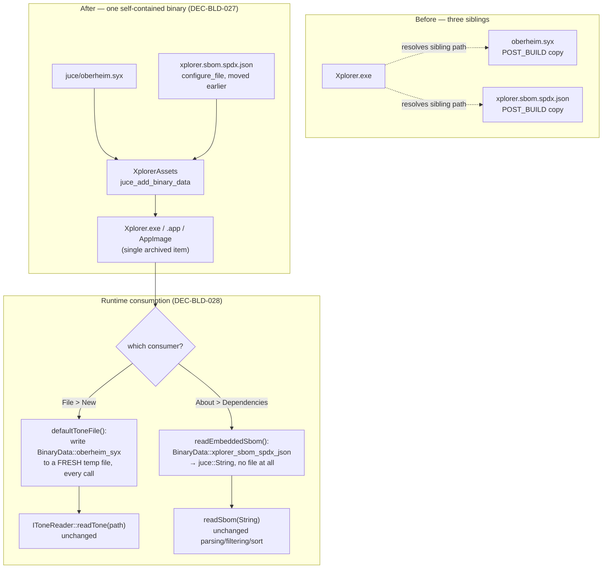

# ADR-BLD-005: Embed the Default Patch and the SBOM as Binary Data

## Status
Accepted (session BLD, 2026-08-18).

<!-- Motivated by an owner report: the deployment currently ships three loose parts
(executable, oberheim.syx, xplorer.sbom.spdx.json) sitting as siblings on disk, which
means either sibling can be edited, deleted or substituted without touching the
executable at all. The owner wants one self-contained, tamper-resistant binary.
Supersedes ADR-JUC-032's DEC-JUC-100 and ADR-ABT-001's DEC-ABT-002/DEC-ABT-007;
narrows ADR-BLD-004's DEC-BLD-018 and DEC-BLD-021. -->

## Requirements
RQ-BLD-014 (amended), RQ-BLD-021 (amended), RQ-BLD-022 (amended), RQ-GUI-008, RQ-GUI-057.

## Context

Every deployment today carries three siblings, not one file: `Xplorer[.exe]`,
`oberheim.syx` (the default patch File > New loads, DEC-JUC-100) and
`xplorer.sbom.spdx.json` (the dependency disclosure, DEC-ABT-002). Both ancillary
files were **deliberately** kept as loose files rather than embedded, by two earlier,
independently-reasoned decisions:

- **DEC-JUC-100** rejected embedding `oberheim.syx` because `IToneReader::readTone`
  (`framework/include/midiapp/model/ToneIO.hpp`) takes a filesystem
  `std::string filename` and opens it via `std::ifstream` — there is no in-memory
  overload — so embedding would need a temp-file bounce "to satisfy an API that
  already accepts a plain path," judged not worth it when the loose copy already
  matched the reference's own resolution.
- **DEC-ABT-002/DEC-ABT-007** put the SBOM beside the executable specifically so a
  **later CI step could replace it with GitHub's own generated SBOM export, verbatim,
  with no rebuild** — ADR-ABT-001's own Alternatives Considered section rejected
  embedding outright: *"it would make the disclosure immutable at build time, which
  defeats DEC-ABT-001's whole purpose of letting CI supply the content, and would
  require a rebuild to correct a licence error found post-release."*

Neither decision was wrong for the property it was optimizing — simplicity for the
patch, post-build correctability for the SBOM. The owner is now optimizing for a
**different** property neither decision weighed: **neither file has any reason to be
user-editable, and a loose file sitting next to the executable is exactly what a
tampered or corrupted deployment looks like.** Nothing reads either file's content
back as configuration; both are fixed data the build itself produces. The owner wants
one self-contained executable per platform, immune to whatever happens to a sibling
file between download and launch.

## Decision

### DEC-BLD-027 — Both files become `BinaryData` in the existing `XplorerAssets` target

`juce/oberheim.syx` and the build-generated `${CMAKE_CURRENT_BINARY_DIR}/xplorer.sbom.spdx.json`
join the four existing `SOURCES` of `juce_add_binary_data(XplorerAssets ...)`
(`juce/app/CMakeLists.txt`) — the same mechanism already embedding the combo-box
typeface, the About image and the three menu icons. No new CMake target: a fifth and
sixth source on an existing, working one is not new machinery.

**Ordering constraint, not a style choice.** The SBOM's `configure_file(...)` step
must run **before** `juce_add_binary_data` is called, so the file exists on disk when
it is read as a source — the two calls are reordered accordingly. `oberheim.syx` has
no such constraint; it is a plain repository file.

Both `POST_BUILD add_custom_command(... copy_if_different ...)` steps are removed:
there is nothing left to copy beside the executable. This also removes the AppImage
and macOS-bundle special-casing DEC-BLD-021 needed *("oberheim.syx and the SBOM go
INSIDE the AppImage, not beside it... the application resolves both from its own
executable's directory, and inside a mounted AppImage that directory is the read-only
squashfs")* — with nothing resolved from a directory at all, that constraint is now
vacuous rather than satisfied by placement.

### DEC-BLD-028 — Two different runtime access patterns, one per consumer's actual need

The two files are consumed differently today, and embedding preserves that difference
instead of forcing one shape onto both:

- **`oberheim.syx` is bounced through a freshly-written temp file, every call, never
  cached.** `MainComponent.cpp`'s `defaultToneFile()` now writes
  `BinaryData::oberheim_syx`/`oberheim_syxSize` to
  `juce::File::getSpecialLocation(tempDirectory).getChildFile("oberheim.syx")` via
  `replaceWithData`, then returns that file — unconditionally, on every call, not
  written once and reused. `IToneReader::readTone` still receives a plain path
  exactly as before, so `XpanderController::loadXplorerTone` and its call site
  (`MainComponent.cpp`'s File > New handler, including its existing
  `!file.existsAsFile()` error path for a write failure) are **unchanged**. Rewriting
  on every call, rather than once and caching the path, is what makes the temp copy
  irrelevant to tamper with: any edit to it between two "File > New" invocations is
  overwritten by the next one, from the compiled-in bytes.
  *Refactoring `IToneReader`/`IToneWriter` to also accept an in-memory buffer* was
  considered and rejected — see Alternatives.
- **The SBOM needs no file at all.** `SbomReader::readSbom` already turned its input
  into a `juce::String` before doing anything else with it
  (`stream.readEntireStreamAsString()`); it is refactored to take that `juce::String`
  directly, and a new `readEmbeddedSbom()` builds the string straight from
  `BinaryData::xplorer_sbom_spdx_json`/`Size` with `juce::String::createStringFromData`.
  `readSbom(const juce::File&)` and `defaultSbomFile()` are removed — nothing in
  production calls a file-based reader once there is no file — and with them go the
  now-unreachable `SbomStatus::FileNotFound`/`Unreadable` results (an in-memory string
  can be invalid JSON or not a valid SPDX document, but it cannot be "missing" or
  "unreadable"). `Dialogs.cpp`'s `explanationFor` drops the same two cases and the
  "Expected at: `<path>`" location line, which named a file that no longer exists on
  disk to point at.

### Packaging (`.github/actions/package-deployment/action.yml`, `build-app/action.yml`)

The `locate` step's `for part in oberheim.syx xplorer.sbom.spdx.json; do [ -f ... ]`
check and every `require "${ARTEFACT_DIR}/oberheim.syx"` /
`.../xplorer.sbom.spdx.json"` line across the Windows/macOS/Linux packaging branches
are removed, along with the `cp` lines that copied them into the Windows staging
directory and the Linux AppDir. Each platform's archive now requires and contains
**exactly one item** — the executable, the `.app` bundle, or the AppImage — down from
three.

## Consequences

**Easier.** One archive per platform holds one thing. A user (or an attacker) editing,
deleting or replacing a file next to the executable can no longer change what patch
"New" loads or what the Dependencies window claims — both are fixed at compile time.
The AppImage/macOS packaging steps lose a whole layer of "files must land inside, not
beside" reasoning that embedding makes moot.

**Harder / constrained.** RQ-BLD-022's "GitHub's generated SBOM replaces the shipped
file verbatim, no rebuild" capability is gone — correcting a licence error found
post-release now requires a rebuild, exactly the cost ADR-ABT-001 originally refused
to pay. Accepted deliberately: the owner's priority inverted from *"CI can correct this
without a rebuild"* to *"nothing outside the compiled binary can change this,"* and the
two are mutually exclusive by construction — there is no design where a file is both
swappable after the build and unreachable to tampering between build and launch.

**Unchanged.** The SBOM's generation (`configure_file`, the curated component list,
the build-known version) and format (SPDX 2.3 JSON); `oberheim.syx`'s content and the
"New loads the bundled default patch" behaviour (RQ-GUI-008); `IToneReader`'s
path-based interface; every other `XplorerAssets` asset and its consumer.

## Alternatives Considered

- **Refactor `IToneReader`/`IToneWriter` to accept an in-memory buffer, avoiding the
  temp-file bounce entirely.** Rejected: `readTone`/`writeTone` are the framework-layer
  I/O interface used by every load and save path in the application (Open, Save,
  Backup/Restore, Single-patches), ported directly from the .NET reference's own
  path-based `IToneReader`/`IToneWriter`. Widening it for one caller's convenience is a
  cross-cutting interface change to a stable, heavily-used port for a cost the
  temp-file bounce already pays for three lines. DEC-JUC-100 reached the same
  conclusion for the same reason when it first rejected embedding.
- **Keep the SBOM on disk, sign or checksum it instead of embedding.** Rejected: adds
  a verification step and a place for the check itself to be bypassed or stripped,
  where embedding removes the loose file — and the thing being defended against —
  entirely. More machinery for a weaker guarantee.
- **Embed only `oberheim.syx`, leave the SBOM swappable.** Rejected: the owner's
  request named both files explicitly and for the same reason (no end-user edit
  reason, deployment resilience); leaving one sibling behind keeps exactly the
  tamper surface this ADR exists to close, for the one file most likely to be
  copy-pasted or hand-edited by someone "fixing" a licence entry.
- **A build-time checksum embedded alongside loose files, verified at startup.**
  Rejected: detects tampering after the fact and still requires deciding what to do
  about it (refuse to start? warn and continue?) — new failure-handling surface for a
  problem embedding avoids by construction.

## Diagram

