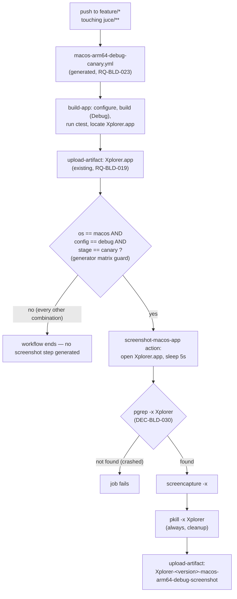

# ADR-BLD-006: macOS Debug Canary Launch Screenshot Smoke Test

## Status
Accepted (session BLD, 2026-09-12) — implemented (TASK-BLD-018, TASK-BLD-019); the actual "does
`Xplorer.app` really paint a window" claim is provable only by the next real
`macos-arm64-debug-canary` run, not locally.

<!-- Motivated by RQ-BLD-032 (owner request: catch a macOS build that compiles
but does not actually run, directly on the GitHub-hosted runner). Extends
ADR-BLD-002's macOS CI build — which already closed the "compile error only
seen locally" and "font-metric regression only seen locally" gaps — with a
third: "the app doesn't launch," which neither a green `cmake --build` nor a
green `ctest` can detect on its own. -->

## Context

`macos-arm64-debug-canary` (ADR-BLD-002, ADR-BLD-003) builds `Xplorer.app` and
runs its unit suite on every push to a feature branch, but neither step proves
the packaged **application** opens a window. A missing framework reference, a
malformed `Info.plist`, or a crash in `JUCEApplication::initialise()` would
link and pass `ctest` cleanly and only surface when the owner actually
double-clicked the `.app` — on their own Mac, after downloading the canary
artifact by hand.

The owner asked for this to be verified directly on the runner, pointing to a
sibling project (XplorerChat) that already does this. Its Actions run itself
was not reachable while drafting this ADR (its GitHub URL returned 404 from
this environment), so the owner instead pasted the working job YAML directly.
That job (`macos-ui-check`, single inline job, no composite actions) launches
its built `.app` with `open`, sleeps 5s, runs `screencapture -x`, then
`pkill -f` to quit — proven to work on a `macos-latest` runner, which carries
a real window server even though no interactive user is attached. This ADR
adopts that exact mechanism rather than an untested alternative (an earlier
draft of this ADR had planned to exec the binary directly in the background
and track its PID — rejected once the reference showed `open` is what
actually works: `open` hands the launch to `launchd` and returns immediately,
so the shell's own `$!` would only ever be `open`'s PID, never the app's).

The owner scoped this explicitly to **macOS Debug canary only**: canary is
where a feature branch gets its fastest, least-supervised feedback (RQ-BLD-019),
Debug is the configuration the owner iterates on day to day, and Windows/Linux
runners have no comparable on-screen window to capture. Widening later to
other streams or platforms is a one-line change to the generator's matrix,
not a redesign.

## Decision

- **DEC-BLD-029 — A dedicated composite action wrapping the reference's exact
  mechanism, invoked only for the macOS/Debug/canary combination, generated
  rather than hand-copied into one workflow file.**
  `.github/actions/screenshot-macos-app/` takes `build-app`'s own
  `artefact-dir` output (`<...>/Xplorer.app/Contents/MacOS`), derives the
  `.app` bundle path two levels up, and runs the reference's own sequence:
  `open` the bundle, sleep 5s, `screencapture -x`, `pkill -x Xplorer` to quit
  (always, even on failure). `juce/tools/generate_workflows.py` appends the
  call to this action — and the `upload-artifact` step for its output — to
  the generated workflow body only `if os_name == "macos" and config ==
  "debug" and stage == "canary"`, the same conditional-augmentation style the
  generator already uses for permissions (`if stage != "canary"`). Extracted
  into a composite action rather than inlined, unlike the reference's single
  plain job: this repository's workflows are themselves generated
  (RQ-BLD-023), so a step that will only ever apply to one cell of the matrix
  still has to exist exactly once in the generator, not copy-pasted into a
  hand-maintained `.yml`. (RQ-BLD-032)

- **DEC-BLD-030 — A crash before capture fails the job; the screenshot ships
  as its own artifact, separate from the app.** Between `open` and
  `screencapture`, the action runs `pgrep -x Xplorer` and fails the step if
  it finds no matching process, so "the app crashed on startup" is a **red**
  job, not a green one with a blank or desktop screenshot silently attached —
  the exact gap the reference's own workflow comment names and leaves open
  ("this doesn't by itself prove the window is visible on screen — a
  blank/black capture is still a plausible-sized PNG"). `pgrep`, not a
  tracked PID, is what makes this possible at all: `open` detaches the launch
  through `launchd`, so no shell in this job ever holds the app's real PID to
  check. The screenshot is uploaded under its own artifact name
  (`Xplorer-<version>-macos-arm64-debug-screenshot`, this project's own
  commit-derived version per RQ-BLD-015/ADR-BLD-003, not the reference's
  `github.sha`), after the existing app artifact upload — so a crash still
  leaves the binary itself downloadable for the owner to debug locally,
  exactly the debuggability the existing canary upload step already
  provides. (RQ-BLD-032)

- **Easier:** a macOS build that compiles but never opens a window now fails
  CI at the earliest, most frequent signal (every feature-branch push)
  instead of being discovered by hand after download.
- **Harder / constrained:** one more composite action to keep working if the
  runner image's window-server behaviour ever changes; the screenshot proves
  the app *painted a window*, not that any specific control renders
  correctly — it is a smoke test, not a visual regression check.
- **Neutral:** zero effect on Release canary, on any preprod/prod stream, or
  on Windows/Linux — none of them gain a step, per the generator's scope
  guard.
- **Reversible:** the added generator branch and the composite action are
  both additive and narrowly scoped; removing them is a local, one-file-plus-
  one-directory change.

## Alternatives Considered

- **Launch the executable directly in the background and track its PID
  (`"$exe" & pid=$!`), instead of `open` + `pgrep`:** rejected once the
  owner-supplied reference showed `open` is the mechanism actually proven to
  work on this runner image. Also technically wrong for the `open` case: a
  backgrounded `open` returns almost immediately, so `$!` after it is `open`'s
  own PID, not the launched app's — `pgrep -x Xplorer` is what identifies the
  real process either way.
- **Run it on every macOS combination (Release too), or every stream:**
  rejected — not requested, and Release canary carries no extra risk of a
  startup-only regression that Debug canary would miss first; can be widened
  later by editing one `if` guard if the owner asks.
- **Hand-edit the generated `macos-arm64-debug-canary.yml` directly:**
  rejected — violates the generator's own reason for existing (RQ-BLD-023):
  the next `generate_workflows.py` run would silently discard the edit.
  Mirrors why ADR-BLD-002's original two-workflow design was itself later
  folded into the generator (RQ-BLD-023).
  - **Add the screenshot step inside `build-app/action.yml` itself, gated by
    an `if:`:** rejected — `build-app` builds and tests every platform/config
    combination that exists (SRP); teaching it one macOS-only, canary-only
    side effect would make its one `if os == 'macos'` block turn into three
    unrelated concerns (build, test, and now launch-and-photograph) in a
    single file, where a separate composite action keeps each concern in its
    own file, consistent with the Windows-only verification steps already
    living in `build-app/action.yml` being genuinely build-output checks
    (version resource, icon), not a full app launch.
- **A GitHub-hosted virtual display tool (Xvfb-style) or a screenshot
  Action from the Marketplace:** rejected — macOS runners already provide a
  real window server; adding a third-party Action would be an unneeded
  dependency for something `screencapture`(1) does natively.

## Diagram

