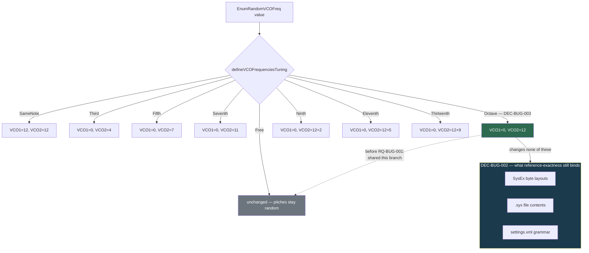

# ADR-BUG-001: Correcting Defects Inherited From the Reference Implementation

## Status
Accepted

## Context
This port's governing principle is fidelity to the reference .NET Xplorer:
`RQ-MOD` opens with "All formats bit-exact versus the reference implementation
and the Oberheim MIDI spec", RQ-MOD-050 requires patch files to round-trip
between the two implementations, and requirement after requirement says
"identically to the reference". Ports are reviewed against that principle, and
it has been applied down to reproducing reference quirks — including the one
this ADR is about.

`XpanderTone::defineVCOFrequenciesTuning` selects how the randomizer tunes the
two oscillators. Its enumeration `EnumRandomVCOFreq` lists
`Free, SameNote, Third, Fifth, Seventh, Octave, Ninth, Eleventh, Thirteenth` —
`Octave` sitting between `Seventh` and `Ninth`, musically where an eighth
belongs. Every value has a `case` except `Octave`, which shares `Free`'s
`break`, leaving both pitches random. The port reproduced this and recorded it
in a comment: *"reference has no case: falls through unchanged"*.

The consequence is a user-facing option that silently does nothing: the
Randomizer settings page offers "Octave", the choice persists to
`settings.xml`, and the generated patch is indistinguishable from "Free". The
owner reported it while reviewing the user manual — the manual described the
option as tuning VCO2 an octave above VCO1, which is what the name promises and
what the code does not do.

Correcting it is a deliberate, user-visible divergence from the reference. The
force requiring a decision is therefore not *how* to write the fix — it is one
line — but whether reference-exactness admits exceptions at all, and on what
boundary.

**Requirements**: RQ-BUG-001. Related: RQ-MOD-033, RQ-MOD-050, RQ-CTL-050,
RQ-SET-003.

## Decision

### DEC-BUG-001 — Correct the behaviour rather than the documentation
`Octave` SHALL tune the oscillators an octave apart. The two alternatives —
removing the option, or documenting it as a no-op — were rejected (see
Alternatives). A named option that does nothing is a defect regardless of which
implementation introduced it, and the reference is unmaintained, so there is no
upstream to stay aligned with on this point.

### DEC-BUG-002 — Reference-exactness binds data, not broken affordances
The reference-exactness principle SHALL be read as binding on everything
observable *outside* the application — SysEx byte layouts, `.syx` file
contents, settings file grammar, MIDI behaviour — and on functional behaviour
that a user could depend on. It SHALL NOT be read as an obligation to reproduce
an affordance the reference offers but never implemented.

This is the boundary that makes the correction admissible without weakening the
principle: nothing this decision permits can change a byte on the wire or in a
file. A future divergence that would change observable data remains forbidden
by RQ-MOD-050 and is not covered by this ADR.

### DEC-BUG-003 — Follow the compound-interval convention already in the table
`Octave` SHALL be implemented as `VCO1_FREQ = 0`, `VCO2_FREQ = 12`, matching how
the table already expresses intervals: `Third` = 4, `Fifth` = 7, `Seventh` = 11,
then `Ninth` = 12 + 2, `Eleventh` = 12 + 5, `Thirteenth` = 12 + 9. The value 12
places `Octave` in the monotonic sequence its list position implies, between
`Seventh` and `Ninth`.

`SameNote`'s base of 12 for *both* oscillators is not followed here: it is the
reference's way of expressing "same pitch, mid-range", not an interval origin,
and every actual interval in the table is measured from `VCO1_FREQ = 0`.

### DEC-BUG-004 — Each inherited-defect correction is stated as a requirement
A correction admitted under DEC-BUG-002 SHALL be recorded as a requirement in
`RQ-BUG-defect-corrections.md` before the code changes, stating the intended
behaviour rather than describing the bug. The requirement — not a code comment —
is what a later reader greps to learn that the divergence is intentional.

## Consequences

**Easier.** The Randomizer page's option list becomes honest: nine strategies,
nine distinct outcomes. The user manual's description of "Octave" becomes
accurate without a caveat. A test now pins the behaviour, so a later
"restore reference parity" pass cannot silently undo it.

**Harder / constrained.** The port can no longer be described as
unconditionally reference-exact; DEC-BUG-002 is the qualification, and future
reviewers must check a divergence against it rather than reject it on sight.
Patches generated by the two implementations from the same seed and the same
`Octave` setting now differ — acceptable, because randomizer output is
non-reproducible across implementations anyway (different RNG), and because
no stored artifact is affected.

**Neutral.** No migration: `EnumRandomVCOFreq` keeps its enumerator values and
its `"Octave"` XML name, so existing `settings.xml` files load unchanged and
simply get the corrected behaviour. No public API changes — the signature of
`defineVCOFrequenciesTuning` is untouched.

## Alternatives Considered

**Remove the `Octave` option.** Would also eliminate the silent no-op, and would
keep the port strictly reference-exact in behaviour. Rejected: it removes a
capability users expect from the name, breaks the enumerator ordering that
`XmlSettingsService` and `SettingsDialog` share, and would require migrating
settings files that already store `"Octave"`.

**Document it as a no-op.** Cheapest option, no code change. Rejected: it asks
the manual to explain a defect instead of fixing it, and leaves a settings
control whose only correct usage is not to use it.

**Reproduce the reference exactly and file the divergence upstream.** Not
available: the reference implementation is the archived .NET version of this
same project, no longer maintained. There is no upstream to converge with.

**Treat it as a Tier S one-liner with no ADR.** Rejected: the line count is not
what makes this a decision. Without DEC-BUG-002 on record, the next reviewer
comparing the port to the reference finds an unexplained behavioural difference
and has every reason to "fix" it back.

## Diagram

