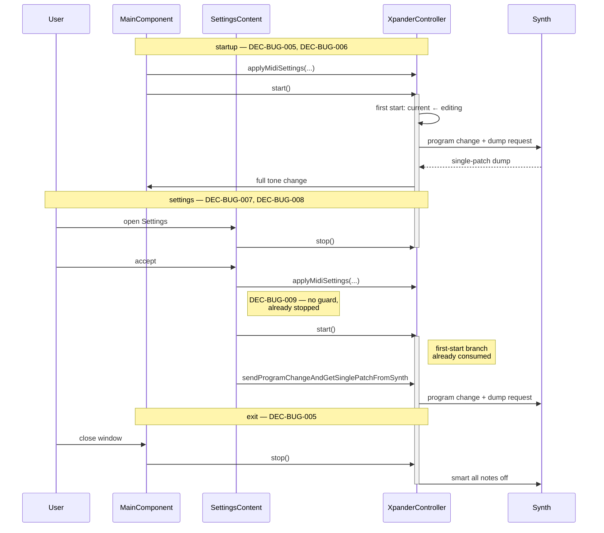

# ADR-BUG-002: Who Starts and Stops the Controller in the JUCE Application

## Status
Accepted

## Context

`AbstractController::start()` starts the MIDI input ports and the paced
transmit worker and sets `isRunning()`; `stop()` reverses it.
`XpanderController` overrides both: `start()` carries a once-only first-start
branch that aligns the current program number on the editing one and requests
that patch from the synthesizer, and `stop()` sends the smart all-notes-off of
RQ-CTL-060.

Both are implemented and unit-tested (`XpanderControllerTests` starts the
controller in a dozen scenarios). **Neither is called anywhere in
`juce/app/`.** The port carried over the controller faithfully and left its
callers behind.

The reference implementation drives this lifecycle from three places, all in
its view layer:

| Reference site | What it does |
|---|---|
| `MainForm.OnLoad` (`MainForm.Overrides.cs:413`) | `Controller.Start()`, after `LoadSettings()` |
| `AbstractControllerMainForm.OnClosing` → `DoCleanupBeforeClosing()` | `Controller.Stop()`, `CloseMidiDevices()`, `UnRegisterForControllerEvents()` |
| `SettingsManager.ShowSettingsDialog` (144/206) and `LoadSettings` (60/132) | `Stop()` around the dialog and around the re-application of settings, each with a `finally { Start(); }` |

Every *controller-internal* pair the reference has — `LoadTone`,
`RandomizeTone`, `MorphTones`, `BackupAllDataDumpToFile`,
`GetSingleTonesFromSynth`, and the single-patch dump handler — was ported
correctly. The gap is exactly the view layer.

Three defects follow from the gap, and they compound:

1. **Nothing transmits until an unrelated operation runs.** The worker is only
   ever started by the trailing `start()` of one of those six internal pairs.
   Before that, panel edits are enqueued by `scanChangedParametersIntoQueue`
   and never dequeued.
2. **The first-start branch is still armed, and fires at the wrong moment.**
   Whichever of those six operations runs first ends with `start()`, which —
   `_firstStart` still true — requests the synth's patch. The reply arrives at
   `synthInputDeviceSysExMessageReceived`, which reloads the tone from it. The
   patch the user just loaded, or the tone they just randomized, is silently
   replaced. Once per session, which is why it went unnoticed.
3. **`stop()` is never reached at exit.** `~AbstractController()` already calls
   `stopWorkerThread()` and `closeMidiDevices()`, so ports and threads are
   released — but the smart all-notes-off is not sent, and notes can hang.

**Requirements**: RQ-BUG-002, RQ-BUG-003. Related: RQ-CTL-021, RQ-CTL-060,
RQ-FMW-041, RQ-GUI-025, RQ-MID-006.

## Decision

### DEC-BUG-005 — The main component owns the lifecycle, mirroring the reference's main form
`MainComponent`'s constructor SHALL call `start()` as its last step, after
`applyMidiSettings`, and its destructor SHALL call `stop()`. This is the
positional equivalent of `MainForm.OnLoad` and `OnClosing`: the component that
creates the controller is the component that runs it.

Only `stop()` is added at teardown, and the destructor **body** is where it
belongs: that body runs before `_controller` — a `std::unique_ptr` member — is
destroyed, so the synth output device is still open and the all-notes-off
`stop()` sends actually reaches the synth. `~AbstractController()` runs
afterwards; it stops the worker and closes the devices but sends nothing, which
is why leaving teardown to it alone loses RQ-CTL-060.

`closeMidiDevices()` and the handler release, which the reference's
`DoCleanupBeforeClosing` performs explicitly, need no equivalent here:
`~AbstractController()` already calls `closeMidiDevices()`, and the event
handlers are `std::function` members that die with the controller. Adding them
again would be redundant, not faithful.

### DEC-BUG-006 — Startup synchronization is `start()`'s job, not a separate call
The startup half of RQ-BUG-002 SHALL be delivered by `start()`'s existing
first-start branch rather than by an explicit
`sendProgramChangeAndGetSinglePatchFromSynth` call.

Two reasons. The branch synchronizes on `editingProgramNumber` — the "Default
patch number" setting, which `applyMidiSettings` has just assigned — after
aligning `currentProgramNumber` on it; an explicit call on
`currentProgramNumber()` would instead use the tone's default of 99 and select
the wrong patch whenever that setting is not 99. And leaving the branch
unconsumed is precisely defect (2) above: `start()` at startup is what disarms
it, so the session's first load or randomize is no longer clobbered.

### DEC-BUG-007 — The Settings dialog stops and restarts the controller through its content's lifetime
`SettingsContent`'s constructor SHALL call `stop()` and its destructor SHALL
call `start()`.

The reference brackets the dialog with `Stop()` … `finally { Start(); }`, which
works because `ShowDialog()` blocks. `showSettingsDialog` uses `launchAsync`
and returns immediately, so the same shape would restart the controller before
the user has seen the dialog. The content object is owned by the
`DialogWindow` (`content.setOwned`) and destroyed on every close path — accept,
cancel, Escape, title bar — which makes its destructor this port's `finally`.
The colour-snapshot restore already relies on exactly that, so the two
teardown concerns sit together rather than in two different mechanisms.

### DEC-BUG-008 — The settings resynchronization happens after the restart, and only on accept
The RQ-BUG-002 resynchronization SHALL be issued from `SettingsContent`'s
destructor, after `start()`, and only when the dialog was accepted.

It cannot stay in `accept()`: at that point the controller is stopped, its
input ports are stopped with it, and the synthesizer's reply dump would be
received by nobody. `_accepted` is already the flag the destructor uses to
decide whether to keep or revert the colours; it decides this too.

This resynchronization is a deliberate addition to the reference, which
re-applies the MIDI settings but never re-requests the patch — confirmed as
the reference's own gap, not a JUCE-port regression: `Start()`'s first-start
guard is consumed at application launch there too, so the reference's own
`finally { Start(); }` after the settings dialog does not resend a patch
request either. Kept anyway, by owner decision (2026-08-21, session BUG,
raised and confirmed after implementation): the controller cannot tell a
same-instrument port rename from a reconnection to a different synth or
patch, because its input ports are stopped for the whole time the dialog is
open (DEC-BUG-007) — so on the common case this is one harmless silent
round-trip, and on the case that matters it is the only thing that catches
the drift.

### DEC-BUG-009 — No `isRunning()` guard around `applyMidiSettings`
`applyMidiSettings` SHALL NOT bracket itself with `stop()`/`start()`.

The reference's `LoadSettings` guards with `if (xController.IsRunning)` because
it is reached both before the first `Start()` and again after
`ShowSettingsDialog`'s `finally { Start(); }` has already restarted the
controller. This port's ordering removes that case: `applyMidiSettings` is
called from the main component's constructor, before `start()`, and from
`accept()`, while DEC-BUG-007 has the controller stopped. In both the
controller is stopped already, so the guard would be a branch that can never
be taken — which the project's own rules forbid adding.

## Consequences

**Easier.** The application transmits from launch instead of from the first
load or randomize. The first-session clobber disappears, with the test in
TASK-BUG-005 keeping it gone. Exit sends the all-notes-off RQ-CTL-060 always
specified. The Settings dialog no longer has incoming MIDI mutating the tone
underneath it.

**Harder / constrained.** Four call sites now have to stay in balance: every
`stop()` needs its `start()`, and the dialog's pair is split across a
constructor and a destructor, which is less obvious to a reader than a
`try/finally`. The comments at both ends name each other for that reason.
Opening the Settings dialog now sends a smart all-notes-off — reference
behaviour, since its `Stop()` is the same override, but newly visible here.

**Neutral.** The dialog's `start()` assumes the content is destroyed before
the main component that owns the controller. That assumption is not new: the
same destructor already calls back into the main component to restore the
colour snapshots (DEC-JUC-038, DEC-JUC-113), and the dialog is modal, so the
main window cannot be closed underneath it. This decision inherits that
invariant rather than adding one.

No controller or framework code changes: this ADR only adds callers. The six internal `stop()`/`start()` pairs are untouched, and their
trailing `start()` becomes a no-op with respect to synchronization once
startup has consumed the first-start branch.

## Alternatives Considered

**Call `start()` from the `XpanderController` constructor.** Self-balancing and
impossible to forget. Rejected: the controller would begin transmitting before
`applyMidiSettings` has assigned its devices, and the first-start patch request
would go to whatever port was open — usually none.

**Keep the explicit startup `sendProgramChangeAndGetSinglePatchFromSynth` and
also call `start()`.** Rejected: two patch requests at launch, on two different
program numbers, the first of them wrong (DEC-BUG-006).

**Restart the controller from a modal-close callback instead of
`~SettingsContent`.** A faithful mirror of the reference's `finally`. Rejected
as a second teardown mechanism next to the destructor the colour restore
already uses; two mechanisms drift, and a close path handled by one but not the
other leaves the controller stopped.

**Leave `stop()` out at exit and rely on `~AbstractController()`.** Rejected:
the destructor stops the worker and closes the devices but does not send the
all-notes-off, which is the whole point of the `stop()` override.

## Diagram

