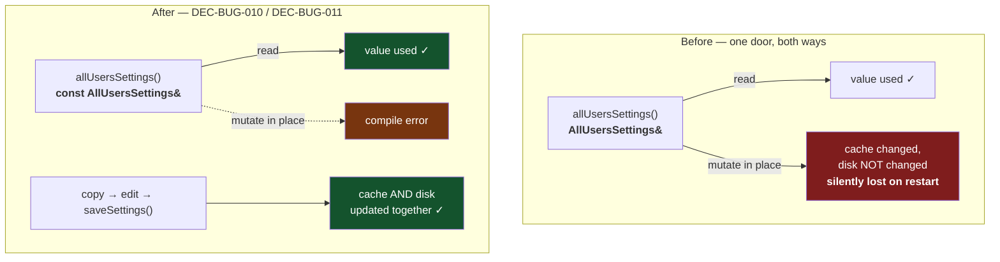

# ADR-BUG-003: Separating Reading From Writing in the Settings Service

## Status
Accepted

## Context

`ISettingsService` exposes settings through two members:

```cpp
[[nodiscard]] virtual AllUsersSettings& allUsersSettings() = 0;   // read
virtual void saveSettings(const AllUsersSettings& settings) = 0;  // write
```

The read accessor returns a **non-const** reference into the implementation's
own cache. `XmlSettingsService` loads the file once and serves that cached
object to every caller; `XpanderController::settings()` forwards the same
reference again.

So a caller can write:

```cpp
settingsService.allUsersSettings().midiConfig.midiChannel = 5;
```

That compiles, and it is wrong in a way that gives no signal. The value changes
for every subsequent reader in the process — the controller consults settings on
nearly every MIDI operation — and it is **never written to disk**, because only
`saveSettings()` writes. The setting therefore appears to work until the
application is restarted, at which point it silently reverts.

The intended protocol is copy → mutate → `saveSettings()`. The Settings dialog
follows it (`auto settings = _settingsService.allUsersSettings();` … `applyTo`
… `saveSettings(settings)`). Nothing else enforces it.

A survey of the tree before this decision found **every** call site already
read-only: 11 in production code, 12 in tests, none mutating. The accessor's
actual contract is therefore already "read", and only the type disagrees.

**Requirements**: RQ-BUG-004. Related: RQ-SET-001, RQ-SET-004, RQ-SET-005.

## Decision

### DEC-BUG-010 — The read accessor returns a const reference
`ISettingsService::allUsersSettings()` and both implementations SHALL return
`const AllUsersSettings&`. `XpanderController::settings()`, which forwards it,
SHALL do the same.

This makes the mistake a compile error instead of a silent behaviour, and it
costs nothing: no existing caller is affected, so the change is a pure
tightening rather than a migration.

### DEC-BUG-011 — `saveSettings()` stays the only way in
No mutating accessor is added. A caller that needs to change settings takes a
copy, edits it and hands it to `saveSettings()`, which persists **and** refreshes
the cache in one step — so "changed" and "saved" cannot diverge. That is already
how the only writer in the application works; this decision records it as the
contract rather than as a convention.

The copy is not a cost worth engineering around: `AllUsersSettings` is a plain
aggregate of a few dozen fields and an automation table, copied at most once per
dialog acceptance.

### DEC-BUG-012 — Const-correctness is the enforcement mechanism, not a review rule
The general principle this instance settles: where a service owns cached state
and hands it out, the handing-out accessor is const, and mutation goes through a
named operation that also persists. Reviewers should not have to notice
`allUsersSettings().x = y` — the compiler should refuse it.

## Consequences

**Easier.** A whole class of "the setting did not stick" defect becomes
impossible to write. A reader of a call site can tell read from write by the
call alone, without knowing the service's caching behaviour.

**Harder / constrained.** A future caller that genuinely needs to mutate several
fields must copy the whole settings object first. That is the intended protocol,
but it is more typing than mutating in place, and someone will be tempted to add
a non-const overload — which would reopen exactly this hole.

**Neutral.** No behaviour changes: no call site was mutating, so nothing that
worked before works differently. `InMemorySettingsService`, whose accessor
returned a reference to its own member, changes signature identically.

## Alternatives Considered

**Leave it and rely on review.** Rejected: the defect is invisible at the call
site — it needs knowledge of the service's caching to spot — and it survives
testing, because within one process run the mutation appears to work.

**Return a copy instead of a reference.** Would also prevent the mistake.
Rejected: the controller reads settings on nearly every MIDI operation, so this
turns a pointer dereference into a struct copy on a hot path, to fix a problem
constness fixes for free.

**Add a mutating accessor plus an explicit `commit()`.** Rejected: it keeps a
window in which changed and saved disagree, which is the actual defect, merely
narrowed. `saveSettings()` already closes it by doing both at once.

## Diagram


