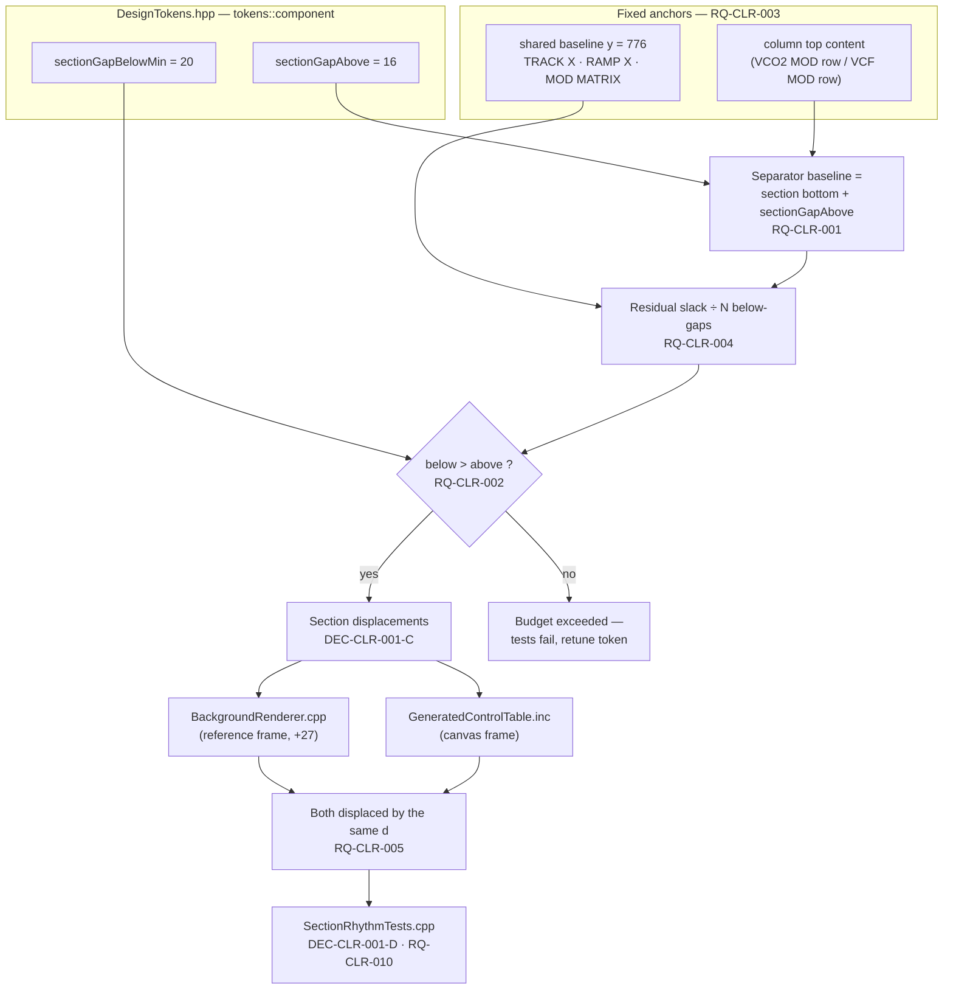

# ADR-CLR-001: Section Vertical Rhythm as Design Tokens

## Status
Accepted (2026-08-10). Partially supersedes the spacing exclusion of
**ADR-JUC-014 (DEC-JUC-014-C)** — see DEC-CLR-001-A.

## Requirements
RQ-CLR-001..005, RQ-CLR-010. Depends on RQ-GUI-062 / ADR-JUC-034 (the
separator's appearance), RQ-DSN-020 (spacing scale), RQ-SCL-001 (canvas height
drives window aspect), ADR-JUC-013 (`CANVAS_TOP_CROP`).

## Context

The section separator bars are *terminators*: the label names the section that
just ended, following the Xpander's silkscreen (ADR-JUC-034, DEC-JUC-107). The
layout contradicted that reading. Measured on the canvas before this change:

| Separator | Gap above (its own section) | Gap below (next section) |
|---|--:|--:|
| `VCO1/VCO2/FM` | 38 | 10 |
| `LAG` | 43 | 11 |
| `TRACK X` | 37 | 10 |
| `VCF/VCA` | 28 | 9 |
| `ENV X` | 17 | 11 |
| `LFO X` | 22 | 10 |
| `RAMP X` | 28 | 10 |

Every bar was 2–4× closer to the section it introduces than to the one it
terminates, so gestalt proximity bound it to the wrong group. The owner
supplied a mockup correcting this by hand. Measuring it against the current
build (calibration residual 0.33 canvas px) showed one reliable invariant: the
gap *above* each bar normalised to 17–25 px, median 20, while the gap below
became whatever was left. The hand-drags themselves were 17–18 screen px in the
left column and 9–10 in the centre — approximations, not intent.

Two constraints frame any fix. First, the three columns terminate on one
baseline (y = 776) and the canvas height feeds the window aspect ratio
(RQ-SCL-001), so the layout cannot grow. Second, the centre column is nearly
saturated: between the bottom of the VCF group and the `RAMP X` baseline there
are 633 px, of which the ENV, LFO and RAMP groups consume 508. Whatever is not
spent on the four above-gaps is all that remains for the three below-gaps.

That budget is what decides the token value. With gap-above = G, each centre
below-gap is `(125 - 4G) / 3`. The relation RQ-CLR-002 requires — below > above
— therefore holds only while `G < 17.9`. The mockup's own value of 20 does not
satisfy it: it yields 15 px below, leaving the centre column still inverted,
which is exactly what the mockup shows.

Finally, the two files holding the layout — `BackgroundRenderer.cpp` and
`GeneratedControlTable.inc` — are now independently maintained. The control
table is no longer generated from the .NET `MainForm.Designer.cs`, so control
positions are free to move; nothing but RQ-CLR-005 keeps the two in step.

## Decision

### DEC-CLR-001-A — Section rhythm enters the token set; DEC-JUC-014-C is narrowed
`DEC-JUC-014-C` excluded "spacing / layout geometry … section-bar dimensions"
from the token set, on the grounds that `RQ-DSN-020` had not yet derived a
spacing scale from evidence. That justification no longer holds for this
specific pair of values: the mockup *is* the evidence, and the two gaps are
the values that carry the design intent. Two tokens are added to
`tokens::component`:

- `sectionGapAbove` — canvas px between the bottom of a section's lowest
  visible element and its separator's label baseline.
- `sectionGapBelowMin` — the floor for the gap between a separator's label
  baseline and the top of the next section's first element.

The exclusion in `DEC-JUC-014-C` stands for everything else it lists (dialog
margins, control insets, canvas crop/padding, rail width, box sizes). Absolute
element positions stay as literals in the two layout files; only the two
*relations* become tokens.

### DEC-CLR-001-B — `sectionGapAbove` = 16, `sectionGapBelowMin` = 20
16 is chosen over the mockup's measured median of 20 because 20 cannot satisfy
RQ-CLR-002 inside the centre column's budget (see Context): it leaves 15 px
below each bar and preserves the inversion the change exists to remove. 16
yields ≈20 px below, restoring the relation in both columns, and both values
sit on the 4 px scale of `RQ-DSN-020`.

This is a **deviation from the owner mockup**, recorded here per the
design-system deviation rule: the mockup's 20 px is reproduced in spirit — the
bar hugs its own section — but the literal value is 16, because the mockup's
value was measured from a hand-drag that did not account for the centre
column's remaining budget. The owner reviewed both options rendered from the
real screenshot and selected 16.

### DEC-CLR-001-C — Below-gaps are computed, not authored
`sectionGapAbove` fixes each separator relative to the section above it.
Each column's remaining space is then divided equally among its below-gaps
(RQ-CLR-004), which makes the layout a consequence of two anchors plus one
token rather than a table of hand-picked offsets. The resulting displacements:

| Column | Element | Displacement |
|---|---|--:|
| Left | VCO group | 0 |
| | `VCO1/VCO2/FM` bar | −22 |
| | LAG group | +13 |
| | `LAG` bar | −14 |
| | TRACK group | +21 |
| | `TRACK X` bar | 0 |
| Centre | VCF group | 0 |
| | `VCF/VCA` bar | −12 |
| | ENV group | −1 |
| | `ENV X` bar | −2 |
| | LFO group | +8 |
| | `LFO X` bar | +2 |
| | RAMP group | +12 |
| | `RAMP X` bar | 0 |

Left column below-gaps: 45 / 46. Centre column: 20 / 21 / 20.

### DEC-CLR-001-D — The rhythm is asserted headlessly, per section
The relations of RQ-CLR-001..004 are asserted in
`juce/tests/app/SectionRhythmTests.cpp` against the layout constants directly,
not against rendered pixels. Each section contributes one above-gap assertion
and one below-gap assertion, named so a failure identifies the section. This
is what stops the rhythm decaying the way the pre-change layout did: the old
spread of 17–43 px accumulated one uncontrolled edit at a time, with nothing
to fail.

## Consequences

**Easier.** The layout now has one authored number per relation instead of
seven independent offsets. Retuning the rhythm is a token edit plus a
recomputation, and the tests say immediately whether every section followed.
The separator finally reads as belonging to its own section, which is what
ADR-JUC-034 decided it should mean.

**Harder.** `sectionGapAbove` is no longer free: raising it above 17 breaks
RQ-CLR-002 in the centre column, and the tests will say so. That is the
constraint made visible rather than a new one introduced — but anyone wanting a
more generous rhythm must now either shorten a centre-column group or revisit
RQ-CLR-003's canvas height, and thereby the window aspect ratio (RQ-SCL-001).

**Constrained.** The left column's below-gaps land at ~45 px, more than twice
the centre's. This is inherent: the columns hold different amounts of content
between the same two anchors. Equalising *across* columns is not possible
without either growing the canvas or padding the centre column's groups.

**Unchanged.** No colour, font, stroke or block dimension moves. The
separator's own appearance (ADR-JUC-034) is untouched — only its y.

## Alternatives Considered

**Keep `sectionGapAbove` = 20, the mockup's measured value.** Rejected for the
centre column only: it yields 15 px below each bar, so the bar stays closer to
the next section than to its own and RQ-CLR-002 fails. It would have to be
accepted as a permanent documented deviation in the very column the change was
requested for. The owner compared both, rendered from the real screenshot, and
chose 16.

**Reproduce the mockup's displacements literally.** Rejected: the mockup's
below-gaps (41 and 26 in the left column) are artefacts of where each hand-drag
landed, not a rule. Encoding them would leave the layout exactly as
unmaintainable as before, with seven independent magic offsets instead of
seven different ones.

**Grow `LOGICAL_CANVAS_HEIGHT` to relieve the centre column.** Rejected: it
changes the window's aspect ratio, which RQ-SCL-001 derives from the canvas,
and it would move the shared bottom baseline that RQ-CLR-003 protects — a much
larger blast radius than the problem warrants.

**Leave spacing out of the token set, per DEC-JUC-014-C, and use file-local
constants.** Rejected: the whole point of this change is that the two gaps are
a *design decision* rather than an implementation detail, and the design system
is where design decisions are recorded. Keeping them file-local is what allowed
the 17–43 px spread to appear in the first place.

## Diagram

