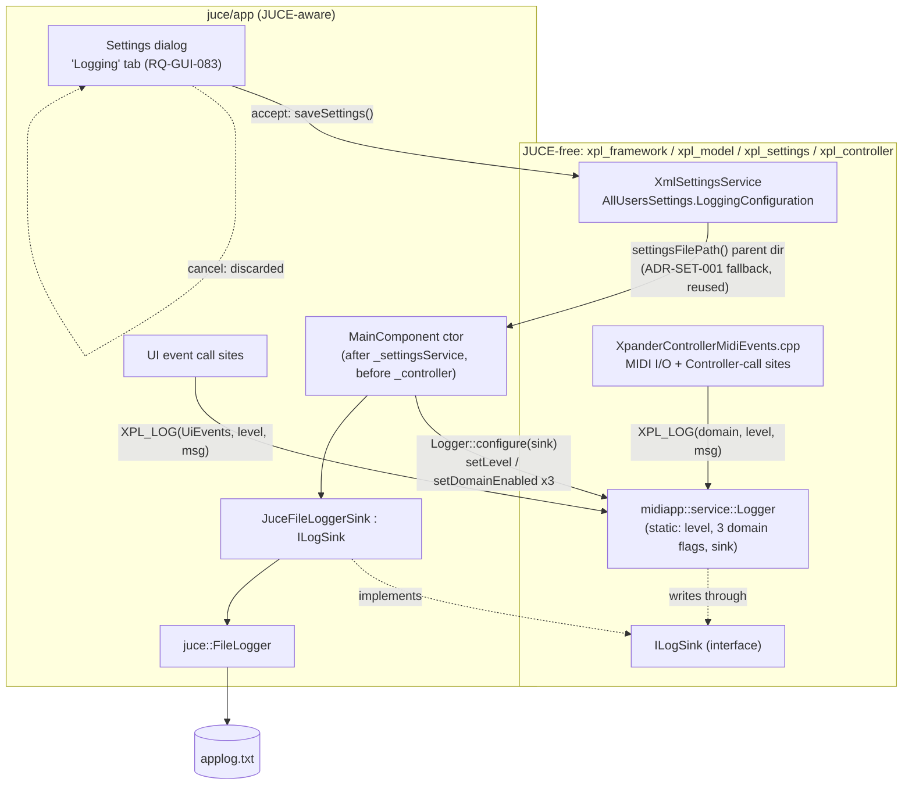

# ADR-FMW-001: Domain-Based Diagnostic Logging — Sink, Wiring and Configuration

## Status
Proposed.

<!-- Motivated by GitHub issue #68: Logger::configure()/setLevel() are never called outside
juce/tests/, so no log file is ever created and the one existing TraceLevel::Error call site is
inert. Extended by owner request (session LOG) to classify every log line into three domains --
MIDI I/O, controller calls, UI events -- each independently switchable, and to reuse
juce::FileLogger as the file-writing sink instead of the hand-rolled std::ofstream currently in
Logger.cpp. [RQ-FMW-070, RQ-FMW-073..076, RQ-SET-008, RQ-GUI-083, RQ-NFR-008] -->

## Context

**The logger exists but is wired to nothing.** `midiapp::service::Logger`
(`juce/framework/include/midiapp/service/Logger.hpp`, `juce/framework/src/Logger.cpp`) already
implements level-filtered, timestamped, mutex-guarded writes to a `std::ofstream` sink. Three call
sites already exist in `juce/controller/src/XpanderControllerMidiEvents.cpp` (lines 159, 186 —
`TraceLevel::Info`; line 452 — `TraceLevel::Error`), and `ServicesTests.cpp` exercises the class
directly. But `Logger::configure()`/`setLevel()` are called from nowhere in `juce/app/`,
`juce/controller/`, `juce/model/` or `juce/framework/` itself — `g_level` never leaves
`TraceLevel::Off`, so every one of those calls is a silent no-op.

**The library graph is layered, and the layering is real, not incidental.** Verified from every
`CMakeLists.txt` on the path from `Logger` to the application, not assumed:

```
xpl_framework  (juce/framework)  -- PUBLIC xpl_midi                  -- NO JUCE dependency at all
xpl_model      (juce/model)      -- PUBLIC xpl_framework
xpl_settings   (juce/settings)   -- PUBLIC xpl_model, PRIVATE juce::juce_core (XML parsing only,
                                                                       never in a public header)
xpl_controller (juce/controller) -- PUBLIC xpl_model, xpl_settings
xpl_app_core   (juce/app/core)   -- PUBLIC xpl_controller
XplorerApp     (juce/app)        -- links xpl_app_core + full JUCE (GUI, FileChooser, ...)
```

`xpl_framework` is a *transitive PUBLIC* dependency of `xpl_controller` through `xpl_model`/
`xpl_settings` — which is why `XpanderControllerMidiEvents.cpp` can already call
`Logger::writeLine` today even though `juce/controller`'s own `CMakeLists.txt` never names
`xpl_framework` directly. Nowhere on this path below `juce/app` does a public header include a
`juce_*` header. `XmlSettingsService` follows the same discipline one layer up: its constructor
takes plain `std::string` directories (`XmlSettingsService.hpp:49`), and it is `MainComponent.cpp`
— the JUCE-aware layer — that resolves `juce::File::getSpecialLocation(...)` and passes the result
down as a string (`MainComponent.cpp:122-140, 157-158`). Introducing `juce::FileLogger` directly
into `Logger.cpp` would be the first crack in a boundary every layer below `juce/app` currently
honours without exception.

**The reference used `FileMode.Create` (truncate on every launch, RQ-FMW-070's `applog.txt`);
`juce::FileLogger` appends and optionally caps the file's size instead.** This ADR uses
`juce::FileLogger`'s own default behaviour (append + size-based trim) rather than reimplementing
truncate-on-launch — see Consequences.

**Requirements driving this decision:** RQ-FMW-070 (severity-filtered logging to a per-user file),
RQ-FMW-073 (three independently-switchable domains sharing one global severity threshold),
RQ-FMW-074/075/076 (what each domain logs), RQ-SET-008 (persisted level, domain flags, directory
override), RQ-GUI-083 (Settings dialog "Logging" tab), RQ-NFR-008 (no robustness regression vs.
the reference). Directory resolution reuses ADR-SET-001 (DEC-SET-001).

## Decision

### DEC-FMW-001 — Injected-sink interface; `juce::FileLogger` is used only above `juce/app`

`Logger.hpp` gains a minimal, JUCE-free abstraction:

```cpp
class ILogSink
{
public:
    virtual ~ILogSink() = default;
    virtual void write(const std::string& line) = 0;
};
```

`Logger::configure(const std::string& logFilePath)` **keeps its exact current signature and
behaviour** — internally it still opens its own `std::ofstream` sink. Every existing test and the
three existing controller call sites are therefore unaffected; this is the zero-regression path.

A second overload, `Logger::configure(std::unique_ptr<ILogSink> sink)`, is added for production
use. `juce/app` (the only layer allowed to know JUCE exists) implements it:

```cpp
class JuceFileLoggerSink final : public midiapp::service::ILogSink
{
public:
    explicit JuceFileLoggerSink(const juce::File& file)
        : _fileLogger(file, productNameAndVersion()) {}   // reuses the existing helper, MainComponent.cpp:148-151
    void write(const std::string& line) override { _fileLogger.logMessage(line); }
private:
    juce::FileLogger _fileLogger;                          // default ctor args: append, 128 KB trim
};
```

`juce::FileLogger::logMessage()` is `public` on the derived class (it overrides `Logger`'s
`protected` pure virtual and widens access, confirmed against the JUCE 8.0.9 source pinned at
`juce/CMakeLists.txt:88`), so `JuceFileLoggerSink` can call it directly — `juce::Logger`'s own
global `setCurrentLogger()`/`writeToLog()` routing is not used at all, since `midiapp::service::Logger`
is already the application's single access point and routing through both would be two
overlapping singletons for no benefit. `Logger::shutdown()` resets whichever sink is active
(default or injected), releasing its handle exactly as it does today.

### DEC-FMW-002 — Three domains, one shared threshold, macro-captured call site

`Logger.hpp` gains:

```cpp
enum class LogDomain { Midi, ControllerCalls, UiEvents };   // [RQ-FMW-073]
```

Three independent `std::atomic<bool>` enable flags (`setDomainEnabled`/`isDomainEnabled`), read
the same lock-free way `g_level` already is (Logger.cpp:36-38 explains why: called from the
message thread, the transmit worker and MIDI callback threads alike). **The severity threshold
stays the single existing `g_level`/`TraceLevel` — there is no per-domain level**, per the owner's
explicit choice. A line is written only when its domain is enabled **and** its severity passes
that one shared threshold.

A new overload carries the domain and an automatically-captured call site instead of the free-text
`source` the legacy overload takes by hand:

```cpp
static void writeLine(LogDomain domain, TraceLevel level, const char* file, int line, const std::string& message);
```

reached only through a macro, so the call site can never be mistyped or left stale:

```cpp
#define XPL_LOG(domain, level, message) \
    ::midiapp::service::Logger::writeLine((domain), (level), __FILE__, __LINE__, (message))
```

one macro, not three, since the domain is already a plain argument and three near-identical macros
would just triplicate it. The formatted line becomes:

```
2026-09-05 14:32:10.123 [ERROR] [MIDI] XpanderControllerMidiEvents.cpp:452: <message>
```

— the existing timestamp/level formatting (Logger.cpp:96-113) is reused unchanged; only the
`[<domain>] <file>:<line>:` segment is new. The legacy `writeLine(source, level, message)` path
keeps its current `timestamp [LEVEL] source: message` shape verbatim — the two call shapes coexist
by design (see Consequences).

**MIDI formatting reuses `xpl::midi::MidiMessage::toString()`** (`juce/midi/src/MidiMessage.cpp:146-155`,
a hex byte dump already used nowhere else for logging) — call sites compose the log message from
it plus a direction/device literal (e.g. `"IN " + msg.toString()`); no new MIDI-to-string
formatter is introduced.

### DEC-FMW-003 — Settings-backed configuration, reusing ADR-SET-001's directory resolution

`AllUsersSettings` (`juce/settings/include/xplorer/settings/AllUsersSettings.hpp`) gains a fourth
section:

```cpp
struct LoggingConfiguration
{
    int severityLevel = 0;                 // mirrors TraceLevel's underlying value; 0 = Off
    bool midiDomainEnabled = true;
    bool controllerDomainEnabled = true;
    bool uiDomainEnabled = true;
    std::string logDirectoryOverride;      // empty = no override (RQ-SET-008 default)
};
```

Stored as a plain `int`/`bool`/`std::string`, **not** `midiapp::service::TraceLevel` or
`LogDomain`: `xpl_settings` has no dependency on `xpl_framework` today (only `xpl_model` PUBLIC and
`juce::juce_core` PRIVATE — `juce/settings/CMakeLists.txt:15-17`), and this decision does not
introduce one. `juce/app` — which already depends on both — converts at the one point that needs
to. `XmlSettingsService` gains a `<LoggingConfig>` XML section following the exact tolerance
convention RQ-SET-006/RQ-SET-007 already establish: a missing element or section reads back as the
default above, so a settings file predating this feature loads unchanged.

**Default log directory reuses `settingsFilePath()`, not a new directory-resolution call.**
`XmlSettingsService::settingsFilePath()` already returns the full path already resolved through
`ADR-SET-001`'s preferred/fallback fallback (`XmlSettingsService.cpp:326-331`). The default log
path is that path's parent directory plus `applog.txt` (RQ-FMW-070's reference filename) — zero
duplicated resolution logic, zero new exported directory-resolution function. When
`logDirectoryOverride` is non-empty, it is used verbatim instead.

**Wiring point:** `MainComponent`'s constructor (`MainComponent.cpp:154-158`), immediately after
`_settingsService` is constructed and *before* `_controller` is constructed — the earliest point
settings exist, and strictly before any MIDI/controller activity can occur. It reads
`LoggingConfiguration`, builds a `JuceFileLoggerSink` at the resolved path, and calls
`Logger::configure(...)`, `Logger::setLevel(...)`, `Logger::setDomainEnabled(...)` (×3).

**UI:** the Settings dialog (`juce/app/src/SettingsDialog.{hpp,cpp}`) gains a fourth tab,
**Logging**, alongside MIDI / User interface / Randomizer (RQ-GUI-083): a severity selector
(Aucun/Erreur/Avertissement/Info/Détaillé), three domain checkboxes, and a directory chooser
reusing the existing `juce::FileChooser` directory-selection pattern already used elsewhere
(`Dialogs.cpp:492-496`) — no new file-picking mechanism. Apply-on-accept / discard-on-cancel,
identical contract to the dialog's other tabs (RQ-GUI-046).

## Consequences

**Easier.** A log file is finally produced, with per-user severity control and, additionally, a
per-domain switch the original issue didn't ask for but the owner did. Framework, model and
settings keep zero public JUCE surface — the boundary that already existed is preserved, not
special-cased. Reusing `settingsFilePath()` for the default log directory means a future change to
ADR-SET-001's fallback logic (e.g. a third fallback tier) automatically applies to the log file
too, with nothing to keep in sync by hand.

**Harder.** `Logger` now has two `configure()` overloads and two `writeLine()` shapes (legacy
free-text `source`, new domain+file/line) that coexist rather than one replacing the other — a
reader has to know both exist. The three pre-existing calls in `XpanderControllerMidiEvents.cpp`
are not migrated to the new domain-aware macro by this ADR (they are prime candidates — Controller/
MIDI domain — but choosing exactly which call becomes which domain is implementation detail for
the plan, not an architectural decision).

**Constrained.** `juce::FileLogger`'s append-and-trim replaces the reference's truncate-per-launch:
a relaunch no longer starts an empty file (it keeps recent history up to the trim size instead).
This is a deliberate, documented departure from the literal .NET behaviour — RQ-FMW-070 only
requires a severity-filtered per-user log file, not the truncation semantics — using the sink's
own default is what "reuse `FileLogger` by default" (owner instruction) means. The single-file,
single-global-threshold design (owner's explicit choice) means a user cannot mute the MIDI domain
at Info while keeping Controller calls at Verbose; they can only turn a domain fully on or off
under whatever the one severity threshold currently is.

**Unchanged.** The existing `Logger::configure(std::string)`, `writeLine(source, level, message)`,
`setLevel`/`level`/`shutdown` signatures and behaviour; every existing `ServicesTests.cpp`
scenario; the XML schema for `MidiConfig`/`UiConfig`/`RandomizerConfig`; ADR-SET-001's directory
resolution itself (only reused, not modified).

## Alternatives Considered

- **`juce::FileLogger` instantiated directly inside `juce/framework`'s `Logger.cpp`.** Rejected —
  the one layer in this codebase with zero JUCE dependency, confirmed transitively load-bearing
  (§Context), would gain one. The injected-sink pattern costs one interface and mirrors
  `XmlSettingsService`'s existing precedent instead of breaking it.
- **Per-domain severity thresholds** (three independent level selectors instead of one global
  threshold plus three on/off gates). Rejected by the owner: one global threshold, per-domain
  enable only — simpler settings schema, simpler UI, matches the explicit instruction.
  Revisitable later as a schema-compatible addition (new optional fields) if it turns out to be
  needed — RQ-SET-006/007's "absent element ⇒ default" tolerance already accommodates that without
  breaking existing settings files.
- **Per-domain logging macros** (`XPL_LOG_MIDI`, `XPL_LOG_CONTROLLER`, `XPL_LOG_UI`). Rejected —
  triplicates the same expansion for no behavioural difference; a single `XPL_LOG(domain, level,
  message)` macro is one definition instead of three.
- **No macro — an explicit call-site-identifier parameter**, extending today's free-text `source`
  convention instead of auto-capturing it. Rejected by the owner: defeats the point of automatic
  capture and is exactly the kind of copy-pasted-and-forgotten call site RQ-FMW-073's traceability
  is meant to prevent.
- **New semantic MIDI-message formatter** (decode Note On/Off/CC into words) instead of reusing
  `MidiMessage::toString()`. Rejected by the owner: the existing hex dump is legible to this
  application's MIDI-literate audience, and a decoder is scope the original ask did not include.
- **`TraceLevel`/`LogDomain` stored directly in `AllUsersSettings`.** Rejected — would make
  `xpl_settings` depend on `xpl_framework`, a new edge in a dependency graph that currently flows
  the other way (`xpl_framework` ← `xpl_model` ← `xpl_settings`); a plain `int`/`bool` costs
  nothing and the one conversion site already sits in `juce/app`, which depends on both.
- **Truncate the log file on every launch** (matching the .NET reference's `FileMode.Create`
  literally) instead of using `juce::FileLogger`'s append/trim default. Rejected — the owner asked
  to reuse `FileLogger` "by default"; reimplementing truncate-on-launch on top of it would be
  extra code to *undo* part of the class being reused, for a behaviour RQ-FMW-070 does not itself
  require.

## Diagram


