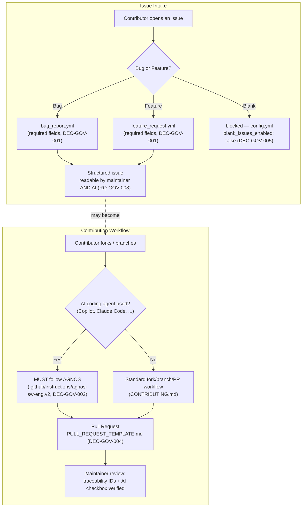

# ADR-GOV-001: Community Health Files & Issue Template Format

## Status
Accepted

<!-- Motivated by RQ-GOV-001..008. New functional area (repository
governance / contribution intake) distinct from the JUCE UI/model
architecture (ADR-JUC-*) and build/release tooling (ADR-BLD-*), hence the
ADR-GOV-* series. -->

## Context

The repository has no standard GitHub community-health files
(`CODE_OF_CONDUCT.md`, `CONTRIBUTING.md`, issue templates, PR template).
`README.md`'s current "Contributing" section is a five-line generic
fork/branch/PR list with no traceability to the AGNOS process the project
otherwise uses for every change (RQ-NFR-007, `CLAUDE.md`), and no
structured intake for bug reports or feature requests.

Two forces shape the decision:
1. **Issue intake must be non-negotiable and unambiguous** (owner
   requirement): a submitter must know exactly what to provide, a
   maintainer must receive unambiguous, directly actionable information,
   and — because this project explicitly uses AI coding agents in its own
   SDLC (README "What's new in the JUCE port") — an AI assistant must be
   able to read a raw submission and correctly reformulate it in plain
   language for a non-technical user, with no invented information.
2. **AI-agent-assisted contributions must follow AGNOS, non-negotiably**
   (owner requirement): the project's own commits already carry AGNOS
   traceability (requirement/ADR/task IDs); an external contribution
   prepared by an AI agent without that discipline would silently
   reintroduce the ambiguity AGNOS exists to remove.

## Decision

- **DEC-GOV-001 — GitHub Issue Forms (YAML), not free-text Markdown
  templates.** Bug reports and feature requests SHALL be
  `.github/ISSUE_TEMPLATE/bug_report.yml` and `feature_request.yml`, using
  GitHub's structured Issue Forms schema (`type: input/textarea/dropdown/
  checkboxes`, `validations: { required: true }`). A required field cannot
  be submitted empty — this is what makes the standard *enforced*, not just
  documented. Every field carries a plain-language `label` and
  `description`, which is also what an AI assistant reads to reformulate
  the issue (RQ-GOV-004, RQ-GOV-005, RQ-GOV-008).

- **DEC-GOV-002 — `CONTRIBUTING.md` links to the AGNOS instructions; it
  does not restate them.** The mandatory-AGNOS clause (RQ-GOV-003) points
  to `.github/instructions/agnos-sw-eng.v2.instructions.md` (and
  `CLAUDE.md` as the Claude Code entry point) as the single source of
  truth, mirroring the pattern already established for the git-workflow
  skill (RQ-PRT-004: ".claude/skills/... points to .github/skills/... as
  canonical"). Duplicating the process text inline would create a second
  copy that drifts the first time either is updated.

- **DEC-GOV-003 — Code of Conduct = Contributor Covenant v2.1, verbatim.**
  Industry-standard text (also what GitHub's own community-profile
  checklist recognises), so no bespoke wording to maintain or justify.
  Enforcement contact is the maintainer's GitHub handle (`@xplorer2716`),
  not an invented email address — the repository does not currently
  publish a monitored contact email, and fabricating one would be
  misleading.

- **DEC-GOV-004 — PR template requires explicit traceability IDs and an
  AI-assistance checkbox.** `.github/PULL_REQUEST_TEMPLATE.md` has a
  dedicated "AGNOS traceability" field (requirement/ADR/task IDs, "N/A" if
  none apply) and a checklist item: "If this PR was prepared with the help
  of an AI coding agent, I confirm it followed the AGNOS process
  (CONTRIBUTING.md)." This makes non-compliance visible at review time
  instead of relying on trust (RQ-GOV-006).

- **DEC-GOV-005 — Blank issues disabled.** `.github/ISSUE_TEMPLATE/
  config.yml` sets `blank_issues_enabled: false`, so every bug/feature
  submission is forced through one of the two structured forms — this is
  the mechanism that makes the standard "non-negotiable" rather than one
  option among several (RQ-GOV-004/005).

## Consequences

- **Easier:** every issue arrives with the same required fields, cutting
  maintainer triage/clarification round-trips; an AI agent (used by the
  maintainer or by a contributor) can read a submission's field
  label/value pairs directly and produce a reliable plain-language summary
  or a first-pass fix without guessing missing context; PRs are reviewable
  against one fixed checklist.
- **Harder / constrained:** contributors must fill more structured fields
  before submitting an issue than a one-line free-text report; the two
  `.yml` forms need to be kept in sync (fields, required-ness) whenever the
  project's supported platforms or implementations change.
- **Neutral:** zero effect on application code or CI; `CONTRIBUTING.md`'s
  AGNOS clause applies only when an AI agent is used — a manual,
  human-only PR is not required to run the full AGNOS session ceremony
  (session state, feature branch, ADRs), only to follow the general
  workflow in `CONTRIBUTING.md`.

## Alternatives Considered

- **Plain Markdown issue template (`ISSUE_TEMPLATE.md`, single file):**
  rejected — no required-field enforcement, a submitter can delete or skip
  whole sections, and free text is harder for an AI reader to reliably map
  to "what was actually provided" versus "what the template suggested".
- **Restating the AGNOS process inline in `CONTRIBUTING.md`:** rejected —
  violates the single-source-of-truth pattern already established for the
  git-workflow skill (RQ-PRT-004); two descriptions of the same process
  will diverge.
- **A dedicated `SECURITY.md` with a monitored contact email:** deferred,
  out of scope — not requested by the owner; the Code of Conduct's
  enforcement contact uses the maintainer's existing GitHub handle instead
  of an invented address. Revisit as a follow-up if a real security-contact
  need arises.

## Diagram

