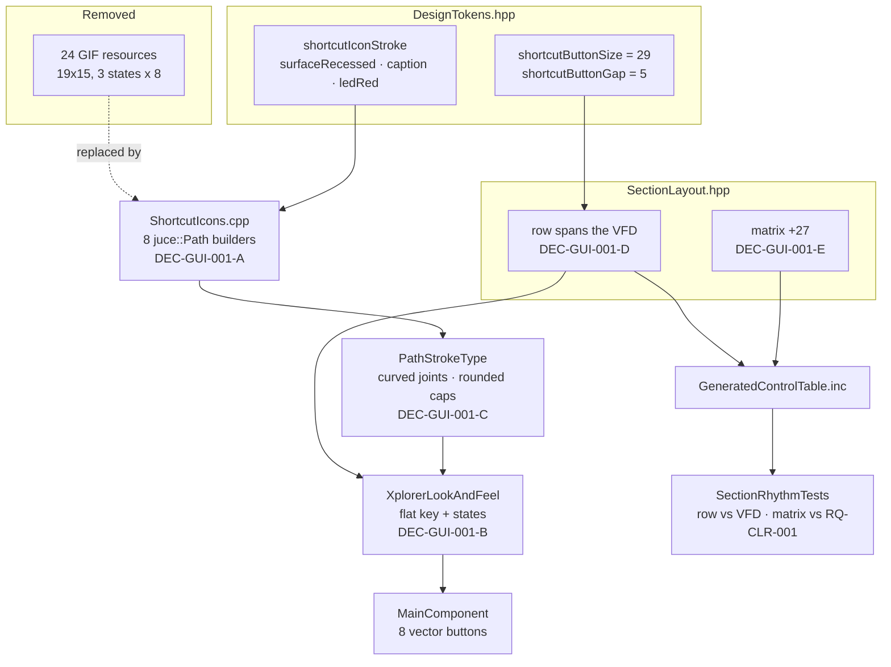

# ADR-GUI-001: Vector Shortcut Buttons and Their Icon Library

## Status
Accepted (owner, session GUI, 2026-08-10).

## Requirements
RQ-GUI-063, RQ-GUI-064, RQ-GUI-065, RQ-GUI-066, RQ-GUI-067. Depends on RQ-GUI-021 (what the
eight buttons do), RQ-GUI-022 (the LED strip beside them), RQ-CLR-001/003/007
(section rhythm and grid alignment), RQ-SCL-001 (the 1x scale), ADR-JUC-014
(token module), ADR-JUC-011 (the control accent), ADR-JUC-017 (interaction
states), ADR-JUC-020 (user-themeable palette), ADR-JUC-024 (display group).

**Referenced (not amended) by RQ-GUI-070** (2026-08-15, session GUI, Tier M,
no new decision): the Settings/About/Dependencies title-bar icons
(`DialogIcons.hpp/.cpp`) reuse this ADR's DEC-GUI-001-A (hand-authored
`juce::Path`, no asset) in a new context — a native OS title bar, rendered
once to a `juce::Image` rather than painted per frame. DEC-GUI-001-B/C/D/E/F
are about the shortcut-button row specifically and do not apply.

## Context

The eight shortcut buttons are `juce::ImageButton`s fed by 24 GIF resources of
70–146 bytes each, three states per button, at 19×15 px. They came across from
the .NET editor unchanged and are the last raster elements of the control
surface: the background, the knobs, the block frames and the VFD are all vector
already (ADR-JUC-013, ADR-JUC-023).

Two things follow from that. They do not scale — at 1.25x and above they are
interpolated and blur while everything around them stays sharp, which is exactly
what RQ-GUI-005's uniform-scale model exists to prevent. And 19×15 is too small
to carry a legible glyph, which is why *randomise* is drawn as a question mark
and *load* as an ellipsis: the source bitmaps gave up on depicting the action.

The owner supplied two concept mockups. The first carried a caption under each
key; measured against the available width it cannot fit — a legible "SAVE PATCH"
needs roughly 50 px per key, and seven of those overrun the 267 px column. The
second is caption-less, and is the one adopted. Its embossed rubber-key styling
was rejected on owner review as foreign to the rest of the interface, which is
flat throughout.

A third constraint surfaced while sizing the row. The matrix column had never
been brought into the section rhythm: TASK-CLR-001 and TASK-CLR-002 covered the
left and centre columns, and `SectionRhythmTests` asserted only those, so the
`MOD MATRIX` separator still sat 43 px above its block where RQ-CLR-001 requires
16. Correcting that frees 27 px — very nearly the extra height the taller keys
need. The two changes are therefore one change.

## Decision

### DEC-GUI-001-A — Hand-authored `juce::Path`, not embedded SVG
Each icon is built as a `juce::Path` in a dedicated translation unit, the way
`BackgroundRenderer` builds the diagram and `VfdSegmentRenderer` builds the
glyphs. Rejected: embedding SVGs and parsing them with
`juce::Drawable::createFromSVG`. It would trade 24 binary assets for 8 and add a
parse step at construction, where the whole point is to have no assets and
geometry that a test can read.

### DEC-GUI-001-B — Flat, in the interface's own vocabulary
A key is a rounded rectangle at `radiusControl`, filled `surfaceRecessed` — the
combo-box fill — with a 1 px `strokeBorder` outline at the same alpha the tick
boxes use for theirs. No gradient, no bevel, no drop shadow. The owner's second
mockup proposed an embossed key; adopting it would have introduced a lighting
model that exists nowhere else in the application.

Icons are stroked in `caption`, the colour of the parameter legends that surround
them, at `shortcutIconStroke`. *store* alone is drawn in `ledRed` — the existing
red of the synth-output LED, reused rather than duplicated — because it writes to
the hardware and is the one destructive action in the row.

### DEC-GUI-001-C — Rounded caps and curved joints, stated not defaulted
Every icon stroke uses `juce::PathStrokeType(w, JointStyle::curved,
EndCapStyle::rounded)`. At 29 px a mitred corner or a butt cap reads as a burr on
the shape; the owner flagged it on the first mockup. This is recorded as a
decision because the JUCE default is the wrong one here and a later refactor that
drops the stroke type will silently reintroduce the artefact.

### DEC-GUI-001-D — The row is defined by the modulation grid, both ends
The row starts on the `MOD_SRC_n` column's left edge and ends on the
`MOD_QUANTIZE_n` column's right edge — 960 to 1218, the span RQ-CLR-007 already
gives the `MOD MATRIX` separator. Across those 258 px, 27 px keys with 6 px gaps
is the solution, so the alignment fixes the metrics rather than the other way
round.

A first pass aligned the row to the VFD instead (951→1218, 29 px keys). Both
alignments are defensible on their own, but the owner observed that this is the
same calculation as the separator's, and it is: hanging the row off the grid
leaves the right column with ONE reference rather than two nearly-identical ones,
and a reader no longer has to ask why the row and the bar start nine px apart.
The keys lose two px, which is the price.

Vertically the row sits 8 px below the LED strip and 24 px above the matrix
labels. The asymmetry is deliberate and is RQ-CLR-001's proximity principle: the
buttons belong to the display group (ADR-JUC-024), so they bind upward to it, not
downward to the matrix.

### DEC-GUI-001-F — Hover uses the control accent, passed in, never a token
A hovered key draws its icon and outline in `XplorerLookAndFeel::ledColour()`
brightened by `hoverBrighten` — the same call a knob ring, a tick box border and
a radio already make. `paintShortcutButton` takes the colour as a PARAMETER and
`ShortcutButton` reads it from the LookAndFeel at paint time.

That the accent is a parameter rather than a token is the substance of this
decision. `ledColour` is the single runtime source of truth for the control
accent (ADR-JUC-011) and the user can retheme it live (ADR-JUC-020, which mutates
the LookAndFeel in place and repaints). A token would have frozen these eight
keys on one colour while every control around them followed the user — the row
would drift out of the palette on the first retheme, silently.

A first implementation did exactly that, lighting the keys in `indicatorSynthIn`
after reading the owner's "LED colour" as the MIDI lamp's blue. The owner
clarified they meant the interaction highlight of the knobs and tick boxes. The
two happen to be neighbouring blues today, which is precisely why the mistake was
invisible on screen and only the retheme case distinguishes them.

`btPatchStore`'s icon is exempt and brightens in its own `indicatorSynthOut` red:
it is the only key that writes to the synth, and a hover that recolours it would
spend the destructive-action signal to buy a hover signal. Its outline still
takes the accent, so the hover is never ambiguous. The pressed state is untouched
and stays inverted, so press and hover remain distinguishable rather than two
intensities of the same thing.

### DEC-GUI-001-E — The matrix descends 27 px, derived not chosen
The whole matrix block moves down 27 px so the `MOD MATRIX` separator clears it
by `sectionGapAbove`. The figure is a consequence of RQ-CLR-001 applied to a
column that had escaped it, not a layout preference — and `SectionRhythmTests`
gains the matrix assertions it was missing, so the column cannot drift out again.
The separator itself does not move: RQ-CLR-003 pins it to the shared floor.

## Consequences

**Easier.** The button row scales with everything else, and its icons say what
the buttons do rather than standing in for it. 24 binary assets leave the
repository. The row's metrics and the matrix's position both become derived
values with tests behind them, joining the section rhythm rather than sitting
outside it.

**Harder.** Icon geometry now lives in code, so changing an icon means editing
paths rather than swapping a file — a real cost for anyone who would rather work
in a drawing tool. The 27/6 metrics are load-bearing: they are the pair that
spans the modulation grid, so moving the `MOD_SRC` or `MOD_QUANTIZE` columns
forces a rethink of the row rather than a tweak — and `SectionRhythmTests` will
say so.

**Constrained.** The keys cannot grow beyond 27 px without breaking the grid
alignment, and the icons are drawn for that size — the DIN's five pins in
particular are at their legibility floor. A future request for larger keys is a
request to re-lay-out the right column, not to change a constant.

**Unchanged.** What the buttons *do* (RQ-GUI-021), the LED strip's position and
behaviour (RQ-GUI-022), the VFD, and the `MOD MATRIX` separator's own position.

## Alternatives Considered

**Keep the bitmaps, redraw them at 2x/3x for high-dpi.** Rejected: it multiplies
the asset count by the number of scales supported, and RQ-SCL-001 allows
arbitrary scaling, so no finite set of bitmaps is enough.

**Embedded SVG parsed at startup.** Rejected under DEC-GUI-001-A — still assets,
plus a parser, and the geometry stops being readable by a test.

**Captioned keys, as the owner's first mockup.** Rejected on measurement: a
legible caption needs roughly 50 px per key and seven keys overrun the 267 px
column. Reported to the owner, who chose the caption-less variant.

**Embossed key styling, as the owner's second mockup.** Rejected on owner review:
it introduces a lighting model — bevel, inner shadow, recess ring — that no other
control in the application uses.

**A gear for *settings*.** Considered because the DIN's pins are the least
legible element at this size. Rejected on owner instruction: the DIN says MIDI,
which is what the dialog is mostly about, and five pins were judged sufficient.

**Leave the matrix where it is and fit the row into the space available.**
Rejected: it would have capped the keys around 22 px, keeping them nearly as
cramped as the bitmaps, *and* left RQ-CLR-001 violated in the matrix column. The
descent is required on its own merits.

## Diagram

