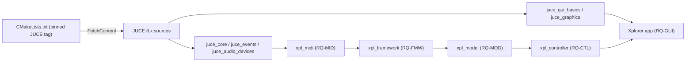

# ADR-JUC-001: JUCE 8 Integration via CMake FetchContent

## Status
Accepted

## Requirements
RQ-BLD-001, RQ-BLD-002, RQ-BLD-006, RQ-NFR-005

## Context
The port targets the JUCE framework (README roadmap). JUCE can be consumed via the Projucer, as a git submodule, or through CMake. The project is GPL v3; JUCE offers a GPL license option. Reproducible builds and headless Linux CI are required (RQ-BLD-007), and this repo already uses submodules for MidiApp/Sanford.

## Decision
- Use **JUCE 8.x** (latest stable tag, pinned) consumed with **CMake `FetchContent`** — no Projucer, no committed JUCE sources, no extra submodule.
- Use JUCE under its **GPL v3** option, matching the project license.
- Only link the JUCE modules needed per layer: `juce_audio_devices` (+ core/events deps) for MIDI; GUI modules only in the application target.

## Consequences
- One-command configure+build on Windows and Linux; JUCE version bumps are a one-line change.
- First configure downloads JUCE (network needed once; cached afterwards).
- No `.jucer` project to maintain; CMake is the single build truth (RQ-BLD-005).
- Non-UI targets stay free of GUI module dependencies, keeping headless CI light (RQ-BLD-002).

## Diagram

