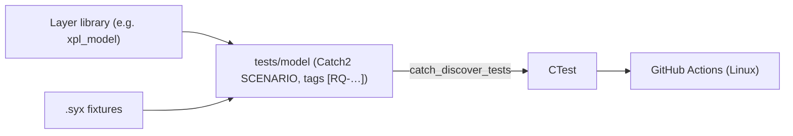

# ADR-JUC-003: Catch2 v3 as Test Framework

## Status
Accepted

## Requirements
RQ-TST-001, RQ-TST-004, RQ-TST-007, RQ-BLD-007

## Context
RQ-TST mandates headless, Given/When/Then-styled unit and functional tests with requirement-ID traceability. Candidates: JUCE's built-in `juce::UnitTest` (poor CTest/reporting integration, JUCE-coupled), GoogleTest (solid, verbose fixtures, no native BDD naming), Catch2 v3 (BDD macros `SCENARIO/GIVEN/WHEN/THEN`, tags, first-class CTest integration via `catch_discover_tests`, FetchContent-friendly).

## Decision
- Use **Catch2 v3** (pinned, via FetchContent) for all unit and functional tests.
- Use `SCENARIO`/`GIVEN`/`WHEN`/`THEN` structure; tag every test with its requirement IDs, e.g. `TEST_CASE("...", "[RQ-MOD-022]")`, enabling `ctest -R` / tag filtering and mechanical traceability (RQ-TST-007).
- One test executable per layer under `juce/tests/`, registered with CTest; `.syx` fixtures in `juce/tests/fixtures/`.

## Consequences
- BDD naming maps directly onto EARS requirements; the traceability matrix can be generated by grepping tags.
- One more third-party dependency (BSL-1.0, GPL-compatible — RQ-NFR-005).
- JUCE-backend integration tests (RQ-TST-005) also run under Catch2, guarded by a runtime skip when no loopback device exists.

## Diagram

