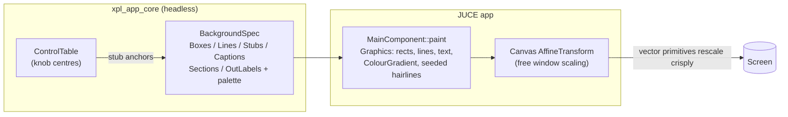

# ADR-JUC-013: Vector Background — Replace the Stretched Bitmap by JUCE-Drawn Vector Graphics

## Status
Accepted (mockup owner-validated; implemented in TASK-JUC-080)

## Context
The main window background is a 1260×813 JPEG (`main-background.jpg`, 427 KB in
BinaryData) drawn stretched over the logical canvas. At any window scale other
than 1:1 the bitmap is interpolated and blurs — text and thin diagram lines
degrade first. The owner wants a fully vector UI (the VFD glyph display stays
bitmap for now, to be revisited if this test is conclusive).

The bitmap's content is a synth block diagram, fully enumerable (measured by
line-detection on the bitmap itself):

- **Plate**: dark brushed-metal (#37373F mid, lighter top #45464F, fine
  horizontal streaks), dark strip at the top (menu shadow), wood side rails
  (~28 px, warm brown grain) left and right.
- **Diagram**: light-grey frames (#B7BDD0, 2 px, slightly rounded) — VCO1/VCO2
  (with in-box TRIANGLE/SAWTOOTH/PULSE labels), PWM ×2, MIX ×2, VCA ×5, FM VCA,
  DESTINATION, MULTIMODE VCF, VCA1, ENVELOPE GENERATOR, LFO, RAMP, LAG,
  TRACKING GENERATOR, plus two large empty frames (ENV/RAMP trigger rows).
- **Signal lines** between blocks, and **stub ticks** dropping from block
  bottoms exactly onto the knob centres of the control table.
- **Captions** (FREQUENCY, DETUNE, …), **IN/OUT labels** (VOICE OUT, LAG IN,
  TRIGGER IN…), one rotated label (NOISE).
- **Section titles** with a blue underline bar (#243876, ~4.5 px): VCO1/VCO2/FM,
  LAG, TRACK X, VCF/VCA, ENV X, LFO X, RAMP X, MODULATION MATRIX.

A full-fidelity SVG mockup (`ADR-JUC-013-mockup.svg`, generated by
`ADR-JUC-013-mockup-generator.py` from the measured geometry) demonstrates the
target rendering; every SVG primitive used maps 1:1 to a `juce::Graphics` call.

Mockup v3 after second owner review: the DESTINATION→VCF branch now ends on
the **VCF FREQ stub** (the FM modulates the frequency, exactly like the VCO1
branch ends on the VCO1 FREQUENCY stub — it does not enter the VCF block);
both horizontal buses above DESTINATION are aligned at the same y; the ENV
and RAMP TRIGGER IN verticals now connect into the trigger frames below them.

Mockup v2 after owner review: added the three routing details initially
missed — (1) the two DESTINATION risers (x=284 up to the y=180 bus toward
VCO1; x=289 up to the y=182 bus running right, hopping over the x=499
vertical, rising at x=513 into the VCF), (2) the VCO2-row VCA output
returning into the MULTIMODE VCF via the x=499 vertical, (3) the VCO2
TRIANGLE tap (x=204) feeding the left bus into the FM VCA input. Captions
re-centred on their knob stubs.

## Decision
**DEC-JUC-013**: render the background vectorially in JUCE from a declarative
specification; drop the JPEG once validated.

1. **Declarative `BackgroundSpec`** in `xpl_app_core` (headless-testable):
   plain tables of `Box{bounds, title, style}`, `Line{points}`,
   `Stub{anchor}`, `Caption{pos, text}`, `Section{title, barBounds}`,
   `OutLabel{pos, line1, line2}` — geometry from the measured reference.
   Stubs reference **control-table knob centres**, so diagram/controls
   alignment holds by construction (single source of truth for positions).
2. **Painting** with `juce::Graphics` primitives in the main component's
   `paint()`: `drawRoundedRectangle`/`drawLine`/`drawText` for the diagram,
   `ColourGradient` fills for plate/wood/blue bars; brushed streaks and wood
   grain as seeded-random hairlines (fixed seed → identical on every repaint).
   All colours become named constants (single palette block).
3. **No `setBufferedToImage` for the background**: an image cache is rendered
   at logical scale, so the canvas `AffineTransform` would rescale it and
   reintroduce exactly the blur this change removes. Direct paint (~300
   primitives) is cheap and background repaints are rare.
4. **Cut-over**: after owner validation on Windows, the vector background
   replaces the bitmap outright; `main-background.jpg` leaves BinaryData
   (−427 KB). The VFD stays bitmap (ADR-JUC-007) pending a separate decision.

## Implementation Notes (as built — TASK-JUC-080)
Two deviations from the decision as originally worded, taken deliberately and
recorded here for traceability:

1. **Geometry lives in the app painter, not a `BackgroundSpec` in `xpl_app_core`.**
   The owner-validated mockup (`ADR-JUC-013-mockup.svg` /
   `ADR-JUC-013-mockup-generator.py`) is the single validated source of truth
   for the geometry, and it is transcribed 1:1 into
   `juce/app/src/BackgroundRenderer.cpp` (`paintVectorBackground`). Splitting
   the same numbers into declarative core tables would duplicate the validated
   coordinates without adding value while `session.unit_tests = false` (no
   headless geometry test is run this session). If headless geometry tests are
   later wanted, extracting the tables into `xpl_app_core` is a mechanical
   follow-up. Palette, line widths, corner radius, stub length, font sizes and
   section-bar dimensions are named constants (no duplicated literals).
2. **Stub anchors are the validated mockup coordinates, not derived live from
   the `ControlTable`.** The mockup coordinates were measured to sit on the
   knob centres and the running app confirms the controls overlay their stubs
   exactly; deriving them at paint time from the control table was not needed
   to hold that alignment.

The splash screen (`Main.cpp`), which previously reused `main-background.jpg`,
now renders `paintVectorBackground` once into an offscreen `juce::Image`, so
the bitmap could be dropped from `BinaryData` entirely.

## Consequences
- Crisp diagram at any window size; no interpolation artefacts.
- −427 KB of embedded asset; colours/geometry become reviewable, testable
  data instead of pixels; future re-theming (colours, fonts) is trivial.
- The wood/brushed textures become stylised (procedural) rather than
  photographic — visually close but not pixel-identical; owner judges.
- Initial effort: transcribing the measured geometry into the spec tables
  (the mockup generator already contains it).

## Alternatives Considered
- **Keep the bitmap** (status quo): blurry under scale, 427 KB, untestable —
  the problem statement itself. Rejected.
- **Ship an SVG asset rendered by `juce::Drawable`**: bitmap-free, but JUCE's
  SVG support lacks gradients-on-strokes/filters/patterns needed for the
  textures, adds parse cost, and geometry stays opaque to tests. Rejected.
- **Higher-resolution bitmap (2×/4×)**: heavier asset, still soft at
  non-integer scales, same untestability. Rejected.

## Diagram

