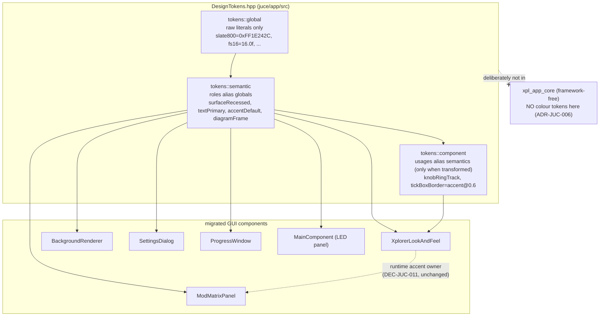

# ADR-JUC-014: Design Token Module — Single Source of Truth for JUCE UI Presentation

## Status
Proposed (2026-07-19)

## Requirements
RQ-DSN-001..006, RQ-DSN-010..011, RQ-DSN-020..024, RQ-DSN-060..063,
RQ-DSN-080..083, RQ-DSN-090..091 (implements the token *structure* and the
first, value-preserving migration pass of `RQ-DSN-design-system.md`, itself an
instance of `docs/design-system-template.md`).

## Context
The JUCE UI (`juce/app/src/`) defines its visual constants independently, file
by file, with no shared source of truth. The same colour is hard-coded in
several places (`juce::Colour::fromRGB(30, 36, 44)` in four files;
`fromRGB(24, 28, 34)` in three), font sizes are chosen per file (ten `FS_*`
constants local to `BackgroundRenderer.cpp`, plus independent literals in
`XplorerLookAndFeel.cpp`), and interaction-state styling exists only for the
rotary knob. `RQ-DSN-design-system.md` documents this drift and specifies a
three-tier token model to fix it; `ADR-JUC-011` already proved the pattern for
one value (the knob LED colour). This ADR decides *where* the token module
lives, *how* it is structured, and *how* the first migration is verified.

A hard constraint frames the "where": the design tokens are typed values —
`juce::Colour`, `juce::Font` sizes — so the module inherently depends on the
JUCE graphics module. `xpl_app_core` is deliberately **UI-framework-free**
(ADR-JUC-006, ADR-JUC-002): it links `xpl_controller`/`xpl_model` and JUCE
*core* logic only, never `juce_graphics`/`juce_gui_*`. Putting colour tokens
there would break that boundary.

## Decision

### DEC-JUC-014-A — Module location: `juce/app/src/DesignTokens.hpp`
The token module is a header in the GUI app target (`XplorerApp`), **not** in
`xpl_app_core`. Rationale: tokens are `juce::Colour`/`juce::Font`-typed, so
they belong with the code that already depends on `juce_graphics`; the
headless core stays framework-free (ADR-JUC-006). Headless unit-testing of raw
colour *values* is not required (`session.unit_tests = false`, and value
identity is a compile-time/review fact, not runtime logic) — so the reason
`RQ-DSN-060` offered for optionally placing it in core (headless tests) does
not apply this session. If headless *logic* over tokens is ever needed (e.g. a
state→role resolver), that logic — not the `juce::Colour` constants — can move
to core later, mechanically.

### DEC-JUC-014-B — Three-tier structure via nested namespaces
`namespace xplorer::app::tokens` with three sub-namespaces, each referencing
only the tier below (RQ-DSN three-tier model, template §2):
- `tokens::global` — the raw curated palette/scale; the **only** tier holding
  literals (hex colours, point sizes, pixel radii). Named by
  family/appearance (`slate800`, `metalPlateTop`, `fs16`).
- `tokens::semantic` — roles aliasing globals (`surfaceRecessed`,
  `textPrimary`, `accentDefault`, `panelPlateTop`, `diagramFrame`,
  `textCaption`).
- `tokens::component` — per-control usages aliasing semantics, **only where a
  transform or independent-movement potential exists** (e.g.
  `knobRingTrackColour`, `tickBoxBorderColour` = accent @ 0.6 alpha). Where a
  usage is exactly a semantic role with no transform, call sites reference the
  semantic token directly (template §2: don't add a component token for a
  pass-through).

Accent handling is unchanged (DEC-JUC-011): the effective knob/accent colour
stays owned at runtime by `XplorerLookAndFeel::ledColour()`; the token module
supplies only the *default*, and no consumer caches a copy.

### DEC-JUC-014-C — Scope boundary of the token set
This pass tokenises **appearance** values: colour, font size, corner radius,
stroke width, and motion/timing (hover-brighten factor, LED hold duration),
plus the named alpha transforms. It deliberately **excludes**:
- **Spacing / layout geometry** (dialog margins, control insets, canvas
  crop/padding, rail width, section-bar dimensions, box sizes) — `RQ-DSN-020`
  explicitly defers the spacing scale ("not yet derived from evidence"); these
  stay as file-local named constants for now.
- **Procedural texture parameters** (wood-grain RNG ranges, hairline counts,
  fixed seed) — algorithm inputs of `BackgroundRenderer`, not shared design
  tokens.
This keeps the boundary principled and the diff a pure appearance-token
substitution.

### DEC-JUC-014-D — First migration is a value-preserving refactor
Every token is initialised to the **exact** value of the literal it replaces
(same ARGB, same float). Migrating the six files
(`XplorerLookAndFeel`, `BackgroundRenderer`, `ModMatrixPanel`,
`SettingsDialog`, `ProgressWindow`, `MainComponent`) changes only the *origin*
of each value (inline → token reference), never the value. No RQ-GUI/RQ-CTL
behaviour changes (RQ-DSN-090). The *consolidation candidates* flagged in
`RQ-DSN-010` (e.g. `FS_BLOCK` 13.5 vs `FS_VCA` 13) and the *missing states*
(RQ-DSN-030..033) are **out of scope here** — they change pixels and are the
next, owner-reasoned phase.

### Verification
Because the rotary/background rendering is deterministic (fixed RNG seed 42,
ADR-JUC-013) and every token equals its original literal, the rendered output
is **pixel-identical by construction**. This is verified by:
1. **Compile**: `XplorerApp` builds clean with the migrated code (no display
   needed to prove the substitution is well-formed and type-correct).
2. **Functional tests**: the existing Catch2 suites (`xpl_tests_*`) pass
   unchanged — no test is modified (DoD). (No *new* unit tests are written:
   `session.unit_tests = false`, and a header of constant aliases has no
   behavioural logic to unit-test — confirmed with the owner.)
3. **Value-mapping table**: the migration commit carries a token → original-
   literal table so each substitution's value-identity is reviewable by grep.
On-screen visual confirmation on Windows remains the owner's per-milestone
check (the established pattern), but is not the *proof* of identity here — the
construction argument is.

## Consequences
- **Easier**: any future colour/size/motion change is a one-place edit in
  `DesignTokens.hpp`; a re-theme touches no component code (RQ-DSN-081); new
  visual ADRs extend the token set instead of adding scattered literals
  (RQ-DSN-083).
- **Constrained**: new visual code must resolve values through the token chain
  (template §0); a raw appearance literal outside `DesignTokens.hpp` becomes a
  reviewable defect (RQ-DSN-002, RQ-DSN-071 grep check).
- **Harder / deferred**: spacing and texture params remain untokenised, so the
  system is not yet *complete* — a follow-up pass (and an owner-approved
  spacing scale) is needed before "all graphics via tokens" is literally true.
- The SVG mockup prototype must stay in sync with the token values
  (RQ-DSN-063). **Superseded by ADR-JUC-015**: the sync is now structural —
  both `DesignTokens.hpp` and the mockup are generated from / consume the one
  `juce/tools/design-tokens.yaml` source, so they cannot diverge, and the
  hand-authoring of `DesignTokens.hpp` described in DEC-JUC-014-A/B is replaced
  by code generation (DEC-JUC-015-A). The three-tier structure and value
  boundaries decided here are unchanged; only the *authoring mechanism* moves
  from hand-written to generated.

## Alternatives Considered
- **Tokens in `xpl_app_core`** (headless): rejected — forces `juce_graphics`
  into the deliberately framework-free core (ADR-JUC-006), for a headless-test
  benefit that does not apply while `unit_tests = false` and the values carry
  no logic.
- **Flat single-tier token list** (no global/semantic/component split):
  rejected — loses the re-theming property (a colour change would still hit
  every role that shares a value) and the traceability the three tiers give;
  contradicts the RQ-DSN model.
- **Migrate everything at once, including spacing/layout**: rejected for this
  pass — spacing has no owner-approved scale yet (RQ-DSN-020), and bundling it
  would make the "pixel-identical" claim harder to verify by construction.
- **JSON/asset-driven tokens loaded at runtime**: rejected — adds parse/IO
  cost and runtime failure modes for values that are compile-time constants;
  a C++ header is the natural single source of truth here.

## Diagram

