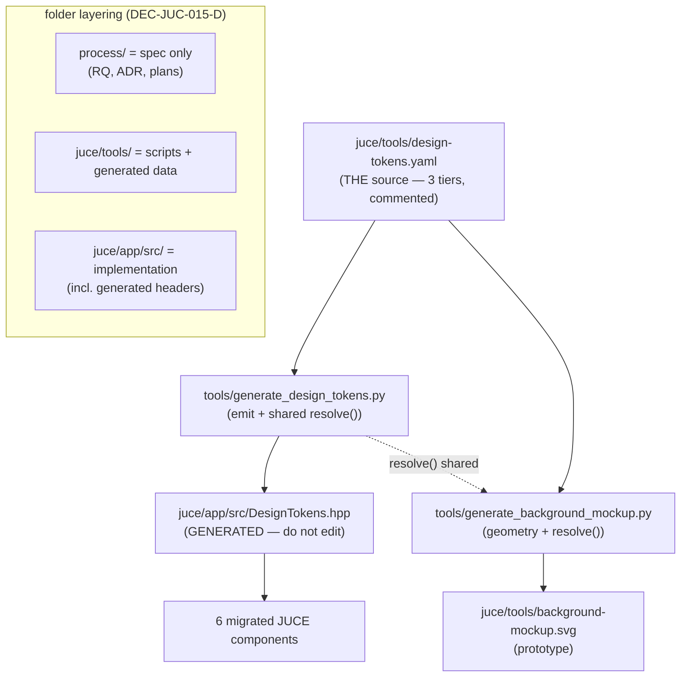

# ADR-JUC-015: Design Token Codegen — One YAML Source, Generated C++ + Consumed Mockup

## Status
Proposed (2026-07-19)

## Requirements
RQ-DSN-060..063, RQ-DSN-032 (structural sync mechanism), RQ-DSN-090..091.
Refines ADR-JUC-014 (supersedes its hand-authoring clause; the three-tier
structure and value boundaries of ADR-JUC-014 are unchanged).

## Context
ADR-JUC-014 introduced `DesignTokens.hpp` as a hand-written C++ header, and
`RQ-DSN-063` asked the SVG mockup prototype (`generate_background_mockup.py`)
to *mirror* the same palette/fonts "reviewed together on any token change" —
a manual discipline, i.e. exactly the drift risk the design system exists to
remove, just moved up one level (from scattered literals to two hand-synced
copies of the palette).

Two further forces:
- **Repository convention.** The repo already generates C++ from Python tools
  (`GeneratedControlTable.inc`, `GeneratedParameterNames.inc`,
  `GeneratedControlChangeNames.inc` via `tools/` scripts). A generated
  `DesignTokens.hpp` fits this established pattern.
- **Artifact placement.** The mockup generator and its `.svg` lived under
  `process/2.architecture/`, mixing an executable tool and a generated binary
  artifact into the spec/aspect folder. The intended layering is:
  `process/` = specification (requirements, ADRs, plans) only; `tools/` =
  scripts that realise/validate those concepts; `<lang> src/` = the
  implementation (including generated files).

## Decision

### DEC-JUC-015-A — One language-neutral source of truth: `design-tokens.yaml`
`juce/tools/design-tokens.yaml` holds every token (three tiers: global raw
values, semantic roles, component usages) as neutral data (colours as `RRGGBB`,
sizes/factors as numbers). YAML is chosen over JSON specifically for **native
comments** (each token carries its rationale), at the cost of a PyYAML
dependency (standard, `pip install pyyaml`) documented as a tools prerequisite.

### DEC-JUC-015-B — `DesignTokens.hpp` is generated, not hand-written
`juce/tools/generate_design_tokens.py` reads the YAML and emits
`juce/app/src/DesignTokens.hpp` with a "GENERATED — DO NOT EDIT" banner. The
generator resolves the alias tiers into the same `tokens::{global,semantic,
component}` C++ namespaces ADR-JUC-014 specified; every value is byte-faithful
to the YAML, hence value-identical to the prior hand-written header (verified:
27 global colours, 0 ARGB differences; build clean; 81/81 tests). It is
idempotent (`--check` exits non-zero if the committed header is stale).

### DEC-JUC-015-C — The mockup consumes the same source
`generate_background_mockup.py` imports the generator's shared `resolve()` and
reads its palette, font sizes and line width from the YAML — it no longer keeps
its own copy. Only the diagram **geometry** (coordinates) stays in the mockup
script. Regenerating the SVG after the refactor produces a **byte-identical**
file, proving the values were preserved. Both the mockup script and its
`background-mockup.svg` output move from `process/2.architecture/` to
`juce/tools/`.

### DEC-JUC-015-D — Folder-layering rule
Enforced going forward: `process/` holds specification artifacts only (no
scripts, no generated binaries); `juce/tools/` holds the generator/extractor
scripts and their committed generated data; C++ `src/` holds the
implementation, including generated headers. `extract_control_table.py` already
lives under a `tools/` dir and is left in place (`juce/app/core/tools/`), close
to the core artifact it generates; full consolidation is optional later work.

### Regeneration & verification contract
- Regenerate: `python3 juce/tools/generate_design_tokens.py` (header) and
  `python3 juce/tools/generate_background_mockup.py` (SVG).
- A token change is a one-line edit in `design-tokens.yaml` followed by
  regenerating both outputs; the C++ and the mockup move together by
  construction, satisfying RQ-DSN-063/081 without a review checklist.
- `--check` is available for a CI/DoD staleness gate (not wired into the build
  yet, to avoid a Python/PyYAML build-time requirement; documented as a manual
  step for now).

## Consequences
- **Easier**: the C++ tokens and the mockup can no longer diverge — the RQ-DSN-063
  risk is closed structurally, not by discipline. A re-theme is a YAML edit +
  regenerate.
- **Constrained**: `DesignTokens.hpp` must not be hand-edited (banner + `--check`);
  changes go through the YAML. Running the tools needs PyYAML.
- **Cleaner layering**: `process/` is now spec-only; tooling and generated
  artifacts sit under `juce/tools/`.
- **Deferred**: wiring `--check` into CMake/CI; consolidating
  `extract_control_table.py`; a JSON-Schema/validation pass on the YAML.

## Alternatives Considered
- **Keep `DesignTokens.hpp` hand-written + mirror the mockup manually**
  (ADR-JUC-014 status quo): the drift risk RQ-DSN exists to remove. Rejected.
- **JSON source**: neutral and zero-dependency, but no comments; the owner
  wanted inline rationale per token. Rejected in favour of YAML (a "description"
  side-field in JSON was considered and judged noisier than YAML comments).
- **Python module as the source** (imported by both): simplest to wire, but the
  source of truth would be code, not neutral data — weaker for "generic,
  language-neutral" and for future non-Python consumers. Rejected.
- **Runtime-loaded tokens** (app reads YAML/JSON at startup): adds parse/IO and
  failure modes for compile-time constants; already rejected in ADR-JUC-014.
- **C++ as the source, generate YAML from it**: inverts the dependency so the
  neutral artifact is the derivative — the mockup (Python) would then depend on
  parsing C++. Rejected.

## Diagram

