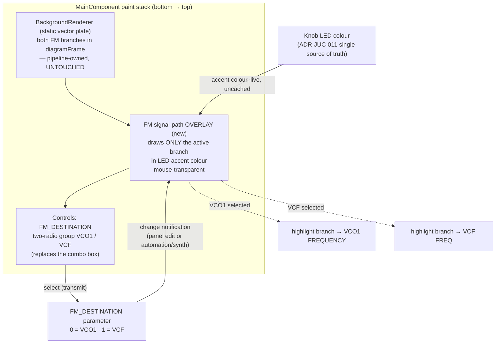

# ADR-JUC-016: FM Destination Two-Way Radio Selector and Active Signal-Path Overlay

## Status
Proposed

<!-- Motivated by RQ-GUI-038 (FM destination two-way radio) and RQ-GUI-039
(active FM signal-path highlight). UI-affecting ADR: references the design
system ADR-JUC-014 and the LED-colour single-source-of-truth ADR-JUC-011. -->

## Context

Two owner requests on the FM/VCA block ([RQ-GUI-038], [RQ-GUI-039]):

1. **Selector.** `FM_DESTINATION` is declared in the control-table metadata as a
   `ControlKind::RadioButtonPanel` with two option rows (`rdFMDestVCO1` = 0,
   `rdFMDestVCF` = 1), inherited from the reference .NET `MainForm` radio panel.
   However the JUCE widget factory (`MainComponent`, `case ControlKind::RadioButtonPanel:`)
   **substitutes a single `BoundComboBox`** — it calls `radioPanelOptions()` only
   to source the two (label, value) pairs — and there is **no widget case for
   `ControlKind::BackgroundImageRadioButton`**, so the two child rows never become
   widgets. Net: at runtime the control renders as a combo box, never as radios.
   The owner wants the real two-way exclusive radio (`VCO1` / `VCF`).

2. **Routing legibility.** The two FM-bus branches (into VCO1 FREQUENCY, into VCF
   FREQ) are painted **statically** in `BackgroundRenderer::paintVectorBackground`,
   both always shown in the neutral signal-line colour (`semantic::diagramFrame`).
   The panel therefore never shows which way the FM signal is actually routed. The
   owner wants the branch that leads to the selected destination to be emphasised
   (comparable to Arturia Matrix-12 V active-path lighting).

Constraint from [ADR-JUC-013]: the static background is owner-validated through a
two-stage pipeline — `generate_background_mockup.py` → `background-mockup.svg`
(validated single source of truth) → hand-ported to `BackgroundRenderer.cpp`. Any
change to the **static** plate must go through that whole pipeline (edit the
generator, regenerate the SVG, owner re-validation, port to CPP).

## Decision

- **DEC-JUC-016 — Real two-radio selector.** Replace the combo-box substitution for
  `FM_DESTINATION` with an actual **exclusive two-button radio group** (`VCO1` /
  `VCF`), reusing the exclusive-toggle pattern already in the app for the
  page-family selectors (`PageSelectorButton` + `setClickingTogglesState(true)` +
  `setRadioGroupId(...)`), bound to the `FM_DESTINATION` parameter (0 = VCO1,
  1 = VCF, per `EnumFMDestinationTypes`). VFD feedback on change is unchanged
  ([RQ-GUI-020]). ([RQ-GUI-038])

- **DEC-JUC-017 — Overlay, not a background edit (owner: try overlay first).** Render
  the active-path emphasis as a **separate lightweight overlay `Component`** painted
  on top of the static vector background — **not** by parameterising
  `BackgroundRenderer` nor the mockup pipeline. This leaves
  `generate_background_mockup.py`, `background-mockup.svg` and the validated static
  geometry **untouched**; the overlay is purely additive. If the overlay renders
  poorly, a follow-up ADR may move the emphasis into the pipeline route instead.
  ([RQ-GUI-039])

- **DEC-JUC-018 — Accent = LED colour SoT; neutral stays the static line.** The active
  branch is stroked in the runtime knob-LED colour — the single source of truth of
  [ADR-JUC-011], i.e. the same accent the modulation-matrix highlight uses
  ([RQ-GUI-018]). The inactive branch is simply **not drawn** by the overlay, so it
  keeps the static plate's `semantic::diagramFrame`. Stroke width and corner
  rounding come from the diagram line tokens ([RQ-GUI-037], [RQ-DSN-061]). No colour
  or stroke literal lives in the overlay. ([RQ-GUI-039], [ADR-JUC-014], [ADR-JUC-011])

- **DEC-JUC-019 — Live update, shared geometry, no cached colour.** The overlay observes
  `FM_DESTINATION` through the existing parameter-change notification path and
  repaints on every change — panel edits and incoming automation/synth changes alike
  ([RQ-GUI-006]); its branch colour follows the LED-colour setting live via the
  existing skin-rebuild path, with no cached colour copy ([ADR-JUC-011]). The
  overlay's branch coordinates are the **same constants** `BackgroundRenderer`
  already uses for those two branches — single-sourced (shared header / exposed
  constants), not re-measured, so the highlighted path can never drift from the
  drawn path (honours the no-duplicated-literal rule).

## Consequences

- **Easier:** the routing becomes self-evident; the static-background pipeline
  ([ADR-JUC-013]) is entirely bypassed for this feature (no mock-script churn, no
  re-validation cycle); the radio matches both the reference hardware panel and the
  control-table metadata intent; the accent reuses an existing runtime colour, so
  the settings LED-colour change flows through for free.
- **Harder / constrained:** adds an overlay component to the paint stack whose
  z-order and hit-testing must be right — it sits above the background but must
  **not intercept mouse events** on the controls it overlaps
  (`setInterceptsMouseClicks(false, false)`). The two FM-branch coordinates must be
  shared between `BackgroundRenderer` and the overlay (a small refactor to expose
  them) rather than duplicated. The radio swap changes the control footprint (two
  ~17 px buttons vs one combo) inside the reserved `RadioButtonPanel` bounds
  (191, 189, 82, 42) — the layout must fit that area.
- **Reversible:** because the overlay is additive and pipeline-free, backing it out
  (or promoting it into `BackgroundRenderer` if the overlay looks wrong) is a
  contained change.

## Alternatives Considered

- **Parameterise `BackgroundRenderer` / the mockup** to draw the active branch in the
  accent colour: rejected for the first iteration — it forces the full
  [ADR-JUC-013] pipeline (edit generator, regenerate SVG, owner re-validate, port to
  CPP) for what is an interactive, stateful highlight that does not belong to the
  static plate. Retained as the fallback if the overlay renders poorly (owner
  decision: overlay first).
- **Keep the combo box, add only the path highlight:** rejected — the owner
  explicitly wants the two-way radio control (clearer, one-click, matches the
  reference).
- **Implement `BackgroundImageRadioButton`** (the reference's GIF-backed radios):
  rejected — the skin is vector / `LookAndFeel`-based ([RQ-GUI-031]); a token-skinned
  radio reusing `PageSelectorButton` is consistent, whereas raster radio images
  would reintroduce the bitmap assets the vector migration removed.

## Diagram

