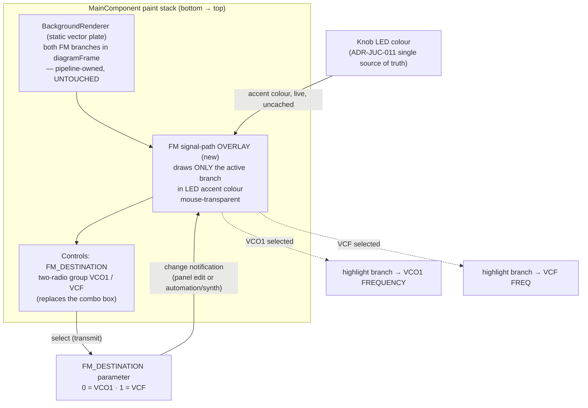
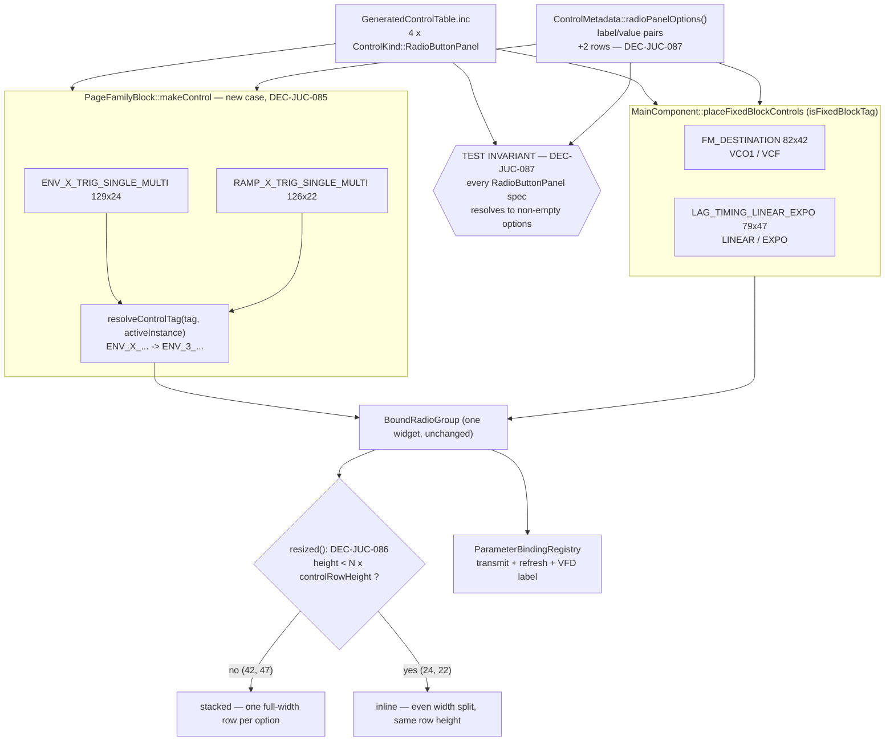

# ADR-JUC-016: FM Destination Two-Way Radio Selector and Active Signal-Path Overlay

## Status
Partially superseded (owner decision 2026-07-23). **DEC-JUC-016 (two-way radio
selector) — Accepted and implemented (TASK-JUC-105).** **DEC-JUC-017/018/019 (active
signal-path overlay) — Withdrawn:** the overlay was implemented (TASK-JUC-106,
commit `e84c24a`) and then reverted at the owner's request — the two-way radio is
deemed sufficient for FM-routing legibility, so no active-path highlight is kept.
RQ-GUI-039 is withdrawn accordingly; RQ-GUI-038 remains fulfilled.

**Extended 2026-08-04 (issue #31) — DEC-JUC-085/086/087 Accepted:** the radio
widget this ADR introduced reaches the page-family blocks (ENV X / RAMP X
`SINGLE`/`MULTI`), and its layout stops assuming a vertical stack. See
[Decision](#decision) and [PLAN-TRG-001](../3.plan/14-Phase-14-page-family-radio-panels.md).

**Corrected 2026-08-04 (session GFX) — DEC-JUC-094 Accepted:** DEC-JUC-086's
orientation rule shipped with the wrong option *height* in the horizontal case,
placing the ENV X / RAMP X radios 3 px above the check boxes on their row
(owner-reported). A side-by-side option now fills its panel. See
[PLAN-GFX-003](../3.plan/17-Phase-17-radio-row-alignment.md).

<!-- Motivated by RQ-GUI-038 (FM destination two-way radio) and RQ-GUI-039
(active FM signal-path highlight); extended by RQ-GUI-053 (ENV X / RAMP X
SINGLE/MULTI trigger radio panels, issue #31). UI-affecting ADR: references the
design system ADR-JUC-014 and the LED-colour single-source-of-truth ADR-JUC-011. -->

## Requirements
RQ-GUI-038, RQ-GUI-039, RQ-GUI-053

## Context

Two owner requests on the FM/VCA block ([RQ-GUI-038], [RQ-GUI-039]):

1. **Selector.** `FM_DESTINATION` is declared in the control-table metadata as a
   `ControlKind::RadioButtonPanel` with two option rows (`rdFMDestVCO1` = 0,
   `rdFMDestVCF` = 1), inherited from the reference .NET `MainForm` radio panel.
   However the JUCE widget factory (`MainComponent`, `case ControlKind::RadioButtonPanel:`)
   **substitutes a single `BoundComboBox`** — it calls `radioPanelOptions()` only
   to source the two (label, value) pairs — and there is **no widget case for
   `ControlKind::BackgroundImageRadioButton`**, so the two child rows never become
   widgets. Net: at runtime the control renders as a combo box, never as radios.
   The owner wants the real two-way exclusive radio (`VCO1` / `VCF`).

2. **Routing legibility.** The two FM-bus branches (into VCO1 FREQUENCY, into VCF
   FREQ) are painted **statically** in `BackgroundRenderer::paintVectorBackground`,
   both always shown in the neutral signal-line colour (`semantic::diagramFrame`).
   The panel therefore never shows which way the FM signal is actually routed. The
   owner wants the branch that leads to the selected destination to be emphasised
   (comparable to Arturia Matrix-12 V active-path lighting).

Constraint from [ADR-JUC-013]: the static background is owner-validated through a
two-stage pipeline — `generate_background_mockup.py` → `background-mockup.svg`
(validated single source of truth) → hand-ported to `BackgroundRenderer.cpp`. Any
change to the **static** plate must go through that whole pipeline (edit the
generator, regenerate the SVG, owner re-validation, port to CPP).

### Extension context — the two page-family panels ([RQ-GUI-053], issue #31)

DEC-JUC-016 solved the *fixed-block* case and, in solving it, hid a second one.
The reference declares **four** `RadioButtonPanel` controls, not two: alongside
`FM_DESTINATION` and `LAG_TIMING_LINEAR_EXPO` sit `ENV_X_TRIG_SINGLE_MULTI` and
`RAMP_X_TRIG_SINGLE_MULTI`, the `SINGLE`/`MULTI` trigger mode of the ENV X and
RAMP X blocks. All four are present in the extracted control table. Only the
first two render. Three independent causes, each of which alone suffices:

1. **The widget case exists on one placement path only.** `RadioButtonPanel` is
   handled in `MainComponent::placeFixedBlockControls`, which iterates
   `isFixedBlockTag(tag)` and so never sees an `ENV_X_*` / `RAMP_X_*` tag. The
   page-family path, `PageFamilyBlock`'s `makeControl`, knows Knob, CheckBox and
   ComboBox and returns `nullptr` for everything else — **silently**. A control
   declared in the table simply does not appear, with no diagnostic.
2. **The option metadata lists only the fixed-block panels.** `radioPanels()` in
   `ControlMetadata.cpp` holds two entries; its own comment says so
   ("RadioButtonPanels of the fixed blocks"). Even with cause 1 fixed,
   `radioPanelOptions()` would return empty and the control would be skipped.
3. **The layout rule assumes a vertical stack.** `BoundRadioGroup::resized()`
   gives each option one full-width row. That is right for the two panels it was
   written for (82×42, 79×47 — tall) and wrong for these two (129×24, 126×22 —
   wide and short), where the reference places the radios **side by side**
   (`rdSINGLE` x=3 w=63, `rdMULTI` x=69 w=57 within 129 px).

The three causes compose into one lesson: the port's widget factory is a
`switch` with a silent `default`, and its metadata is hand-maintained, so a
whole control class can be declared and dropped with nothing failing.

## Decision

- **DEC-JUC-016 — Real two-radio selector.** Replace the combo-box substitution for
  `FM_DESTINATION` with an actual **exclusive two-button radio group** (`VCO1` /
  `VCF`), reusing the exclusive-toggle pattern already in the app for the
  page-family selectors (`PageSelectorButton` + `setClickingTogglesState(true)` +
  `setRadioGroupId(...)`), bound to the `FM_DESTINATION` parameter (0 = VCO1,
  1 = VCF, per `EnumFMDestinationTypes`). VFD feedback on change is unchanged
  ([RQ-GUI-020]). ([RQ-GUI-038])

- **DEC-JUC-017 — Overlay, not a background edit (owner: try overlay first).** Render
  the active-path emphasis as a **separate lightweight overlay `Component`** painted
  on top of the static vector background — **not** by parameterising
  `BackgroundRenderer` nor the mockup pipeline. This leaves
  `generate_background_mockup.py`, `background-mockup.svg` and the validated static
  geometry **untouched**; the overlay is purely additive. If the overlay renders
  poorly, a follow-up ADR may move the emphasis into the pipeline route instead.
  ([RQ-GUI-039])

- **DEC-JUC-018 — Accent = LED colour SoT; neutral stays the static line.** The active
  branch is stroked in the runtime knob-LED colour — the single source of truth of
  [ADR-JUC-011], i.e. the same accent the modulation-matrix highlight uses
  ([RQ-GUI-018]). The inactive branch is simply **not drawn** by the overlay, so it
  keeps the static plate's `semantic::diagramFrame`. Stroke width and corner
  rounding come from the diagram line tokens ([RQ-GUI-037], [RQ-DSN-061]). No colour
  or stroke literal lives in the overlay. ([RQ-GUI-039], [ADR-JUC-014], [ADR-JUC-011])

- **DEC-JUC-019 — Live update, shared geometry, no cached colour.** The overlay observes
  `FM_DESTINATION` through the existing parameter-change notification path and
  repaints on every change — panel edits and incoming automation/synth changes alike
  ([RQ-GUI-006]); its branch colour follows the LED-colour setting live via the
  existing skin-rebuild path, with no cached colour copy ([ADR-JUC-011]). The
  overlay's branch coordinates are the **same constants** `BackgroundRenderer`
  already uses for those two branches — single-sourced (shared header / exposed
  constants), not re-measured, so the highlighted path can never drift from the
  drawn path (honours the no-duplicated-literal rule).

- **DEC-JUC-085 — The radio widget crosses to the page-family path; no second
  widget.** `PageFamilyBlock::makeControl` gains a `ControlKind::RadioButtonPanel`
  case building the **same** `BoundRadioGroup` as the fixed-block path, bound to
  the concrete instance tag (`ENV_3_TRIG_SINGLE_MULTI`) resolved by the existing
  `resolveControlTag`. Because the group is a `BoundControl` like every other
  entry of `_controls`, instance switching, unbind/rebind and the
  `setDisplayedValue` refresh work with **no** page-family code beyond that case:
  the block does not learn that radios exist. Option labels/values are keyed on
  the shared `_X_` tag, exactly as `ComboBoxValuedControl` already keys
  `comboLabelsForControl`. ([RQ-GUI-053], [RQ-GUI-010], [RQ-GUI-011])

- **DEC-JUC-086 — Orientation is derived from the extracted bounds, not
  declared.** `BoundRadioGroup::resized()` lays its options out **horizontally
  when the panel is too short to stack them** — `height < optionCount ×
  semantic.controlRowHeight` — and vertically otherwise. The reference geometry
  already encodes the designer's intent (129×24 cannot hold two 17 px rows;
  82×42 can), so re-declaring it as a metadata field would duplicate a fact the
  control table already carries and let the two copies drift. ~~Buttons keep the
  `controlRowHeight` height they have today in both orientations, so radios stay
  on the row of their sibling check boxes ([RQ-GUI-040], TASK-JUC-108)~~
  *(the height clause is **corrected by DEC-JUC-094**, 2026-08-04: keeping
  `controlRowHeight` in the horizontal case is what pushed the radios 3 px above
  their sibling check boxes. The orientation rule itself — the subject of this
  decision — is unchanged.)*; the
  horizontal case splits the width evenly, which reproduces the reference's two
  near-equal halves without introducing a gap literal. No new token.
  ([RQ-GUI-053], [ADR-JUC-014])

- **DEC-JUC-094 — A side-by-side option fills its panel; only a stacked one is a
  design-system row.** *(Added 2026-08-04, owner-reported: the ENV X and RAMP X
  radios sit slightly above the check boxes on their row.)* In the **horizontal**
  branch the option button takes the **full height of the panel**; the
  `controlRowHeight` height stays in the **vertical** branch alone.

  *Why it was wrong.* Two sources of geometry coexist here by design: the design
  system owns shared metrics, and the control table owns extracted reference
  positions — which RQ-DSN §2 puts explicitly out of the token system
  ("control-table coordinates mechanically extracted from the .NET reference, out
  of scope"). `resized()` used `semantic.controlRowHeight` three times, and only
  two of them ask a design-system question:

  | Use | Verdict |
  |---|---|
  | `height < optionCount × controlRowHeight` — the orientation test | Correct: it asks whether there is room for N standard rows |
  | Vertical branch: each option is one `controlRowHeight` | Correct: the panel spans several rows, each option must land on one |
  | Horizontal branch: the option is one `controlRowHeight` | **Wrong**: the panel *is* the row |

  In the horizontal case the panel is a single row whose height is *extracted*
  reference geometry (129×24, 126×22), and the reference drew it deliberately
  taller than the 17 px row, straddling it — ENV X: panel at y=313 h=24 against
  check boxes at y=316 h=17, so 3 px above and 4 px below. Imposing
  `controlRowHeight` pinned the button to the panel's top edge and **discarded the
  centring the reference had encoded in the panel's own bounds**. Measured on the
  drawn glyph (`drawToggleButton` centres a 14 px indicator in whatever bounds it
  is given): check boxes centre at y=324.5 (ENV) / 730.5 (RAMP), radios at 321.5 /
  727.5 — exactly 3 px high in both, which is what the owner saw.

  *Why full height rather than a centring calculation.* Full panel height restores
  the reference's own centring through the glyph-centring already in
  `drawToggleButton`: the radios then centre at 325 / 730 against 324.5 / 730.5 —
  0.5 px, and **no new arithmetic**. The obvious alternative, centring a
  `controlRowHeight`-tall button in the panel (`y = (height − rowHeight) / 2`),
  cannot be exact: both gaps are odd (24−17 = 7, 22−17 = 5), so integer division
  is off by 1 px on one panel whichever way it rounds — and it would keep mixing a
  token into extracted geometry, which is the actual defect. After this decision
  the horizontal branch consumes extracted geometry only.
  ([RQ-GUI-053], [RQ-GUI-040], [RQ-DSN-052], [ADR-JUC-014])

- **DEC-JUC-087 — The metadata gap is closed by an invariant, not by vigilance.**
  The two missing entries are added to `radioPanels()`, and a headless test
  asserts that **every** `RadioButtonPanel` spec in the control table resolves to
  a non-empty option set. Cause 2 was invisible precisely because nothing related
  the table to the metadata; the invariant is what makes the class of bug
  non-recurring, and it lives in `xpl_tests_app` (JUCE-free, [ADR-JUC-006]).
  The silent `default:` of both factories is deliberately **left as is** — the
  table also holds `Label`, `FakePanel` and `BackgroundImageButton` kinds that
  legitimately produce no bound widget on these paths, so failing loudly there
  would be wrong; the invariant targets the one kind that is always a real
  control. ([RQ-GUI-053], [RQ-TST-001])

## Consequences

- **Easier:** the routing becomes self-evident; the static-background pipeline
  ([ADR-JUC-013]) is entirely bypassed for this feature (no mock-script churn, no
  re-validation cycle); the radio matches both the reference hardware panel and the
  control-table metadata intent; the accent reuses an existing runtime colour, so
  the settings LED-colour change flows through for free.
- **Harder / constrained:** adds an overlay component to the paint stack whose
  z-order and hit-testing must be right — it sits above the background but must
  **not intercept mouse events** on the controls it overlaps
  (`setInterceptsMouseClicks(false, false)`). The two FM-branch coordinates must be
  shared between `BackgroundRenderer` and the overlay (a small refactor to expose
  them) rather than duplicated. The radio swap changes the control footprint (two
  ~17 px buttons vs one combo) inside the reserved `RadioButtonPanel` bounds
  (191, 189, 82, 42) — the layout must fit that area.
- **Reversible:** because the overlay is additive and pipeline-free, backing it out
  (or promoting it into `BackgroundRenderer` if the overlay looks wrong) is a
  contained change.

### Extension consequences (DEC-JUC-085/086/087)

- **Easier:** the two reference panels reappear with **no new widget, no new
  token and no new metadata field** — one `switch` case, two data rows and one
  layout branch. Any future `RadioButtonPanel` added to the control table now
  works on both placement paths and lays itself out from its own bounds.
- **Harder / constrained:** `BoundRadioGroup::resized()` now has two branches
  instead of one, and its behaviour depends on the bounds it is given — a panel
  resized in the control table can silently flip orientation. That is the
  intended coupling (DEC-JUC-086), but it means the four panels' geometry is now
  load-bearing and the layout test must pin **both** orientations, not just the
  new one.
- **Not addressed:** the widget factories keep their silent `default:` (see
  DEC-JUC-087). A control kind that is *not* `RadioButtonPanel` can still be
  declared in the table and dropped without a failure; closing that generally
  would mean classifying every kind as widget-bearing or not, which is a larger
  change than issue #31 warrants and is deliberately left out of scope.

## Alternatives Considered

- **Parameterise `BackgroundRenderer` / the mockup** to draw the active branch in the
  accent colour: rejected for the first iteration — it forces the full
  [ADR-JUC-013] pipeline (edit generator, regenerate SVG, owner re-validate, port to
  CPP) for what is an interactive, stateful highlight that does not belong to the
  static plate. Retained as the fallback if the overlay renders poorly (owner
  decision: overlay first).
- **Keep the combo box, add only the path highlight:** rejected — the owner
  explicitly wants the two-way radio control (clearer, one-click, matches the
  reference).
- **Implement `BackgroundImageRadioButton`** (the reference's GIF-backed radios):
  rejected — the skin is vector / `LookAndFeel`-based ([RQ-GUI-031]); a token-skinned
  radio reusing `PageSelectorButton` is consistent, whereas raster radio images
  would reintroduce the bitmap assets the vector migration removed.

### For the extension (DEC-JUC-085/086/087)

- **Declare the orientation in `radioPanels()`** (a `RadioLayout::Stacked |
  Inline` field, filled in by hand for the four panels): rejected — it restates
  in metadata what the extracted bounds already say, and the two copies can
  disagree. Considered and put to the owner alongside the geometric rule
  (2026-08-04); the geometric rule was chosen. Its cost is the coupling recorded
  under Extension consequences.
- **Share one placement routine between `MainComponent` and `PageFamilyBlock`**
  instead of adding the case to both: rejected as out of scope for issue #31 —
  the two paths differ in more than the `switch` (parameter resolution, hover
  wiring, ownership, instance rebinding), so unifying them is a refactor of the
  whole placement layer, not a bug fix. The duplication is two `switch` arms and
  is left standing deliberately.
- **Give the page-family radios their own widget class** (e.g. a horizontal
  `BoundRadioRow`): rejected — two widgets differing only in a layout branch
  would double the state, hover and focus surface that [ADR-JUC-017] treats
  uniformly, for no behavioural gain.
- **Hard-fail on an unhandled `ControlKind`** in either factory: rejected, see
  DEC-JUC-087 — several kinds legitimately produce no widget on these paths, so
  the assertion would fire on correct code. The narrower table↔metadata
  invariant catches the actual defect without that false-positive surface.

## Diagram

```mermaid
flowchart TB
    subgraph paint["MainComponent paint stack (bottom → top)"]
        direction TB
        BG["BackgroundRenderer (static vector plate)\nboth FM branches in diagramFrame\n— pipeline-owned, UNTOUCHED"]
        OV["FM signal-path OVERLAY (new)\ndraws ONLY the active branch\nin LED accent colour\nmouse-transparent"]
        CTL["Controls: FM_DESTINATION\ntwo-radio group VCO1 / VCF\n(replaces the combo box)"]
        BG --> OV --> CTL
    end

    PARAM["FM_DESTINATION parameter\n0 = VCO1 · 1 = VCF"]
    LED["Knob LED colour\n(ADR-JUC-011 single source of truth)"]

    CTL -- "select (transmit)" --> PARAM
    PARAM -- "change notification\n(panel edit or automation/synth)" --> OV
    LED -- "accent colour, live, uncached" --> OV

    OV -. "VCO1 selected" .-> B1["highlight branch → VCO1 FREQUENCY"]
    OV -. "VCF selected" .-> B2["highlight branch → VCF FREQ"]
```

### Extension — the four RadioButtonPanels across both placement paths

```mermaid
flowchart TB
    TBL["GeneratedControlTable.inc\n4 x ControlKind::RadioButtonPanel"]
    META["ControlMetadata::radioPanelOptions()\nlabel/value pairs\n+2 rows — DEC-JUC-087"]
    INV{{"TEST INVARIANT — DEC-JUC-087\nevery RadioButtonPanel spec\nresolves to non-empty options"}}

    TBL --> INV
    META --> INV

    subgraph fixed["MainComponent::placeFixedBlockControls (isFixedBlockTag)"]
        FM["FM_DESTINATION 82x42\nVCO1 / VCF"]
        LAG["LAG_TIMING_LINEAR_EXPO 79x47\nLINEAR / EXPO"]
    end

    subgraph family["PageFamilyBlock::makeControl — new case, DEC-JUC-085"]
        ENV["ENV_X_TRIG_SINGLE_MULTI 129x24"]
        RMP["RAMP_X_TRIG_SINGLE_MULTI 126x22"]
        RES["resolveControlTag(tag, activeInstance)\nENV_X_... -> ENV_3_..."]
        ENV --> RES
        RMP --> RES
    end

    TBL --> fixed
    TBL --> family
    META --> fixed
    META --> family

    fixed --> RG["BoundRadioGroup (one widget, unchanged)"]
    RES --> RG

    RG --> LAY{"resized(): DEC-JUC-086\nheight < N x controlRowHeight ?"}
    LAY -- "no (42, 47)" --> V["stacked — one full-width row per option"]
    LAY -- "yes (24, 22)" --> H["inline — even width split, same row height"]

    RG --> REG["ParameterBindingRegistry\ntransmit + refresh + VFD label"]
```
