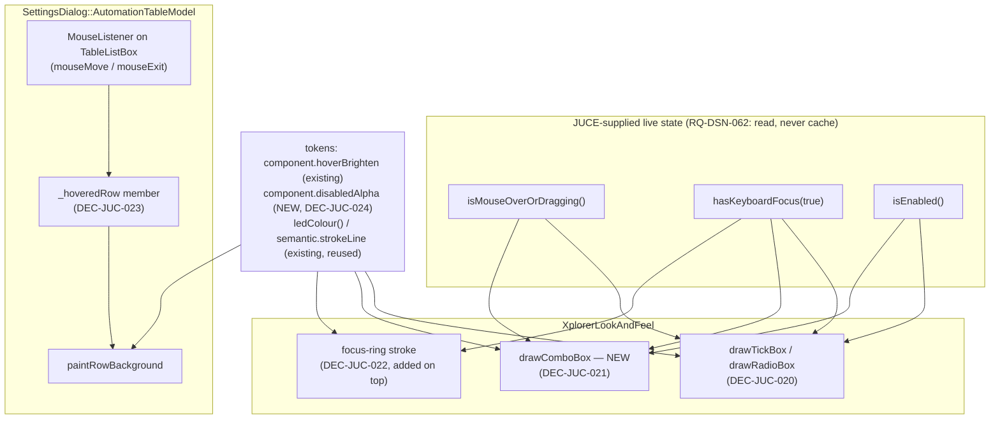

# ADR-JUC-017: Hover, Keyboard-Focus and Disabled Rendering for Every Interactive Control

## Status
Proposed

<!-- Motivated by RQ-GUI-041 (hover), RQ-GUI-042 (keyboard focus), RQ-GUI-043
(disabled); closes the "States missing" rows of the design-system component
catalogue (RQ-DSN §4). References the shared state-to-code mapping
(RQ-DSN-062), the shared hover-brighten rule (RQ-DSN-023/031), the shared
disabled rule (RQ-DSN-032), the shared focus rule (RQ-DSN-033), the LED
single-source-of-truth (ADR-JUC-011) and the token module (ADR-JUC-014). -->

## Context

Verified directly in code before deciding (per the "never assume, read the source
first" rule): only the rotary knob currently reacts to any interaction state
(`drawRotarySlider` checks `slider.isMouseOverOrDragging(true)`). Every other
control type is state-blind:

- `XplorerLookAndFeel::drawToggleButton(g, button, bool, bool)` — the two JUCE-
  supplied parameters (`shouldDrawButtonAsHighlighted`, `shouldDrawButtonAsDown`,
  which `juce::Button::paint` already computes from its own mouse tracking) are
  unnamed and discarded; the call it makes into `drawTickBox` hardcodes `false, false`
  for those same states instead of forwarding what it received.
- `drawTickBox(..., bool isEnabled, bool, bool)` receives `isEnabled` but never
  reads it.
- `drawRadioBox` (ADR-JUC-016) takes no state parameters at all yet.
- No `drawComboBox` override exists — combo boxes fall back to
  `LookAndFeel_V4`'s default, which is not token-driven and does not match our
  hover/disabled rules.
- No component anywhere reads `hasKeyboardFocus()`; there is no focus indicator
  in the whole app, even though `juce::Button`/`juce::ComboBox` accept keyboard
  focus by default in stock JUCE (tab traversal already works mechanically —
  only the visual indicator is missing).
- `SettingsDialog`'s automation table (`AutomationTableModel : juce::
  TableListBoxModel`) paints `paintRowBackground`/`paintCell` directly with a
  `selected` flag only; `TableListBoxModel` has no built-in per-row hover
  callback (checked against the JUCE header) — hover here needs manual mouse
  tracking, not just reading a parameter.
- `setEnabled(false)` has **zero call sites** in `juce/app/src/` today. The
  max-6-sources rule (RQ-GUI-016) filters the destination combo's **list
  contents** (`XpanderController::getAvailableModulationDestinationsForEntry`),
  it does not disable a visible item; the "Paste Page" gating (RQ-GUI-027) is a
  `PopupMenu` item's enabled flag, already greyed out correctly by JUCE's own
  default popup-menu rendering. So RQ-GUI-043 is readiness work (make the render
  path correct for when/if a control is disabled), not a fix for a currently
  visible bug.

Owner-confirmed, ahead of this ADR: disabled opacity = **50%**; focus indicator
= an **outline in the accent (knob LED) colour**, distinct in form from hover
(hover brightens an existing filled/stroked element; focus adds a ring around
the control's outer bounds), so a control can be hovered and focused at once
without the two states reading as one.

## Decision

- **DEC-JUC-020 — Stop discarding state JUCE already computes; no new
  plumbing for Button-family controls.** `drawToggleButton` forwards its real
  `shouldDrawButtonAsHighlighted`/`isEnabled` (via `button.isEnabled()`, already
  passed) into `drawTickBox` and `drawRadioBox` instead of hardcoding
  `false, false`; both then apply the shared `component.hoverBrighten` (already
  used by the knob) to the accent-derived colours when highlighted, and the new
  `component.disabledAlpha` (0.5, DEC-JUC-024) to the whole tick/radio box when
  `!isEnabled`. Covers `BoundCheckBox` and every `BoundRadioGroup` option
  (FM destination, LAG timing) with one shared code path — no per-control
  divergence. (RQ-GUI-041, RQ-GUI-043)

- **DEC-JUC-021 — New `drawComboBox` override, same state-read pattern.**
  `XplorerLookAndFeel` gains a `drawComboBox` override (today's combos fall back
  to `LookAndFeel_V4`'s untokenised default). It reads
  `box.isMouseOverOrDragging()` / `box.isEnabled()` straight from the
  `juce::ComboBox&` parameter it already receives (RQ-DSN-062's mandated
  pattern: read live JUCE state, no cached per-instance duplicate), and applies
  `hoverBrighten` / `disabledAlpha` to the existing `surfaceRecessed` fill — no
  other visual change to the combo (arrow, popup, text sizing untouched).
  (RQ-GUI-041, RQ-GUI-043)

- **DEC-JUC-022 — Focus ring composes as an addition, not a fill swap.** Every
  control routed through the overrides above additionally checks
  `component.hasKeyboardFocus(true)` and, when true, strokes an outline in the
  accent colour (`XplorerLookAndFeel::ledColour()`, ADR-JUC-011's single source
  of truth — **no new colour token**) around the control's outer bounds, at
  `tokens::semantic::strokeLine` width (2 px, already used for diagram lines —
  distinct from the thinner 1 px `strokeBorder` used for the tick-box border
  itself, so the ring reads as a separate element, not a thicker border). Drawn
  last, on top of the idle/hover/disabled fill, so it composes with any of the
  three rather than replacing them. (RQ-GUI-042)

- **DEC-JUC-023 — Table-row hover is tracked manually; no framework hook
  exists for it.** `TableListBoxModel` has no per-row hover callback (verified
  against JUCE's header — only `paintRowBackground(g, row, w, h, isRowSelected)`).
  `SettingsDialog`'s `AutomationTableModel` gains a `_hoveredRow` member and a
  small `MouseListener` attached to its `juce::TableListBox`, updated on
  `mouseMove`/`mouseExit` via `TableListBox::getRowContainingPosition`; only the
  previously- and newly-hovered rows are repainted (not the whole table).
  `paintRowBackground` applies `hoverBrighten` to the row background when
  `rowNumber == _hoveredRow && !isRowSelected` — selection (already implemented)
  takes visual precedence over hover, per RQ-DSN-062's Selected/Hover ordering.
  (RQ-GUI-041)

- **DEC-JUC-024 — One new token: `disabledAlpha`.** `global.disabledAlpha =
  0.5` (owner-confirmed) aliased as `component.disabledAlpha`, following the
  exact existing pattern of `knobTrackAlpha`/`tickBoxBorderAlpha` (component-tier
  float aliasing a global, ADR-JUC-014). No other new token: hover reuses
  `component.knobRingHoverBrighten`'s underlying `semantic.hoverBrighten`
  (RQ-DSN-023 — one shared factor, not knob-specific despite its current name),
  the focus colour reuses the runtime LED colour (ADR-JUC-011), and the focus
  stroke width reuses `semantic.strokeLine`. (RQ-GUI-041, RQ-GUI-042, RQ-GUI-043;
  ADR-JUC-014)

## Consequences

- **Easier:** the panel stops feeling inert under the mouse; keyboard users can
  finally see where focus is (closes a real accessibility gap, RQ-DSN-033); a
  future `setEnabled(false)` call anywhere renders correctly for free, with no
  new per-call-site styling decision. All three states are single-sourced
  (RQ-DSN-062 pattern already established by the knob and the FM/LAG radios),
  so a future control type only has to read the same three JUCE state queries,
  not invent a fourth convention.
- **Harder / constrained:** `drawComboBox` is a new override with more surface
  than the existing tick-box/radio overrides (popup styling, arrow, text
  layout must be preserved exactly — only the fill state changes); the table
  row hover requires genuinely new mouse-tracking code (not just reading a
  parameter), the only piece of this ADR that is not a mechanical "stop
  discarding a JUCE-supplied bool."
- **Reversible:** every change is confined to `XplorerLookAndFeel` (plus the
  small `AutomationTableModel` hover tracker) and one new token; no control
  construction code, parameter binding, or layout changes.

## Alternatives Considered

- **Per-control bespoke hover/disabled colours** (e.g. a different brighten
  factor for combos than for checkboxes): rejected — RQ-DSN-023 already
  mandates one shared factor; per-control tuning would silently violate a
  requirement that exists precisely to prevent that.
- **New dedicated focus-ring colour token** (independent of the LED accent):
  rejected — the accent is already the single runtime source of truth for
  "this is the active/selected/highlighted colour" everywhere else in this app
  (knob ring, matrix highlight, radio dot); introducing a second "accent-like"
  colour for focus would fragment that single source of truth for no visual
  benefit the owner asked for.
- **Per-row `Component` for the automation table** (so hover could be read the
  normal `isMouseOverOrDragging()` way): rejected as disproportionate — it would
  mean replacing `TableListBoxModel`'s direct-paint rows with 20+ live child
  components for a hover cue alone; the manual mouse-tracked row index is a
  much smaller, contained change with the same visible result.
- **Skip table-row hover entirely** (ship only Button-family + ComboBox hover):
  rejected — RQ-GUI-041 explicitly scopes the automation table in; leaving it
  out would under-deliver the requirement without a documented reason.

## Diagram

