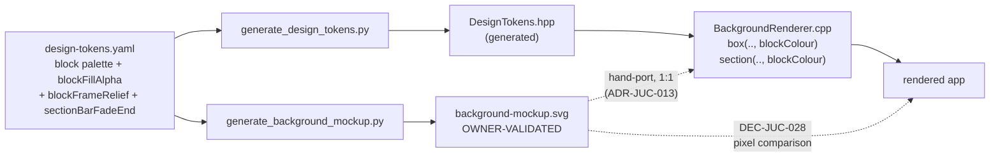

# ADR-JUC-018: Porting the Functional-Block Identity Colours to the Vector Painter

## Status
Accepted (owner-approved 2026-07-25; mockup stage owner-validated)

<!-- Motivated by RQ-GUI-044 (per-block colour identity on the main panel) and
RQ-DSN-092/093/094 (block colour family, colour-only scope guard, fill + frame
relief). Bound to the mockup-first pipeline of ADR-JUC-013 and the token module
of ADR-JUC-014/015. -->

## Requirements
RQ-GUI-044, RQ-DSN-092, RQ-DSN-093, RQ-DSN-094

## Context

The block-identity colour system (palette, tinted fill, frame relief, coloured
section headers) is specified (RQ-GUI-044, RQ-DSN-092/094), tokenised in
`design-tokens.yaml`, and **owner-validated on the SVG mockup**
(`juce/tools/background-mockup.svg`, TASK-GUI-001/002). Per ADR-JUC-013 the
mockup is the validated source of truth and the painter
(`juce/app/src/BackgroundRenderer.cpp`) is hand-ported from it — the two must
not diverge.

What the port has to reproduce, verified against the mockup generator:

- `box()` gains a per-block variant: fill = block hue at
  `component.blockFillAlpha`, frame = **vertical gradient** from the pure hue
  (top edge) to `hue.darker(component.blockFrameRelief)` (bottom edge).
- `section()` draws its label **and** its underline bar in the block hue, the
  bar fading to `component.sectionBarFadeEnd` at the far end — replacing the
  single blue `BAR_TOP/MID/BOT` gradient shared by all sections today.
- Control sub-panels (ENV/RAMP trigger frames, FM DESTINATION frame) and all
  connector lines stay on the neutral `diagramFrame` (RQ-DSN-094).

Two JUCE-specific points settled by reading the framework: `Graphics::
setGradientFill` sets the brush for **stroking** as well as filling, so a
gradient-stroked rounded rectangle needs no custom path work; and
`juce::Colour::darker(amount)` is exactly the transform the token was measured
against (HSB brightness × 1/(1+amount)), so the C++ and the Python mockup
produce the same bottom-edge colour with no second formula.

The old blue-bar tokens (`sectionBarTop/Mid/Bot`) become unused by the painter
once every section carries a block hue.

## Decision

- **DEC-JUC-025 — Per-block colour passed at the call site, no new lookup
  layer.** The `box()` and `section()` lambdas take an optional
  `const juce::Colour*` / `juce::Colour` block argument, exactly mirroring the
  mockup generator's `blk` parameter; the ~25 call sites name their block's
  semantic token (`tokens::semantic::blockEnv`, …). No enum, no id→colour map,
  no `BlockId` type: the painter is a flat transcription of the validated
  mockup and a second indirection would be one more place for the two to
  diverge. Omitting the argument keeps the current neutral behaviour, so
  sub-panels and every line are unchanged by construction. (RQ-GUI-044)

- **DEC-JUC-026 — Fill and relief inside `box()`, one code path.** The block
  variant fills with `blockColour.withAlpha(blockFillAlpha)` then strokes with a
  `juce::ColourGradient` running top→bottom from the hue to
  `hue.darker(blockFrameRelief)`. Both transforms read component tokens; no raw
  literal, no per-block special case. (RQ-DSN-094, ADR-JUC-014)

- **DEC-JUC-027 — Section header takes the block hue; the blue bar tokens are
  retired from the painter.** `section()` gains a block-colour parameter used
  for both the label text and the bar gradient (hue at full opacity → hue at
  `sectionBarFadeEnd`). `sectionBarTop/Mid/Bot` stay in `design-tokens.yaml`
  (add-only rule) but lose their painter consumer; they are **not** deleted in
  this change. (RQ-GUI-044, RQ-DSN-092)

- **DEC-JUC-028 — Verification is a mockup-vs-app pixel comparison, not a
  screenshot eyeball.** The rendered app is compared against the rendered
  mockup by sampling the same block interiors and frame edges and checking the
  measured colours match the token-derived expectations (the method that caught
  the stale-process and cursor-diff mistakes in TASK-JUC-109/110). Geometry is
  asserted unchanged by diffing the app screenshot against the pre-change one
  outside the block areas. (RQ-DSN-093)

## Consequences

- **Easier:** mockup and painter stay one-to-one, so the next colour tweak is a
  token edit plus a regeneration on both sides; the neutral default means the
  blast radius is exactly the call sites that opt in.
- **Harder / constrained:** ~25 call sites must each be tagged with the right
  block — a mechanical but attention-demanding edit, and a mis-tagged box is a
  silent visual bug (mitigated by DEC-JUC-028's comparison against the
  validated mockup). The painter now builds a `ColourGradient` per block frame
  instead of a flat colour; negligible cost at paint frequency, but it is more
  work per box than `setColour`.
- **Neutral:** no geometry, no control, no layout change; `BackgroundRenderer`
  keeps its current signature and call from `MainComponent::paint`.

## Alternatives Considered

- **A `BlockId` enum + `blockColour(BlockId)` mapping function:** rejected —
  it adds an abstraction the mockup does not have, so the two sources of truth
  would stop being line-comparable, which is precisely what ADR-JUC-013's
  hand-port discipline exists to prevent.
- **Emitting the painter from the mockup generator (single generated source):**
  attractive on paper, rejected as out of proportion here — it would mean
  generating C++ from Python for one file, replacing a reviewable hand-port
  with a code generator nobody asked for. Revisit only if the two files start
  drifting in practice.
- **Deleting the now-unused blue-bar tokens in the same change:** rejected —
  the token file is add-only by RQ-DSN governance; retiring them is a separate,
  reversible clean-up once the block colours are owner-accepted in the app.

## Diagram

