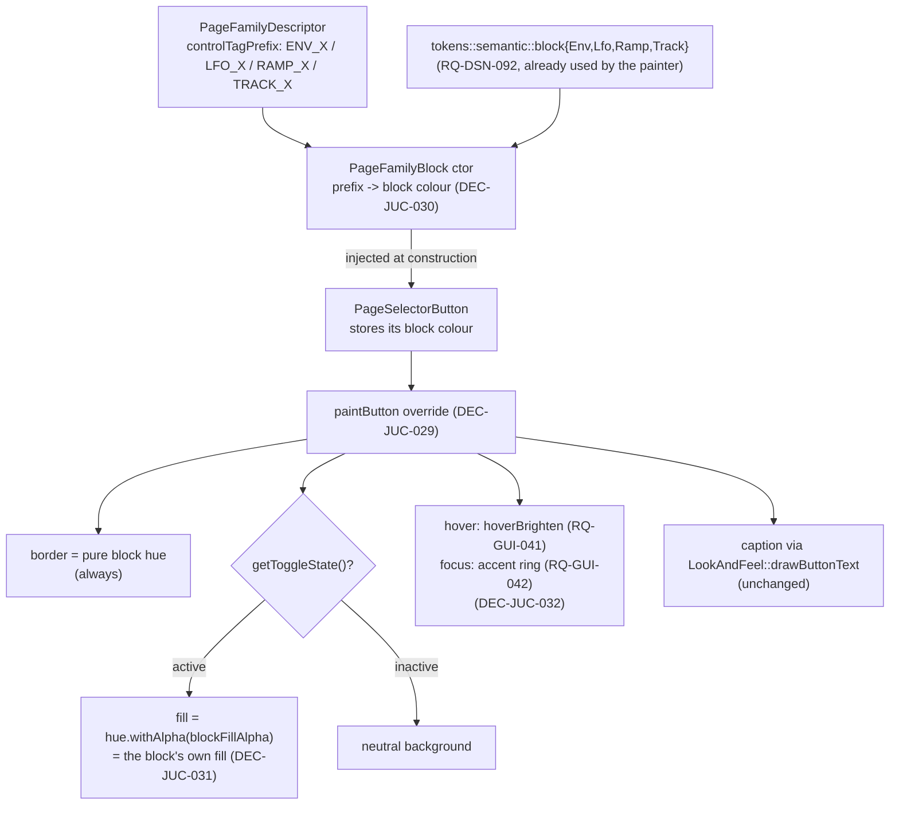

# ADR-JUC-019: Block Colour Identity on the Page-Family Selector Buttons

## Status
Accepted — implemented and merged to `main` (TASK-GUI-004, PR #23).
**DEC-JUC-030 partially superseded by ADR-JUC-020 (DEC-JUC-037):** the
block colour is no longer injected into the button at construction — once the
palette became user-themeable (RQ-DSN-095) a cached copy would go stale, so the
button stores its `BlockId` and resolves the live palette at paint time. Every
other decision here (self-painting, fill/border rules, hover/focus, verification)
stands unchanged.

<!-- Motivated by RQ-GUI-045 (selector buttons carry their block's colour).
Builds on RQ-GUI-044 / ADR-JUC-018 (block identity colours in the painter),
RQ-DSN-092/093/094 (block palette, colour-only scope, fill + relief) and must
not regress RQ-GUI-041/042 (hover / keyboard focus). -->

## Requirements
RQ-GUI-045, RQ-GUI-044, RQ-DSN-092, RQ-DSN-093, RQ-DSN-094, RQ-GUI-041, RQ-GUI-042

## Context

The block-identity colours are in place on the painted panel (ADR-JUC-018): each
functional block is framed, filled and section-labelled in its own hue. The
ENV/LFO/RAMP/TRACK **instance-selector buttons** that drive those blocks were
left out — they are live `juce::TextButton`s (`PageSelectorButton`) rendered
with JUCE's stock look, visually unrelated to the block they command. The owner
wants the relationship made explicit: **border always in the block hue, and the
block's own fill on the active instance only** (RQ-GUI-045).

Constraints found by reading the code:

- `PageSelectorButton` (`PageFamilyBlock.hpp/.cpp`) already exists as a custom
  `TextButton` subclass — it carries the copy/paste gesture (RQ-GUI-027) — and is
  created in `PageFamilyBlock`'s constructor, which holds the
  `PageFamilyDescriptor` whose `controlTagPrefix` (`"ENV_X"`, `"LFO_X"`,
  `"RAMP_X"`, `"TRACK_X"`) is the natural key to the block hue.
- Selection is stock JUCE radio behaviour (`setClickingTogglesState(true)` +
  `setRadioGroupId`), so "is this the active instance" is already
  `getToggleState()` — no new state to track.
- `juce::TextButton` has **no** standard outline colour id (only
  `buttonColourId` / `buttonOnColourId` / `textColour*Id`), so a border colour
  cannot be carried through the stock colour-id mechanism alone.
- `XplorerLookAndFeel` does **not** override `drawButtonBackground` today, so
  every other `TextButton` in the app (Settings "Reset all to unassigned",
  "Export as HTML", dialog OK/Cancel, …) currently gets `LookAndFeel_V4`'s
  default rendering.

## Decision

- **DEC-JUC-029 — The button paints itself; no global `drawButtonBackground`
  override.** `PageSelectorButton` overrides `juce::Button::paintButton` to draw
  its own background/border, then delegates the caption to
  `getLookAndFeel().drawButtonText(...)` so text rendering stays shared. A
  `LookAndFeel` override would restyle **every** `TextButton` in the
  application — a far wider blast radius than the requirement asks for, and it
  would need a way to tell block-owned buttons from ordinary ones. Self-painting
  keeps the change strictly inside the class the requirement is about.
  (RQ-GUI-045, scope guard RQ-DSN-093)

- **DEC-JUC-030 — Family → block hue resolved once in `PageFamilyBlock`,
  injected into the button.** The constructor maps
  `descriptor.controlTagPrefix` to the matching `tokens::semantic::block*` and
  passes the resulting `juce::Colour` to each `PageSelectorButton`, which stores
  it. *Note on consistency with ADR-JUC-018 DEC-JUC-025*, which rejected an
  id→colour map: that rule exists so `BackgroundRenderer` stays a line-by-line
  transcription of the owner-validated SVG mockup. These buttons are live
  components with no mockup counterpart, so the rationale does not transfer; a
  single four-entry mapping at the one place that already owns the family
  identity is the simplest correct option here. (RQ-GUI-045)

- **DEC-JUC-031 — Active fill reuses `blockFillAlpha`, border uses the pure
  hue.** The active-instance background is `blockColour.withAlpha(
  tokens::component::blockFillAlpha)` — byte-for-byte the same expression the
  painter uses for the block's own fill (DEC-JUC-026), so the button visually
  reads as a piece of its block; the border is the unmodified block hue at
  `strokeBorder` width. **No new token.** (RQ-GUI-045, RQ-DSN-094)

- **DEC-JUC-032 — Taking over the paint means re-implementing hover and focus,
  not dropping them.** Because `paintButton` bypasses `LookAndFeel_V4`, the
  stock hover/focus/pressed feedback disappears unless reproduced. The override
  SHALL therefore apply the shared `hoverBrighten` factor when
  `shouldDrawButtonAsHighlighted` (RQ-GUI-041, RQ-DSN-023) and draw the accent
  focus ring when `hasKeyboardFocus(true)` (RQ-GUI-042) — the same rules the
  check boxes, radios and combo boxes already follow (ADR-JUC-017). This is a
  no-regression obligation, not new scope. (RQ-GUI-041, RQ-GUI-042)

- **DEC-JUC-033 — Verification by pixel sampling against the block's own fill.**
  The active selector's background is sampled under Xvfb and compared with the
  fill sampled inside the corresponding painted block: the two must agree,
  proving the button really carries the block's colour rather than a look-alike.
  Inactive buttons are sampled to confirm a neutral background with a
  block-coloured border. (RQ-GUI-045, method per ADR-JUC-018 DEC-JUC-028)

## Consequences

- **Easier:** the selector row becomes self-explanatory (which block it drives,
  which instance is live); the mapping lives in one constructor, so adding a
  fifth family later is a one-line addition.
- **Harder / constrained:** `PageSelectorButton` now owns its rendering, so any
  future global button restyling must remember this class opts out; and the
  hover/focus rules are now duplicated in a third place (LookAndFeel tick
  box/radio, combo box, and here) — acceptable today, a candidate for a shared
  helper if a fourth appears.
- **Neutral:** no geometry, no caption, no layout, no behaviour change; the
  copy/paste gesture (RQ-GUI-027) and the radio selection logic are untouched.

## Alternatives Considered

- **`setColour(TextButton::buttonOnColourId, blockColour)` only (no custom
  paint):** rejected — it colours the *active* background but cannot express the
  always-on **border**, which is half of RQ-GUI-045 and the part that ties an
  inactive button to its block.
- **Global `drawButtonBackground` override in `XplorerLookAndFeel`:** rejected —
  restyles every `TextButton` in the app (dialogs included) for a requirement
  scoped to 17 selector buttons, and needs an extra signal to distinguish
  block-owned buttons from ordinary ones.
- **A new `blockActiveFill` design token:** rejected — it would be a second name
  for `blockFillAlpha` applied to the same hue, exactly the "second independent
  value for the same semantic role" RQ-DSN-005 forbids.
- **Deriving the hue from the button id string (`"ENV_1"` → env) inside the
  button:** rejected — string-sniffing an id inside the leaf component is more
  fragile and less explicit than passing the colour from the object that already
  knows the family.

## Diagram

