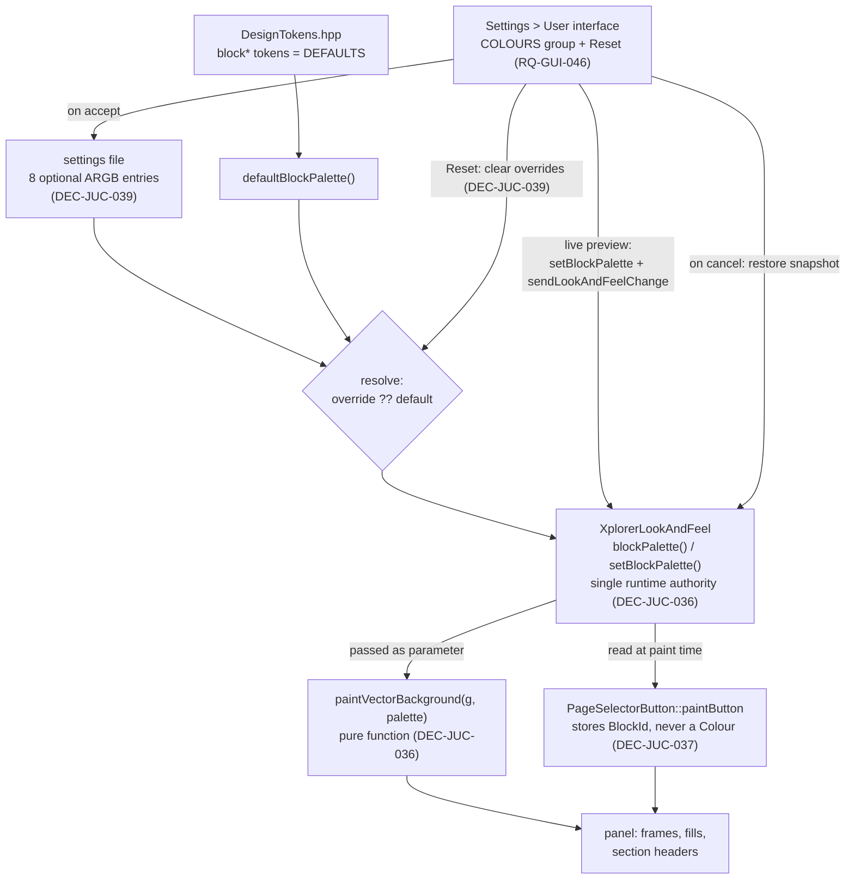

# ADR-JUC-020: User-Themeable Block Palette — Runtime Resolution, Persistence and Settings UI

## Status
Proposed

<!-- Motivated by RQ-DSN-095 (block colours themeable through a single runtime
accessor), RQ-SET-007 (per-block override persistence) and RQ-GUI-046 (settings
UI + reset to defaults). Extends ADR-JUC-018 (block colours in the painter),
ADR-JUC-019 (selector buttons) and follows ADR-JUC-011's single-source-of-truth
rule for the knob LED colour. -->

## Context

The block-identity colours are today **compile-time** `constexpr juce::Colour`
tokens: `BackgroundRenderer.cpp` binds them as namespace-level references
(`const juce::Colour& BLK_ENV = tokens::semantic::blockEnv;`) and
`PageFamilyBlock` resolves one per family and **copies it into each
`PageSelectorButton` at construction** (ADR-JUC-019 DEC-JUC-030). RQ-DSN-095
now requires them to be runtime values: token = default, user override wins,
resolved through **one** accessor with no cached copies anywhere.

What the code imposes:

- `paintVectorBackground(juce::Graphics&)` is a **free function** with no
  component and no `LookAndFeel` in scope — it cannot reach a runtime colour
  source without a new parameter or a global.
- `XplorerLookAndFeel` is already the established runtime source of truth for
  the accent/LED colour (`ledColour()`, ADR-JUC-011), and every component can
  reach it through `getLookAndFeel()`. Its LED colour is changed by **rebuilding
  the whole LookAndFeel object** (`MainComponent::updateLedColour`) then
  `sendLookAndFeelChange()`.
- `PageSelectorButton` caches its block colour — directly contrary to
  RQ-DSN-095's "no cached copy" clause, so ADR-JUC-019's injection must be
  revisited.
- `AllUsersSettings::UiConfiguration` stores the LED colour as a plain 32-bit
  ARGB `int`; RQ-SET-007 additionally requires **individually optional**
  per-block entries, with reset meaning *remove the entry*, not *write the
  current default*.
- The settings dialog already has the apply-on-accept / revert-on-cancel
  contract with live preview for the LED colour (`_originalLedColour` +
  `onLedColourChanged`), which the palette must join rather than reinvent.

The settings-page layout was mocked up and owner-validated before this ADR: one
**COLOURS** group box containing the knob LED colour, a separator, then the
eight block colours in a 2×4 grid, with **Reset to defaults** inside that group
(so its scope is visually unambiguous), and knob movement/style moved to a
separate **KNOB BEHAVIOUR** group.

## Decision

- **DEC-JUC-034 — `BlockPalette`: a value type with eight named fields, not a
  keyed container.** A small header declares
  `struct BlockPalette { juce::Colour vco, lag, track, vcf, env, lfo, ramp, matrix; }`
  plus `defaultBlockPalette()` returning the design-system tokens. The painter
  keeps naming its colours (`palette.env`), so `BackgroundRenderer` stays the
  line-by-line transcription of the validated mockup that ADR-JUC-013 and
  DEC-JUC-025 require — a map lookup in the painter is still refused.
  (RQ-DSN-095, ADR-JUC-013)

- **DEC-JUC-035 — Iteration for settings/UI goes through a separate descriptor
  table, not through the painter's naming.** Persistence and the settings page
  need to walk the eight blocks generically; a static table of
  `{ BlockId, display name, member pointer }` provides that **without** forcing
  the painter to index anything. This is where the `BlockId` enum that
  DEC-JUC-025 rejected for the painter legitimately belongs: it serves the
  generic consumers (XML keys, UI rows) while the painter keeps explicit names.
  (RQ-SET-007, RQ-GUI-046)

- **DEC-JUC-036 — `XplorerLookAndFeel` owns the live palette; the painter takes
  it as a parameter.** The LookAndFeel gains `blockPalette()` / `setBlockPalette()`
  next to `ledColour()`, keeping **one** runtime colour authority for the whole
  app (ADR-JUC-011's rule, extended rather than duplicated). Because
  `paintVectorBackground` has no `LookAndFeel` in scope, its signature becomes
  `paintVectorBackground(juce::Graphics&, const BlockPalette&)` and
  `MainComponent::paint` passes the live palette. The painter therefore stays a
  **pure function of (graphics, palette)** — trivially testable, no global, no
  hidden state. (RQ-DSN-095)

- **DEC-JUC-037 — Selector buttons resolve at paint time; the cached colour of
  ADR-JUC-019 is removed.** `PageSelectorButton` stores its `BlockId` instead of
  a `juce::Colour` and reads
  `dynamic_cast<XplorerLookAndFeel*>(&getLookAndFeel())->blockPalette()` inside
  `paintButton`. This **supersedes DEC-JUC-030's injection-at-construction**:
  that design predates the themeable requirement and would hold a stale colour
  after a settings change, which RQ-DSN-095 forbids outright. (RQ-DSN-095,
  RQ-GUI-045)

- **DEC-JUC-038 — Live preview by mutating the palette, not by rebuilding the
  LookAndFeel.** `setBlockPalette()` + `sendLookAndFeelChange()` repaints the
  tree in place. The LED colour keeps its existing rebuild path (untouched, out
  of scope): rebuilding the whole LookAndFeel on every mouse-move of a colour
  picker — eight pickers, continuous dragging — would be gratuitous churn for a
  purely visual preview. The dialog snapshots the palette on open and restores
  it on **cancel**, exactly mirroring `_originalLedColour`. (RQ-GUI-046)

- **DEC-JUC-039 — Overrides persist as eight optional entries; reset erases
  them.** `UiConfiguration` gains
  `std::array<std::optional<int>, BlockCount> blockColours` (ARGB, same
  encoding as `knobLedBorderColor`). `XmlSettingsService` writes **only** the
  entries that are set and treats a missing element as "unset", so files from
  earlier versions and imported .NET files (RQ-SET-006) load unchanged.
  Reset-to-defaults clears the optionals — it must **not** materialise today's
  defaults as literals, otherwise a future palette revision would never reach
  users who had pressed Reset once. (RQ-SET-007)

## Consequences

- **Easier:** one authority for every runtime colour (LED + blocks); the painter
  becomes a pure function, so a palette can be rendered headlessly in a test;
  users can retune readability without a rebuild; a future design-system palette
  change propagates to every non-customised user automatically.
- **Harder / constrained:** `paintVectorBackground`'s signature changes (one call
  site, `MainComponent::paint`, plus the splash renderer in `Main.cpp` — both
  must pass a palette); `PageSelectorButton` gains a `dynamic_cast` per paint
  (negligible, and the same pattern the focus ring already uses); the settings
  page grows from 3 rows to a two-group layout, the largest UI change in the
  dialog since it was written.
- **Neutral:** no change to the block geometry, to the painted layout, or to the
  LED-colour behaviour; with no overrides set the rendering is byte-identical to
  today's.

## Alternatives Considered

- **A global/singleton palette accessor:** rejected — it would let any
  translation unit read colours implicitly, exactly the hidden-coupling that
  ADR-JUC-011 avoided for the LED colour, and it would make the painter
  untestable in isolation.
- **Keeping the tokens and applying user colours as a post-paint recolour:**
  rejected as a hack — it cannot work for the 18 %-alpha fills or the gradient
  frames, and it would leave two sources of truth.
- **Rebuilding `XplorerLookAndFeel` on every palette change** (symmetry with the
  LED path): rejected for live preview, see DEC-JUC-038; the LED path is left
  alone rather than "fixed" opportunistically, to keep this change scoped.
- **Storing the eight overrides as a single packed string / one XML blob:**
  rejected — it defeats the per-entry optionality RQ-SET-007 requires, and makes
  a hand-edited settings file harder to read and repair.
- **A "reset" that writes the current defaults explicitly:** rejected — it
  freezes the palette for that user forever; RQ-SET-007 mandates clearing.

## Diagram

