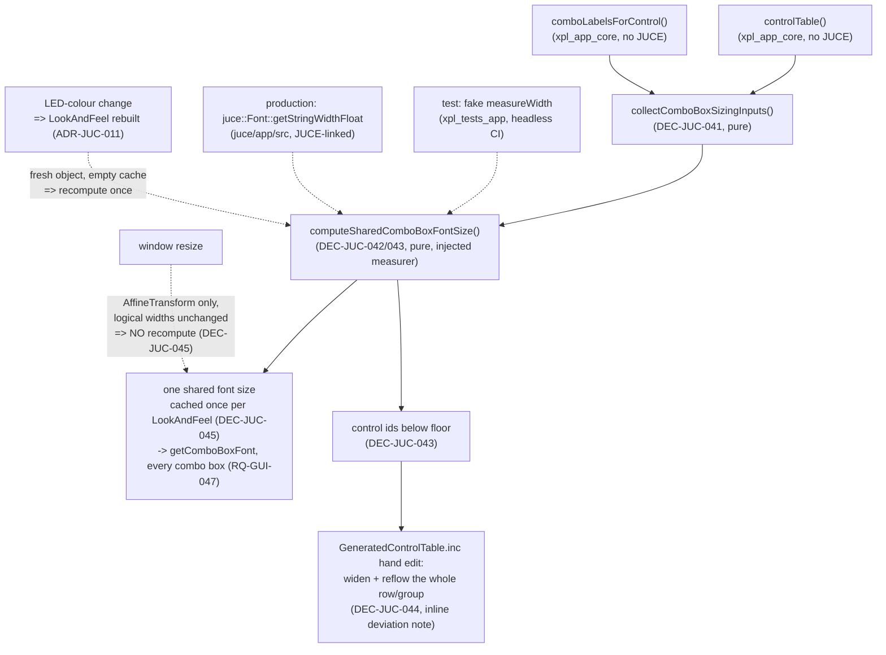

# ADR-JUC-021: One Shared Font Size for Every Combo Box, Split Across the Headless/GUI Boundary

## Status
**Superseded by ADR-JUC-022** (2026-07-28), before completing implementation.
DEC-JUC-041/042/045 shipped (TASK-CBL-001/002) and were then withdrawn;
DEC-JUC-043/044 were never implemented.

*Why:* the central decision here — derive one size by aggregating the whole
inventory — was measured against real JUCE metrics and produced 9.0 pt, the
legibility floor, because the most constrained box governs the minimum. Even
after widening the boxes below the floor, `MOD_DEST_*` would have pinned the
whole panel at 9.38 pt, where `MOD_SRC_*` renders at 16 pt today. Consistency
was achieved at the smallest common denominator — technically satisfying
RQ-GUI-047 as then written, but a worse panel than before. The owner reframed
the requirement (fixed size by design, per-group widths); ADR-JUC-022 records
the replacement. The measurement that killed this design is kept below as the
Consequences note, because it is the evidence for the successor.

<!-- Motivated by RQ-GUI-047 (single shared combo-box font size, issue #12
follow-up) and RQ-DSN-011 (as amended). Supersedes the per-instance mechanism
RQ-GUI-032 originally described (TASK-JUC-087, issue #12 first pass).
Respects ADR-JUC-002's headless/GUI layering (xpl_app_core has no JUCE
dependency) and ADR-JUC-014's token module (size bounds stay tokens, not
literals). -->

## Context

`XplorerLookAndFeel::getComboBoxFont(juce::ComboBox& box)` computes a font
size **per combo-box instance**: it shrinks from `tokens::semantic::
textDisplay` down to a `textDense` floor until *this* box's own widest list
item fits *its own* width. Inventorying every `ComboBoxValuedControl` in
`GeneratedControlTable.inc` and the label set each resolves to
(`comboLabelsForControl`) shows every existing "family" (boxes sharing the
same enum, e.g. the 20 `MOD_SRC_*` rows) already has **identical width**
across its instances — so the per-instance formula already produces the same
size within a family, mechanically. The owner's complaint (issue #12 follow-
up) is that the seven distinct label-set families each land on a *different*
size, so the panel shows up to seven font sizes at once: internally
consistent per family, inconsistent across the whole window.

RQ-GUI-047 requires one size for literally every combo box in the app,
computed from the full inventory rather than any single box, with labels
never ellipsized; where even the legibility floor can't fit a box's widest
label, that box's **width** grows instead (never the font, never
truncation), and any such widening must keep its row/group visually aligned.

What the code imposes:

- `xpl_app_core` (`controlTable()`, `comboLabelsForControl()`) is the only
  place that already knows every combo box's width and label set, and it has
  **zero JUCE dependency** by design (ADR-JUC-002) — the top-level
  `CMakeLists.txt` builds it with `JUCE_MODULES_ONLY` skipped entirely
  outside `XPL_BUILD_APP`, specifically so `xpl_tests_app` and the rest of
  the headless layer never need GUI system libraries. The default CI job
  (`linux-headless-release.yml`) configures with `XPL_BUILD_APP` **off** and
  runs on every push/PR; the JUCE-linked app (and its `ctest` pass) is only
  built by `windows-app-release.yml`, and only run there when `RUN_TESTS` is set.
- Actually measuring a string's pixel width at a candidate size needs
  `juce::Font::getStringWidthFloat` — real JUCE, unavailable to
  `xpl_app_core` without breaking the above.
- No class under `juce/app/src` (where `XplorerLookAndFeel` lives) has ever
  had Catch2 coverage in this repo; every prior GUI/paint fix this project
  has shipped was verified visually under Xvfb instead (TASK-GUI-004/010,
  TASK-HLT-001). Session `unit_tests=true` asks that this not be the default
  answer again where the logic genuinely permits better.
- Which, if any, of the eight distinct label-set families will actually need
  widening at the shared size is an empirical question — it depends on real
  JUCE font metrics for the actual label strings, not something to guess by
  hand. It can only be answered by running the real computation.
- The inputs to the computation are entirely **static**: `controlTable()` is a
  compile-time table and `comboLabelsForControl()` resolves to fixed enum
  label sets. Nothing about it needs a live `juce::ComboBox` instance — only
  the *description* of the boxes that will exist. In particular, window
  **resize changes none of it**: `ScaledCanvasComponent::resized()` only
  applies a uniform `AffineTransform::scale(...)` to the whole canvas
  (`MainComponent.cpp`), and never touches any child's bounds — every control
  keeps its fixed **logical** width (`VCF_MODE` is 127 logical px at any
  window size), and the same transform that scales the diagram scales the
  text with it. This is the same logical-canvas model that already keeps the
  whole panel crisp and proportional at any zoom (RQ-GUI-005, RQ-GUI-037).

## Decision

- **DEC-JUC-041 — Split the pure sizing policy from the JUCE measurement, at
  the existing headless/GUI boundary.** `xpl_app_core` gains a small,
  JUCE-free module: `collectComboBoxSizingInputs()` (filters `controlTable()`
  to `ComboBoxValuedControl` entries and pairs each with its label set via
  `comboLabelsForControl`) and `computeSharedComboBoxFontSize(inputs,
  baseSize, minSize, arrowZone, labelMargin, measureWidth)`, where
  `measureWidth` is an injected `std::function<float(std::string_view,
  float)>` — a callback, not a hard dependency on `juce::Font`. The sizing
  *policy* (aggregate every box, take the most-constraining one, clamp to the
  floor, report which boxes still don't fit) is therefore pure C++, testable
  by `xpl_tests_app` with a fake measurer, and covered by the always-run
  `linux-headless-release` CI job — no change to `xpl_app_core`'s JUCE-free status.
  `XplorerLookAndFeel::getComboBoxFont` (in `juce/app/src`, already
  JUCE-linked) becomes a thin adapter: call `collectComboBoxSizingInputs()`,
  pass a real `measureWidth` backed by `juce::Font::getStringWidthFloat`,
  and return the resulting size for every combo box regardless of which one
  is asking (lifetime and caching per DEC-JUC-045). (RQ-GUI-047,
  RQ-DSN-011, ADR-JUC-002)

- **DEC-JUC-042 — The shared-size formula is the existing per-instance
  formula, aggregated by minimum, not a new algorithm.** For each box,
  compute its own candidate size exactly as `getComboBoxFont` does today
  (`baseSize`, shrunk by `availableWidth / widestLabelWidth` when the widest
  label overflows); the shared size is the **minimum** of every box's
  candidate, clamped to `[minSize, baseSize]`. This is the smallest possible
  change to a formula the owner has already seen work correctly per-box; the
  only new step is taking the minimum across the whole inventory instead of
  using each box's own candidate. (RQ-GUI-047)

- **DEC-JUC-043 — A box whose own candidate falls below the floor is a
  widening candidate, independent of what the shared size ends up being.**
  `computeSharedComboBoxFontSize` also returns the control ids whose
  **unclamped** candidate size is below `minSize` — i.e. boxes that cannot
  fit their widest label at any legible size, with or without the sharing
  step. Only those boxes are widened (RQ-GUI-047's fallback), each a hand
  edit to `GeneratedControlTable.inc` with an inline deviation note, the same
  precedent as TASK-GUI-009's selector-column realignment. Which boxes (if
  any) this turns out to be is an empirical result of running the real
  computation during implementation, not a design choice made here.
  (RQ-GUI-047; deviation-recording rule per CLAUDE.md, "MANDATORY DESIGN SYSTEM")

- **DEC-JUC-044 — Widening reflows the whole row/group, not just the one
  box.** Any control widened under DEC-JUC-043 is diagnosed together with
  the other controls sharing its row/block in `GeneratedControlTable.inc`
  (identified the same way TASK-GUI-009 identified the VCO1/VCO2 MOD row):
  neighbouring controls that would now overlap or leave a gap are
  repositioned in the same edit, with the same inline rationale note
  covering the whole group, not one note per control. (RQ-GUI-047's
  alignment-coherence clause)

- **DEC-JUC-045 — Computed once per `XplorerLookAndFeel`, cached, and never
  recomputed on resize or on combo-box construction.** JUCE calls
  `getComboBoxFont` frequently — on layout, on repaint, on selection change,
  for each of the ~48 combo boxes — so the adapter computes the shared size
  **once** (first call, memoised in a `mutable` member) and returns the cached
  value thereafter. It is explicitly **not** per-combo-box-instantiation work:
  the computation reads only the static control table and label sets, so it
  neither needs nor observes live `juce::ComboBox` instances. It is equally
  **not** resize work: control bounds are logical and fixed, and resizing only
  changes the canvas `AffineTransform` (see Context) — so **no resize listener
  and no invalidation-on-resize is to be added**; doing so would be pure
  overhead answering a question the logical-canvas model already answers. The
  only event that legitimately produces a fresh value is the rebuild of the
  whole `XplorerLookAndFeel` object on an LED-colour change
  (`MainComponent::updateLedColour`, ADR-JUC-011): a new object starts with an
  empty cache and recomputes once. Both facts are stated explicitly because a
  future reader, seeing a `juce::ComboBox&` parameter go unused, is likely to
  assume the opposite. (RQ-GUI-047, RQ-GUI-005, ADR-JUC-011)

## Consequences

- **Easier:** the sizing *policy* is unit-testable exactly like every other
  `xpl_app_core` module, with fast, deterministic, headless coverage on
  every push — a first for combo-box presentation logic in this codebase.
  A future combo box added to `GeneratedControlTable.inc` is automatically
  included in the shared-size computation with no new wiring.
- **Harder / constrained:** `getComboBoxFont` no longer answers per-`box`
  (its parameter is now unused beyond triggering the call) — a comment must
  make that intentional (DEC-JUC-045), or a future reader may "fix" it back
  into a per-instance read, or bolt on a resize listener the logical-canvas
  model makes unnecessary. The actual set of boxes needing widening
  (DEC-JUC-043) is unknown until the real measurement runs; the geometry edit
  and its count of affected rows cannot be finalised in this ADR.
- **Reversible:** the split is additive (`xpl_app_core` gains one small new
  module; `getComboBoxFont`'s body changes, its signature does not); no
  other consumer of `controlTable()`/`comboLabelsForControl()` is touched.

## Alternatives Considered

- **Per-family size instead of fully global** (one size per distinct label
  set, seven values instead of one): rejected — this is already the de facto
  status quo (same enum ⇒ same width ⇒ same computed size today) and the
  owner still reported it as inconsistent; a single global size is no harder
  to implement and strictly satisfies both options the owner offered.
- **Add `juce_graphics` to `xpl_app_core` so the whole computation
  (including real measurement) is testable in one place:** rejected — it
  would force the always-run, GUI-library-free `linux-headless-release` CI job to
  need GUI system libraries for the first time, undoing the deliberate split
  `ADR-JUC-002`/the top-level `CMakeLists.txt` set up, for a testability gain
  the injected-measurer split already provides without the cost.
- **Gate widening on the final shared size instead of each box's own floor
  check** (only widen a box if it *still* doesn't fit at whatever the shared
  size ends up being, rather than checking each box's own unclamped
  candidate in isolation, DEC-JUC-043): rejected — a box that cannot fit its
  widest label at any legible size needs widening regardless of what the rest of the panel's
  shared size turns out to be; gating it on the shared value would make
  widening decisions depend on unrelated boxes, which is fragile and harder
  to reason about than a per-box floor check.
- **Recompute the shared size on window resize** (a resize listener
  invalidating the cache): rejected — `ScaledCanvasComponent` resizes by
  transforming the canvas, never by re-laying-out children, so every combo
  box keeps its logical width and the same transform scales the text along
  with the diagram. A resize-driven recomputation would burn work to arrive
  at the identical value, and would invite the false belief that the sizing
  depends on physical window size (DEC-JUC-045).
- **Skip unit tests, verify only visually (the precedent from TASK-GUI-004/
  010/HLT-001):** rejected here specifically — those fixes were pure
  JUCE-paint/mouse-event plumbing with no headless-testable logic; this one
  has a genuine, pure aggregation-and-arithmetic core that the injection
  split exposes for free, so skipping tests would be declining coverage the
  design already makes available, not avoiding an artificial one.

## Diagram

