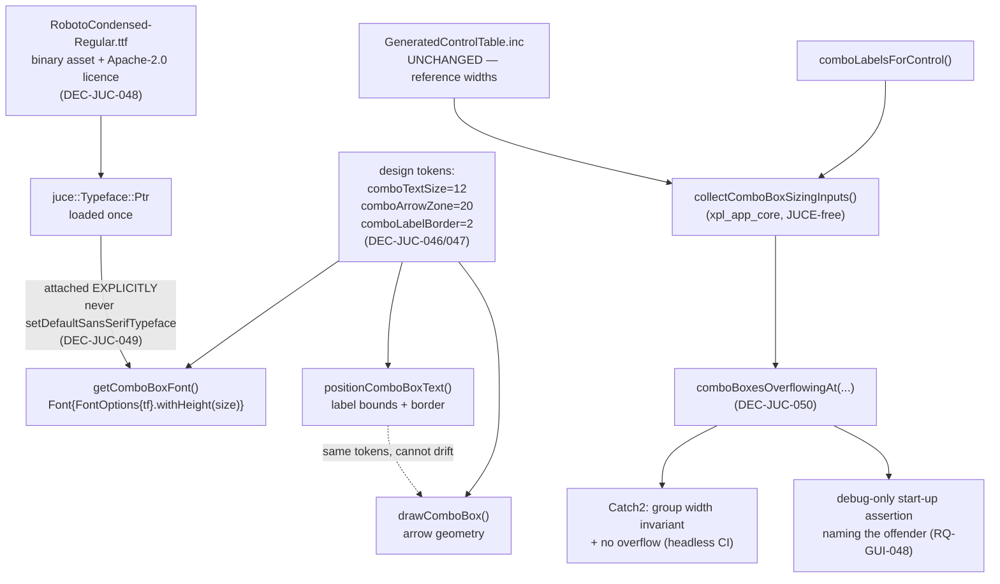

# ADR-JUC-022: Fixed Combo-Box Text Size Made Possible by an Embedded Condensed Typeface

## Status
Proposed

<!-- Motivated by RQ-GUI-047 (fixed combo-box font size, per-group widths),
RQ-GUI-048 (development-build fit assertion) and RQ-DSN-096 (embedded combo-box
typeface). Supersedes ADR-JUC-021 in full. Builds on ADR-JUC-014 (token module)
and ADR-JUC-017 (the drawComboBox override this reuses). -->

## Requirements
RQ-GUI-047, RQ-GUI-048, RQ-DSN-096

## Context

ADR-JUC-021 tried to *derive* one combo-box font size by aggregating the whole
inventory. Measured against real JUCE metrics it produced **9.0 pt — the
legibility floor** — because the minimum is set by the most constrained box, and
`MOD_DEST_*` (20 boxes, widest label `ENV1 RELEASE`) would still have pinned the
panel at 9.38 pt even after widening the four boxes that fell below the floor.
Every other combo box, including the 20 `MOD_SRC_*` that render at 16 pt today,
would have shrunk to match. The owner rejected that outcome and reframed the
problem: **fix the size by design, and size the widths per group to fit it.**

What measurement then established, in this order:

- The stock JUCE look wastes a lot of the box: `LookAndFeel_V4::drawComboBox`
  reserves `width - 30` for the arrow and `positionComboBoxText` hands the
  `Label` `width - 30` with the `Label`'s own 5 px border on each side — **40 px
  of overhead** on controls that are 21 px high. Reclaiming it (arrow zone 20,
  label border 2) frees 16 px of text room in *every* combo box, for free.
  These are two separate JUCE methods that each hard-code the same 30, so they
  must be overridden together or the arrow and the text disagree.
- The application's text is drawn in the platform's default sans-serif, which is
  **Liberation Sans** here (identified by matching measured JUCE advance widths
  against every installed face — 0.02 % max error). Liberation Sans is
  metric-compatible with Arial; Windows and macOS resolve a different default,
  so widths verified on one platform are not guaranteed on another.
- Rendering the real label sets in candidate faces showed that a **condensed**
  face changes the problem qualitatively rather than incrementally: at 12 pt
  with the reclaimed overhead, Roboto Condensed fits **every** label of **every**
  group inside the existing reference widths, tightest margin ≈ 10 px — no
  widening, no reflow, no deviation from the extracted geometry at all.
- Two failed attempts established a hard constraint: registering an embedded
  face via `LookAndFeel::setDefaultSansSerifTypeface`, and letting combo `Font`s
  resolve to it implicitly, renders text as **unrelated characters** (`1 POLE
  LOW` → `1 NMLC LMU` with one face, `3 RQNGNQY` with another — a systematic
  glyph-index offset, opposite in sign per face, so a property of the resolution
  path, not of the fonts, whose Unicode cmaps were verified correct). Attaching
  the typeface explicitly to the `juce::Font` renders correctly.

## Decision

- **DEC-JUC-046 — The combo-box text size is a design token, not a computed
  value.** `design-tokens.yaml` gains a combo-box text size (12), and
  `getComboBoxFont` returns it for every combo box. The whole aggregation
  machinery of ADR-JUC-021 (DEC-JUC-041/042/045: injected measurer, minimum
  across the inventory, memoised result) is removed: with a fixed token there is
  nothing to compute, nothing to cache and nothing to invalidate. The
  `juce::ComboBox&` parameter stays unused *and documented as such* — the size
  is a property of the design system, not of the asking box. (RQ-GUI-047,
  RQ-DSN-011)

- **DEC-JUC-047 — Reclaim the stock overhead, in both methods that define it.**
  The arrow zone and label border become design tokens (20 and 2, replacing
  JUCE's 30 and 5). `drawComboBox` (already overridden for the interaction
  states, ADR-JUC-017 DEC-JUC-021) reads them for its arrow geometry, and a new
  `positionComboBoxText` override reads the same tokens for the label bounds and
  border, so the two cannot drift apart. This is what makes the fixed size fit
  the reference geometry; it is a correction of a default sized for much taller
  controls, not a workaround. (RQ-GUI-047, ADR-JUC-014)

- **DEC-JUC-048 — Embed Roboto Condensed and use it for combo boxes only.** The
  font ships as a binary asset next to the existing image assets
  (`juce_add_binary_data`), with its Apache 2.0 licence text beside it, and is
  loaded once into a `juce::Typeface::Ptr`. Embedding is what turns "fits on the
  developer's machine" into "fits everywhere": the advance widths become a
  property of the build, not of the host. Scope is combo boxes only (owner
  decision) — every other control keeps the host font, because no other control
  makes a dimensional promise, and restyling the whole application would be a
  far larger visual change than the problem requires. (RQ-DSN-096)

- **DEC-JUC-049 — The typeface is attached explicitly to each `juce::Font`;
  registering it as the LookAndFeel default is forbidden.** `getComboBoxFont`
  builds `juce::Font{juce::FontOptions{typeface}.withHeight(size)}`. The
  forbidden path is not a style preference: it was observed to corrupt glyph
  mapping on the pinned JUCE version with two independent, valid font files.
  The prohibition is recorded in code at the call site so it is not
  "simplified" back later. (RQ-DSN-096)

- **DEC-JUC-050 — Per-group width uniformity and label fit are *verified*, not
  computed.** No width is derived at run time and none is stored as a token: the
  reference widths already satisfy the rule, so `GeneratedControlTable.inc`
  stays the single source of geometry, untouched. What the code owns is the
  check: `xpl_app_core` keeps `collectComboBoxSizingInputs()` and replaces
  `computeSharedComboBoxFontSize` with `comboBoxesOverflowingAt(inputs, size,
  arrowZone, labelBorder, measureWidth)` — still JUCE-free, still fed by an
  injected measurer, still covered by the always-run headless CI job. Two
  guards consume it: a Catch2 test asserting that combo boxes sharing a value
  list share a width (the group invariant of RQ-GUI-047, which would otherwise
  live only in prose), and a **debug-only** start-up assertion naming any
  control whose widest label does not fit (RQ-GUI-048). Release builds skip the
  latter — the condition is settled at build time. (RQ-GUI-047, RQ-GUI-048)

## Consequences

- **Easier:** the reference geometry is left completely alone — no widening, no
  row reflow, no deviation note, none of the cascade ADR-JUC-021 was heading
  into (`TRACK_X_IN` would have collided with the painted `PT 1..5` knob row).
  Combo text becomes both uniform *and* larger than the 9.4 pt the superseded
  design produced. Widths are deterministic across Windows and macOS, so the
  cross-platform safety margin that plan originally required is unnecessary.
- **Harder / constrained:** the application now ships a font asset (337 KB
  unsubset) and carries its licence; two typefaces coexist in the UI, which is
  a deliberate, owner-approved trade-off; and `positionComboBoxText` joins
  `drawComboBox` as a JUCE method we must keep in step with future JUCE
  releases.
- **Reversible:** every piece is additive or a narrowing of existing code. The
  asset can be dropped and the token changed without touching geometry.

## Alternatives Considered

- **Keep ADR-JUC-021's derived size:** rejected on measured evidence — it lands
  on the legibility floor and shrinks the whole panel; see Status there.
- **Widen the combo boxes to fit a larger size in the host font** (the path
  ADR-JUC-021 was on): rejected once the condensed face showed the widening was
  avoidable entirely. At 13 pt it also left `TRACK_X_IN` 1 px from the PT1 knob
  and pushed the matrix's QTZ column to within a few pixels of the wood rail —
  spending the panel's whole spatial reserve on a problem that turned out to
  have a typographic answer.
- **Shorten the longest labels** (`ENV1 RELEASE` → `ENV1 REL`): rejected — the
  labels come from the reference enumerations and are what an Xpander owner
  reads on the hardware; changing user-visible vocabulary to solve a layout
  problem is the wrong trade, and it was the owner's call to make, not ours.
- **Pin a font by family name** (`FontOptions{}.withName("...")`): rejected —
  silently falls back to another face when absent, which reintroduces exactly
  the metric uncertainty embedding removes, and hides it.
- **Apply the embedded face to the whole application:** rejected by the owner —
  it would restyle every title, caption and label for no dimensional benefit.
- **Keep a safety margin on the widths anyway** (the earlier plan's ~8 %):
  rejected as now meaningless — with embedded metrics the measured margins *are*
  the real margins on every platform; a margin would only express distrust of a
  value the build itself guarantees. The debug assertion is kept, because it
  guards against *future edits*, which embedding does not.

## Diagram

