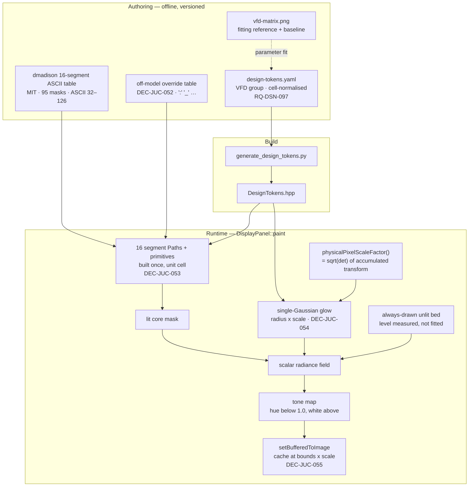

# ADR-JUC-023: VFD Vector 16-Segment Rendering

## Status
Proposed

<!-- Supersedes ADR-JUC-007 (VFD bitmap glyph rendering). Motivated by the
amendment of RQ-GUI-033 (vector 16-segment rendering), RQ-GUI-049 (full ASCII
32–126 coverage) and RQ-DSN-097 (VFD token group). Same functional area as
ADR-JUC-007, hence the ADR-JUC series. Builds on ADR-JUC-013 (the rest of the
panel is already vector), ADR-JUC-014/015 (design tokens and their codegen). -->

## Requirements
RQ-GUI-020, RQ-GUI-031, RQ-GUI-033, RQ-GUI-049, RQ-DSN-097

## Context

`DisplayPanel` currently blits 12×16 px cells out of `vfd-matrix.png`, a sprite
sheet inherited from the .NET `MATRIXTINY` resource (ADR-JUC-007). Three facts,
each verified against the source or the asset itself, motivate replacing it.

**The sheet is not a dot matrix — it is a 16-segment font already.** Decoding
the asset shows the segment topology plainly: `0` carries the diagonal slash,
`M` and `W` use opposite diagonal pairs, `+` lights the two centre verticals.
It was authored as a 16-segment display, rasterised at 12×16 and bloomed. So
this ADR does not invent a look; it reconstructs, as geometry, what the asset
already encodes as pixels.

**It cannot survive a scale change.** Measured from the source: at launch the
window content is 1260×810, the canvas is 1260×786 + a 24 px menu bar, so
`ScaledCanvasComponent::resized()` computes `min(1260/1260, 786/786)` = **1.0**
and the sprite is blitted 1:1 — ADR-JUC-007 was correct for that case, and its
nearest-neighbour choice does nothing there. The scale leaves 1.0 as soon as
the display is HiDPI (2.0 on Retina and on Windows at 200 %) or the window is
enlarged, and then no resampling can recover detail the 12×16 source never had.

**It has holes.** Only **51** of the 95 printable cells are drawn; the other 44
— including every lowercase letter — are byte-identical to the space cell, so
those characters silently vanish (RQ-GUI-049).

Two further findings shape the decision. First, the sheet is **no longer
regenerable in this repository**: `extract_control_table.py` reads
`Xplorer/Properties/Resources.resx`, a path that left for the archive repo.
Second, the sheet is **not a pure 16-segment display**: it draws `:` as two
separated dots and `_` as a bar below the glyph body, neither of which any
combination of 16 segments can produce.

The nothing-to-do option was considered seriously and is recorded under
*Alternatives*: at 100 % DPI and default size, today's rendering is at its
optimum and a vector port buys no visible improvement.

## Decision

- **DEC-JUC-051 — Glyph topology comes from a vendored 16-segment ASCII table,
  not from hand-authored artwork.** The port adopts the character map of
  `dmadison/LED-Segment-ASCII` (MIT, © 2017 David Madison), covering ASCII
  32–126 as one 16-bit mask per character, bit 0 = segment A through bit 15 =
  segment U. MIT is compatible with this project's GPLv3; the upstream notice
  SHALL be preserved in the generated header and the dependency declared as a
  third party. The bit→geometry mapping SHALL be verified by test, not assumed:
  decoding `0`, `1`, `8`, `A`, `E`, `H`, `M`, `W`, `X`, `+`, `-` and `T` pins it
  unambiguously (outer ring `A`–`H` clockwise from top-left, then `K`,`M`,`N`,
  `P`,`R`,`S`,`T`,`U` inside).
  *Why not author 95 glyphs by hand:* it is the same data, it would have to be
  verified anyway, and hand artwork cannot be regression-tested against a
  published reference.

- **DEC-JUC-052 — An off-model primitive layer, driven by a small override
  table.** A pure 16-segment renderer is not sufficient for this display: `:`
  is two dots and `_` is a sub-baseline bar in the reference, and `:` appears
  in *every* parameter-edit line (`NAME:VALUE`) and in every `MIDI CC:` line.
  A short per-character override table SHALL map such characters to explicit
  primitives instead of a segment mask. The table SHALL be data, listed in one
  place, so the divergence from the vendored table is auditable rather than
  scattered through the renderer.
  The table has **three** entries, two of which also resolve the only two
  collisions in the vendored data (RQ-GUI-049 requires all 95 glyphs to render
  distinctly):
  | Character | Primitive | Reason |
  |---|---|---|
  | `:` | two separated dots | reference fidelity; also splits `0x2200` from `\|`, which keeps the centre verticals and is correctly a bar |
  | `_` | bar below the glyph body | reference fidelity (the vendored mask uses the bottom horizontals instead) |
  | `x` | half-height crossing | splits `0x5500` from `X` |
  The lowercase `x` case is *not* a data defect to report upstream: a 16-segment
  cell draws lowercase in its lower half, and a crossing needs one `\` and one
  `/` stroke whose only available diagonal pairs (`K`,`N`) start at the **top**
  corners. No lower-half crossing exists, so upstream's `x = X` is the correct
  answer for a pure 16-segment device and the distinction has to come from
  outside the model. Editing the vendored table instead would break its
  diffability against upstream for no gain.

- **DEC-JUC-053 — Paths built once in cell-normalised units; rendering happens
  at the physical pixel scale.** The 16 segment outlines and the off-model
  primitives SHALL be built once as `juce::Path` in a unit cell and reused, with
  the cell→device transform applied at paint time. `paint()` SHALL read
  `Graphics::getInternalContext().getPhysicalPixelScaleFactor()`, which JUCE
  computes as `sqrt(|det|)` of the accumulated transform and therefore already
  folds in both the `ScaledCanvasComponent` scale and the OS DPI scale.
  *Consequence to respect:* the glow radii are cell fractions (RQ-DSN-097) and
  SHALL be multiplied by that factor. A halo whose radius is fixed in device
  pixels would shrink visually as the window grows — this is the one place where
  "resolution independent" needs explicit code rather than falling out for free.

- **DEC-JUC-054 — The photometry is a scalar radiance field, tone-mapped once.**
  Measurement of the reference asset shows the red channel stays at 0 through
  the entire halo and only rises at the saturated core (up to `#5CFFDB`), which
  is the signature of accumulating intensity past 1.0 and washing out toward
  white — not of a second colour. The renderer SHALL therefore accumulate a
  scalar field (lit core, plus glow, over an always-drawn unlit bed) and convert
  to colour once at the end, preserving the phosphor hue below 1.0 and lifting
  toward white above it.
  The glow is a **single** Gaussian. This decision was initially written the
  other way — two components, on the grounds that the falloff measured on an
  isolated glyph (≈0.25 of core at 1 px but still ≈0.16 at 2 px) is too
  wide-tailed for one Gaussian, which predicts ≈0.005 there. Fitting over the
  whole drawn set refuted it: the two radii converge (2.10 px and 2.59 px on a
  12×16 cell), which is what an over-parameterised model looks like, and the
  second component buys 0.53 RMSE — 2 % — for twice the blur cost at paint
  time, with no difference visible in a side-by-side render. One isolated glyph
  was not a sound basis for a runtime cost paid on every repaint.
  The **unlit bed level is measured, not fitted**: left as a free parameter it
  trades against the glow and parks itself at its bound, visibly
  over-brightening the unlit segments. It is read from the baseline's own blank
  cell instead.

- **DEC-JUC-055 — Grid, centering and caching are carried over from
  ADR-JUC-007 unchanged.** `cols = floor(w/12)`, `lines = floor(h/16)` computed
  from the panel's **logical** bounds, glyph block centered, black background;
  `setLines` keeps its identical-text early-out and `setBufferedToImage(true)`
  is kept. The latter is not a resolution trap, contrary to what one might
  expect: `StandardCachedComponentImage::paint` allocates its cache at
  `bounds * getPhysicalPixelScaleFactor()` and paints into it with that scale
  applied, so the cache follows the device resolution. Only the *artwork* inside
  each cell changes.

- **DEC-JUC-056 — Every visual value is a design token (RQ-DSN-097).** Segment
  geometry, shear, stroke, gaps, glow radii and amplitudes, unlit level and
  phosphor hue live in `design-tokens.yaml` and reach the code through the
  generated `DesignTokens.hpp`. Values obtained by fitting against the inherited
  sheet carry a `note` recording that provenance.

## Consequences

- The VFD stops being the one bitmap component left in an otherwise vector panel
  (ADR-JUC-013), and gains 44 missing characters as a side effect.
- `vfd-matrix.png` stops being a runtime dependency. It is **kept in the
  repository** as the fitting reference and the regression baseline — it is the
  only surviving witness of the original artwork now that the .NET tree is gone.
- Per-glyph work grows from one blit to ~10–16 path fills plus a blur, but the
  cost is bounded by `setLines`' early-out and the component cache: it is paid
  only when the text actually changes, never on knob-drag repaints of the panel.
- The cached image grows with the scale (≈0.9 MB at scale 3 for a 267×82 panel).
  Negligible, and unchanged in kind from today's cache.
- Fidelity is now a tunable, not a fixed asset: the fitted parameter set reaches
  an RMSE of ≈25.8/255 over the 51 glyphs the baseline draws, and the residual is
  dominated by table divergences (`Y`, `[`, `]`, `:`) rather than by the filters —
  which is precisely why spending a second blur to shave 2 % off it was refused.
- A conscious loss: the reference's hand-drawn cells for a few punctuation marks
  are approximations in the vendored table. DEC-JUC-052 covers the ones that
  matter; the rest (`.` notably) will differ slightly from the old artwork.

## Alternatives Considered

- **Keep ADR-JUC-007 as is.** Legitimate, and the honest baseline: at 100 % DPI
  and the default window size the current rendering is pixel-optimal and a port
  changes nothing visible. Rejected because that is exactly one configuration —
  HiDPI is now the common case, the window is resizable by requirement
  (RQ-GUI-005), the 44 missing glyphs are a live defect, and the asset can no
  longer be regenerated here.
- **Regenerate a *better* sprite sheet offline** (same segment table and filters,
  written back to `vfd-matrix.png`). Keeps `DisplayPanel` untouched and restores
  regenerability, at zero runtime risk. Rejected as the target because it does
  not fix scaling at all — but retained as a **fallback** if the runtime cost or
  quality of the vector path ever disappoints, since DEC-JUC-051/054 produce the
  generator either way.
- **Render the glyphs with an embedded segment *font*** (a TTF of 16-segment
  characters, drawn as text). Rejected: it would reintroduce the platform
  metric-dependency that ADR-JUC-022 had to eliminate for combo boxes, offers no
  control over the unlit bed or the glow, and cannot express DEC-JUC-052.
- **Triangle-lattice rendering** (glyph paved on a lattice of cells split into
  four triangles, giving tiled strokes with triangular terminals). Explored
  against an owner-supplied mockup and shown to be reachable from the same
  skeleton at low extra cost. Rejected for now by the owner: it is a
  reinterpretation rather than a restoration of the Xpander display, its tiling
  is unreadable below roughly three times the current cell size, and its
  fidelity cannot be measured against any ground truth. The skeleton stays
  reusable if it is ever revisited.

## Diagram

