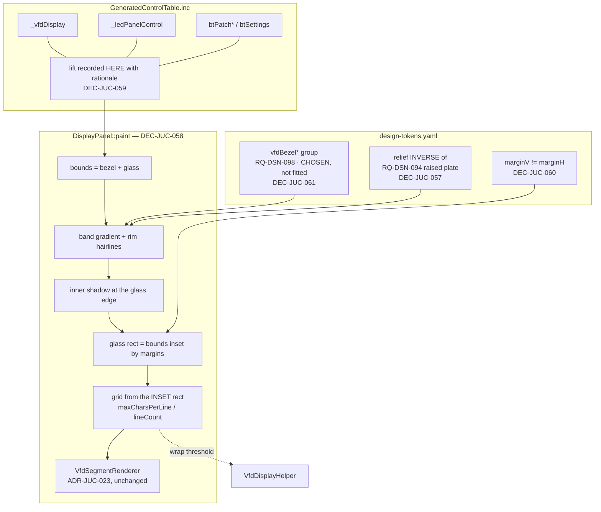

# ADR-JUC-024: VFD Bezel and Display-Group Placement

## Status
Proposed

<!-- Motivated by RQ-GUI-050 (recessed bezel + display group read as one unit)
and RQ-DSN-098 (its token group). Follows ADR-JUC-023, which made the display
vector-rendered; this ADR only adds what surrounds it. Touches the deviation
policy of ADR-JUC-006 (mechanically-extracted control table) and the
reference-fidelity clause of ADR-JUC-013 / RQ-GUI-037. -->

## Requirements
RQ-GUI-050, RQ-DSN-098, RQ-GUI-037, RQ-GUI-022

## Context

The display is the only element of the façade with no frame. Every labelled
block is drawn with a rounded frame and a fill (RQ-DSN-094); the glass is drawn
straight onto the brushed-metal plate, so it reads as laid on the panel rather
than mounted in it.

Two mockups were rendered in the running application and compared at 1:1
(owner review, 2026-07-31):

- **Flat bright outline** — a `FRAME`-coloured stroke, the same language as the
  block frames. Rejected: at 1:1 it was the highest-contrast element of the
  entire façade, louder than any block frame, and pulled the eye out of all
  proportion to the display's importance. It read as *a frame*, not as *a
  transition*, which is what was missing.
- **Recessed bezel** — a metal band whose top edge is dark and bottom edge lit,
  the inverse of the raised-plate relief. Accepted: it sits in the same material
  register as the rest of the panel and reads as an inset without shouting.

The blocking constraint is geometric, not aesthetic. Measured from the control
table: the glass ends at `y=122`, the LED strip starts at `y=123`, the shortcut
buttons at `y=128`. **One pixel.** No bezel of any thickness fits without moving
something, which is why this ADR is about placement as much as about drawing.

## Decision

- **DEC-JUC-057 — Recessed relief, not a flat outline.** The bezel is a band
  filled with a vertical gradient, dark at the top and light at the bottom, with
  a dark hairline on its outer top edge and a light one on its outer bottom
  edge, plus an inner shadow where the glass meets it. This is deliberately the
  **inverse** of RQ-DSN-094's raised-plate treatment: under light from above,
  that inversion is the entire difference between a recess and a bump. The two
  treatments must therefore never be given the same values, and are kept as
  separate token groups so they cannot silently converge.
  The inner shadow is a **square stroke straddling the glass boundary**, which
  renders heavier than the rounded stroke of the approved mockup. That drift was
  incidental, not designed — it was surfaced by TASK-DSP-005's diff rather than
  chosen — but the owner reviewed the two side by side and **kept the heavier
  one** (2026-07-31): it reads as a more convincing recess. Recorded as an
  accepted deviation from the mockup so a later reader does not "restore" the
  lighter version thinking it fixes a regression.

- **DEC-JUC-058 — The bezel belongs to `DisplayPanel`, not to
  `BackgroundRenderer`.** The alternative was tempting — the bezel is panel
  furniture, and `BackgroundRenderer` already draws every other frame. It is
  rejected because the bezel's inner edge must line up with the glass to the
  pixel at any render scale, and the background is painted by a different
  component with no knowledge of the display's bounds. Coupling them through
  shared constants would make a single layout change require edits in two files
  that are verified separately. The bezel is drawn by the component that owns
  the geometry it must match.
  *Consequence accepted:* `DisplayPanel`'s bounds now cover bezel **and** glass,
  so its grid arithmetic works off an inset rectangle rather than its full
  bounds. `maxCharsPerLine()` and `lineCount()` — which `VfdDisplayHelper` uses
  as its wrap threshold — must inset too, or the text would wrap to a width the
  glass does not have.

- **DEC-JUC-059 — The lift is recorded in the control table, not applied at
  placement.** The display, the LED strip and the shortcut buttons move up
  together. Those coordinates live in `GeneratedControlTable.inc`, extracted
  from the reference; the lift is written **there**, with its rationale, exactly
  as the TASK-GUI-009 VCO2 deviation was. Subtracting an offset in
  `MainComponent` would leave the table saying one thing and the screen showing
  another — and the table is the source of truth now that the .NET tree is
  archived (ADR-JUC-006 amended by that same precedent).
  *This is an acknowledged deviation from the reference layout* (RQ-GUI-001,
  RQ-GUI-037), owner-arbitrated: the reference had no bezel, so it had no reason
  to leave room for one.

- **DEC-JUC-060 — Vertical and lateral margins are separate tokens.** The
  mockup showed the bezel crowding the modulation matrix on its right while
  having air above. One shared margin cannot express that; forcing it would mean
  accepting whichever side looks worse. Two tokens, so the asymmetry is a stated
  decision rather than a compromise nobody chose.

- **DEC-JUC-061 — The bezel tokens are chosen, not fitted.** Unlike the glyph
  tokens of RQ-DSN-097, there is no reference artwork to measure: the .NET
  display had no bezel. `fit_vfd_tokens.py` is therefore **not** extended, and
  each bezel token's note records that it is a design choice. Pretending to
  derive them would fabricate a provenance that does not exist.

- **DEC-JUC-062 — The bezel has square corners, because the component is
  opaque.** *(Added 2026-07-31, owner-reported defect.)* The first
  implementation — and the mockup it came from — filled the band with
  `fillRoundedRectangle`. That leaves the four corner pixels of the bounds
  unpainted, and `DisplayPanel` declares `setOpaque(true)`. JUCE takes that
  declaration literally: `StandardCachedComponentImage` allocates the cache with
  `clearImage = ! isOpaque()`, so an opaque component's buffer is **never
  cleared**. Those four pixels therefore displayed uninitialised memory —
  measured `(126,1,1)` and `(100,65,86)` against a `(68,69,78)` plate.
  Square corners make the opacity declaration true rather than patching around
  it, and a metal bezel cut into a plate has sharp outer corners anyway.
  *Rejected alternative:* `setOpaque(false)`. Correct in principle — the
  component genuinely did not fill its bounds — but `MainComponent::paint` runs
  the whole uncached vector background, so every VFD text change (i.e. every
  knob movement) would have re-run that drawing clipped to the display.
  *Consequence:* `vfdBezelRadius` is deleted rather than left unused. A token
  nothing consumes is worse than no token: it reads as a knob that does nothing.

## Consequences

- The display stops being the one unframed element of the façade, and the
  display group (glass + LEDs + buttons) reads as one assembly.
- `DisplayPanel` gains a second responsibility (its own surround) and its bounds
  no longer equal its glass. That is the cost of DEC-JUC-058; the alternative
  cost — geometry split across two independently-verified components — is worse.
- The control table diverges further from the archived reference. It already
  did (TASK-GUI-009); what matters is that each divergence is written down where
  the coordinates live.
- Freed space appears below the shortcut buttons, roughly 30 px before the
  modulation-matrix headers. This reinforces the separation RQ-GUI-050 asks for,
  but it is a visible layout change that the owner should see before it ships.
- `session.unit_tests = false`: verification is the Xvfb/screenshot pipeline
  against the approved mockup, not unit tests.

## Alternatives Considered

- **Flat bright outline.** Mocked up and rejected on sight at 1:1 — see Context.
  Kept here because it is the obvious first idea and a later reader will
  otherwise propose it again.
- **Bezel drawn by `BackgroundRenderer`.** Rejected per DEC-JUC-058: alignment
  to the glass at any scale would depend on constants shared between two
  components verified independently.
- **Lift applied in `MainComponent` placement code.** Rejected per DEC-JUC-059:
  it hides a layout decision in imperative code and makes the control table lie.
- **No lift, thinner bezel.** With one pixel of clearance, the only bezel that
  fits without moving anything is no bezel. Not viable.
- **Moving the LEDs/buttons but not the display.** Would open the gap below the
  glass without giving the bezel its room, and would break the group's internal
  spacing — the opposite of what RQ-GUI-050 asks for.

## Diagram

