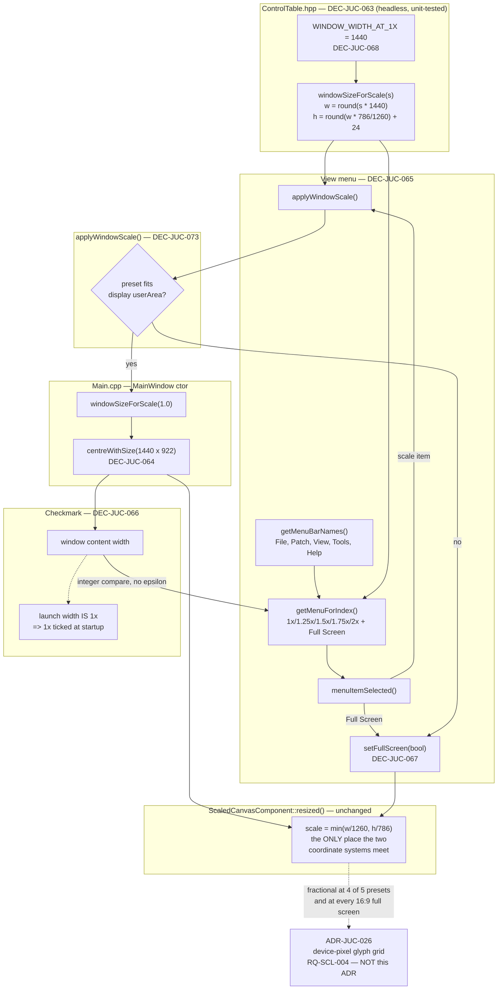

# ADR-JUC-025: Deterministic Window Sizing and a View-Menu Scale/Full-Screen Control

## Status
Accepted — implemented, TASK-SCL-001/002/003, owner-verified 2026-08-03.

<!-- Motivated by RQ-SCL-001 (reference 1x window size), RQ-SCL-002 (View
menu scale presets) and RQ-SCL-003 (Full Screen). Builds on the
free-resize/uniform-scale mechanism of RQ-GUI-005 and ADR-JUC-013, and on the
existing four-entry menu bar of RQ-GUI-008. The VFD's device-pixel alignment
(RQ-SCL-004) is deliberately NOT here — it belongs to the renderer and is
decided by ADR-JUC-026. -->

## Requirements
RQ-SCL-001, RQ-SCL-002, RQ-SCL-003, RQ-GUI-005, RQ-GUI-008, RQ-GUI-037

## Context

`Main.cpp` creates the top-level `MainWindow` (a `juce::DocumentWindow`) and
calls:

```cpp
setContentOwned(new ScaledCanvasComponent(), true);
setResizable(true, true);
centreWithSize(getWidth(), getHeight());
```

`ScaledCanvasComponent`'s own constructor sets its size to
`LOGICAL_CANVAS_WIDTH × (LOGICAL_CANVAS_HEIGHT + 24)` = `1260×810` — the 24 px
is the in-window `juce::MenuBarComponent` strip (`_menuBar`), which this
project renders itself rather than relying on an OS-native application menu,
so File/Patch/Tools/Help already live inside the content area, not outside it
(`ScaledCanvasComponent::resized()`, `MainComponent.cpp:867-880`). The window
then reads back its **own** `getWidth()/getHeight()` to centre itself — a
value that depends on `setContentOwned`'s internal resize-to-fit timing rather
than on a value this code computes and owns. There is no single place that
answers "what window size does scale *N* mean?" — the constructor hard-codes
`1260×810` once, and nothing currently offers any other scale.

### Where `1260` came from, and why it was the wrong thing to copy

The .NET reference (`MainForm`, archived) declared `ClientSize` `1260×813`
(`extract_control_table.py`'s `CANVAS_TOP_CROP` derivation: `813 − 27 = 786 =
LOGICAL_CANVAS_HEIGHT`) — which is where `LOGICAL_CANVAS_WIDTH = 1260` comes
from, and why the JUCE port launches at that width today.

**This ADR's first draft argued the default width was therefore already
correct. That was wrong, and the owner's measurement exposed it.** The .NET
application actually launched at **≈1473 px wide** (2026-08-02). The cause was
in the analysis document all along: `architecture-analysis.md` row 17 records
the reference as "Fixed size, **WinForms DPI autoscale at launch**".
`ClientSize` is the *design-time* size; what the user saw was that size
multiplied by their display's scale factor. The number in the resx and the
number on the screen are two different quantities, and the port copied the
first while the owner remembers the second.

A consequence worth stating plainly: **the reference had no single default
width to reproduce.** Its launch width was a function of the display it ran
on. Anything this port picks is a fixed logical value.

### Is `1x` a scale over the canvas, or a size of its own?

The owner settled this (2026-08-02): **1x is a window content width**, fixed
at **1440** — chosen over the measured ≈1473 because it clears a 1920×1080
display with room to spare while still reading as the familiar size.

The alternative framing — 1x = the 1260 canvas, launch = ≈1.17× — produces the
same window but a worse system: every preset becomes the product of a chosen
multiplier and an unchosen ≈1.1706 that would have to be explained wherever it
appeared, the launch size matches no menu entry, and the menu checkmark needs
a floating-point tolerance. Defining 1x as a width removes all three. The
canvas's `1260×786` keeps its own, unchanged job: the coordinate grid the
extracted control table is expressed in (ADR-JUC-006). The two systems meet in
exactly one place, the uniform render transform in
`ScaledCanvasComponent::resized()` that RQ-GUI-005 requires anyway.

Independently of the width, the `getWidth()/getHeight()` round-trip above is
removed regardless: an implicit, layout-timing-dependent computation is the
wrong thing to keep even when it happens to produce the right number (same
reasoning as DEC-JUC-058/059's preference for explicit, single-owned geometry
over values re-derived from component state at an unspecified point in the
layout cycle).

### What the presets are, and are not, for

The owner asked for a View menu partly for convenience and partly expecting
preset sizes to render the VFD better than a mouse-dragged one. **Only the
first half survives contact with the code.** Of the five chosen ratios only
`1.75x` (2520 = 2 × 1260) yields an exact canvas scale; the other four are
fractional, as is every full-screen scale on a 16:9 display (RQ-SCL-003). VFD
crispness therefore cannot come from picking window sizes — it has to be fixed
in the renderer, which is RQ-SCL-004 and ADR-JUC-026. That separation is what
freed the ratios to be chosen for ergonomics alone.

## Decision

- **DEC-JUC-063 — One function computes "window size for scale *N*"; nothing
  else invents a size.** A single function `windowSizeForScale(float scale)`
  returns

  ```
  width  = round(scale × WINDOW_WIDTH_AT_1X)                      // 1440 at 1x
  height = round(width × LOGICAL_CANVAS_HEIGHT / LOGICAL_CANVAS_WIDTH)
         + MENU_BAR_HEIGHT
  ```

  Width is a plain multiple of the stated 1x width; height is whatever keeps
  the canvas aspect ratio, expressed as the ratio of the two canvas constants
  rather than as a decimal — so no magic number appears and a future canvas
  relayout stays correct by construction.
  It lives in `xplorer/app/ControlTable.hpp`, next to the canvas constants it
  reads, in the **headless** `xpl_app_core` library and therefore
  unit-testable with no JUCE window (`session.unit_tests = true`). No new
  header: the constants it needs already live there, and a separate file for
  one function would be an abstraction for a one-off. `MENU_BAR_HEIGHT` moves
  there too, from the two places in `MainComponent.cpp` that currently
  hard-code `24`.
  Both the startup default and every View-menu preset call this one function.
  No caller re-derives the arithmetic, and no caller reads back
  `getWidth()/getHeight()` to decide what size it *already* is before setting
  it — removing the implicit round-trip identified in Context.

- **DEC-JUC-064 — Sizing is applied to `MainWindow`, not to
  `ScaledCanvasComponent`.** `setContentOwned` is called with
  `resizeToFitContent = false`, so the window sizes the content rather than
  the content sizing the window, and `ScaledCanvasComponent`'s constructor
  drops its own `setSize` — today it sets `1260 × (786 + 24)` there, which is
  a second place stating what the launch size is. `MainWindow` calls
  `centreWithSize(windowSizeForScale(...))` at construction and on every View
  menu selection; `ScaledCanvasComponent::resized()` keeps computing the
  render scale from its own bounds exactly as it does today (RQ-GUI-005) —
  unchanged, because it must still cope with an arbitrary mouse-dragged size,
  not only the five presets.
  *Re-centring on every scale change is deliberate:* 1x → 2x roughly
  quadruples the footprint, and keeping the top-left corner fixed would push
  most of the window off-screen for a window already near a screen edge.
  Centring is also what a "zoom to N%" command conventionally does.

- **DEC-JUC-065 — `View` is a fifth entry on the existing
  `juce::MenuBarModel`, not a new mechanism.** Added to
  `MainComponent::getMenuBarNames()` between `"Patch"` and `"Tools"`
  (`{"File", "Patch", "Tools", "Help"}` → `{"File", "Patch", "View", "Tools",
  "Help"}` — owner-specified position, 2026-08-02), with its `PopupMenu`
  built in `getMenuForIndex()` and its five scale items plus Full Screen
  handled in `menuItemSelected()` — the same three functions that already
  own File/Patch/Tools/Help (RQ-GUI-008). Because `menuItemSelected()`
  dispatches by item ID rather than by menu index, inserting `View` in the
  middle of the bar does not renumber or otherwise disturb the existing
  Patch/Tools/Help handlers. No native OS menu, no second widget system, no
  new dependency.

- **DEC-JUC-066 — The checked preset is read from the window's *actual*
  width, not from a separately stored "requested scale".** A `PopupMenu`
  item is ticked when the window's current content width equals
  `windowSizeForScale(preset).width` — an **integer** comparison against the
  same function that set the size, never a memory of which item was last
  clicked. Defining 1x as a width (DEC-JUC-068) is what makes this exact: had
  the presets been float scale factors, the check would have needed a
  tolerance, and picking a tolerance means deciding how wrong a window may be
  and still claim to be at a preset. There is no such question here.
  A window resized by mouse-drag shows no checkmark, and so does one that
  went full screen because a preset did not fit (DEC-JUC-073, below) — in
  both cases because the window really is not at that preset's size
  (RQ-SCL-002 acceptance).

- **DEC-JUC-073 — A preset that does not fit the display switches to full
  screen instead of resizing.** `applyWindowScale` reads
  `Desktop::getInstance().getDisplays().getDisplayForRect(window.getScreenBounds())->userArea`
  and, if the preset's content size exceeds it in either axis, calls
  `setFullScreen(true)` and returns rather than calling `centreWithSize` with
  an oversized rectangle. *Why this needs a decision at all:* an owner
  reading the first draft of this ADR pointed out that nothing prevented a
  preset from producing a window larger than the screen — `centreWithSize`
  places a window of the size it is given; JUCE does not clamp it to the
  display, so the window would extend off-screen rather than being "clamped"
  as an earlier draft of this ADR assumed. **Full screen is the closest
  available equivalent to what the preset asked for** — as large as the
  display allows — so it is the natural fallback rather than an error state.
  When the window is later returned to a preset that *does* fit, full screen
  is explicitly cleared first (`setFullScreen(false)`) before the resize, so
  a stale full-screen flag never fights the new bounds.
  *No change to DEC-JUC-066:* the checkmark still reads the window's actual
  state, so a preset applied via this fallback simply results in **Full
  Screen** being ticked and no scale entry — an honest description of what
  actually happened, with no special-casing needed in the menu-building code.

- **DEC-JUC-067 — Full Screen reuses
  `juce::ResizableWindow::setFullScreen(bool)`.** `DocumentWindow` inherits
  it; JUCE already saves the pre-fullscreen bounds internally and restores
  them on `setFullScreen(false)`. No bespoke "remember the previous
  geometry" state is introduced — a second, hand-rolled copy of that logic is
  exactly the kind of duplicated source of truth DEC-JUC-063/066 are written
  to avoid elsewhere in this same ADR.

- **DEC-JUC-068 — `1x` *is* a window content width of `1440`, and the presets
  are `1, 1.25, 1.5, 1.75, 2`.** `WINDOW_WIDTH_AT_1X = 1440` is the unit every
  preset multiplies, and the launch size is simply `windowSizeForScale(1.0F)`
  = `1440×922`. Width is the authority because width is what the owner
  measured and what the eye compares across two editors side by side; height
  follows so the canvas aspect ratio is preserved and nothing is letterboxed.

  | Preset | Content size | Canvas render scale |
  |---|---|---|
  | 1x | 1440 × 922 | ≈1.143 |
  | 1.25x | 1800 × 1147 | ≈1.429 |
  | 1.5x | 2160 × 1371 | ≈1.714 |
  | 1.75x | 2520 × 1596 | **exactly 2.000** |
  | 2x | 2880 × 1821 | ≈2.286 |

  *Two properties worth naming, because both are easy to misread later:*
  - **The launch size is exactly `1x`**, so the View menu shows `1x` ticked at
    startup and returning to the default is a menu click, not a size the user
    has to remember.
  - **`1.75x` is the only preset on an exact canvas scale**, and by
    coincidence rather than design (2520 = 2 × 1260). It is *not* evidence
    that the ratios were chosen for pixel alignment, and no future change
    should preserve it at the cost of the ergonomics that did drive the
    choice. Alignment is ADR-JUC-026's job at every scale.

  **1440 is a fixed *logical* width, whereas the reference's was DPI-derived**
  (see Context). On Windows, JUCE logical pixels are themselves subject to the
  OS/desktop scale factor, so on a display scaled differently from the owner's
  the result will not track what the .NET build did there. Accepted limit, not
  an oversight: the reference had no display-independent default to reproduce.
  TASK-SCL-005 measures the result on the owner's actual display; if it needs
  tuning, it is a one-line change precisely because DEC-JUC-063 put it in one
  place.

  *Not pursued:* the reference's `813` design-time height. The JUCE port
  renders its menu bar *inside* the content area where WinForms placed it
  outside, and matching `813` would mean shrinking the logical canvas —
  rippling into every extracted control coordinate (ADR-JUC-006) for a value
  that, as established above, was never what the user actually saw anyway.

## Consequences

- Startup sizing and the View-menu presets share one code path — a future
  change to `LOGICAL_CANVAS_WIDTH/HEIGHT` (e.g. a canvas relayout)
  automatically keeps both in sync.
- `MainWindow` gains a small amount of new responsibility (calling
  `windowSizeForScale`), but `ScaledCanvasComponent::resized()` is untouched,
  so the free-resize path (RQ-GUI-005) has zero behavioural change.
- The application opens larger than before (1440×922 against 1260×810, ≈ +30 %
  area) while still fitting a 1920×1080 display with margin — the reason 1440
  was preferred to the measured ≈1473.
- **Reach of the upper presets is uneven, by construction.** 1.25x and 1.5x
  need ≈1440 px of display height; `1.75x` needs 1596 px of *content* height,
  more than a 2560×1440 panel offers; `2x` targets 4K. On a smaller display
  those entries now enter full screen instead (DEC-JUC-073), which
  DEC-JUC-066 then correctly reports as **Full Screen** ticked and no scale
  entry. Kept because the owner specified these five ratios and full screen
  is a usable, honest substitute for a preset the display cannot show at its
  stated size.
- **No preset guarantees a device-pixel-aligned VFD, and this ADR does not
  claim one.** Four of the five canvas scales are fractional, as is every
  16:9 full-screen scale. That is delegated in full to ADR-JUC-026; if that
  work were dropped, the View menu would still deliver its ergonomic value
  and nothing here would become incorrect — the two decisions are genuinely
  independent, which is why they are two ADRs.

## Alternatives Considered

- **Keep computing the default size from `getWidth()/getHeight()` after
  `setContentOwned`.** Rejected: works only as long as JUCE's internal
  resize-to-fit timing does not change, and gives the View menu nothing to
  call — it would need its own, separate sizing logic, duplicating the
  constants a second time.
- **Treat the reference width as a scale factor over the 1260 canvas** (1x =
  1260, launch ≈1.17×). Rejected by the owner, 2026-08-02, and the design is
  better for it — see Context: it would have put an unchosen ≈1.1706 into
  every preset, left the launch size matching no menu entry, and forced a
  float tolerance into DEC-JUC-066.
- **Keep `1260` and treat the owner's report as a misunderstanding.**
  Rejected: the measurement is of the running application, and
  `architecture-analysis.md` row 17 independently corroborates the DPI
  autoscale that explains it. The first draft of this ADR asserted 1260 was
  already correct; that assertion was wrong and is recorded as such in
  Context rather than quietly deleted.
- **Choose the preset ratios to land on exact canvas scales** (e.g. multiples
  giving 1.0/1.25/1.5/…). Rejected once ADR-JUC-026 took ownership of
  alignment: it would have constrained the user-facing ratios to serve an
  internal rendering detail, and the detail is better fixed where it lives.
- **Store the last-clicked scale as explicit state for the menu checkmark.**
  Rejected per DEC-JUC-066: a mouse-drag resize would silently desynchronise
  it from what is on screen — the exact class of bug RQ-SCL-002's acceptance
  criteria calls out.
- **Hand-rolled full-screen bounds tracking.** Rejected per DEC-JUC-067:
  `ResizableWindow` already does this; duplicating it is a second source of
  truth for no benefit.
- **A native OS application menu for `View`.** Rejected: File/Patch/Tools/Help
  are already a JUCE-rendered `MenuBarComponent` inside the window, not a
  native menu; a native `View` menu would be inconsistent with its four
  siblings and platform-dependent.
- **Shrink the logical canvas to hit `813` exactly.** Rejected per
  DEC-JUC-068: would touch every extracted control-table coordinate to match
  a design-time number the user never actually saw on screen.
- **Derive the default from the display's DPI at run time**, reproducing
  WinForms' autoscale. Rejected as scope: it would make the default
  machine-dependent again — reproducing the reference's behaviour rather than
  its result — and JUCE already applies a desktop scale of its own, so the
  two would compound.
- **Let an oversized preset resize the window anyway and rely on the OS to
  clamp or reposition it.** This was the original assumption — an earlier
  draft's Consequences section stated it as fact. It is false: `centreWithSize`
  places a window of exactly the size it is given, and JUCE does not clamp
  that size to the display. Caught by the owner reading this ADR, not by a
  test, which is itself worth recording — it was a claim about run-time
  behaviour that had not been checked. Replaced by DEC-JUC-073.
- **Shrink an oversized preset to fit the display instead of going full
  screen.** Rejected: it would produce a window at neither the requested
  preset's size nor the display's full extent — a third, unlabelled size the
  checkmark logic would have needed a special case for. Full screen is a
  size the user already has a name for.

## Diagram


