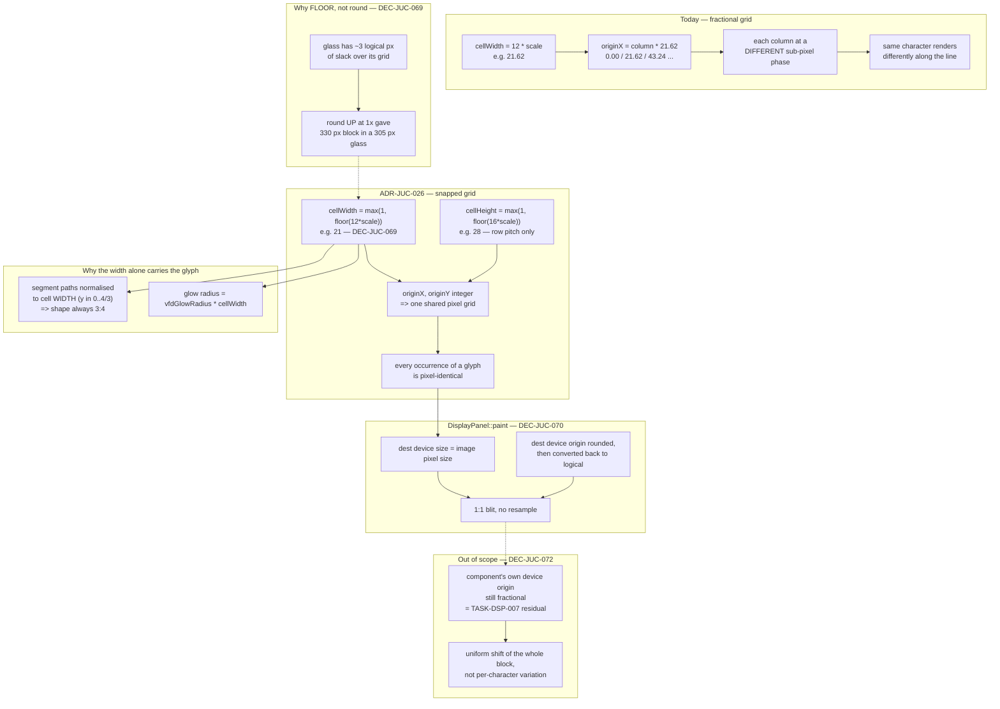

# ADR-JUC-026: VFD Glyph Grid Snapped to Whole Device Pixels

## Status
Accepted — implemented, TASK-SCL-004, owner-verified 2026-08-03. The
per-axis-floor design superseded this ADR's own first-draft decision
(multiple-of-3 rounding) before merge, per a failing test — see DEC-JUC-069.

<!-- Motivated by RQ-SCL-004. Amends the rendering path established by
ADR-JUC-023 (vector 16-segment glyphs) without reopening any of its
decisions; the bezel geometry of ADR-JUC-024 is untouched. Independent of
ADR-JUC-025 (window sizing) by design — see its Context. -->

## Requirements
RQ-SCL-004, RQ-GUI-020, RQ-GUI-033, RQ-GUI-049, RQ-DSN-097

## Context

ADR-JUC-023 replaced the 12×16 sprite blit with vector 16-segment glyphs
rasterised at the true device scale. That removed the magnification defect
completely: `DisplayPanel::paint` reads
`getPhysicalPixelScaleFactor()` and hands it to
`VfdSegmentRenderer::renderBlock`, so the glyphs are always rendered at the
resolution they will be displayed at. **Nothing below is a criticism of that
decision, and no part of it is reversed here.**

What remains is a different defect, at a different stage. In `renderBlock`:

```cpp
const auto cellWidth  = static_cast<float>(CELL_WIDTH)  * scale;   // 12 * s
const auto cellHeight = static_cast<float>(CELL_HEIGHT) * scale;   // 16 * s
...
const auto originX = static_cast<float>(column) * cellWidth;
const auto originY = static_cast<float>(row)    * cellHeight;
```

The cell origins are floating point. When `12 × scale` is not a whole number,
every column starts at a different sub-pixel phase — column 0 at 0.00,
column 1 at 21.62, column 2 at 43.24, and so on at scale 1.8015. Each glyph is
therefore rasterised against a different pixel grid alignment, and the same
character renders with slightly different stroke placement and weight
depending on where it sits in the line. The visible result is a line of text
whose letterforms are subtly inconsistent — read by the owner as a display
that is not *nickel*.

**The condition for a clean grid is narrow but not severe.** Both `12 × scale`
and `16 × scale` must be integers; since `gcd(12, 16) = 4`, that is exactly
the set of scales that are multiples of **0.25**.

Where the application actually lands:

| Situation | Canvas scale | Multiple of 0.25? |
|---|---|---|
| Full screen, 1920×1080 | ≈1.3435 | no |
| Full screen, 2560×1440 | ≈1.8015 | no |
| Full screen, 3840×2160 | ≈2.7176 | no |
| View preset 1x / 1.25x / 1.5x / 2x | ≈1.143 / 1.429 / 1.714 / 2.286 | no |
| View preset 1.75x | 2.000 | yes |

So the aligned case is the exception, not the rule — one preset out of five,
and no full-screen 16:9 resolution at all. This cannot be fixed by choosing
window sizes: full screen is dictated by the display, and constraining the
View-menu ratios to serve an internal rendering detail would be the tail
wagging the dog (ADR-JUC-025 Context reaches the same conclusion from the
other side).

Two smaller contributors sit alongside the main one:

- the block image's pixel size is `roundToInt(columns × cellWidth)` while its
  contents were laid out at the unrounded size, so the last column can be
  clipped or padded by a fraction of a pixel;
- `DisplayPanel::paint` blits the finished image into a *logical* rectangle,
  which the context maps to a fractional device rectangle, applying a
  resample. The existing code comments describe this as "under 0.1%,
  measured; invisible side by side" — but that figure is a **size** error.
  It does not measure what a half-pixel displacement does to the sharpness of
  a one-pixel stroke. Those are two different claims and only the first was
  ever checked.

### The lever this design already provides

`VfdSegmentRenderer` normalises **everything** to the cell *width*: the 16
segment paths are stored in cell-width-normalised units with `y` running
`0..4/3` (deliberately isotropic, per the header comment), and the glow radius
is applied as `vfdGlowRadius * cellWidth`. Consequently a single snapped
value propagates to the entire glyph rendering — geometry, stroke widths and
halo alike. There is no second quantity to keep in step.

## Decision

- **DEC-JUC-069 — Each cell axis is floored to a whole number of device
  pixels, independently.** In `renderBlock`,
  `cellWidth = max(1, floor(CELL_WIDTH × scale))` and
  `cellHeight = max(1, floor(CELL_HEIGHT × scale))`. Cell origins are then
  integer multiples of integers, so every glyph is rasterised against the same
  pixel grid and every occurrence of a character is pixel-identical to every
  other — which is the whole requirement.

  *Why the two axes may be rounded independently, despite appearances.*
  `paintGlyph` receives only the cell **width**: the segment paths are stored
  in width-normalised units with `y` running `0..4/3`, so the glyph's drawn
  shape is **always exactly 3:4, whatever the cell height is**. The height is
  a *row pitch* — line leading — not a drawing dimension. Rounding it
  separately therefore changes the gap between lines by under a pixel and
  distorts nothing. An earlier draft of this ADR asserted the opposite and
  constrained the width to multiples of 3 so the height would come out `4/3`
  of it; that constraint was solving a problem the renderer does not have.

  *Why floor and not round.* This is the part that matters, and the earlier
  draft got it wrong. The glass is 267×82 logical for a 22×5 grid of 12×16
  cells — about **three logical pixels of horizontal slack in total**.
  Rounding to nearest can round *up*: at the 1x canvas scale (1440/1260 ≈
  1.143) the quarter-step rule of the first draft gave a 15 px cell and a
  330 px block inside a 305 px glass — the outermost glyphs would have been
  drawn under the bezel band. Flooring can only ever make the block smaller
  than nominal, by less than one device pixel per cell, so it fits by
  construction. The cost is a block up to ~5% narrower than nominal at the
  smallest scale in use, absorbed as black margin inside the glass and
  invisible against text whose "correct" size the user has no reference for.

  *No new token and no change to the vendored segment table:* this is a
  rasterisation-time snap, not a change to glyph design (RQ-DSN-097 untouched).

- **DEC-JUC-070 — The block is blitted 1:1, at a whole-pixel device origin.**
  `DisplayPanel::paint` sizes the destination rectangle from the returned
  image's own pixel dimensions rather than from `columns × GLYPH_WIDTH`
  logical units, and converts back to logical by dividing by the render
  scale, so the destination device rectangle matches the image exactly and no
  resampling filter runs. The centring offset is computed in **device** space
  and rounded there before being converted back, so the block's top-left lands
  on a whole device pixel instead of wherever the logical arithmetic happened
  to fall. This closes both secondary contributors named in Context.
  *No signature change:* `renderBlock` keeps taking the true device scale and
  does the snapping itself; the caller reads the result from
  `Image::getWidth()/getHeight()`. Pushing the snap up into `DisplayPanel`
  would split one decision across two components and re-introduce the
  duplicated-geometry problem DEC-JUC-058 was written to avoid.

- **DEC-JUC-071 — Fitting inside the glass wins over matching the nominal
  block size.** Flooring means the block is slightly smaller than
  `columns × 12 × scale`: at scale 1.8015 the cell goes 21.62 → 21, so a 22×5
  block measures 462×140 device px instead of ≈475.6×144.1 — about 7 device px
  of extra black on each side, inside a glass 481 px wide. Centred, on black,
  against glyphs that gain uniformity: a good trade. The alternatives both
  lose: stretching the block back to fill the glass restores the fractional
  destination rectangle and undoes DEC-JUC-070, while rounding up to get
  closer to nominal overflows the glass (DEC-JUC-069).
  *The existing test that asserted the old contract was amended, not deleted.*
  `"A fractional render scale produces a correctly sized block"` required the
  block to stay within half a pixel of nominal — precisely the absence of this
  snap. It now asserts the new, one-sided contract: never larger than nominal,
  and within one device pixel per cell of it. That is a genuine contract
  change, and the amended test is stricter in the direction that now matters
  (overflow), not looser.

- **DEC-JUC-072 — The whole-block placement residual is left in place, and
  the owner has accepted it on sight.** `DisplayPanel` is
  `setBufferedToImage(true)`, and its cached image is composited into the
  canvas at the component's own device position — `_vfdDisplay.x ×
  canvasScale` plus the canvas's centring offset, generally fractional. So a
  uniform sub-pixel translation of the *entire* block remains after
  everything above: **the same class of defect as the one DEC-JUC-070 fixes,
  one level up.** That should be said plainly rather than filed as an
  acceptable limitation, because it is not a different kind of problem — it
  is an integer image drawn to a fractional device rectangle, which is
  exactly what an image resampler blurs.
  *Why it is nevertheless not fixed here.* The display's device origin is
  `951 × scale + centring`. Making it integral means either constraining the
  scale — i.e. forbidding window sizes, which defeats RQ-GUI-005 — or taking
  the display out of the canvas transform and positioning it in window
  coordinates, at which point it has to scale itself and stops being a plain
  child of the canvas. Dropping `setBufferedToImage` does **not** help: the
  image still lands at the same fractional position, and the whole vector
  background would be repainted on every knob movement.
  *Status:* the owner built the change and inspected the display at several
  window sizes (2026-08-03) and judged the result acceptable. So the residual
  is an **owner-accepted** deviation with a known cause and a known price,
  not an unexamined one. If it later proves objectionable, the fix is the
  canvas-level device-grid snap listed under Alternatives — its own decision,
  affecting every component on the panel.

## Consequences

- The VFD renders identically at every scale — full screen on any 16:9
  display, every View preset, and any mouse-dragged size alike. The property
  RQ-SCL-002 was originally expected to deliver through preset sizes is
  delivered here instead, and unconditionally.
- `renderBlock`'s output size is no longer a pure function of
  `columns × 12 × scale`; callers must read the image's dimensions. Only
  `DisplayPanel` calls it, and DEC-JUC-070 makes that the documented contract.
- The glyph size now advances in whole device pixels per cell, so dragging the
  window enlarges the display in one-pixel-per-cell steps rather than
  continuously. That is the finest possible quantisation — a cell cannot grow
  by less than a pixel and still land on the grid — and it is what the
  independent per-axis floor buys over the first draft's quarter-scale steps.
- The block is always slightly smaller than the glass would nominally allow
  (under one device pixel per cell), so there is marginally more black margin
  than before. Never larger: that direction is what the amended test now pins.
- The existing `VfdSegmentRendererTests` continue to apply unchanged; the snap
  is additive and testable in isolation (`session.unit_tests = true`), with the
  pixel-identity property expressible as a direct assertion: render a line
  containing a repeated character at a deliberately fractional scale and
  compare the cell rasters.

## Alternatives Considered

- **Round to the nearest integer rather than flooring.** Rejected per
  DEC-JUC-069, on evidence rather than taste: it overflows the glass at the 1x
  canvas scale, where the block would have been 330 device px inside a 305 px
  glass. Found by a test failure, not by inspection.
- **Constrain the cell width to a multiple of 3 so the height is `4/3` of
  it.** This ADR's first draft. Withdrawn: it was written on the belief that
  the cell height sets the glyph's drawn height, when `paintGlyph` takes only
  the width and the `y ∈ 0..4/3` normalisation makes the shape 3:4 regardless.
  The constraint bought nothing and cost precision — it quantises the scale to
  multiples of 1/4, a 25% relative jump at the low end, which is what pushed
  1.143 up to 1.25 and caused the overflow above.
- **Snap the *canvas* scale to a multiple of 0.25** instead of the cell.
  Rejected: it fixes the VFD by shrinking the whole application — at 2560×1440
  full screen, 1.8015 → 1.75; at 3840×2160, 2.7176 → 2.50, an 8% loss of size
  on every control on the panel — to serve one component. It also would not
  survive a future canvas whose height is not 786.
- **Snap the canvas transform's translation to whole device pixels.** Not
  rejected on merit — it would additionally close DEC-JUC-072's residual and
  TASK-DSP-007's bezel offset — but deferred: it is a decision about how the
  whole panel meets the device grid, affecting every component, and folding it
  into a VFD ADR would hide it. Worth its own ADR if the residual proves
  visible after this change.
- **Accept the status quo on the strength of the "<0.1%" note.** Rejected:
  that measurement is of geometric size error and says nothing about stroke
  sharpness or per-column phase variation, which is the actual complaint. A
  measurement that does not test the property in question is not evidence
  about it.
- **Return to a fixed-scale glyph atlas** rendered once and blitted. Rejected:
  that is the sprite-sheet architecture ADR-JUC-023 removed, and it fails for
  the original reason — a fixed raster cannot stay crisp across scales.

## Diagram


