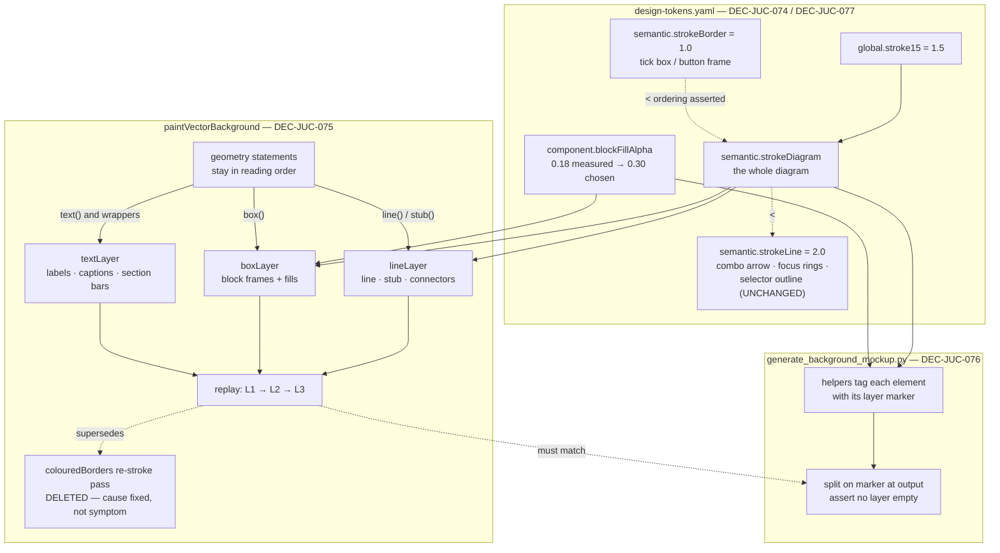

# ADR-JUC-027: Diagram Stroke Weight and Paint Order

## Status
Proposed

<!-- Motivated by RQ-GUI-051 (block frame weight, fill contrast, paint order)
and RQ-DSN-099 (the stroke-role split). Refines ADR-JUC-013 (the vector
background this restructures) and ADR-JUC-018 (the block-identity colours whose
legibility this is about). Token mechanics per ADR-JUC-014 / ADR-JUC-015. -->

## Requirements
RQ-GUI-051, RQ-DSN-099, RQ-GUI-037, RQ-GUI-044, RQ-DSN-094

## Context

The eight colour-coded functional blocks (ADR-JUC-018) do not stand out from the
diagram that connects them. Three independent causes, found by rendering the
mockup and looking at it rather than by reading the code:

1. **The block frame has no weight of its own.** `BackgroundRenderer` strokes
   block frames, signal lines and neutral sub-panel frames from one constant,
   `LINE_WIDTH = semantic::strokeLine` (2.0px). A block's boundary is therefore
   drawn exactly like the wire running into it.

2. **The fill is faint.** `component.blockFillAlpha` is 0.18, measured from the
   owner-supplied modernisation mockup (RQ-DSN-094). That measurement was taken
   against a *different* plate colour than the one that shipped; at 0.18 over the
   shipped `#393941` plate the tint is barely separable from the metal.

3. **Lines are painted over blocks — in the mockup.** Both the painter and the
   SVG generator draw in reading order, and a knob stub or signal line belongs to
   its block's paragraph, so it is emitted *after* the block it touches and its
   rounded end-cap lands on top: a nub of neutral `FRAME` colour across the
   coloured border. This is what the owner reported, reviewing
   `background-mockup.svg` (2026-08-03).

**The shipped painter did not have that defect, and it matters to say so.** A
final pass at the end of `paintVectorBackground` re-strokes every **coloured
block border** for exactly this reason (owner request, 2026-07-27, RQ-GUI-037),
so at every point measured the border already won. The SVG generator never grew
an equivalent — which is how the two drifted, and why the defect was visible in
the prototype but not in the product. *Verified, not assumed:* the paint-order
test of TASK-GUI-013 passes unmodified against the pre-change painter.

So the painter side of this ADR is **parity and hygiene, not a bug fix**, and is
justified on three grounds rather than on a visible symptom: ADR-JUC-013 requires
the generator and the painter to stay constructed alike or the prototype stops
predicting the product; the re-stroke pass repairs a *symptom* per coloured block
and covers neither neutral sub-panel frames nor fills, so it would need extending
every time a new case appeared; and raising the fill to 0.30 (cause 2) removes
the margin that made a leftover case harmless. Claiming otherwise would
misrepresent what changed.

Values were settled by regenerating `background-mockup.svg` and reviewing it,
per the ADR-JUC-013 pipeline. Two intermediates were rejected on sight and are
recorded here so they are not re-proposed: `blockFillAlpha = 0.24` ("on voit pas
trop la différence") and a 1.5px block frame against 2.0px signal lines, which
inverted the intended hierarchy — the connecting wires read heavier than the
blocks.

## Decision

- **DEC-JUC-074 — One stroke role for the whole diagram, split from the
  control-widget role.** `semantic.strokeLine` served two unrelated consumers
  that happened to share a value: the diagram, and the combo-box arrow / focus
  rings / page-family selector outline. A new role `semantic.strokeDiagram`
  (1.5px) takes every diagram stroke; `strokeLine` keeps its 2.0px value and its
  widget consumers, so **no control changes appearance**. Block frames, signal
  lines and neutral sub-panel frames all use the new role at the **same** width.
  *Rejected:* giving block frames their own width. It is the obvious reading of
  "make the frame stronger", it was implemented first, and the mockup showed it
  is wrong — a diagram whose connectors outweigh its boxes reads as wiring with
  labels rather than as blocks in a signal path. The strength of a block comes
  from its fill and its hue, not from out-drawing its own wires.
  *What the design system holds is the ordering*, not the three numbers:
  `strokeBorder` (1.0) < `strokeDiagram` (1.5) < `strokeLine` (2.0). A block
  frame stays heavier than a widget frame; that relation is what RQ-GUI-051 asks
  for and what the regression test asserts.

- **DEC-JUC-075 — Paint order is layered, not repaired.** `paintVectorBackground`
  no longer draws in reading order. Every primitive is appended to one of three
  layers — **lines → boxes → text** — and the layers are replayed in that order
  at the end of the function. A line can no longer land on a block, by
  construction, rather than by a compensating pass.
  *Consequence:* the coloured-border re-stroke pass and its `colouredBorders`
  vector are **deleted**. Keeping both would leave two mechanisms for one
  problem, the weaker one silently shadowing the stronger — and in particular
  making the regression test of TASK-GUI-013 pass for the wrong reason.
  *Text is a third layer, not part of the box layer*: a block label is emitted
  before its own block in several places, and with a fill at 0.30 a label painted
  under it is visibly muddied rather than hidden — the failure would be subtle
  enough to ship.
  *Implementation:* the layers hold `std::function<void()>` closures. The
  alternative — reordering the ~250 geometry statements by hand into three
  blocks — was rejected: the geometry is the owner-validated part of this file
  and grouping it by primitive type would scatter each block's paragraph across
  three places, making the next geometry review harder than the last. Deferring
  execution keeps the source in reading order and moves only the *painting*.
  The background is repainted rarely and uncached (ADR-JUC-013 §3), so ~250
  closure allocations per paint are not a cost worth optimising against
  readability.

- **DEC-JUC-076 — The SVG mockup generator is layered the same way, by marker
  rather than by restructuring.** `generate_background_mockup.py` must keep
  producing what the painter produces (ADR-JUC-013), so it gets the same three
  layers. Its helpers return *strings that call sites concatenate with `+`*, so
  the layer marker travels with each element and the split happens at output
  time. This leaves all ~60 geometry call sites untouched — the same reasoning as
  DEC-JUC-075, for the same reason: the geometry is the validated artefact.
  A generation-time assertion fails if any layer comes out empty, which is what
  a lost marker would look like.

- **DEC-JUC-077 — `blockFillAlpha` moves to 0.30, and its note keeps its
  provenance.** The token's `note` records that 0.18 was *measured* from the
  modernisation mockup and that 0.30 is an *owner decision* taken against the
  shipped plate, with 0.24 rejected as too subtle. RQ-DSN-094 states the measured
  value, so the deviation is written where the value lives rather than left as an
  unexplained number — the design-system deviation rule (CLAUDE.md).

## Consequences

- The blocks read as objects the signal path runs into; the diagram reads as one
  drawing at one weight.
- `paintVectorBackground` gains an indirection: what a statement does and when it
  is painted are no longer the same place. This is the real cost of DEC-JUC-075
  and it is why the layer assignment lives in the four primitive lambdas rather
  than at call sites — a new geometry statement inherits the correct layer
  without its author thinking about z-order.
- One special case must be written by hand: the rotated `NOISE` label applied its
  rotation via a `ScopedSaveState` *around* a `text()` call. With `text()`
  deferred, that transform would be long popped by replay time, so the rotation
  moves inside the deferred closure. Any future transform-wrapped primitive has
  the same constraint.
- `strokeLine` keeps a value that no longer matches its old name's intent
  ("frames + signal lines"). Its note is rewritten to say what it actually
  serves now; renaming it would touch four widget files for no behavioural gain
  and is left for a future rename pass.
- `session.unit_tests = true`: the token *ordering* of DEC-JUC-074 is covered by
  a unit test. Paint order is verified by rendering the painter into an image and
  sampling the pixel where a knob stub meets a block border — an end-to-end check
  that the layering holds, not a check that the code is shaped a certain way.
  *What that test does and does not prove:* it fails when the replay order is
  inverted (checked — the sample then reads the neutral colour exactly), so it
  guards the invariant going forward. It does **not** demonstrate a defect in the
  pre-change painter, which passes it too via the re-stroke pass. The test exists
  to keep the property, not to prove it was once absent.

## Alternatives Considered

- **Block frames thicker than signal lines.** The literal reading of the
  requirement, implemented first, rejected on mockup review — see DEC-JUC-074.
- **Keep the border re-stroke pass and extend it to re-fill.** Would mean drawing
  each block twice, with the fill composited over itself (0.30 over 0.30 = 0.51
  effective) unless the second pass were made opaque. Repairs a symptom at
  increasing complexity while the cause — paint order — stays.
- **Reorder the geometry statements by hand into three blocks.** No runtime cost
  and no indirection, but it destroys the per-block paragraph structure of the
  validated geometry. Rejected per DEC-JUC-075.
- **`setBufferedToImage` per layer.** Would make ordering explicit via composited
  images, but ADR-JUC-013 §3 rules out caching the background at logical scale —
  the canvas transform would rescale the cache and reintroduce the blur the
  vector background exists to remove.
- **Raise the fill alpha only, leave strokes alone.** Fixes legibility from a
  distance but leaves the end-cap nubs *more* visible against the stronger fill,
  and leaves a block's boundary indistinguishable from a wire.

## Diagram

