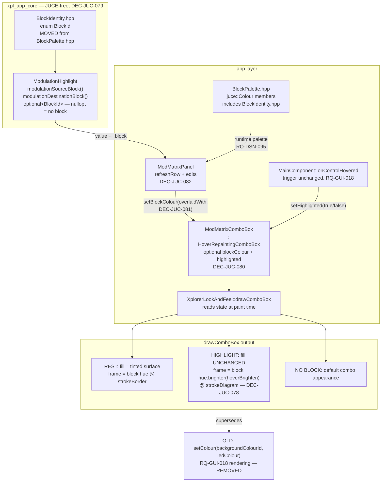

# ADR-JUC-028: Modulation-Matrix Block Identity and Frame Highlight

## Status
Proposed

<!-- Motivated by RQ-GUI-052 (matrix block colours + frame highlight) and
RQ-DSN-100 (the shared block-referencing-control rule). Amends the rendering
half of RQ-GUI-018 / ADR-JUC-010 and removes the matrix from the accent-colour
consumers of RQ-DSN-004 / ADR-JUC-011. Extends the block family of ADR-JUC-018
and reuses the stroke role of ADR-JUC-027. -->

## Requirements
RQ-GUI-052, RQ-DSN-100, RQ-GUI-018, RQ-GUI-044, RQ-DSN-095, RQ-DSN-099

## Context

The modulation matrix is the densest region of the UI — 20 rows × 4 controls,
1/6th of the façade — and the only large region the block-identity work of
ADR-JUC-018 never reached. It is entirely monochrome: relating an entry to the
part of the signal path it drives means reading the label text of all 20 rows.

Two mechanisms already exist and now collide:

- **Resting colour (new).** RQ-GUI-052 gives each source/destination combo the
  hue of the block its *selected value* belongs to.
- **Hover cross-reference (existing, RQ-GUI-018).** Hovering a page-family
  selector or a destination knob elsewhere on the panel highlights the matching
  matrix combos. `ModMatrixPanel::highlightSources/highlightDestinations`
  implement this by calling `setColour(ComboBox::backgroundColourId, ledColour)`
  — i.e. by **overwriting the background**, which is exactly where the new
  resting colour lives.

The collision is not a detail of implementation order. The two carry different
information — "what block does this entry touch" vs "does this entry match what
I am pointing at" — and the second would erase the first for precisely as long
as the user is looking at it.

A second collision was found while specifying, and is worth recording because
the obvious fix does not work: making the highlight a *coloured frame* is not
enough, because under RQ-GUI-052 the combo's frame is **already** the block
hue. A same-colour, same-width frame drawn over it is invisible. And the case
never self-resolves: every source the selector highlight can match is
ENV/LFO/RAMP/TRACK, and every destination the knob highlight can match maps to
VCO/VCF/LFO/ENV/LAG — so a highlighted combo **always** already has a block
hue. There is no neutral-combo case in which a plain coloured frame would show.

Note also that "hover" means two unrelated things here and they must not be
merged: RQ-GUI-041's *direct* hover (pointer on the combo itself, brightens its
fill) is a separate, already-implemented feature from RQ-GUI-018's *remote*
cross-reference (pointer on a control elsewhere). Both must remain, and remain
distinguishable.

## Decision

- **DEC-JUC-078 — The highlight changes width and brightness together.** The
  highlighted combo's frame goes from `semantic.strokeBorder` (1.0 px) to
  `semantic.strokeDiagram` (1.5 px, the block-frame width of ADR-JUC-027) *and*
  brightens by `motion.hoverBrighten`. Neither cue is sufficient alone on an
  already-tinted control: 1.0 → 1.5 px is a half-pixel change, and a brightness
  step on a control that is already saturated with its block hue reads as a
  rendering artefact rather than a signal. The background is not touched.
  *Rejected: framing the whole row.* It reads well and was the first proposal,
  but it puts a fifth rectangle around four controls that already have frames,
  and it cannot express *which* of the two combos matched — the source and
  destination highlights are distinct events that can even apply to the same row.
  *Rejected: keeping the accent (LED) colour for the frame.* It would be legible,
  but it re-introduces a second colour language into a control that has just been
  given a block identity, and it makes the highlight mean "matched" in a hue
  unrelated to anything else on that row.

- **DEC-JUC-079 — The block lookup is a headless table, and `BlockId` moves to
  `xpl_app_core` to allow it.** `modulationSourceBlock()` /
  `modulationDestinationBlock()` are pure enum→enum lookups, the same shape as
  the `SELECTOR_SOURCES` / `FIXED_DESTINATIONS` tables already in
  `ModulationHighlight.cpp`, and they belong beside them: headless, JUCE-free,
  cheaply unit-testable, and reviewable as data.
  The obstacle is that `BlockId` lives in `BlockPalette.hpp`, which pulls in
  `juce_graphics` — and `xpl_app_core` is JUCE-free **by design** (ADR-JUC-006).
  `BlockId` itself has no JUCE dependency: it is an `enum class : std::size_t`
  whose ordering is the settings persistence contract. It is therefore **moved**
  to a small core header, which `BlockPalette.hpp` includes; the `juce::Colour`
  members and the descriptor table stay in the app layer.
  *Why move rather than duplicate:* the enum's ordering is a persistence
  contract (RQ-SET-007). Two copies of a contract is one copy too many, and the
  divergence would surface as silently mis-mapped user colours.
  *Why not put the lookup in the app layer instead:* it would work, but it would
  be the first piece of modulation cross-reference logic to sit outside
  `ModulationHighlight`, and it would only be testable in the JUCE-linked test
  binary — a heavier test for logic that has no graphics in it.

- **DEC-JUC-080 — Tint and highlight are per-combo state, read by the
  LookAndFeel at paint time.** A `ModMatrixComboBox` (deriving the existing
  `HoverRepaintingComboBox`, so the issue-#21 repaint fix is inherited) carries
  an optional block colour and a highlight flag; `drawComboBox` reads them.
  *Why not `setColour(backgroundColourId/outlineColourId)` alone* — which would
  need no new type and no `LookAndFeel` change: it can express the resting tint,
  but not the highlight, because the frame *width* is not a colour and
  `drawComboBox` hard-codes `strokeBorder`. Splitting the two halves across two
  mechanisms (colours via `setColour`, width via a flag) would leave the resting
  and highlighted appearances defined in two different places.
  *Why not `Component::getProperties()`*, JUCE's stringly-typed extension point:
  a typed member checked by the compiler is worth more than avoiding one
  `dynamic_cast`, and this codebase already resolves component capabilities that
  way (`dynamic_cast<BoundControl*>` in `MainComponent::onControlHovered`).
  *Consequence:* `drawComboBox` gains one `dynamic_cast` on a paint path. It is a
  combo box repaint, not an inner loop.

- **DEC-JUC-081 — The resting background is composited, not alpha-blended at
  paint time.** The tint is `surfaceRecessed.overlaidWith(blockHue.withAlpha(
  blockFillAlpha))` — an **opaque** colour computed once per value change —
  rather than an alpha colour left for `fillRoundedRectangle` to blend. A
  translucent combo would blend against whatever sits behind it, which for the
  matrix is the vector panel background: the same value would render differently
  depending on where the row sits, and text contrast would vary with it. The
  design system specifies a fill *over the control surface* (RQ-DSN-100), not a
  window into the panel.

- **DEC-JUC-082 — The tint follows the value, so it is refreshed wherever the
  value is.** The hue is a function of the *selected* source/destination, so it
  is re-resolved in `refreshRow` (incoming automation / synth / tone change) and
  after each user edit, not at construction. This is the failure mode most likely
  to ship unnoticed — everything looks right until a patch is loaded — so the
  refresh sits in `refreshRow`, the one path every external change already goes
  through.

## Consequences

- The matrix gains the panel's colour language; a user can see which entries
  touch the filter, the envelopes, the LFOs without reading 20 rows of text.
- `RQ-DSN-004`'s accent rule loses its most-cited example. The rule stands for
  the remaining consumers (knob ring, checked toggle, focus ring); the
  requirement text is corrected rather than left with a stale example.
- `xpl_app_core` gains a header it did not have, and `BlockPalette.hpp` becomes
  the *colour* half of a concept whose *identity* half now lives a layer down.
  That is a better seam than it sounds — the enum is data, the colours are
  presentation — but it is a real move of a public type and must land in one
  commit with its users.
- The keyboard-focus ring on a matrix combo (RQ-GUI-042, accent colour,
  `strokeLine` = 2.0 px) is drawn last and is thicker than both the resting
  block frame (1.0 px) and the highlight frame (1.5 px), so **while a matrix
  combo has keyboard focus it hides both** — observed in the running app while
  verifying this plan, not predicted. Accepted rather than fixed: focus is a
  deliberate, transient state on one control at a time, the block identity is
  still carried by the fill (which nothing overdraws), and the alternative —
  insetting or restyling the focus ring — would weaken an accessibility
  affordance (RQ-GUI-042 is a genuine a11y gap-closure) to protect a decorative
  one. Recorded because a reader who tabs through the matrix will otherwise
  read it as a bug.
  This is the first control carrying three independent frame meanings; a fourth
  would need a rethink rather than another width.
- `session.unit_tests = true`: the lookup tables get headless coverage in
  `xpl_tests_app` (no JUCE), including the neutral cases and full enum coverage.
  The rendering itself is verified in the running app against the requirement's
  Gherkin, as no pixel baseline exists for combo boxes.

## Alternatives Considered

- **Frame the whole matrix row.** Rejected per DEC-JUC-078: cannot express which
  combo matched, and adds a fifth rectangle to a four-control row.
- **Keep the background repaint, drop the resting tint on highlight and restore
  it after.** Equivalent to the status quo with extra state; the information the
  tint carries is lost exactly when the user is inspecting that row.
- **Tint the whole row (knob + check box too).** Rejected per RQ-GUI-052 scope:
  knobs answer to the accent/LED rule everywhere else on the panel, and a row has
  *two* block identities (source and destination) with no principled way to pick
  one for the controls between them.
- **A dedicated `matrixHighlight` colour/width token pair.** Rejected per
  RQ-DSN-100: the design system already owns a "block frame width" and a "hover
  brighten"; a third value existing only here is how a design system stops being
  one.

## Diagram

