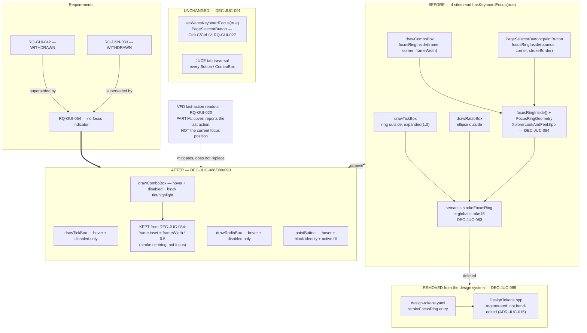

# ADR-JUC-029: Removal of the Keyboard-Focus Visual Indicator

## Status
Proposed

<!-- Motivated by RQ-GUI-054 (no keyboard-focus visual indicator). Supersedes
RQ-GUI-042 and the focus half of RQ-DSN-033, both withdrawn. Partially supersedes
ADR-JUC-017 (DEC-JUC-022, the ring itself) and ADR-JUC-028 (DEC-JUC-083 in full,
DEC-JUC-084 in part). Amends the state-to-code mapping RQ-DSN-062, the catalogue
completeness rule RQ-DSN-030 and the token source of truth RQ-DSN-063
(ADR-JUC-015). Leaves ADR-JUC-017's hover and disabled decisions in force. -->

## Requirements
RQ-GUI-054, RQ-GUI-042 *(withdrawn)*, RQ-DSN-033 *(withdrawn)*, RQ-GUI-041,
RQ-GUI-043, RQ-GUI-045, RQ-GUI-052, RQ-GUI-020, RQ-GUI-027, RQ-DSN-030,
RQ-DSN-062, RQ-DSN-063, RQ-DSN-099

## Context

The keyboard-focus indicator has been specified once and re-engineered twice, and
the owner's assessment after all three rounds is that it does not work
visually — "c'est visuellement pas bon et rentre graphiquement en conflit avec le
reste du GUI" (2026-08-04).

The history matters, because it is the argument for removing the feature rather
than adjusting it a third time:

| When | What | Why it was not enough |
|---|---|---|
| ADR-JUC-017, DEC-JUC-022 | Accent ring at `strokeLine` (2.0 px) around the control's outer bounds | Same geometry as the control's own border, but thicker — so it *replaced* that border instead of adding to it. Invisible while all borders were neutral grey |
| ADR-JUC-028, DEC-JUC-083 | Own width role `strokeFocusRing` (1.5 px); ring drawn *beside* the border — outside where there is room, inside otherwise, via one shared `focusRingInside()` | Fixed the occlusion (verified: `blockLfo` band then accent band, neither hidden). Did not change that the ring is one more rectangle on the control |
| ADR-JUC-028, DEC-JUC-084 | Stroke inset by half its width; focus-ring radius reduced by the same inset | Corner geometry corrected. Still one more rectangle |

Each round fixed exactly what was reported and the result was still judged wrong.
That is the signature of a problem in the feature, not in its parameters.

**What the ring competes with.** A modulation-matrix combo (RQ-GUI-052) carries a
block-identity frame and, while cross-referenced, a thickened brightened frame
(RQ-GUI-018). A page-family selector button (RQ-GUI-045) carries a permanent
block-hue border and an active-instance fill. On both, the focus ring is a third
concentric rectangle in a *fourth* colour language — the accent — placed one
half-stroke from a border that is already carrying information. ADR-JUC-028's own
Consequences section drew the line at exactly this density: *"a fourth would need
a rethink rather than another width or another inset."* The rethink is that the
focus ring is the member of that set with the weakest claim: block identity and
cross-reference highlight both say something about the **patch**; focus says only
where an input device happens to be pointing.

**What the ring was for, and what actually covers it.** RQ-GUI-042 and RQ-DSN-033
justified the indicator as a genuine accessibility gap rather than a consistency
nicety, and that argument was made against the picture of a UI that reports
nothing back. This application does not fit that picture: the VFD displays the
last control acted upon (RQ-GUI-020), so a user driving the panel — by mouse or
by keyboard — is continuously told what they just touched.

This is **not** an equivalence and must not be recorded as one. The VFD reports
the last *action*; the focus ring reported the current *position*. A user tabbing
across five controls without pressing anything gets five ring moves and zero VFD
updates. That user is the residual gap, and it is real. The owner has weighed it
against a visual defect present on every repaint of the densest region of the UI
and chosen to accept it (see DEC-JUC-088). Recording the trade honestly is the
point of this section — a later reader must be able to see that the gap was
priced, not missed.

**What is not in question.** Hover (RQ-GUI-041) and disabled (RQ-GUI-043) are
untouched: they were never reported as problems, they carry no geometry of their
own — hover brightens an existing element, disabled scales an alpha — and neither
adds a rectangle to anything.

## Decision

- **DEC-JUC-088 — The focus indicator is removed at every site, and nothing takes
  its place.** The four `hasKeyboardFocus(true)` render branches —
  `XplorerLookAndFeel::drawTickBox`, `drawRadioBox`, `drawComboBox` and
  `PageFamilyBlock::PageSelectorButton::paintButton` — are deleted. A focused
  control renders exactly as an idle one. The residual accessibility gap
  described in Context (a user tabbing without acting) is accepted, explicitly and
  with its cost named, on the owner's decision; the VFD's last-action readout
  (RQ-GUI-020) covers the acting user, not the merely-navigating one.
  *Rejected: fold focus into the hover treatment* (reuse `motion.hoverBrighten`
  on `hasKeyboardFocus`). It was the first proposal and it adds no geometry, which
  is the whole defect — but the owner's objection is not only geometric ("en plus
  de l'aspect graphique"), and it would make a focused control indistinguishable
  from a hovered one, i.e. two different states rendering identically. A design
  system that has just spent RQ-DSN-030 requiring each state to declare itself
  should not answer a state by disguising it as another.
  *Rejected: an underline or side marker instead of a ring* — a different shape in
  a different place, so no occlusion. Rejected because it still adds a visual
  element to controls the owner is asking to quieten; it trades one competing mark
  for a smaller competing mark, which is a fourth round of the same adjustment.
  *Rejected: remove the ring only where it collides* (matrix combos, selector
  buttons) and keep it on plain check boxes and radios. This is the option that
  preserves the most; it is rejected because RQ-DSN-033's single reason for
  existing was that the focus rule be **one shared rule**, and a rule that applies
  to two control types out of four is not one. It would also leave the design
  system asserting a focus treatment that most focusable controls do not have.

- **DEC-JUC-089 — `semantic.strokeFocusRing` is deleted from the token source of
  truth, not left as an unused role.** The token is removed from
  `juce/tools/design-tokens.yaml` and `DesignTokens.hpp` is regenerated
  (`generate_design_tokens.py`, ADR-JUC-015 — never hand-edited, RQ-DSN-063). It
  was created by DEC-JUC-083 for this indicator alone and has no other consumer.
  *Why not keep it:* a design system's tokens are a statement of what the product
  looks like. A surviving `strokeFocusRing` would say a focus treatment exists,
  which is precisely what RQ-GUI-054 denies, and it is the kind of orphan that a
  later change re-adopts by accident because it is already there. `global.stroke15`
  stays — `strokeDiagram` still aliases it, and DEC-JUC-083 was explicit that the
  two roles coincide by value only and must not be aliased to each other.

- **DEC-JUC-090 — `focusRingInside()` goes; DEC-JUC-084's frame rule stays.** The
  `FocusRingGeometry` struct and `focusRingInside()` helper in
  `XplorerLookAndFeel.hpp` exist solely to nest a ring inside a border and are
  deleted with their four call sites. What must **not** be reverted is the other
  half of DEC-JUC-084: `drawComboBox` insets its frame rectangle by
  `frameWidth * 0.5F` rather than a constant `0.5F`. That is a general property of
  centred strokes, and it is what keeps RQ-GUI-052's 1.5 px highlight frame from
  being clipped against the component bounds and losing its corner arc. It was
  *discovered* while fixing the focus ring; it is not *about* the focus ring, and
  a removal that reverted it would silently reintroduce a matrix rendering bug.
  This distinction is the reason DEC-JUC-084 is superseded in part rather than in
  full.

- **DEC-JUC-091 — Focus*ability* is untouched; this is a rendering change only.**
  No `setWantsKeyboardFocus` call is altered — in particular
  `PageSelectorButton`'s, which exists so Ctrl+C / Ctrl+V reach `keyPressed` for
  the page copy/paste gesture (RQ-GUI-027) and whose removal would break a working
  feature. Tab traversal keeps working mechanically on every JUCE control. This is
  the distinction that separates the present decision from the proposal
  ADR-JUC-028 (DEC-JUC-083) rejected: that one would have made the 40 matrix
  combos non-focusable, removing keyboard **access** to all matrix editing to fix
  an appearance. This one removes an **appearance** and leaves access intact, so
  the earlier rejection does not apply to it.

## Consequences

- The check box, radio, combo box and page-family selector each lose one drawn
  element. On a matrix combo the frame count drops from three possible meanings to
  two, both of which describe the patch.
- **A keyboard-only user loses positional feedback while navigating.** This is the
  cost, stated plainly: it is mitigated for the acting user by the VFD (RQ-GUI-020)
  and not mitigated at all for the navigating one. If it is ever revisited, the
  requirement to reopen is RQ-GUI-054, and the design system will have to
  reintroduce a focus role — deliberately, not by finding a leftover token.
- `RQ-DSN-030`'s "a missing state is an open gap" rule needed an explicit
  exception for Focused, or every future control would re-open a closed decision.
  The exception is narrow: Hover and Disabled keep the original rule.
- ADR-JUC-017 now covers two of the three states it was written for; its title and
  structure are left intact rather than rewritten, so the record of what shipped
  stays readable.
- One design token disappears from a generated header. Since `DesignTokens.hpp` is
  generated and checked (`--check`, ADR-JUC-015), the removal cannot be
  half-applied: a hand-edit of the header without the YAML would fail the check,
  and a YAML edit without regenerating would too.
- `session.unit_tests = true`: there is no pixel baseline for combo boxes, check
  boxes or radios, so the visual outcome is verified in the running app against
  RQ-GUI-054's Gherkin. What *is* mechanically testable is the absence itself —
  that no source references `strokeFocusRing`, `focusRingInside` or
  `hasKeyboardFocus` — and the existing token-ordering guard
  (`BackgroundRendererTests.cpp`, `strokeBorder < strokeDiagram < strokeLine`)
  must still hold, since DEC-JUC-089 touches none of those three.

## Alternatives Considered

- **Fold focus into the hover brighten** (no new geometry). Rejected per
  DEC-JUC-088: two distinct states would render identically, and the owner's
  objection to the current mechanism is not purely geometric.
- **Replace the ring with an underline or a side marker.** Rejected per
  DEC-JUC-088: still an added mark on controls that are being quietened — a fourth
  adjustment round rather than a decision.
- **Keep the ring only on controls with no block identity.** Rejected per
  DEC-JUC-088: it dissolves the "one shared focus rule" that RQ-DSN-033 existed to
  guarantee, and leaves the design system claiming a treatment most focusable
  controls would not have.
- **Make the controls non-focusable instead of unstyling them.** Rejected — this
  is the proposal ADR-JUC-028 (DEC-JUC-083) already refused, and for a reason that
  has not changed: it removes keyboard access rather than a visual, and it would
  break the Ctrl+C/Ctrl+V page gesture (RQ-GUI-027) outright. See DEC-JUC-091.
- **Keep `strokeFocusRing` in the YAML "in case focus comes back".** Rejected per
  DEC-JUC-089: an unused token states a product decision that is no longer true,
  and is the mechanism by which a removed feature quietly returns.
- **A fourth geometry adjustment** (thinner ring, larger gap, dashed stroke,
  accent at lower alpha). Rejected as the option the evidence argues against: two
  adjustments each fixed their reported symptom and left the verdict unchanged.

## Diagram

